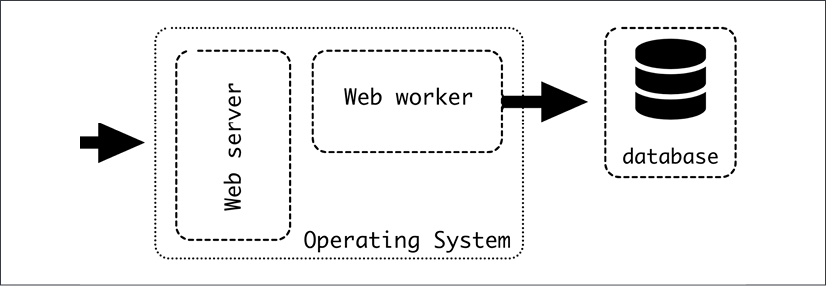
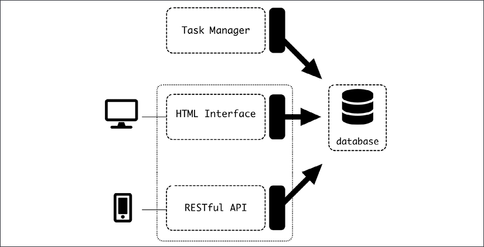

# 软件架构简介

本章的目的是介绍什么是软件架构以及它的用处。我们将了解在定义系统架构和 Web 服务架构的基线示例时使用的一些基本技术。

本章讨论了软件结构对团队结构和沟通的影响。由于任何非小型软件的成功构建在很大程度上取决于多个开发人员组成的一个或多个团队之间的成功沟通和协作，因此应该考虑这一因素。此外，软件的结构会对不同元素的访问方式产生深远的影响，因此软件的结构会对安全性产生影响。

此外，在本章中，将简要介绍一个示例系统的架构，我们将使用它来展示本书其余部分的不同模式和讨论。

在本章中，我们将介绍以下主题：

- 定义系统的结构
- 分成更小的单位
- 软件架构中的康威定律
- 示例概述
- 软件架构的安全方面

让我们深入了解。

## 定义系统的结构

软件开发的核心是创建和管理复杂的系统。

在计算机早期，程序相对简单。最多，他们也许可以计算抛物线轨迹或分解数字。第一个计算机程序由 Ada Lovelace 于 1843 年设计，计算了一系列伯努利数。一百年后，在第二次世界大战期间，发明了电子计算机来破解密码。随着新发明的可能性开始被探索，越来越复杂的操作和系统被设计出来。编译器和高级语言等工具增加了可能性的数量，硬件的快速发展允许执行越来越多的操作。这很快产生了管理日益增长的复杂性并将一致的工程原则应用于软件创建的需求。

在计算行业诞生 50 多年后，我们可以使用的软件工具种类繁多且功能强大。我们站在巨人的肩膀上构建自己的软件。我们可以用相对较少的精力快速添加很多功能，或者利用高级语言和 API，或者使用开箱即用的模块和包。这种强大的力量带来了管理其产生的复杂性爆炸的重大责任。

用最简单的术语来说，软件架构定义了软件系统的结构。这种架构可以有机地发展，通常在项目的早期阶段，但是在系统增长和一些变更请求之后，仔细考虑架构的需要变得越来越重要。随着系统变得更大，结构变得更难改变，这会影响未来的努力。按照结构而不是根据结构进行更改更容易。

> 使某些更改难以进行并不一定总是一件坏事。应该变得困难的更改可能涉及需要由不同团队监督的元素，或者可能影响外部客户的元素。虽然主要重点是创建一个在未来易于更改且高效的系统，但智能架构设计将根据需求在轻松和困难之间取得适当的平衡。在本章后面，我们将研究安全性，作为一个明确的例子，说明何时保持某些操作难以实施。

那么，软件架构的核心就是着眼于大局：关注系统未来的发展方向，能够将这一观点具体化，同时也有助于当前的情况。短期获胜和长期运营之间的通常选择在发展中非常重要，其最常见的结果是产生技术债务。软件架构主要处理长期影响。

软件架构的考虑因素可能非常多，并且需要在它们之间取得平衡。一些例子可能包括：

- 商业愿景，如果系统要进行商业开发。这可能包括来自营销、销售或管理等利益相关者的要求。业务愿景通常由客户驱动。
- 技术要求，例如确保系统可扩展并且可以处理一定数量的用户，或者系统对于其用例来说足够快。新闻网站需要与实时交易系统不同的更新时间。
- 安全性和可靠性问题，其严重性取决于应用程序和存储的数据的风险或关键程度。
- 任务分工，允许多个团队，可能专注于不同领域，在同一系统上同时以灵活的方式工作。随着系统的增长，将它们划分为半自主的、更小的组件的需求变得更加紧迫。使用“单块”或整体方法的小型项目可能会存在更长的时间。
- 使用特定技术，例如，允许与其他系统集成或利用团队中的现有知识。

这些考虑因素将影响系统的结构和设计。从某种意义上说，软件架构师负责实现应用程序愿景并将其与将开发它的特定技术和团队相匹配。这使得软件架构师成为业务团队和技术团队之间以及不同技术团队之间的重要中介。沟通是工作的一个关键方面。

为了实现成功的沟通，一个好的架构应该定义不同方面之间的界限并分配明确的职责。除了定义清晰的边界之外，软件架构师还应该促进系统组件之间的接口通道的创建，并跟进实现细节。

理想情况下，架构设计应该发生在系统设计之初，并根据项目要求进行深思熟虑的设计。这是本书中的通用方法，因为它是解释不同选项和技术的最佳方式。但这并不是现实生活中最常见的用例。

软件架构师面临的主要挑战之一是使用需要调整的现有系统，为更好的系统采用渐进方法，同时不中断保持业务运行的正常日常操作。

## 分成更小的单位

软件架构的主要技术是将整个系统划分为更小的元素，并描述它们如何相互交互。每个较小的元素或单元都应具有清晰的功能和界面。

例如，典型系统的通用架构可能是由以下组成的 Web 服务架构：

- 将所有数据存储在 MySQL 中的数据库
- 提供用 PHP 编写的动态 HTML 内容的 Web Worker
- 处理所有 Web 请求、返回任何静态文件（如 CSS 和图像）并将动态请求转发给 Web Worker 的 Apache Web 服务器

图 1.1：典型的 Web 架构

> 自 2000 年代初以来，这种架构和技术堆栈一直非常流行，被称为 LAMP，这是由所涉及的不同开源项目组成的首字母缩写词：(L)inux as an operating system、(A)pache、(M)ySQL 和(P)HP。如今，这些技术可以交换为等效技术，例如使用 PostgreSQL 代替 MySQL 或使用 Nginx 代替 Apache，但仍使用 LAMP 名称。在使用 HTTP 设计基于 Web 的客户端/服务器系统时，可以将 LAMP 架构视为默认起点，从而为开始构建更复杂的系统奠定坚实且经过验证的基础。

如你所见，每个不同的元素在系统中都有不同的功能。它们以明确定义的方式相互作用。这被称为单一职责原则。当出现新功能时，大多数用例将清楚地属于系统的元素之一。任何样式更改都将由 Web 服务器处理，而动态更改将由 Web Worker 处理。元素之间存在依赖关系，因为可能需要更改存储在数据库中的数据以支持动态请求，但可以在流程的早期检测到它们。

> 我们将在第 9 章更详细地描述这种架构。

每个元素都有不同的要求和特点：

- 数据库需要可靠，因为它存储所有数据。诸如备份和恢复相关工作之类的维护工作将很重要。数据库不会经常更新，因为数据库非常稳定。对表模式的更改将通过 web worker 中的重新启动来进行。
- Web Worker 需要可扩展且不存储任何状态。相反，任何数据都将从数据库发送和接收。这个元素会经常更新。可以在同一台机器或多台机器上运行多个副本，以实现水平可扩展性。
- Web 服务器需要对新样式进行一些更改，但这不会经常发生。正确设置配置后，此元素将保持相当稳定。每台机器只需要一个网络服务器，因为它能够在多个网络工作者之间进行负载平衡。

正如我们所见，元素之间的工作平衡非常不同，因为 web worker 将成为大多数新工作的重点，而其他两个元素将更加稳定。该数据库将需要我们进行特定的工作以确保它处于良好状态，因为它可以说是三者中最关键的元素。如果出现问题，另外两个可以快速恢复，但是数据库中的任何损坏都会产生很多问题。

> 系统中最关键和最有价值的元素几乎总是存储的数据。

通信协议也是独一无二的。 Web Worker 使用 SQL 语句与数据库对话。 Web 服务器使用专用接口与 Web Worker 对话，通常是 FastCGI 或类似协议。 Web 服务器通过 HTTP 请求与外部客户端通信。 Web 服务器和数据库不相互通信。

这三个协议是不同的。并非所有系统都必须如此。不同的组件可以共享相同的协议。例如，可以有多个 RESTful 接口，这在微服务中很常见。

### 进程内通信

查看不同单元的典型方法是独立运行不同的进程，但这不是唯一的选择。同一流程中的两个不同模块仍然可以遵循单一职责原则。

> Single-Responsibility 原则可以应用于不同的层次，用于定义功能或其他块之间的划分。因此，它可以应用在越来越小的范围内。一路下来都是乌龟！但是，从架构的角度来看，更高级别的元素是最重要的，因为它是定义结构的更高级别。知道在细节方面要走多远显然很重要，但是在采用架构方法时，最好在“大局”方面犯错，而不是在“太多细节”方面犯错。

一个明显的例子是独立维护的库，但它也可以是代码库中的某些模块。例如，你可以创建一个模块来执行所有外部 HTTP 调用并处理保持连接、重试、处理错误等的所有复杂性，或者你可以创建一个模块来根据某些参数生成多种格式的报告.

重要的特点是，为了创建一个独立的元素，API 需要明确定义，职责需要明确定义。应该可以将模块提取到不同的 repo 中并作为第三方元素安装，以便将其视为真正独立的。

> 创建仅具有内部划分的大型组件是一种众所周知的模式，称为单体架构。上面描述的 LAMP 架构就是一个例子，因为大部分代码都是在 web worker 内部定义的。单体应用通常是项目的实际开始，因为通常在开始时没有大计划，并且当代码库很小时，将事物严格划分为多个组件并没有很大的优势。随着代码库和系统变得越来越复杂，单体内部的元素划分开始变得有意义，后来将它分成几个组件可能开始变得有意义。我们将在第 9 章“微服务与单体应用”中进一步讨论单体应用。

在同一个组件内部，通信通常很简单，因为将使用内部 API。在绝大多数情况下，将使用相同的编程语言。

## 康威定律——对软件架构的影响

在处理建筑设计时要始终牢记的一个关键概念是康威定律。康威定律是一句著名的格言，它假定组织中引入的系统反映了组织结构的通信模式（https://www.thoughtworks.com/insights/articles/demystifying-conways-law）：

> 任何设计系统（定义广泛）的组织都将产生其结构是组织通信结构副本的设计。
> -- 梅尔文·E·康威

这意味着组织人员的结构被显式或以其他方式复制，以形成组织创建的软件结构。在一个非常简单的例子中，一家拥有两个大部门（例如采购和销售）的公司将倾向于创建两个大系统，一个专注于购买，另一个专注于销售，它们相互交流，而不是其他可能的结构，例如按产品划分的系统。

这感觉很自然；毕竟，团队之间的沟通比团队内部的沟通更难。团队之间的沟通需要更有条理，需要更积极的工作。单个组内的交流会更加流畅，不那么僵化。这些元素是设计良好软件架构的关键。

任何软件架构成功应用的关键是团队结构需要非常紧密地遵循设计的架构。试图偏离太多会导致困难，因为事实上倾向于按照群体划分来组织一切。同样，更改系统架构可能需要重组组织。这是一个艰难而痛苦的过程，任何经历过公司重组的人都会证明这一点。

职责分工也是一个关键方面。单个软件元素应该有一个明确的所有者，并且不应该分布在多个团队中。不同的团队有不同的目标和重点，这将使长期愿景复杂化并造成紧张局势。

> 相反，一个团队拥有多个元素的所有权，这绝对是可能的，但也需要仔细考虑以确保这不会给团队带来过度压力。

如果工作单元到团队的映射存在很大的不平衡（例如，一个团队的工作单元太多而另一个团队的工作单元太少），则很可能是系统架构存在问题。

随着远程工作变得越来越普遍，团队越来越多地分布在世界各地，沟通也受到了影响。这就是为什么设置不同的分支来处理系统的不同元素并使用详细的 API 来克服地理距离的物理障碍变得非常普遍的原因。沟通的改进也会对协作能力产生影响，使远程工作更加有效，并允许完全远程的团队在同一代码库上紧密合作。

> 最近的 COVID-19 危机大大增加了远程工作的趋势，尤其是在软件方面。这导致更多的人远程工作，并使用适合以这种方式工作的更好的工具。虽然时区差异仍然是沟通的一大障碍，但越来越多的公司和团队正在学习在全远程模式下有效工作。请记住，康威定律非常依赖于组织的通信依赖性，但通信本身可以改变和改进。

康威定律不应被视为克服的障碍，而是反映了组织结构对软件结构产生影响的事实。软件架构与不同团队如何协调和职责划分密切相关。它具有重要的人类交流组件。

牢记这一点将帮助你设计成功的软件架构，使通信流程始终保持流畅，你可以提前发现问题。当然，软件架构与人为因素密切相关，因为架构最终将由工程师实施和维护。

## 应用示例 – 概述

在本书中，我们将使用一个应用程序作为示例来演示所呈现的不同元素和模式。此应用程序将很简单，但出于演示目的分为不同的元素。该示例的完整代码可在 GitHub 上获得，其不同部分将在不同章节中介绍。该示例是用 Python 编写的，使用了众所周知的框架和模块。

示例应用程序是一个用于微博的 Web 应用程序，与 Twitter 非常相似。本质上，用户将编写可供其他用户阅读的短文本消息。

示例系统的架构如下图所示：

它具有以下高级功能元素：

- 可以访问的 HTML 格式的公共网站。这包括登录、注销、写新微博和阅读其他用户的微博的功能（无需登录）。
- 一个公共 RESTful API，允许使用其他客户端（移动、JavaScript 等）而不是 HTML 站点。这将使用 OAuth 对用户进行身份验证并执行类似于网站的操作。
  
    > 这两个元素虽然不同，但将组成一个应用程序，如图所示。正如我们在 LAMP 架构描述中看到的那样，应用程序的前端部分将包括一个 Web 服务器，为简单起见，此处未显示。
- 将执行事件驱动任务的任务管理器。我们将添加定期任务，这些任务将计算每日统计数据，并在用户在微帖子中命名时向用户发送电子邮件通知。
- 存储所有信息的数据库。请注意，对它的访问是在不同元素之间共享的。
- 在内部，一个通用包确保所有服务都能正确访问数据库。这个包作为一个不同的元素工作。

## 软件架构的安全

创建架构时要考虑的一个重要因素是安全要求。并非每个应用程序都是相同的，因此有些应用程序在这方面可以比其他应用程序更轻松。例如，银行应用程序需要比讨论猫的互联网论坛安全 100 倍。最常见的例子是密码的存储。最简单的密码方法是以纯文本形式存储密码，与用户名或电子邮件地址相关联——例如，存储在文件或数据库表中。当用户尝试登录时，我们收到输入的密码，将其与之前存储的密码进行比较，如果相同，我们允许用户登录。对吗？

好吧，这是一个非常糟糕的主意，因为它会产生严重的问题：

- 如果攻击者有权访问应用程序的存储，他们将能够读取所有用户的密码。用户倾向于重复使用密码（即使这是一个坏主意），因此，与他们的电子邮件配对，他们将面临对多个应用程序的攻击，而不仅仅是被破坏的应用程序。

    > 这似乎不太可能，但请记住，存储的任何数据副本都容易受到攻击，包括备份。

- 另一个真正的问题是内部威胁，即工人可能有权合法访问系统，但出于恶意目的或错误地复制数据。对于非常敏感的数据，这可能是一个非常重要的考虑因素。

- 在状态日志中显示用户密码等错误。

为了确保安全，数据的结构需要尽可能防止访问甚至复制，同时又不暴露用户的真实密码。通常的解决方案是具有以下架构：

1. 密码本身不会被存储。而是存储密码的加密哈希。这将数学函数应用于密码并生成可复制的位序列，但反向操作在计算上非常困难。
2. 由于哈希是基于输入的确定性的，因此恶意行为者可以检测到重复的密码，因为它们的哈希是相同的。为避免此问题，为每个帐户添加了称为盐的随机字符序列。这将在散列之前添加到每个密码，这意味着具有相同密码但不同盐的两个用户将具有不同的散列。
3. 生成的哈希和盐都被存储。
4. 当用户尝试登录时，他们的输入密码会被添加到 salt 中，并将结果与存储的哈希值进行比较。如果正确，则用户已登录。

请注意，在此设计中，系统不知道实际密码。它不存储在任何地方，仅在处理后临时接受以将其与预期的哈希进行比较。

> 此示例以简化的方式呈现。有多种使用此模式的方法以及比较哈希的不同方法。例如，bcrypt 函数可以多次应用，每次都增加加密，这可以增加产生有效哈希所需的时间，使其更能抵抗暴力攻击。

这种系统比直接存储密码的系统更安全，因为操作系统的人不知道密码，也不会存储在任何地方。

> 在状态日志中错误显示用户密码的问题仍有可能发生！应格外小心，以确保不会错误地记录敏感信息。

在某些情况下，可以采用与密码相同的方法来加密其他存储的数据，这样只有客户才能访问自己的数据。例如，你可以为通信通道启用端到端加密。

安全性与系统的架构有着非常密切的关系。正如我们之前看到的，该架构定义了哪些方面容易和难以更改，并且可以使一些不安全的事情变得不可能，例如知道用户的密码，正如我们在前面的示例中描述的那样。例如，其他选项包括不存储用户的数据以保护隐私或减少内部 API 中暴露的数据。软件安全是一个非常棘手的问题，往往是一把双刃剑，试图让系统更安全可能会产生操作冗长和不便的副作用。

## 概括

本章中，我们研究了软件架构是什么以及何时需要它，以及它对长期方法的关注，这是该学科的特点。我们了解到，软件的底层结构很难改变，在设计和改变软件系统时应该考虑到这一点。

我们描述了最重要的是如何将复杂的系统划分为更小的部分，并为每个部分分配明确的目标和目标，记住这些更小的部分可以使用多种编程语言并引用不同的范围。我们还描述了 LAMP 架构，以及在创建简单的 Web 服务系统时它是如何成为一个广泛成功的起点。

我们讨论了康威定律如何影响系统架构，因为底层团队结构对软件的实现和结构有直接影响。毕竟，软件是由人类操作和开发的，需要考虑到人类的交流才能成功实施。

我们描述了我们将在整本书中使用的示例来描述我们将呈现的不同元素和模式。最后，我们评论了软件架构的安全方面，以及如何在系统结构设计中设置访问数据的障碍可以缓解安全问题。

在本书的下一部分，我们将讨论设计系统的不同方面。