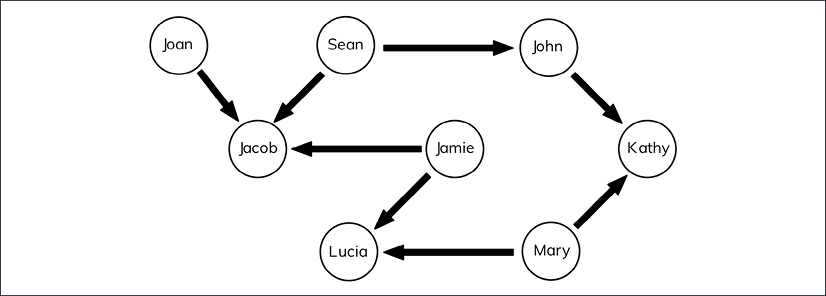
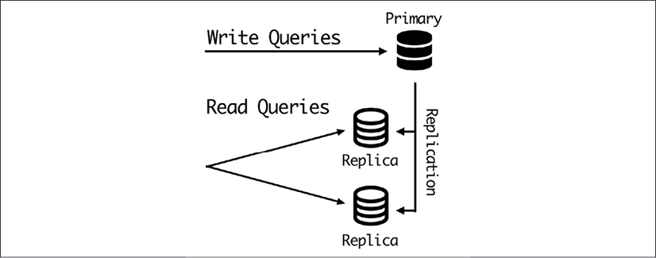
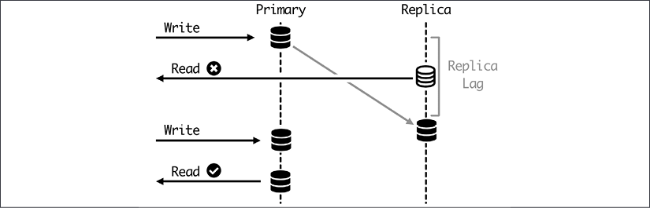
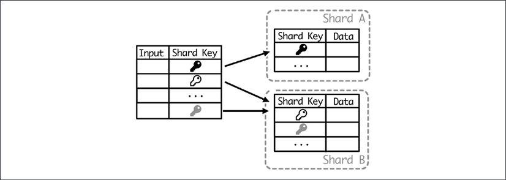
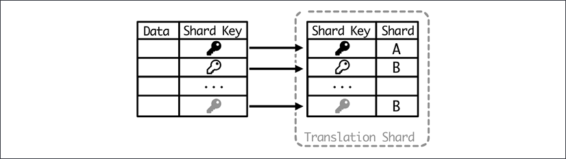
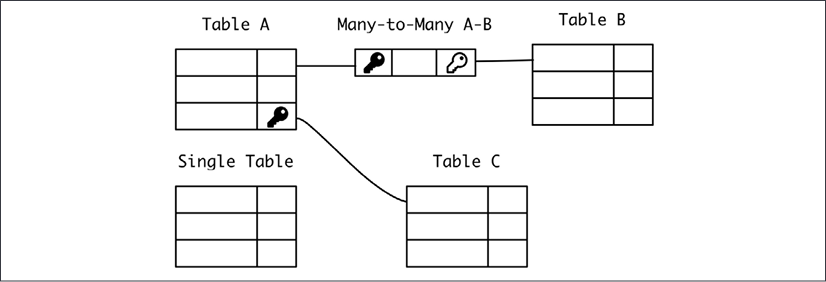
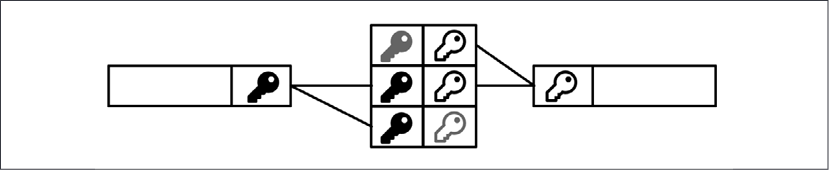
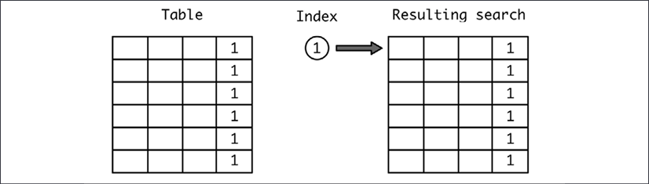

# 数据建模

任何应用程序的核心都是其数据。在任何计算机应用程序的根本上，它是一个旨在处理信息、接收信息、转换信息并返回相同信息或从中提取的有见地的元素的系统。存储的数据是此循环的关键部分，因为它允许你使用之前已传达的信息。

在本章中，我们将讨论如何对应用程序中存储的数据进行建模，以及存储和构造要持久化的数据的不同选项。

我们将从描述可用的不同数据库选项开始，这对于理解它们的不同应用程序至关重要，但在本章中，我们将主要关注关系数据库，因为它们是最常见的类型。我们将描述事务的概念，以确保一次性应用不同的更改。

我们将描述通过使用多个服务器来增加关系数据库范围的不同方法，以及每个选项的用例是什么。

之后，我们将在设计模式时描述不同的替代方案，以确保我们的数据以最佳方式构建。我们将讨论如何通过使用索引来快速访问数据。

在本章中，我们将介绍以下主题：

- 数据库类型
- 数据库事务
- 分布式关系数据库
- 架构设计
- 数据索引

让我们从介绍不同的数据库开始。

## 数据库类型

来自应用程序的所有持久数据都应该存在于数据库中。正如我们所讨论的，数据是任何应用程序中最关键的方面，正确处理数据对于确保项目的可行性至关重要。

> 从技术上讲，数据库本身就是数据的集合，由允许输入和输出数据的软件数据库管理系统 (DBMS) 处理。通常，“数据库”一词用于收集和管理系统，具体取决于上下文。大多数 DBMS 将允许访问多个相同类型的数据库，而不能在它们之间交叉数据，以允许数据的逻辑分离。

在软件系统可用的大部分时间里，数据库一直是一个关键工具。他们创建了一个抽象层，允许访问数据，而不必过多担心硬件如何构建数据。大多数数据库允许定义数据的结构，而不必担心如何在幕后实现。

> 正如我们在第 2 章 API 设计中所看到的，这种抽象并不完美，有时我们必须了解数据库的内部结构才能提高性能或以“正确的方式”做事。

DBMS 是软件领域投资最多、最成熟的项目之一。每个 DBMS 都有自己的怪癖，以至于“数据库专家”有一个特定的工作角色：数据库管理员 (DBA)。

> 长期以来，DBA 角色非常流行，需要高度专业化的工程师，以至于 DBA 专门从事单个特定的 DBMS。 DBA 将作为数据库中的专家，既知道如何访问它，又确保对其进行的任何更改都能正常工作。它们通常是唯一允许在数据库中执行更改或维护任务的人。

硬件和软件的性能改进以及用于处理数据库复杂性的外部工具使这个角色变得不那么常见，尽管它仍然被一些组织使用。在某种程度上，架构师的角色取代了这个角色的一部分，尽管更多的是监督角色，而不是把关角色。

市场上有多种 DBMS 可供选择，其中有很多涵盖大多数用例的开源软件可供选择。粗略地说，我们可以将现有的 DBMS 替代品分为以下非详尽分类：

- 关系数据库：数据库中的默认标准。使用 SQL 查询语言并具有已定义的架构。例如 MySQL 或 PostgreSQL 等开源项目，或 Oracle 或 MS SQL Server 等商业项目。
- 非关系数据库：传统数据库的新替代品。这是一个多元化的群体，有多种选择，包括非常不同的选择，如 MongoDB、Riak 或 Cassandra。
- 小型数据库：这些数据库旨在嵌入到系统中。最著名的例子是 SQLite。

让我们更深入地了解它们。

### 关系数据库

这些是最常见的数据库，也是谈论数据库时想到的第一个想法。数据库的关系模型是在 1970 年代开发的，它基于创建一系列可以相互关联的表。自 1980 年代以来，它们变得非常受欢迎。

每个定义的表都有许多固定的字段或列，数据被描述为记录或行。表格理论上是无限的，因此可以添加越来越多的行。其中一列被定义为主键并唯一地描述该行。因此，它必须是唯一的。

> 如果有一个值是唯一且具有足够描述性的，则可以将其用作主键；这称为自然键。自然键也可以是字段的组合，尽管这限制了它们的便利性。当自然键不可用时，数据库可以直接处理递增的计数器，以确保每行都是唯一的。这称为代理键。

必要时，主键用于在其他表中引用该记录。这将创建数据库的关系方面。当表中的列引用另一个表时，这称为外键。

这些引用可以产生一对一的关系；一对多，当单行可以在另一个表的多行中引用时；甚至多对多，这需要一个中间表来交叉数据。

所有这些信息都需要在模式中进行描述。模式描述了每个表，每个表的字段和类型，以及它们之间的关系。

> 关系数据库中的关系实际上是约束。这意味着如果某个值仍然在某处被引用，则无法删除它。关系数据库来自严格的数学背景，尽管该背景以不同程度的严格实现。

重要的是要注意定义模式需要提前思考并意识到可以进行的更改。在拥有数据之前定义类型还需要牢记可能的改进。虽然可以更改架构，但它始终是一项严肃的操作，如果不小心处理，可能会导致数据库在一段时间内不可用，或者在最坏的情况下，数据可能会被不一致地更改或处理。

还可以执行查询来搜索满足特定条件的数据。为此，可以根据它们的关系连接表。

几乎所有关系数据库都使用结构化查询语言或 SQL 进行交互。这种语言已成为使用关系数据库的标准，并遵循我们在此处描述的相同概念。它描述了如何查询数据库以及如何添加或更改其中包含的数据。

SQL 最相关的特征是它是一种声明性语言。这意味着语句描述的是结果，而不是获取结果的过程，这在命令式语言中很常见。这将内部细节从如何专注于什么中抽象出来。

> 命令式语言描述控制流并且是最常见的语言。命令式语言的示例有 Python、JavaScript、C 和 Java。声明式语言通常仅限于特定领域（领域特定语言，或 DSL），允许你以更简单的术语描述结果，而命令式语言更灵活。

此特性使 SQL 在系统之间具有可移植性，因为不同数据库中的内部结构可能有所不同。使用特定的关系数据库并适应另一个数据库相对容易。

> 这有时用于设置本地数据库以运行与系统投入生产后将到位的最终数据库不同的测试。这在某些 Web 框架中是可能的，但需要一些注意事项，因为复杂系统有时必须使用特定数据库的特定特征，因此无法执行这种简单的替换。

虽然关系数据库非常成熟和灵活，并且用于非常不同的场景，但有两个主要问题难以处理。一个是需要一个预定义的模式，正如我们上面所说的。另一个在一定规模之后更严重的是处理规模。关系数据库被认为是一个可以访问的中央访问点，一旦达到垂直扩展的限制，就需要一些技术来扩展。

我们将在本章后面讨论处理这个问题并提高关系数据库可扩展性的具体技术。

### 非关系数据库

非关系数据库是一组不同的 DBMS，它们不适合关系范式。

> 非关系型数据库也称为 NoSQL，强调 SQL 语言的关系本质，代表“not SQL”或“Not Only SQL”，更能反映添加可能性而不是删除它们。

虽然甚至在引入关系数据库之前就已经存在非关系数据库，但自 2000 年代以来，已经引入或恢复了寻找替代选择的方法和设计。他们中的大多数旨在解决关系数据库中的两个主要弱点，即它们的严格性和可扩展性问题。

它们种类繁多，结构也大不相同，但最常见的非关系系统类型如下：

- 键值存储
- 文件存储
- 宽列数据库
- 图数据库

让我们详细了解它们。

#### 键值存储

就功能而言，键值存储可以说是所有数据库中最简单的。它们定义了一个存储值的键。该值对系统完全不透明，无法以任何方式查询。在某些实现中，甚至无法查询系统中的键。相反，它们需要成为任何操作的输入。

这与哈希表或字典非常相似，但规模更大。缓存系统通常基于这种数据存储。

> 虽然技术相似，但缓存和数据库之间有一个重要的区别。缓存是存储已计算数据以加快检索速度的系统，而数据库存储原始数据。如果数据不在缓存中，则可以从不同的系统中检索，但如果不在数据库中，则要么数据没有存储，要么出现了大问题。
>
> 这就是为什么缓存系统倾向于只将信息存储在内存中，并且对重启或问题更有弹性，使它们更容易处理。如果缺少缓存，则系统可以工作，只是速度较慢。
>
> 信息最终不会存储在没有适当存储备份的缓存系统中，这一点非常重要。这是一个有时会无意中发生的错误，例如，对于时间数据，但风险是在错误的时间出现问题并丢失数据，因此请注意这一点。

该系统的主要优点一方面是它的简单性，允许快速存储和检索数据。它还允许你在很大程度上水平扩展。由于每个密钥都独立于其余密钥，因此它们甚至可以存储在不同的服务器中。系统中也可以引入冗余，为每个键和值制作多个副本，但这会使信息的检索变慢，因为需要比较多个副本以检测数据损坏。

键值数据库的一些示例是 **Riak** 和 **Redis**（如果使用启用了持久性）。

#### 文件存储
文档存储围绕“文档”的概念展开，类似于关系数据库中的“记录”。但是，文档更灵活，因为它们不需要遵循预定义的格式。它们通常还允许在子字段中嵌入更多数据，这是关系数据库通常不做的事情，而是依赖于创建关系并将该数据存储在不同的表中。

例如，一个文档可能如下所示，这里表示为 JSON：

```json
{
    "id": "ABCDEFG"
    "name": {
        "first": "Sherlock",
        "surname": "Holmes"
     }
    "address": {
        "country": "UK",
        "city": "London",
        "street": "Baker Street",
        "number": "221B",
        "postcode": "NW16XE"
    }
}
```

文档通常分组在集合中，类似于“表格”。通常，文档由充当主键的唯一 ID 检索，但也可以构造查询以搜索文档中创建的字段。

因此，在我们的例子中，我们可以检索键 (ID) ```ABCDEFG```，就像在键值存储中一样；或者进行更丰富的查询，例如“让我在侦探集合中的 ```address.country``` 等于 ```UK``` 的所有条目”。

> 请记住，虽然在技术上可以创建包含完全独立且具有不同格式的文档的集合，但实际上，集合中的所有文档都将遵循某种相似的格式，具有可选字段或嵌入数据。

一个集合中的文档可以通过它们的 ID 与另一个集合中的文档相关联，从而创建一个引用，但通常这些数据库不允许你创建连接查询。相反，应用层应该允许你检索此链接信息。

> 一般来说，文档倾向于嵌入信息而不是创建参考。这可能导致信息非规范化，在多个地方重复信息。我们将在本章后面更多地讨论非规范化。

文档存储的一些示例是 **MongoDB** (https://www.mongodb.com/) 和 **Elasticsearch** (https://www.elastic.co/elasticsearch/)。

#### 宽列数据库

宽列数据库的结构是其数据由列分隔。他们创建具有某些列的表，但它们是可选的。他们也无法将一张表中的记录与另一张表相关联。

它们比纯键值存储更容易被查询，但需要更多的前期设计工作来确定系统中可能存在哪些类型的查询。这比面向文档的商店更具限制性，在设计完成后可以更灵活地执行此操作。

> 通常，列是相关的，只能按特定顺序查询，这意味着如果列 A、B 和 C 存在，则行可以根据 A、A 和 B 或 A、B 和 C 查询，但不能例如，只有 C 或 B 和 C。

它们针对具有高可用性和复制数据的非常大的数据库部署。宽列数据库的一些示例是 Apache Cassandra (https://cassandra.apache.org/) 和 Google 的 Bigtable (https://cloud.google.com/bigtable)。

#### 图数据库

虽然以前的非关系数据库基于放弃在元素之间创建关系以获得其他特性（如可伸缩性或灵活性）的能力，但图形数据库却朝着相反的方向发展。它们极大地增强了元素的关系方面以创建复杂的图形。

它们存储作为节点和边的对象，或节点之间的关系。边和节点都可能具有更好地描述它们的属性。

图数据库的查询能力旨在基于关系检索信息。例如，给定公司和供应商列表，在特定国家/地区的特定公司的供应链中是否有供应商？最多几级？这些问题对于关系数据库中的第一级（获取公司及其国家的供应商）可能很容易回答，但对于第三级关系则相当复杂和消耗。



图 3.1：图数据库的典型数据示例

它们通常用于社交图，其中人或组织之间存在联系。一些例子是 **Neo4j** (https://neo4j.com/) 或 **ArangoDB** (https://www.arangodb.com/)。

#### 小型数据库

与其他人相比，这组有点特别。它由不区分为独立进程的数据库系统组成，作为独立的客户端-服务器结构工作。相反，它们被嵌入到应用程序的代码中，直接从硬盘读取。它们通常用于作为单个进程运行并希望以结构化方式保存信息的简单应用程序中。

表示此方法的一种粗略但有效的方法是将信息作为 JSON 对象保存到文件中，并在需要时恢复它，例如智能手机应用程序的客户端设置。应用程序从内存启动时会加载设置文件，如果有任何更改则保存。

例如，在 Python 代码中，可以这样表示：

```python
>>> import json
>>> with open('settings.json') as fp:
...   settings = json.load(fp)
...
>>> settings
{'custom_parameter': 5}
>>> settings['custom_parameter'] = 3
>>> with open('settings.json', 'w') as fp:
...   json.dump(settings, fp)
```

对于少量的数据，这种结构可以工作，但它的局限性是难以查询。最完整的替代方案是 SQLite，它是一个成熟的 SQL 数据库，但它嵌入到系统中，不需要外部调用。数据库存储在二进制文件中。

SQLite 非常流行，甚至在许多标准库中都得到了支持，而无需外部模块，例如 Python 标准库。

```python
>>> import sqlite3
>>> con = sqlite3.connect('database.db')
>>> cur = con.cursor()
>>> cur.execute('''CREATE TABLE pens (id INTEGER PRIMARY KEY DESC, name, color)''')
<sqlite3.Cursor object at 0x10c484c70>
>>> con.commit()
>>> cur.execute('''INSERT INTO pens VALUES (1, 'Waldorf', 'blue')''')
<sqlite3.Cursor object at 0x10c484c70>
>>> con.commit()
>>> cur.execute('SELECT * FROM pens');
<sqlite3.Cursor object at 0x10c484c70>
>>> cur.fetchall()
[(1, 'Waldorf', 'blue')]
```


该模块遵循 DB-API 2.0 标准，这是连接数据库的 Python 标准。它旨在标准化对不同数据库后端的访问。这使得创建可以访问多个 SQL 数据库并以最少的更改交换它们的更高级别的模块变得容易。

> 你可以在 PEP-249 中查看完整的 DB-API 2.0 规范：https://www.python.org/dev/peps/pep-0249/。

SQLite 实现了大部分 SQL 标准。

## 数据库事务

存储数据可能是数据库内部的一项复杂操作。在某些情况下，它可以包括在一个地方更改数据，但有些操作可能会在一次操作中影响数百万条记录，例如，“更新在此时间戳之前创建的所有记录”。

这些操作的广泛性和可能性在很大程度上取决于数据库，但它们与关系数据库非常相似。在这种情况下，通常会有事务的概念。

事务是一次性发生的操作。它要么发生，要么不发生，但数据库不会在中间处于不一致的状态。例如，如果前面描述的“更新在此时间戳之前创建的所有记录”的操作可以产生通过错误仅更改一半记录的效果，那么这不是一个事务，而是多个独立的操作。

> 事务过程中可能会发生错误。在这种情况下，它会一直回到它的开头，所以不会改变任何记录。

这种特性在某些应用程序中可以成为对数据库的强烈要求，称为原子性。这意味着事务在应用时是原子的。该特性是所谓的 ACID 特性的主要特性之一。

其他属性是一致性、隔离性和持久性。那么这四个属性是：

- 原子性，这意味着事务作为一个单元应用。它要么完全应用，要么不应用。
- 一致性，这意味着在考虑数据库中定义的所有限制的情况下应用事务。例如，遵守外键约束，或应用任何修改数据的存储触发器。
- 隔离性，这意味着并行事务的工作方式与它们一个接一个地运行的方式相同，确保一个事务不会影响另一个事务。显然，例外是它们的运行顺序，这可能会产生影响。
- 持久性，这意味着，在事务被报告为完成后，即使发生灾难性故障，例如数据库进程崩溃，它也不会丢失。

这些属性是处理数据的黄金标准。这意味着数据是安全且一致的。

大多数关系数据库的概念是启动一个事务，执行几个操作，然后最终提交事务，以便一次性应用所有更改。如果出现问题，事务将失败，恢复到之前的状态。如果在执行操作期间检测到任何问题（如约束问题），也可以中止事务。

> 这种操作方式允许创建额外的验证步骤，因为在事务内部，仍然可以在最终提交之前查询和验证数据。

ACID 事务在性能方面是有代价的，尤其是在可扩展性方面。对持久性的需求意味着数据在从事务返回之前需要存储在磁盘或其他永久支持上。隔离要求意味着每个打开的事务都需要以看不到新更新的方式运行，这可能需要存储临时数据，直到事务完成。一致性还需要检查以确保满足所有约束，这可能需要复杂的检查。

几乎所有关系数据库都完全符合 ACID，这已成为它们的定义特征。在非关系世界中，事情更加灵活。

但是，使用具有这些属性的多个服务器或节点来扩展数据库被证明是困难的。该系统创建分布式事务，同时在多个服务器上运行。在具有多个服务器的数据库中维护完整的 ACID 事务非常困难，并且在性能方面有很大的损失，因为了解其他节点所做的事情并在任何节点发生故障时回滚事务会导致额外的延迟其中。这些问题也以非线性方式增加，有点与拥有多个服务器的优势背道而驰。

虽然这是可能的，但许多应用程序可以绕过这些限制。我们将看到一些有用的模式。

## 分布式关系数据库

正如我们之前所讨论的，关系数据库在设计时并未考虑可伸缩性。它们非常适合执行强大的数据保证，包括 ACID 事务，但它们首选的操作方式是通过单个服务器。

这可能会限制应用程序使用关系数据库的大小。

> 值得注意的是，数据库服务器可以垂直增长，这意味着使用更好的硬件。与应用其中一些技术相比，增加服务器的容量或用更大的服务器替换它是一种更容易满足高需求的解决方案，但有一个限制。在任何情况下，请仔细检查预期尺寸是否足够大。如今，云提供商中的服务器达到 1 TB 或更多的 RAM。这足以涵盖大量案例。

请注意，这些技术对于在系统启动和运行后扩展系统很有用，并且可以添加到关系数据库的大多数用途中。

ACID 属性的缺点是最终一致性。系统不是一次性处理的原子操作，而是逐渐转换为所需的系统。并非系统的每个部分都同时具有相同的状态。相反，当这种变化在系统中传播时会有一定的延迟。另一个很大的优势是我们可以提高可用性，因为它不会依赖单个节点来进行更改，并且任何不可用的元素都会在恢复后赶上。由于集群的分布式特性，这可能涉及咨询不同的来源并尝试在它们之间达到法定人数。

这在很大程度上取决于你在考虑是否值得放松某些 ACID 属性时所考虑的应用程序。延迟或数据损坏具有更高影响且可能不可接受的关键数据可能不适合分布式数据库。

为了增加容量，首先要了解应用程序的数据访问是什么。

### 主/从

一个非常常见的情况是读取次数远高于写入次数。或者，用 SQL 术语来说，```SELECT```语句的数量远高于 ```UPDATE``` 或 ```DELETE``` 语句。这是非常典型的应用程序，在这些应用程序中，对信息的访问比对信息的更新要多，例如，报纸，有很多访问权来阅读新闻文章，但相对而言没有那么多新文章。

这种情况的一个常见模式是创建一个集群，添加一个或多个数据库的只读副本，然后将读取分布在它们之间，类似于这种情况：



图 3.2：处理多个读取查询

所有的写入都转到主节点，然后自动传播到副本节点。因为副本包含整个数据库，并且唯一的写入活动来自主数据库，所以这增加了系统中可以同时运行的查询数量。

大多数关系数据库，尤其是最常见的 MySQL 和 PostgreSQL，都原生支持该系统。写入节点配置为主节点，副本指向主节点以开始复制数据。一段时间后，它们将是最新的并与主要同步。

主数据库中的每个新更改都将自动复制。但是，这有一个延迟，称为复制滞后。这意味着刚写入的数据将在一段时间内无法读取，通常不到一秒。

> 复制延迟是数据库健康状况的一个很好的指标。如果延迟随着时间的推移而增加，则表明集群无法处理流量级别并需要调整。这个时间将受到网络和每个节点的一般性能的很大影响。

因此，要避免的操作是在外部操作中写入并立即读取相同或相关的数据，因为这会导致结果不一致。这可以通过暂时保留数据来解决，避免查询的需要，或者可以解决对主节点的特定读取，以确保数据是一致的。

> 这些直接读取应仅在必要时使用，因为它们违背了减少对主服务器的查询数量的想法。这就是设置多个服务器的原因！



图 3.3：主节点上的特定读取查询

该系统还允许存在数据冗余，因为它总是被复制到副本中。如果出现问题，可以将副本提升为新的主副本。

> 副本服务器不履行与备份完全相同的角色，尽管它可以用于类似的目的。副本旨在执行快速操作并维护系统的可用性。备份运行起来更容易、成本更低，并允许你保留数据的历史记录。备份也可以位于与副本完全不同的位置，而副本需要与主服务器有良好的网络连接。
>
> 即使有可用的副本，也不要跳过备份。如果发生灾难性故障，备份将添加一个安全层。

请注意，这种构建数据库的方式可能需要调整应用程序级别以了解所有更改和对不同数据库服务器的访问。有一些现有的工具，例如 Pgpool（用于 PostgreSQL）或 ProxySQL（用于 MySQL），它们位于路径中间并重定向查询。应用程序将查询发送给代理，然后代理根据配置重定向它们。有些情况，例如我们在上面看到的读写模式，不容易涵盖，可能需要对应用程序代码进行特定更改。在你的应用程序中运行它们之前，请务必了解这些工具的工作原理并运行一些测试。

这种结构的一个更简单的例子是创建离线副本。这些可以从备份创建，而不是从实时系统更新。这些副本对于创建不需要最新信息的查询很有用，如果每日快照可能就足够了。它们在统计分析或数据仓库等应用程序中很常见。

### 分片

如果应用程序的写入次数较多，则主副本结构可能不够好。太多的写入被定向到同一台服务器，这会造成瓶颈。或者，如果系统流量增长得足够多，那么单个服务器可以接受的写入数量就会受到限制。

一种可能的解决方案是对数据进行水平分区。这意味着根据特定的键将数据划分到不同的数据库中，因此所有相关的数据都可以到同一台服务器上。每个不同的分区称为一个分片。

> 请注意，“partitioning”和“sharding”可以被认为是同义词，尽管实际上分片仅在分区是水平的情况下，将单个表分成不同的服务器。分区可以更通用，比如将一个表分成两个，或者分成不同的列，这通常不称为分片。

分区键称为分片键，根据它的值，每一行将被分配一个特定的分片。


图 3.4：分片键

> shard 这个名字来源于电子游戏 Ultima Online，它在 90 年代后期使用这种策略创建了一个“多元宇宙”，不同的玩家可以在不同的服务器上玩同一个游戏。他们称它们为“碎片”，因为它们是同一现实的各个方面，但其中包含不同的参与者。这个名字卡住了，它仍然被用来描述架构。

任何查询都需要能够确定要应用的正确分片。任何影响两个或更多分片的查询可能无法执行或只能连续执行。当然，这排除了在单个事务中执行这些查询的可能性。无论如何，这些操作将非常昂贵，应尽可能避免。当数据自然分区时，分片是一个绝妙的主意，而在执行影响多个分片的查询时非常糟糕。

> 一些 NoSQL 数据库允许本地分片，它会自动处理所有这些选项。一个常见的例子是 MongoDB，它甚至能够以透明的方式在多个分片中运行查询。在任何情况下，这些查询都会很慢。

分片键的选择也很关键。一个好的键应该遵循数据之间的自然分区，因此不需要执行跨分片查询。例如，如果用户的数据独立于其他数据，这可能发生在照片共享应用程序中，则用户标识符可能是一个很好的分片键。

另一个重要的品质是需要根据 shard key 来确定处理查询的分片。这意味着每个查询都需要有可用的分片键。这意味着分片键应该是每个操作的输入。

shard key 的另一个属性是数据应该以一种分片具有相同大小的方式进行理想的划分，或者至少它们足够相似。如果一个分片比其他分片大得多，则可能导致数据不平衡、查询分布不充分以及一个分片成为瓶颈的问题。

#### 纯分片

在纯分片上，数据全部分区在分片中，分片键是每个操作的输入。分片是根据分片键确定的。

为了确保分片是平衡的，每个键都以在分片数量之间平均分布的方式进行散列。例如，一个典型的情况是使用模运算。如果我们有 8 个分片，我们会根据平均分布的数字确定数据被划分到哪个分片。

| User ID | Operation   | Shard |
| ------- | ----------- | ----- |
| 1234    | 1234 mod 8  | 2     |
| 2347    | 2347 mod 8  | 3     |
| 7645    | 7645 mod 8  | 5     |
| 1235    | 1235 mode 8 | 3     |
| 4356    | 4356 mod 8  | 4     |
| 2345    | 2345 mod 8  | 1     |
| 2344    | 2344 mod 8  | 0     |

如果分片键不是数字，或者不是均匀分布，则可以应用散列函数。例如，在 Python 中：

```python
>>> import hashlib
>>> shard_key = 'ABCDEF'
>>> hashlib.md5(shard_key.encode()).hexdigest()[-6:]
'b9fcf6'
>>> int('b9fcf6', 16)  # Transform in number for base 16
12188918
>>> int('b9fcf6', 16) % 8
6
```

仅当分片键始终可用作每个操作的输入时，此策略才可行。当这不是一个选项时，我们需要查看其他选项。

改变分片的数量并不是一件容易的事，因为每个键的目的地是由一个固定的公式决定的。但是，可以通过提前做一些准备来增加或减少分片的数量。

我们可以创建指向同一台服务器的“虚拟分片”。例如，要创建 100 个分片，并使用两台服务器，最初的虚拟分片分布将是这样的：

| 虚拟分片 | 服务器   |
| -------- | -------- |
| 0-49     | Server A |
| 50-99    | Server B |

如果需要增加服务器的数量，虚拟分片结构会以这种方式改变。

| 虚拟分片 | 服务器   |
| -------- | -------- |
| 0-24     | Server A |
| 25-49    | Server C |
| 50-74    | Server B |
| 75-99    | Server D |

对与每个分片对应的特定服务器的这种更改可能需要更改一些代码，但由于分片键计算不会改变，因此更容易处理。可以反向应用相同的操作，尽管它可能会造成不平衡，因此需要小心操作。

| 虚拟分片 | 服务器   |
| -------- | -------- |
| 0-24     | Server A |
| 25-49    | Server C |
| 50-99    | Server B |

每个操作都需要根据分片键更改数据的位置。这是一项昂贵的操作，尤其是在需要交换大量数据的情况下。

#### 混合分片
有时不可能创建纯分片，并且需要从输入转换以确定分片键。例如，如果分片键是用户 ID，则当用户登录时就是这种情况。用户将使用他们的电子邮件登录，但需要将其转换为用户 ID 才能确定用于搜索信息的分片。

在这种情况下，外部表可以纯粹用于将特定查询的输入转换为分片键。



图 3.5：用于翻译分片键输入的外部表

这就产生了一个单一的分片负责这个翻译层的情况。该分片可以专门用于此目的，也可以用作任何其他分片。

请记住，这需要为每个可能的输入参数（不是直接分片键）提供一个转换层，并且它需要将所有分片的所有信息保存在单个数据库中。这需要受到控制并尽可能少地存储信息，以避免出现问题。

正如我们在上面看到的，这个策略也可以用来直接存储什么分片键到哪个分片，并执行查询而不是直接操作。



图 3.6：将分片键存储到分片

这带来了不便，即根据键确定分片需要在数据库中进行查询，尤其是对于大型数据库。但它也允许以一致的方式更改数据的分片，这可用于调整分片的数量，例如增加或减少数量。它可以在不需要停机的情况下完成。

如果特定的分片，不仅是分片键，存储在这个转换表中，分片对键的分配可以一个一个地改变，并且以连续的方式。过程大概是这样的：

- 分片键 X 在引用表中分配给服务器 A。这是开始状态。
- 来自服务器 A 的分片键 X 的数据被复制到服务器 B。请注意，目前还没有涉及分片键 X 的查询被定向到服务器 B。
- 复制所有数据后，分片键 X 的引用表条目将更改为服务器 B。
- 对分片键 X 的所有查询都定向到服务器 B。
- 可以清理服务器 A 中 shard key X 中的数据。

步骤 3 是关键步骤，只需要在所有数据复制完成之后，并且在执行任何新的写入之前进行。确保这一点的一种方法是在引用表中创建一个标志，该标志可以在操作到位时停止或延迟数据写入。此标志将在第 2 步之前设置，并在第 3 步完成后删除。

随着时间的推移，此过程将产生平稳的迁移，但它需要足够的空间来工作，并且可能需要大量时间。

> 低档操作比高档操作更复杂，因为空间的增加允许有足够的空间。幸运的是，数据库集群很少需要缩减规模，因为大多数应用程序会随着时间的推移而增长。

请留出充足的时间来完成迁移。根据数据集的大小和复杂性，迁移可能需要很长时间，极端情况可能需要数小时甚至数天。

#### 表分片

对于较小的集群，通过 shard key 进行分片的另一种方法是按服务器分隔表或集合。这意味着表 X 中的任何查询都被定向到特定服务器，而其余查询被定向到另一个服务器。此策略仅适用于不相关的表，因为无法在不同服务器中的表之间执行连接。

> 请注意，虽然结构相似，但可以认为这是迂腐的，因为没有正确分片。

这是一种不太复杂的替代方案，但灵活性较低。仅推荐用于相对较小的集群，其中一到两个表与其余表之间的大小存在很大不平衡，例如，如果一个表存储的日志比数据库的其余部分大得多并且很少被访问。

### 分片的优缺点

总之，分片的主要优点是：

- 允许将写入分布在多个服务器上，增加系统的写入吞吐量
- 数据存储在多个服务器中，因此可以存储海量数据，而不限制可以存储在单个服务器中的数据

从本质上讲，分片允许创建大型、可扩展的系统。但它也有缺点：

- 分片系统运行起来更复杂，并且在配置不同的服务器等方面有一些开销。虽然任何大型部署都会有其问题，但分片需要比主副本设置更多的工作，因为需要更加小心地计划维护和操作，并且操作将花费更长的时间。
- 对分片的原生支持仅在少数数据库中可用，例如 MongoDB，但关系数据库没有原生实现该功能。这意味着需要使用临时代码来处理复杂性，这将需要在开发上进行投资。
- 一旦数据被分片，一些查询将不可能或几乎不可能进行。根据数据的分区方式，聚合和连接是不可能的。需要仔细选择分片键，因为它将对可能的查询有很大的影响。我们也失去了 ACID 属性，因为某些操作可能需要涉及多个分片。分片数据库不太灵活。

正如我们所见，设计、操作和维护分片数据库只对非常大的系统有意义，因为数据库中的操作数量需要如此复杂的系统。

## 架构设计

对于需要定义模式的数据库，使用的具体设计是需要考虑的。

> 本节将专门讨论关系数据库，因为它们是执行更严格模式的数据库。其他数据库在更改方面更加灵活，但它们也受益于花一些时间思考其结构。

更改模式是一项重要的行动，需要进行规划，当然，需要将长期观点应用于设计。

> 我们将在本章后面讨论如何更改数据库的模式。我们只需要在这里说明，改变数据库模式是构建系统过程中不可避免的一部分。尽管如此，这是一个需要尊重并理解可能存在的问题的过程。花时间思考并确保对架构进行适当的设计绝对是一个好主意。

如果有指向其他表的外键，则开始设计模式的最佳方法是绘制不同的表、字段及其关系。



图 3.7：绘制模式

这些数据的呈现应该允许你检测可能的盲点或元素的重复。如果表的数量太大，可能需要将其分成几组。

> 尽管有一些工具可以帮助完成这项工作，但就个人而言，它可以帮助我手绘这些关系，因为它可以帮助我思考不同的关系并构建设计的心理形象。

每个表都可以与其他不同类型的表有外键关系：

- 一对多，其中为另一个表的多个元素添加单个引用。例如，在他们的所有书籍中都引用了一位作者。在这种情况下，一个简单的外键关系有效，因为 Books 表将有一个指向 Authors 条目的外键。多本书行可以引用同一作者。
    
    图 3.8：第一个表中的键引用第二个表中的多行
- 一对零或 -one 是行只能与另一行相关的特定情况。例如，假设编辑可以在一本书上工作（一次只能写一本书）。 Books 表中编辑器的引用是一个外键，如果没有编辑过程，可以将其设置为空。编辑对本书的另一个反向引用将确保这种关系是独一无二的。两个引用都需要在事务中更改。
    严格的一对一关系，比如一本书和一个标题，两者总是相关的，通常更好地建模为将所有信息添加到一个表中。
    
    图 3.9：这种关系只能匹配两行
- 多对多，可以在两个方向上进行多个分配。例如，可以将一本书分类为不同的流派。一个流派将分配给多本书，而一本书可以分配给多个流派。在关系数据结构下，需要一个中间的额外表来建立这种关系，这将指向书籍和流派。
    这个额外的表格可能包含更多信息，例如，书的流派有多准确。这样，它可以描述 50% 恐怖和 90% 冒险的书。
    
    > 在关系数据世界之外，有时并不迫切需要创建多对多关系，而是可以直接将它们添加为标签集合。一些关系数据库现在允许更灵活地允许作为列表或 JSON 对象的字段，可以以这种方式使用，从而简化设计。
    
    图 3.10：注意中间表允许多种组合。第一个表可以引用第二个的多行，第二个可以引用第一个的多行

在大多数情况下，为每个表存储的字段类型很简单，但应考虑某些细节：

- 留出足够的空间在未来发展。某些字段（如字符串）需要定义要存储的最大大小。例如，存储表示电子邮件地址的字符串最多需要 254 个字符。但有时大小并不明显，比如存储客户的姓名。在这些情况下，最好在安全尺寸上犯错并增加限制。

- 不仅应该对数据库实施限制，而且还要在此级别之上实施限制，以始终允许处理该字段的任何 API 或 UI 优雅地处理它。
    在处理数字时，在大多数情况下，常规整数足以表示最常用的数字。尽管一些数据库接受诸如 smallint 2 字节或 tinyint 1 字节值的类别，但不建议使用它们。使用的空间差异很小。

- 内部数据库表示不需要与外部可用的相同。例如，存储在数据库中的时间应始终为 UTC，然后转换为用户的时区。

    > 始终以 UTC 格式存储时间允许在服务器中使用一致的时间，特别是如果有不同时区的用户。为用户应用时区存储时间会在数据库中产生不可比较的时间，而使用服务器的默认时区会根据服务器的位置产生不同的结果，更糟糕的是，如果不止一个，数据不一致涉及不同时区的服务器。确保所有时间都以 UTC 格式存储在数据库中。

另一个例子是如果存储价格，最好将它们存储为美分，以避免浮动数字，然后将它们显示为美元和美分。

> 例如，这意味着 99.95 美元的价格将存储为整数 9995。处理浮点运算可能会给价格带来问题，并且价格可以转换为美分以便于处理。

如果出于某种原因以不同的格式存储它们更好，则内部表示不需要遵循相同的约定。

- 同时，最好自然地表示数据。一个典型的例子是过度使用数字 ID 来表示具有自然键的行或使用枚举（分配用于表示选项列表的小整数）而不是使用短字符串。虽然这些选择在前一段时间是有意义的，但当空间和处理能力受到更多限制时，现在性能提升可以忽略不计，并且以可理解的方式存储数据对开发有很大帮助。

    > 例如，不要使用整数字段来存储颜色，其中 1 表示红色，2 表示蓝色，3 表示黄色，而是使用使用字符串 RED、BLUE 和 YELLOW 的短字符串字段。即使有数百万条记录，存储差异也可以忽略不计，并且导航数据库更容易。

我们稍后会看到与此概念相关的规范化和非规范化。

- 没有设计是完美的或完整的。在正在开发的系统中，模式总是需要更改。这是完全正常和预期的，应该被接受。完美是善的敌人。设计应尽量简单，以适应系统的当前需求。过度设计，试图推进每一个可能的未来需求并使设计复杂化，是一个真正的问题，可能会浪费努力为永远不会实现的需求奠定基础。保持你的设计简单灵活。

### 范式

正如我们所见，在关系数据库中，一个关键概念是外键概念。数据可以存储在一个表中并链接到另一个表。这种数据拆分意味着一组有限的数据可以一分为二，而不是存储在单个表中。

例如，让我们看一下这个表，最初以字段 House 作为字符串：

Characters

| id   | Name               | House     |
| ---- | ------------------ | --------- |
| 1    | Eddard Stark       | Stark     |
| 2    | Jon Snow           | Stark     |
| 3    | Daenerys Targaryen | Targaryen |
| 4    | Jaime Lannister    | Lannister |

为保证数据一致且没有错误，可以对字段House进行归一化处理。这意味着它存储在不同的表中，并且以这种方式强制执行 FOREIGN KEY 约束。

Characters Houses

| id   | Name               | HouseId (FK) |      | Name (PK) |      | Words            |
| ---- | ------------------ | ------------ | ---- | --------- | ---- | ---------------- |
| 1    | Eddard Stark       | Stark        |      | Stark     |      | Winter is coming |
| 2    | Jon Snow           | Stark        |      | Lannister |      | Hear me roar     |
| 3    | Daenerys Targaryen | Targaryen    |      | Targaryen |      | Fire and blood   |
| 4    | Jaime Lannister    | Lannister    |      |           |      |                  |

这种操作方式使数据标准化。除非在 Houses 表中首次引入，否则不能添加带有新 House 的新条目。同样地，Houses 中的条目不能被删除，而 Characters 中的单个条目包含引用。这确保了数据非常一致并且没有问题，例如为新条目引入诸如 House Lanister (single n) 之类的错字，这可能会使以后的查询复杂化。

> 它还具有能够为房屋中的每个条目添加额外信息的优势。在这种情况下，我们可以添加众议院的话。数据也更加紧凑，因为重复的信息以单一的速度存储。

另一方面，这有几个问题。首先，任何需要知道House信息的Character的引用都需要进行```JOIN```查询。在第一个 ```Characters``` 表中，我们可以这样生成查询：

```sql
SELECT Name, House FROM Characters;
```

在第二个模式中，我们将需要这个：

```sql
SELECT Characters.Name, Houses.Name 
FROM Characters JOIN Houses ON Characters.HouseId = Houses.id;
```

此查询将需要更长的时间来执行，因为需要从两个表中组合信息。对于大桌子，这个时间可能很长。例如，如果我们为每个角色添加 PreferredWeapon 字段和 Weapons 规范化表，这也可能需要来自不同表的 ```JOIN```。或者，随着字符表在字段中的增长，我们可以添加更多表。

插入和删除数据也需要更长的时间，因为需要执行更多的检查。一般来说，操作需要更长的时间。

规范化的数据也很难分片。将每个元素描述在自己的表中并从那里引用的规范化概念本质上难以分片，因为它使分区非常困难。

另一个问题是数据库更难读取和操作。删除需要以有序的方式进行，随着更多字段的添加，这变得更加难以遵循。此外，对于简单的操作，需要执行复杂的 ```JOIN``` 查询。查询更长，生成更复杂。

虽然这种通过数字标识符创建外键的规范化结构非常典型，但它不是唯一的选择。

为了提高数据库的清晰度，可以使用自然键来简化它们，以这种方式描述数据。我们不使用整数作为主键，而是使用 ```Houses``` 表中的 ```Name``` 字段。

Characters Houses

| Id   | Name               | House (FK) |      | Name (PK) | Words            |
| ---- | ------------------ | ---------- | ---- | --------- | ---------------- |
| 1    | Eddard Stark       | Stark      |      | Stark     | Winter is coming |
| 2    | Jon Snow           | Stark      |      | Lannister | Hear me roar     |
| 3    | Daenerys Targaryen | Targaryen  |      | Targaryen | Fire and blood   |
| 4    | Jaime Lannister    | Lannister  |      |           |                  |

这不仅消除了额外字段的使用，而且还允许你使用描述性值进行引用。即使数据已标准化，我们也会恢复原始查询。

> 如前所述，存储字符串而不是单个整数的额外空间可以忽略不计。一些开发人员非常反对自然键并且更喜欢使用整数值，但现在并没有真正的技术理由来限制自己。

只有当我们想要获取 Words 字段中的信息时，我们才需要执行 JOIN 查询：

```sql
SELECT Name, House FROM Characters;
```

无论如何，这个技巧可能无法避免在正常操作中使用 ```JOIN``` 查询。可能有很多引用，并且系统在执行查询所花费的时间方面存在问题。在这种情况下，可能需要减少对 ```JOIN``` 表的需求。

### 非规范化

非规范化是与规范化相反的动作。规范化数据将其拆分为不同的表以确保所有数据一致，反规范化将信息重新组合到单个表中以避免加入表的必要性。

按照我们上面的例子，我们想像这样替换一个 JOIN 查询：

```sql
SELECT Characters.Name, Houses.Name, House.Words 
FROM Characters JOIN Houses ON Characters.House = Houses.Name;
```

遵循此架构：

Characters Houses

| Id   | Name               | House (FK) |      | Name (PK) | Words            |
| ---- | ------------------ | ---------- | ---- | --------- | ---------------- |
| 1    | Eddard Stark       | Stark      |      | Stark     | Winter is coming |
| 2    | Jon Snow           | Stark      |      | Lannister | Hear me roar     |
| 3    | Daenerys Targaryen | Targaryen  |      | Targaryen | Fire and blood   |
| 4    | Jaime Lannister    | Lannister  |      |           |                  |

对于与此类似的查询，查询单个表，请使用以下内容：

```sql
SELECT Name, House, Words FROM Characters
```

为此，数据需要在单个表中结构化。

Characters

| id   | Name               | House     |
| ---- | ------------------ | --------- |
| 1    | Eddard Stark       | Stark     |
| 2    | Jon Snow           | Stark     |
| 3    | Daenerys Targaryen | Targaryen |
| 4    | Jaime Lannister    | Lannister |

请注意，信息是重复的。每个角色都有一份```Words``` 的副本，这是以前不需要的。这意味着非规范化使用更多空间；在一个有很多行的大桌子上，空间更大。

非规范化也增加了数据不一致的风险，因为无法确保没有新值是旧值的拼写错误，或者错误地将不正确的单词添加到不同的房子。

但是，另一方面，我们现在不必加入表。对于大表，这可以大大加快读取和写入的处理速度。它还消除了对分片的担忧，因为现在可以在任何方便的分片键上对表进行分区，并将包含所有信息。

对于通常属于 NoSQL 数据库的用例，非规范化是一个极其常见的选项，它删除了执行 JOIN 查询的能力。例如，文档数据库将数据作为子字段嵌入到更大的实体中。虽然它肯定有它的缺点，但在某些操作中这是一个有意义的权衡。

## 数据索引

随着数据的增长，对数据的访问开始变慢。从一个充满信息的大表中准确检索正确的数据需要执行更多的内部操作来定位它。

> 虽然我们将描述与关系数据库相关的数据索引，但大多数基础知识都适用于其他数据库。

通过以易于搜索的方式巧妙地组织数据，可以大大加快此过程。这导致创建索引，使你可以通过搜索非常快速地找到数据。索引的基础是创建一个外部排序的数据结构，该结构指向数据库中每条记录的一个或多个字段。当表中的数据发生变化时，该索引结构始终保持排序。

例如，一个简短的表格可能包含此信息

| id   | Name     | Height (cm) |
| ---- | -------- | ----------- |
| 1    | Eddard   | 178         |
| 2    | John     | 173         |
| 3    | Daenerys | 157         |
| 4    | Jaime    | 188         |

在没有索引的情况下，要查询哪个条目的高度最高，数据库需要单独检查每一行并对其进行排序。这称为全表扫描。如果表有数百万行，则全表扫描可能会非常昂贵。

通过为高度字段创建索引，始终排序的数据结构与数据保持同步。

| id   | Name     | Height (cm) |      | Height (cm) | id   |
| ---- | -------- | ----------- | ---- | ----------- | ---- |
| 1    | Eddard   | 178         |      | 188         | 4    |
| 2    | John     | 173         |      | 178         | 1    |
| 3    | Daenerys | 157         |      | 174         | 5    |
| 4    | Jaime    | 188         |      | 157         | 3    |


因为它总是排序的，所以任何与高度相关的查询都很容易完成。例如，获取前 3 个高度不需要任何检查，只需从索引中检索前三个记录，确定 180 到 170 之间的高度也很容易，使用排序列表中的搜索方法，如二进制搜索。同样，如果该索引不存在，查找这些查询的唯一方法是检查表中的每条记录。

请注意，索引并未涵盖所有字段。例如，名称字段没有索引。可能需要另一个索引来覆盖其他字段。同一个表接受多个索引。

> 表的主键始终被索引，因为它需要是唯一值。

可以组合索引，为两个或多个字段创建索引。这些复合索引根据两个字段的有序组合对数据进行排序，例如，```(Name, Height)``` 的复合索引将快速返回以 ```J``` 开头的 ```Names``` 的高度。```(Height, Name)``` 的复合索引将可以相反，启动高度，然后对名称字段进行排序。

可以仅在复合索引中查询索引的第一部分。在我们的示例中，```(Height, Name)```的索引将始终用于查询高度。

是否使用索引来检索信息由数据库自动完成； SQL 查询根本没有改变。在内部，数据库将在运行查询之前运行查询分析器。这部分数据库软件将确定如何检索数据，以及使用哪些索引（如果有）。

> 查询分析器需要快速运行，因为确定搜索信息的最佳方法可能比运行简单的方法并返回数据需要更多时间。这意味着，有时，它会犯错误而不会使用最佳组合。在另一个 SQL 语句之前使用的 SQL 命令 EXPLAIN 将显示查询将如何被解释和运行，这使你可以理解和调整它以缩短其执行时间。
>
> 请记住，在同一个查询中使用不同的独立索引可能是不可能的。有时数据库无法通过组合两个索引来执行更快的查询，因为数据需要在它们之间进行关联，这可能是一项代价高昂的操作。

索引极大地加快了使用它们的查询，尤其是对于具有数千或数百万行的大表。它们也被自动使用，因此它们不会为查询的生成增加额外的复杂性。那么，如果它们如此出色，为什么不完全索引所有内容呢？好吧，索引也有一些问题：

- 每个索引都需要额外的空间。虽然这是优化的，但在单个表中添加大量索引将使用更多空间，包括硬盘驱动器和 RAM 中的空间。
- 每次表更改时，表中的所有索引都需要调整，以确保索引正确排序。这在写入新数据时更为明显，例如添加记录或更新索引字段。索引是在花费更多时间写入以加快阅读速度之间的权衡。对于写入量很大的表，这种权衡可能不够充分，并且维护一个或多个索引可能会适得其反。
- 小表并没有真正从索引中受益。如果行数低于数千，则全表扫描和索引搜索之间的差异很小。

根据经验，最好在检测到需要后尝试创建索引。一旦发现慢查询，分析索引是否会改善情况，然后才创建它。

### 基数

每个索引有用性的一个重要特征是它的基数。这是索引包含的不同值的数量。

例如，此表中的高度索引的基数为 4。有四个不同的值。

| id   | Height (cm) |
| ---- | ----------- |
| 1    | 178         |
| 2    | 165         |
| 3    | 167         |
| 4    | 192         |

像这样的表只有基数 2。

| id   | Height (cm) |
| ---- | ----------- |
| 1    | 178         |
| 2    | 165         |
| 3    | 178         |
| 4    | 165         |

基数低的索引质量低，因为它不能像预期的那样加快搜索速度。索引可以理解为一个过滤器，它允许你减少要搜索的行数。如果在应用过滤器后，表格没有大幅缩减，则索引将没有用处。让我们用一个极端的例子来描述它。

想象一个表，其中有一百万行由一个在所有行中都相同的字段索引。现在假设我们进行查询以在未索引的不同字段中查找单行。如果我们使用索引，我们将无法加快进程，因为索引将返回数据库中的每一行。



图 3.11：使用无用的索引从查询中返回每一行

现在想象它有两个值。先返回表的一半行，然后我们需要查询它们。这样比较好，但是使用索引与只执行全表扫描相比有一些开销，所以在实践中，这并不是很有利。


图 3.12：使用具有两个值的索引返回行

随着我们增加索引的基数，添加越来越多的值，索引就更有用了。


图 3.13：使用具有四个值的索引返回行

具有更高的基数，数据库能够更好地区分并指向更小的值子部分，这大大加快了对正确数据的访问。

> 根据经验，确保索引的基数始终为 10 或更高。低于此值可能不足以用作索引。查询分析器将考虑基数来查看是否使用索引。

请记住，仅允许少量值的字段的基数（例如布尔值和枚举）始终是有限的，并且使它们成为不好的候选索引，至少它们自己是索引的。另一方面，唯一的值将始终具有最高可能的基数，并且它们是索引的良好候选者。出于这个原因，主键总是自动索引。

## 概括

在本章中，我们描述了处理存储层的不同方法和技术，从数据库本身可用的不同容量和选项的角度来看，以及我们的应用程序代码如何交互以存储和检索信息。

我们描述了不同类型的数据库，包括关系数据库和非关系数据库，以及每种数据库的区别和用法，以及事务的概念（关系数据库的基本特征之一）如何允许符合 ACID 属性。由于一些非关系数据库旨在处理大规模数据并且是分布式的，因此我们介绍了一些扩展关系系统的技术，因为这种数据库最初并不是为处理多个服务器而设计的。

我们继续描述了如何设计模式以及对数据进行规范化和非规范化的优缺点。我们还描述了为什么要索引字段以及何时会适得其反。

在第 4 章，数据层，我们将看到如何设计数据层。