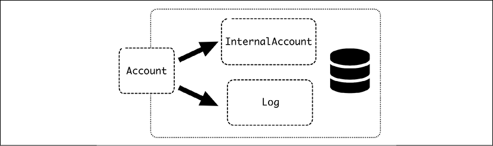
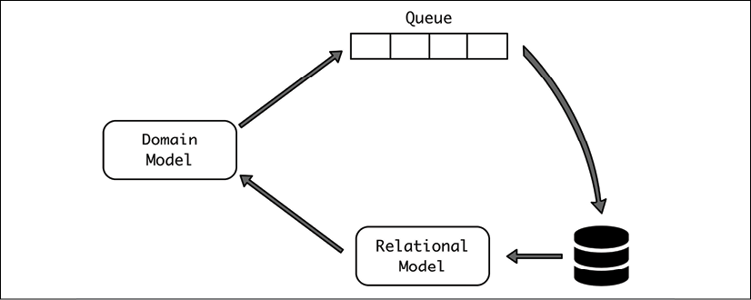
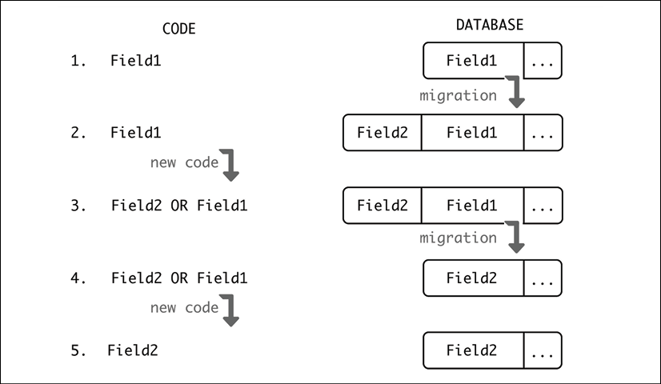
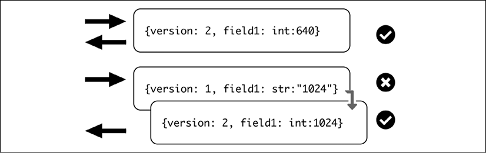

# 数据层

与应用程序代码交互时的数据建模与数据在存储中的存储方式同样重要。数据层是开发人员最常与之交互的层，因此创建良好的界面对于创建生产环境至关重要。

在本章中，我们将描述如何创建一个与存储交互的软件数据层，以抽象存储数据的细节。我们将了解什么是领域驱动设计，如何使用对象关系映射框架，以及更高级的模式，例如命令查询职责分离。

我们还将讨论如何随着应用程序的发展对数据库进行更改，最后讨论在我们参与之前已经定义了结构的情况下处理遗留数据库的技术。

在本章中，我们将研究以下主题：

- 模型层
- 数据库迁移
- 处理遗留数据库

让我们首先将数据设计的上下文作为模型-视图-控制器 (MVC) 模式的模型部分的一部分。

## 模型层

正如我们在第 2 章 API 设计中介绍模型-视图-控制器架构时所看到的，模型层是与数据以及存储和检索数据密切相关的部分。

模型抽象了所有数据处理。这不仅包括数据库访问，还包括相关的业务逻辑。这将创建一个两层结构：

- 内部数据建模层，处理数据库中数据的存储和检索。该层需要了解数据在数据库中的存储方式并进行相应处理。
- 下一层创建业务逻辑并使用内部数据建模层来支持它。该层负责确保要存储的数据是一致的，并强制执行任何关系或约束。

将数据层处理为数据库设计的纯扩展，删除业务层或将其作为代码存储在 Controller 部分中是很常见的。虽然这是可行的，但最好考虑在顶部显式添加业务层并确保实体模型（具有良好的业务意义）与数据库模型（包含有关如何访问数据库。

### 领域驱动设计

这种操作方式已经成为领域驱动设计的一部分。首次引入 DDD 时，它主要旨在弥合特定应用程序和实现它的技术之间的差距，以尝试使用正确的命名法并确保代码与代码用户将使用的实际操作保持同步。例如，银行软件将使用存入和提取资金的方法，而不是从帐户中添加和减去。

> DDD 不仅以与领域的正确术语一致的方式命名方法和属性，而且复制使用和流程。

当与面向对象编程 (OOP) 结合使用时，DDD 技术会将特定领域所需的概念复制为对象。在我们之前的示例中，我们将有一个 Account 对象，它接受 lodge() 和withdraw() 方法。这些可能会接受一个 Transfer 对象，该对象将在资金来源中保持适当的平衡。

如今，DDD 被理解为在模型层中创建这个面向业务的接口，因此我们可以抽象出内部如何映射到对数据库的访问，并提供一个复制业务流程的一致接口。

> DDD 需要对手头的特定领域有深入的了解，才能创建一个有意义的界面并正确地对业务行为进行建模。它需要与业务专家密切沟通和协作，以确保涵盖所有可能的分歧。

对于许多不同的概念，模型纯粹作为数据库模式的复制工作。这样，如果有一个表，它就会被转换为一个访问该表、复制字段等的模型。这方面的一个例子是将用户存储在一个包含用户名、全名、订阅和密码字段的表中。

但请记住，这不是一个硬性要求。模型可以使用多个表或以更具有商业意义的方式组合多个字段，甚至不公开某些字段，因为它们应该保留在内部。

> 我们将使用使用 SQL 作为默认示例的关系数据库，因为它是最常见的数据库类型。但是我们讨论的所有内容都非常适用于其他类型的数据库，尤其是基于文档的数据库。

例如，上面的用户示例在数据库中具有以下字段作为 SQL 表中的列：

| Field             | Type                                  | Description                           |
| ----------------- | ------------------------------------- | ------------------------------------- |
| Username          | String                                | Unique username                       |
| Password          | String                                | String describing the hashed password |
| Full name         | String                                | Name of the user                      |
| Subscription end  | Datetime                              | Time when the subscription ends       |
| Subscription type | Enum (Normal, Premium, NotSubscribed) | Kind of subscription                  |

但是模型可能会暴露以下内容：

| Attribute/Method         | Type               | Description                                                  |
| ------------------------ | ------------------ | ------------------------------------------------------------ |
| username                 | String attribute   | 直接翻译用户名列                                             |
| full_name                | String attribute   | 直接翻译 full_name 列                                        |
| subscription             | Read-only property | 返回订阅类型列。 如果订阅已结束（如订阅结束栏所示），则返回 NotSubscribed |
| check_password(password) | Method             | 内部通过与哈希密码列进行比较来检查密码输入是否有效，并返回是否正确 |

请注意，这隐藏了密码本身，因为其内部详细信息与数据库外部无关。它还隐藏了内部订阅字段，而是呈现一个执行所有相关检查的属性。

该模型将操作从原始数据库访问转换为完全定义的对象，该对象抽象了对数据库的访问。当将对象映射到表或集合时，这种操作方式称为对象关系映射 (ORM)。

### 使用 ORM

正如我们在上面看到的，本质上，ORM 是在数据库中的集合或表之间进行映射，并在 OOP 环境中生成对象。

虽然 ORM 本身是指该技术，但通常将其理解为一种工具。有多种可用的 ORM 工具可以将 SQL 表转换为 Python 对象。这意味着，我们将设置在类和对象中定义的属性，而不是编写 SQL 语句，然后这些属性将由 ORM 工具自动翻译并连接到数据库。

例如，“pens”表中查询的低级访问可能如下所示：

```python
>>> cur = con.cursor()
>>> cur.execute('''CREATE TABLE pens (id INTEGER PRIMARY KEY DESC, name, color)''')
<sqlite3.Cursor object at 0x10c484c70>
>>> con.commit()
>>> cur.execute('''INSERT INTO pens VALUES (1, 'Waldorf', 'blue')''')
<sqlite3.Cursor object at 0x10c484c70>
>>> con.commit()
>>> cur.execute('SELECT * FROM pens');
<sqlite3.Cursor object at 0x10c484c70>
>>> cur.fetchall()
[(1, 'Waldorf', 'blue')]
```

请注意，我们使用的是 DB-API 2.0 标准 Python 接口，它抽象出不同数据库之间的差异，并允许我们使用标准 fetchall() 方法检索信息。

> 要连接 Python 和 SQL 数据库，最常见的 ORM 是 Django 框架 (https://www.djangoproject.com/) 和 SQLAlchemy (https://www.sqlalchemy.org/) 中包含的 ORM。还有其他较少使用的选项，例如 Pony (https://ponyorm.org/) 或 Peewee (https://github.com/coleifer/peewee)，旨在采用更简单的方法。

使用像 Django 框架中可用的 ORM，而不是创建 CREATE TABLE 语句，我们在代码中将表描述为一个类：

```python
from django.db import models
class Pens(models.Model):
     name = models.CharField(max_length=140)
     color = models.CharField(max_length=30)
```

此类允许我们使用该类检索和添加元素。

```python
>>> new_pen = Pens(name='Waldorf', color='blue')
>>> new_pen.save()
>>> all_pens = Pens.objects.all()
>>> all_pens[0].name
'Waldorf'
```

原始 SQL 中的 INSERT 操作是创建一个新对象，然后使用 .save() 方法将数据持久化到数据库中。同样，可以调用搜索 API，而不是编写 SELECT 查询。例如，这段代码：

```python
>>> red_pens = Pens.objects.filter(color='red')
```

相当于这段代码：

```sql
SELECT * FROM Pens WHERE color = 'red;
```

与直接编写 SQL 相比，使用 ORM 有一些优势：

- 使用 ORM 将数据库与代码分离
- 它消除了使用 SQL（或学习它）的需要
- 它消除了编写 SQL 查询的一些问题，例如安全问题

让我们仔细看看这些优势，看看它们的局限性。

#### 独立于数据库

首先，使用 ORM 将数据库使用与代码分离。这意味着可以更改特定的数据库，并且代码将不变地运行。有时这对于在不同环境中运行代码或快速更改以使用不同的数据库很有用。

> 一个非常常见的用例是在 SQLite 中运行测试，并在代码部署到生产环境后使用另一个数据库，如 MySQL 或 PostgreSQL。

这种方法并非没有问题，因为某些选项可能在一个数据库中可用，而在另一个数据库中不可用。对于新项目来说，这可能是一种可行的策略，但最好的方法是使用相同的技术运行测试和生产，以避免意外的兼容性问题。

#### 独立于 SQL 和存储库模式

另一个优点是你不需要学习 SQL（或数据库后端中使用的任何语言）来处理数据。相反，ORM 使用自己的 API，它可以直观且更接近 OOP。这可以降低使用代码的入门门槛，因为不熟悉 SQL 的开发人员可以更快地理解 ORM 代码。

> 使用类从数据库使用中抽象出对持久层的访问称为存储库模式。使用 ORM 将自动使用此模式，因为它将使用编程操作而不需要任何数据库内部知识。

这一优势还具有相应的优势，即某些操作的翻译可能很笨拙，并且会产生非常低效的 SQL 语句。对于需要连接多个表的复杂查询尤其如此。

下面的示例代码就是一个典型的例子。 Books 对象具有对其作者的引用，该引用存储在不同的表中并存储为外键引用。

```python
for book in Books.objects.find(publisher='packt'):
    author = book.author
    do_something(author)
```

此代码按以下方式解释：

```python
Produce a query to retrieve all the books from publisher 'packt'
For each book, make a query to retrieve the author
Perform the action with the author
```

当书籍数量很多时，所有这些额外的查询可能会非常昂贵。我们真正想做的是

```python
Produce a query to retrieve all the books from publisher 'packt', joining with their authors
For each book, perform the action with the author
```

这样，只生成一个查询，这比第一种情况要高效得多。

必须通过以下方式手动向 API 指示此连接。

```python
for book in Books.objects.find(publisher='packt').select_related('author'):
    author = book.author
    do_something(author)
```

> 需要添加额外信息实际上是泄漏抽象的一个很好的例子，如第 2 章所述。你仍然需要了解数据库的细节才能创建高效的代码。

ORM 框架的这种平衡，在易于使用和有时需要理解底层实现细节之间，是一种需要定义的平衡。框架本身将采用或多或少灵活的方法，具体取决于所使用的特定 SQL 语句是如何通过方便的 API 抽象出来的。

#### 没有与编写 SQL 相关的问题

即使开发人员知道如何处理 SQL，在使用它时也会遇到很多问题。一个非常重要的优点是使用 ORM 避免了处理 SQL 语句的直接操作的一些问题。当直接编写 SQL 时，它最终变成了一个纯字符串操作来生成所需的查询。这会产生很多问题。

最明显的要求是编写正确的 SQL 语句，而不是生成语法上无效的 SQL 语句。例如，考虑以下代码：

```python
>>> color_list = ','.join(colors)
>>> query = 'SELECT * FROM Pens WHERE color IN (' + color_list + ')'
```

此代码适用于包含值的颜色值，但如果颜色为空，则会产生错误。

更糟糕的是，如果查询是直接使用输入参数组成的，则会产生安全问题。有一种称为 SQL 注入攻击的攻击正是针对这种行为的。

例如，假设上面显示的查询是在用户调用可以按不同颜色过滤的搜索时产生的。直接向用户询问颜色。恶意用户可能会要求颜色“红色”；删除表用户；。这将利用查询由纯字符串组成的事实来生成包含隐藏的非预期操作的恶意字符串。

为避免此问题，任何可能用作 SQL 查询（或任何其他语言）的一部分的输入都需要进行清理。这意味着删除或转义可能影响预期查询行为的字符。

> 转义字符意味着它们被正确编码以被理解为常规字符串，而不是语法的一部分。例如，在Python中，要转义字符"以包含在字符串中，而不是结束字符串定义，需要在其前面加上\字符。当然，如果需要使用\字符，也需要转义在一个字符串中，在这种情况下将它加倍，使用 \\.
>
> 例如：
>
> "This string contains the double quote character \" and the backslash character \\."

虽然有一些特定的技术可以手动编写 SQL 语句并清理输入，但任何 ORM 都会自动清理它们，从而大大降低默认情况下 SQL 注入的风险。这在安全性方面是一个巨大的胜利，它可能是 ORM 框架的最大优势。手动编写 SQL 语句通常被认为是一个坏主意，而是依靠一种间接的方式来保证任何输入都是安全的。

对应的是，即使对 ORM API 有很好的理解，对于某些查询或结果读取元素的方式也存在限制，这可能导致使用 ORM 框架比创建一个更复杂或低效的操作定制的 SQL 查询。

> 这通常发生在创建复杂连接时。从 ORM 创建的查询适用于简单的查询，但当关系太多时创建查询可能会很困难，因为这会使它们过于复杂。

ORM 框架也会对性能产生影响，因为它们需要时间来编写正确的 SQL 查询、编码和解码数据以及进行其他检查。虽然对于大多数查询来说，这个时间可以忽略不计，但对于特定的查询，这可能会大大增加检索数据所花费的时间。不幸的是，很有可能在某些时候需要为某些操作创建一个特定的、定制的 SQL 查询。在处理 ORM 框架时，在便利性和能够为手头的任务创建准确的查询之间始终存在平衡。

> ORM 框架的另一个限制是 SQL 访问可能允许在 ORM 接口中不可能进行的操作。这可能是所用数据库特有的特定插件或功能的产物。

如果使用 SQL 是要走的路，一种常见的方法是使用准备好的语句，它们是带参数的不可变查询，因此它们在 DB API 中被替换为执行的一部分。例如，以下代码将以与打印语句类似的方式工作。

```python
db.execute('SELECT * FROM Pens WHERE color={color}', color=color_input)
```

此代码将安全地用正确的输入替换颜色，以安全的方式编码。如果有需要替换的元素列表，可以分两步完成：首先，准备适当的模板，每个输入一个参数，然后进行替换。例如：

```python
# Input list
>>> color_list = ['red', 'green', 'blue']
# Create a dictionary with a unique name per parameter (color_X) and the value
>>> parameters = {f'color_{index}': value for index, value in enumerate(color_list)}
>>> parameters
{'color_0': 'red', 'color_1': 'green', 'color_2': 'blue'}
# Create a clausule with the name of the parameters to be replaced
# by string substitution
# Note that {{ will be replaced by a single {
>>> query_params = ','.join(f'{{{param}}}' for param in  parameters.keys())
>>> query_params
'{color_0},{color_1},{color_2}'
# Compose the full query, replacing the prepared string
>>> query = f'SELECT * FROM Pens WHERE color IN ({query_params})'
>>> query
'SELECT * FROM Pens WHERE color IN ({color_0},{color_1},{color_2})'
# To execute, using ** on front of a dictionary will put all its keys as 
# input parameters
>>> query.format(**parameters)
'SELECT * FROM Pens WHERE color IN (red,green,blue)'
# Execute the query in a similar way, it will handle all 
# required encoding and escaping from the string input
   >>> db.execute(query, **query_params)
```

在我们的示例中，为简单起见，我们使用 SELECT * 语句将返回表中的所有列，但这不是解决它们的正确方法，应该避免。问题是返回所有列可能不稳定。

可以将新列添加到表中，因此检索所有列可能会更改检索到的数据，从而增加产生格式错误的机会。例如：

```python
>>> cur.execute('SELECT * FROM pens');
<sqlite3.Cursor object at 0x10e640810>
# This returns a row
>>> cur.fetchone()
(1, 'Waldorf', 'blue')
>>> cur.execute('ALTER TABLE pens ADD brand')
<sqlite3.Cursor object at 0x10e640810>
>>> cur.execute('SELECT * FROM pens');
<sqlite3.Cursor object at 0x10e640810>
# This is the same row as above, but now it returns an extra element
>>> cur.fetchone()
(1, 'Waldorf', 'blue', None)
```

ORM 将自动处理这种情况，但使用原始 SQL 需要你考虑到这种影响，并始终明确包含要检索的列，以避免以后在模式中进行更改时出现问题。

```python
>>> cur.execute('SELECT name, color FROM pens');
<sqlite3.Cursor object at 0x10e640810>
>>> cur.fetchone()
('Waldorf', 'blue')
```

> 处理存储数据时，向后兼容性至关重要。我们将在本章后面详细讨论。

通过组合它们以编程方式生成的查询称为动态查询。虽然默认策略应该是避免它们，但更喜欢准备好的语句，在某些情况下动态查询仍然非常有用。除非涉及动态查询，否则无法生成一定程度的定制。

> 究竟什么被认为是动态查询可能取决于环境。在某些情况下，任何不是存储查询（预先存储在数据库本身中并使用某些参数调用的查询）的任何查询都可能被认为是动态的。从我们的角度来看，我们将考虑动态查询任何需要字符串操作来生成查询的查询。

即使选择的访问数据库的方式是原始 SQL 语句，创建一个处理访问的所有特定细节的抽象层也是很好的。这一层应该负责在数据库中以适当的格式存储数据，而不需要业务逻辑。

ORM 框架通常会针对这一点起作用，因为它们能够处理大量复杂性，并且会邀请你使用业务逻辑重载每个已定义的对象。当业务概念和数据库表之间的转换是直接的，例如，一个用户对象，这很好。但是绝对有可能在存储和有意义的业务对象之间创建一个额外的中间层。

### 工作单元模式和封装数据

正如我们之前所见，ORM 框架直接在数据库中的表和对象之间进行转换。这会以数据在数据库中的存储方式创建数据本身的表示。

在大多数情况下，数据库的设计将与我们在 DDD 哲学中引入的业务实体紧密相关。但是这种设计可能需要一个额外的步骤，因为某些实体可能与数据的内部表示分离，因为它存储在数据库中。

创建表示作为唯一实体的动作的方法称为工作单元模式。这意味着在此高级操作中发生的所有事情都作为一个单元执行，即使在内部它是通过多个数据库操作实现的。该操作对调用者自动执行。

> 如果数据库允许，一个工作单元中的所有操作都应该在一个事务中产生，以确保整个操作一次完成。工作单元这个名称与事务和关系数据库密切相关，通常不用于无法创建事务的数据库，尽管该模式仍然可以在概念上使用。

例如，我们之前看到了接受 .lodge() 和 .withdraw() 方法的 Account 类的示例。虽然可以直接实现一个包含表示资金的整数的 Account 表，但我们也可以通过任何更改自动创建一个跟踪系统的复式记账系统。

> Account 可以称为域模型，以表明它独立于数据库表示。

为此，每个帐户都应具有相应变化的借方和贷方内部值。如果我们还在不同的表中添加一个额外的日志条目来跟踪移动，它可以实现为三个不同的类。 Account 类将用于封装日志，而 InternalAccount 和 Log 将对应数据库中的表。请注意，单个 .lodge() 或 .withdraw() 调用将生成对数据库的多次访问，我们稍后会看到。



图 4.1：Account 类的设计

代码可能是这样的：

```python
class InternalAccount(models.Model):
    ''' This is the model related to a DB table '''
    account_number = models.IntegerField(unique=True)
    initial_amount = models.IntegerField(default=0)
     amount = models.IntegerField(default=0)
class Log(models.Model):
    ''' This models stores the operations '''
    source = models.ForeignKey('InternalAccount', 
                               related_name='debit')
    destination = models.ForeignKey('InternalAccount',  
                                    related_name='credit')
    amount = models.IntegerField()
    timestamp = models.DateTimeField(auto_now=True)
    def commit():
        ''' this produces the operation '''
        with transaction.atomic():
            # Update the amounts
               self.source.amount -= self.amount
        self.destination.amount += self.amount
            # save everything
            self.source.save()
            self.destination.save()
            self.save()
class Account(object):
    ''' This is the exposed object that handled the operations '''
    def __init__(self, account_number, amount=0):
        # Retrieve or create the account
        self.internal, _ = InternalAccount.objects.get_or_create(
            account_number=account_number,
            initial_amount=amount,
            amount=amount)
       @property
       def amount(self):
           return self.internal.amount
    def lodge(source_account, amount):
        '''
        This operation adds funds from the source
        '''
        log = Log(source=source_account, destination=self,
                   amount=amount)
        log.commit()
    def withdraw(dest_account, amount):
        '''
        This operation transfer funds to the destination
        '''
        log = Log(source=self, destination=dest_account,
                   amount=amount)
        log.commit()
```

Account 类是预期的接口。它与数据库中的任何内容都没有直接关系，但使用 account_number 的唯一引用保持与 InternalAccount 的关系。

> 存储不同元素的逻辑呈现在与 ORM 模型不同的类中。这可以理解为 ORM 模型类是 Repositories 类，Account 模型是 Unit of Work 类。
>
> 在一些手册中，它们使用 Unit of Work 类，使它们没有太多上下文，只是作为一个容器来执行存储多个元素的操作。然而，在 Account 类后面分配一个清晰的概念来给出上下文和含义会更有用。并且可能有几个适合业务实体的操作。

每当有操作时，它需要另一个帐户，然后创建一个新的日志。日志引用资金的来源、目的地和金额，并在单个事务中执行操作。这是在 commit 方法中完成的。

```python
def commit():
        ''' this produces the operation '''
        with transaction.atomic():
            # Update the amounts
            self.source.amount -= self.amount
            self.destination.amount += self.amount
            # save everything
            self.source.save()
            self.destination.save()
            self.save()
```

在单个事务中，由 with transaction.atomic() 上下文管理器的使用指示，它从帐户中添加和减去资金，然后保存三个相关的行，即源、目标和日志本身。

> Django ORM 要求你设置此原子装饰器，但其他 ORM 的工作方式可能不同。例如，SQLAlchemy 倾向于通过向队列添加操作并要求你在批处理操作中显式应用所有操作来实现更多工作。请检查你针对每种情况使用的特定软件的文档。

> 由于简单而缺少的细节是验证有足够的资金来执行操作。在没有足够资金的情况下，应产生异常以中止交易。

请注意这种格式如何允许每个 InternalAccount 检索与交易相关的每个日志，包括借方和贷方。这意味着可以检查当前金额是否正确。此代码将根据日志计算帐户中的金额，并可用于检查金额是否正确。

```python
class InternalAccount(models.Model):
    ...
    def recalculate(self):
        '''
        Recalculate the amount, based on the logs
        '''
        total_credit = sum(log.amount for log in self.credit.all())
        total_debit = sum(log.amount for log in self.debit.all())
        return self.initial_amount + total_credit - total_debit
```

需要初始金额。借方和贷方字段是对 Log 的反向引用，如 Log 类中所定义。

从只对使用 Account 对象感兴趣的用户的角度来看，所有这些细节都是无关紧要的。这个额外的层允许我们从数据库实现中清晰地抽象出来，并在那里存储任何相关的业务逻辑。这可以是（领域模型的）暴露的业务模型层，它使用适当的逻辑和命名法处理相关的业务操作。

### CQRS，使用不同的模型进行读写

有时，数据库的简单 CRUD 模型无法描述数据在系统中的流动方式。在一些复杂的设置中，可能需要使用不同的方式来读取数据以及写入数据或与数据交互。

一种可能性是发送数据和读取数据发生在管道的不同端。例如，这是在事件驱动系统中发生的事情，其中数据被记录在队列中，然后再进行处理。在大多数情况下，这些数据会在不同的数据库中进行处理或汇总。

让我们看一个更具体的例子。我们存储不同产品的销售。这些销售包含 SKU（所售产品的唯一标识符）和价格。但是我们不知道，在销售的时候，销售的利润是多少，因为产品的购买取决于市场的波动。销售的存储进入队列以启动流程以将其与支付的价格相协调。最后，关系数据库存储最终销售条目，其中包括购买价格和利润。

信息流从域模型到队列，然后通过一些外部进程到达关系数据库，然后以 ORM 方式用关系模型表示，然后返回到域模型。

这种结构称为命令查询责任分离（CQRS），意味着命令（写操作）和查询（读操作）是分开的。这种模式并不是事件驱动结构所独有的。它们通常出现在这些系统中，因为它们的本质是将输入数据与输出数据分离。

领域模型可能需要不同的方法来处理信息。输入和输出数据具有不同的内部表示，有时可能更容易区分它们。无论如何，使用 CQRS 的显式域模型层来对功能进行分组并将其视为一个整体是一个好主意。在某些情况下，读取和写入的模型和数据可能完全不同。例如，如果有一个生成聚合结果的步骤，则可能会在读取部分中创建从未写入的额外数据。

对读写部分如何连接的过程的描述超出了我们示例的范围。在我们的示例中，该过程将是数据在数据库中的存储方式，包括支付的金额。

下图描述了 CQRS 结构中的信息流：



图 4.2：CQRS 结构中的信息流

我们模型的定义可能是这样的：

```python
Class SaleModel(models.Model):
    ''' This is the usual ORM model '''
    Sale_id = models.IntegerField(unique=True)
    sku = models.IntegerField()
    amount = models.IntegerField()
    price = models.IntegerField()
class Sale(object):
    ''' 
        This is the exposed Domain Model that handled the operations 
        In a domain meaningful way, without exposing internal info
    '''
    def __init__(self, sale_id, sku, amount):
        self.sale_id = sale_id
        self.sku = sku
        self.amount = amount
        # These elements are won't be filled when creating a new element
        self._price = None
        self._profit = None
    @property
    def price(self):
        if self._price is None:
            raise Exception('No price yet for this sale')
        return self._price
    @property
    def profit(self):
        if self._profit is None:
            raise Exception('No price yet for this sale')
        return self._profit
       def save(self):
            # This sends the sale to the queue
            event = {
                'sale_id': self.sale_id,
                'sku': self.sku,
                'amount': self.amount,
            }
            # This sends the event to the external queue
            Queue.send(event)
       @classmethod
       def get(cls, sale_id):
           # if the sale is still not available it will raise an
           # Exception
           sale = SaleModel.objects.get(sale_id=sale_id)
           full_sale = Sale(sale_id=sale_id, sku=sale.sku,
                            amount=sale.amount)
           # fill the private attributes
           full_sale._price = sale.price
           full_sale._profit = sale.amount - full_sale._price
           return full_sale
```

请注意保存和检索的流程有何不同：

```python
# Create a new sale
sale = Sale(sale_id=sale_id, sku=sale.sku, amount=sale.amount)
sale.save()
# Wait some time until totally processed
full_sale = Sale.get(sale_id=sale_id)
# retrieve the profit
full_sale.profit
```

CQRS 系统很复杂，因为输入和输出的数据是不同的。他们通常还会在检索信息时产生一些延迟，这可能会带来不便。

CQRS 系统中的另一个重要问题是不同部分需要同步。这包括读取和写入模型，还包括管道内发生的任何转换。随着时间的推移，这会产生维护需求，尤其是在需要维护向后兼容性时。

> 所有这些问题使 CQRS 系统变得复杂。仅在绝对必要时才应小心使用。

## 数据库迁移

一个不可避免的发展事实是软件系统总是在变化。虽然数据库的变化速度通常不如其他领域快，但仍然存在变化，需要谨慎对待。

数据变化大致分为两种：

- 格式或架构更改：要添加或删除的新元素，如字段或表格；或更改某些字段的格式。
- 数据更改：要求更改数据本身，而不修改格式。例如，规范化包含邮政编码的地址字段，或将字符串字段设为大写。

### 向后兼容性

与数据库更改相关的基本原则是向后兼容。这意味着数据库中的任何单个更改都需要在不更改代码的情况下工作。

这使你可以在不中断服务的情况下进行更改。如果数据库中的更改需要更改代码才能理解它，则必须中断服务。这是因为你不能同时应用这两项更改，并且如果有多个服务器执行代码，则无法同时应用。

> 当然，还有另一种选择，即停止服务，执行所有更改，然后重新启动。虽然这不是很好，但它可能是小型服务的一个选项，或者如果计划的停机时间是可以接受的。

根据数据库的不同，数据更改有不同的方法。

对于关系数据库，鉴于它们需要定义一个固定的结构，架构中的任何更改都需要作为单个操作应用于整个数据库。

对于不强制定义模式的其他数据库，有一些方法可以以更迭代的方式更新数据库。

让我们来看看不同的方法。

### 关系模式更改

在关系数据库中，每个单独的模式更改都作为一个 SQL 语句应用，就像一个事务一样运行。架构更改（称为迁移）可能与数据的某些转换（例如，将整数转换为字符串）同时发生。

迁移是以原子方式执行更改的 SQL 命令。它们可能涉及更改数据库中表的格式，也可能涉及更多操作，例如更改数据或一次性进行多次更改。这可以通过创建对这些更改进行分组的单个事务来实现。大多数 ORM 框架都支持创建迁移并在本地执行这些操作。

例如，Django 将通过运行命令 makemigrations 自动创建一个迁移文件。此命令需要手动运行，但它会检测模型中的任何更改并进行适当的更改。

例如，如果我们在之前介绍的类中添加一个额外的值 branch_id

```python
class InternalAccount(models.Model):
    ''' This is the model related to a DB table '''
    account_number = models.IntegerField(unique=True)
    initial_amount = models.IntegerField(default=0)
    amount = models.IntegerField(default=0)
    branch_id = models.IntegerField()
```

运行命令 makemigrations 将生成描述迁移的正确文件。

```sh
$ python3 manage.py makemigrations
Migrations for 'example':
  example/migrations/0002_auto_20210501_1843.py
    - Add field branch_id to internalaccount
```

请注意，Django 会跟踪模型中的状态并自动调整更改以创建正确的迁移文件。可以使用命令 migrate 自动应用挂起的迁移。

```sh
$ python3 manage.py migrate
Operations to perform:
  Apply all migrations: admin, auth, contenttypes, example, sessions
Running migrations:
  Applying example.0002_auto_20210501_1843... OK
```

> Django 将在数据库中存储应用迁移的状态，以确保每个迁移都只应用一次。
>
> 请记住，要通过 Django 正确使用迁移，不应在此方法之外进行任何更改，因为这可能会造成混淆并产生冲突。如果你需要应用无法通过模型更改自动复制的更改，例如数据迁移，你可以创建一个空迁移并用你的自定义 SQL 语句填充它。这可以创建复杂的自定义迁移，但这将被应用并与自动创建的 Django 迁移的其余部分保持一致。模型也可以显式标记为 Django 未处理以手动管理它们。

有关 Django 迁移的更多详细信息，请查看 https://docs.djangoproject.com/en/3.2/topics/migrations/ 上的文档。

#### 不间断地更改数据库

然后，迁移数据的过程需要按以下顺序进行：

1. 旧代码和旧数据库模式已就位。这是起点。
2. 数据库应用与旧代码向后兼容的迁移。由于数据库可以在运行时应用此更改，因此服务不会中断。
3. 部署了利用新模式的新代码。此部署不需要任何特殊的停机时间，并且可以在不中断流程的情况下执行。

此过程的关键元素是第 2 步，以确保迁移与以前的代码向后兼容。

大多数通常的更改都相对简单，例如向表中添加新表或列，你对此不会有任何问题。旧代码不会使用列或表，这完全没问题。但其他迁移可能更复杂。

例如，让我们假设一个到目前为止一直是整数的字段 Field1 需要转换为字符串。将存储数字，但还会存储一些数据库不支持的特殊值，例如 NaN 或 Inf。新代码将解码它们并正确处理它们。

但显然，如果在旧代码中没有考虑到这一点，那么将代码从整数迁移到字符串的更改将产生错误。

为了解决这个问题，需要通过一系列步骤来解决：

1. 旧代码和旧数据库模式已就位。这是起点。

2. 数据库应用迁移添加新列 Field2。在此迁移中，来自 Field1 的值被转换为字符串并被复制。

3. 部署了新版本的代码，即中间代码。此版本了解可能有一个 (Field2) 或两列 (Field1 和 Field2)。它使用 Field2 中的值，而不是 Field1 中的值，但如果有写入，它应该覆盖两者。

    > 为避免在迁移应用程序和新代码之间出现可能的更新问题，代码需要检查列 Field1 是否存在，如果存在并且与 Field2 具有不同的值，请在执行任何操作之前更新后者.

4. 可以应用删除 Field1（现在未使用）的新迁移。

    > 在同一迁移中，应应用与上述相同的警告——如果 Field1 中的值与 Field2 中的值不同，则使用 Field1 覆盖它。请注意，唯一可能发生这种情况的情况是它是否已使用旧代码进行了更新。

5. 现在可以安全地部署只知道 Field2 的新代码。

根据 Field2 是否是可接受的名称，可能会部署进一步的迁移，将名称从 Field2 更改为 Field1。在这种情况下，需要提前准备新代码以使用 Field2，或者如果不存在，则使用 Field1。

之后可以进行新的部署以再次仅使用 Field1：



图 4.3：从 Field1 迁移到 Field2

如果这看起来工作量很大，那么，确实如此。所有这些步骤都是强制平稳运行和实现无停机所必需的。另一种方法是停止旧代码，使用 Field1 中的格式更改执行迁移，然后启动新代码。但这可能会导致几个问题。

最明显的是停机时间。虽然可以通过尝试设置适当的维护窗口来最大程度地减少影响，但大多数现代应用程序预计将 24x7 全天候运行，并且任何停机都被视为问题。如果应用程序拥有全球用户，则可能很难证明只是为了可避免的维护而停止。

停机时间也可能持续一段时间，具体取决于迁移方面。一个常见问题是在比生产数据库小得多的数据库中测试迁移。这可能会在生产中运行时产生意想不到的问题，花费的时间比预期的要长得多。根据数据的大小，复杂的迁移可能需要数小时才能完成。而且，鉴于它将作为事务的一部分运行，它需要在继续之前完全完成，否则它将被回滚。

> 如果可能，请尝试使用具有代表性的足够大的测试数据库来测试系统的迁移。一些操作可能非常昂贵。一些迁移可能需要调整以更快地运行，甚至分成更小的步骤，以便每个迁移都可以在自己的事务中运行，以便在合理的时间内运行。在某些情况下，数据库甚至可能需要更多内存以允许迁移在合理的时间内运行。

但另一个问题是在新代码的开头引入一个步骤的风险，该步骤可能存在与迁移相关或无关的问题和错误。通过这个过程，在应用迁移之后，就不可能使用旧代码了。如果新代码中存在错误，则需要对其进行修复并部署更新的版本。这会造成很大的麻烦。

诚然，由于迁移是不可逆的，因此应用迁移始终存在风险，但代码保持稳定这一事实有助于缓解问题。更改单个代码比更改两个代码而无法恢复其中任何一个的风险要小。

> 迁移可能是可逆的，因为可能存在执行反向操作的步骤。虽然这在理论上是正确的，但在实际操作中很难执行。像删除列这样的迁移可能实际上是不可逆的，因为数据会丢失。

这种方式需要非常小心地应用迁移，并确保每个步骤都是小而深思熟虑的。

请记住迁移如何与我们讨论的与分布式数据库相关的技术进行互操作。例如，分片数据库需要将每个迁移独立地应用于每个分片，这可能是一个耗时的操作。

#### 数据迁移

数据迁移是数据库中的更改，不会更改格式，但会更改某些字段的值。

这些迁移通常是为了纠正数据中的某些错误，例如存储带有某些编码错误的值的错误，或者将旧记录移动到更新的格式。例如，在所有地址中包括邮政编码（如果尚不存在），或者将测量的比例从英寸更改为厘米。

在任何一种情况下，可能需要对所有行执行这些操作，或者只对其中的一部分执行这些操作。如果可能，仅将它们应用于相关子集可以大大加快进程，尤其是对于大型数据库。

在上述比例变化的情况下，该过程可能需要更多步骤来确保代码可以处理这两种比例并区分它们。例如，带有描述比例的额外字段。在这种情况下，流程如下：

1. 创建一个迁移，为所有行设置一个新列、比例尺，默认值为英寸。旧代码引入的任何新行都将使用默认值自动正确设置值。
2. 部署新版本的代码，该代码能够使用英寸和厘米读取刻度值。
3. 设置另一个迁移以更改测量值。每行都会相应地更改比例和测量值。将比例的默认值设置为厘米。
4. 现在数据库中的所有值都以厘米为单位。
5. （可选）通过部署不访问比例字段且仅了解厘米的新版本代码进行清理，因为两个比例均未使用。之后，还可以运行删除列的新迁移。

第 5 步是可选的，通常对这种清理没有太大的兴趣，因为它不是绝对必要的，并且具有额外列的多功能性可能值得保留以备将来使用。

正如我们之前所讨论的，关键要素是部署能够同时处理新旧数据库值并理解它们的代码。这允许值之间的平滑过渡。

### 不强制执行架构的更改

非关系数据库的灵活方面之一是通常没有强制模式这一事实。相反，存储的文档接受不同的格式。

这意味着，与其对关系数据库进行全有或全无的更改，不如更持续地进行更改并处理多种格式。

而不是应用迁移，这是一个在这里并不真正适用的概念，代码将不得不随着时间的推移执行更改。在这种情况下，步骤如下：

1. 旧代码和旧数据库模式已就位。这是起点。

2. 数据库中的每个文档都有一个版本字段。

3. 新代码包含一个模型层，其中包含从先前版本到新版本的迁移指令——在我们上面的示例中，将 Field1 从整数转换为字符串。

4. 每次访问特定文档时，都会检查版本。如果不是最新的，Field1 被转换为字符串，并更新版本。此操作发生在执行任何操作之前。更新后，操作正常。

    > 此操作与系统的正常操作一起运行。如果有足够的时间，它将逐个文档地迁移整个数据库。
    > version 字段可能不是绝对必要的，因为 Field1 的类型可能很容易推断和更改。但它的优势在于它使流程明确，并且可以连接，在一次访问中从不同版本迁移旧文档。
    > 如果版本字段不存在，它可能被理解为版本 0 并被迁移到版本 1，现在包括该字段。



图 4.4：随时间的变化

这个过程非常干净，但有时将数据长时间保留在旧格式中，即使不访问，也可能不可取。如果代码中仍然存在，它可能会导致该代码从版本 1 迁移到 2、版本 2 到 3 等。如果是这种情况，可能会同时运行一个额外的进程来覆盖每个文档，更新并保存它，直到整个数据库被迁移。

> 此过程类似于为数据迁移所描述的过程，尽管执行模式的数据库需要执行迁移以更改格式。在无模式数据库中，格式可以与值同时更改。
>
> 以同样的方式，纯粹的数据更改，就像之前看到的改变规模的例子一样，可以在不需要迁移的情况下执行，就像我们在这里描述的那样缓慢地改变数据库。但是，通过迁移来确保更清晰的更改，并且可能允许同时更改格式。

另请注意，如果此功能封装在内部数据库访问层中，则此功能之上的逻辑可能会使用较新的功能而无需关心旧格式，因为它们将被即时翻译。

虽然旧版本的数据库中仍有数据，但代码需要能够解释它。这可能会导致一些旧技术的积累，因此也可以在后台迁移所有数据，因为它可以在文档之间完成，通过旧版本过滤，而一切都在运行。完成此后台迁移后，可以重构和清理代码以删除对过时版本的处理。

## 处理遗留数据库

ORM 框架可以生成适当的 SQL 命令来创建数据库模式。当从头开始设计和实现数据库时，这意味着我们可以在代码中创建 ORM 模型，并且 ORM 框架会做出适当的调整。

> 这种在代码中描述模式的方式称为声明式。

但有时，我们需要使用之前通过手动运行 SQL 命令创建的现有数据库。有两种可能的用例：

- 模式将永远不受 ORM 框架的控制。在这种情况下，我们需要一种方法来检测现有架构并使用它。
- 我们想从这种情况下使用 ORM 框架来控制字段和任何新的变化。在这种情况下，我们需要创建一个反映当前情况的模型，并从那里转移到声明性情况。

让我们来看看如何处理这些情况。

### 从数据库中检测模式

对于某些应用，如果数据库稳定或者足够简单，可以直接使用，可以尽量减少代码来处理。 SQLAlchemy 允许你自动检测数据库的模式并使用它。

> SQLAlchemy 是一个非常强大的支持 ORM 的库，可以说是对关系数据库执行复杂和定制访问的最佳解决方案。它允许对表之间的精确关系进行复杂定义，并允许你调整查询并创建精确的映射。它也比其他 ORM 框架（如 Django ORM）更复杂，并且可能更难使用。

要自动检测数据库，你可以自动检测表和列：

```python
>>> from sqlalchemy.ext.automap import automap_base
>>> from sqlalchemy.sql import select
>>> from sqlalchemy import create_engine
# Read the database and detect it
>>> engine = create_engine("sqlite:///database.db")
>>> Base = automap_base()
>>> Base.prepare(engine, reflect=True)
# The Pens class maps the table called "pens" in the DB
>>> Pens = Base.classes.pens
# Create a session to query 
>>> session = Session(engine)
# Create a select query
>>> query = select(Pens).where(Pens.color=='blue')
# Execute the query
>>> result = session.execute(query)
>>> for row, in result:
...     print(row.id, row.name, row.color)
...
1 Waldorf blue
```

请注意如何自动检测表笔和列 id、名称和颜色的描述名称。查询的格式也与 SQL 构造非常相似。

> SQLAlchemy 允许更复杂的用法和类的创建。有关更多信息，请参阅其文档：https://docs.sqlalchemy.org/。

Django ORM 还有一个命令，允许你使用 inspectdb 转储已定义表和关系的定义。

```sh
python3 manage.py inspectdb > models.py
```

这将创建一个 models.py 文件，其中包含基于 Django 可以执行的发现对数据库的解释。该文件可能需要调整。

这些操作方法非常适合简单的情况，其中最重要的部分是不必花费太多精力来复制代码中的模式。其他情况下，架构发生变异并需要更好地处理和控制代码，需要不同的方法。

查看 Django 文档以获取更多信息：https://docs.djangoproject.com/en/3.2/howto/legacy-databases/。

### 将现有模式同步到 ORM 定义

在其他情况下，存在由无法复制的方法创建的遗留数据库。也许它是通过手动命令完成的。当前代码可能使用数据库，但我们想要迁移代码以便我们能够更新它，这样我们一方面可以准确了解不同的关系和格式是什么，另一方面允许 ORM以兼容的方式对架构进行受控更改。我们将后者视为迁移。

这种情况下的挑战是在 ORM 框架中创建一堆模型，这些模型与数据库的定义保持同步。这说起来容易做起来难，有几个原因：

- 可能存在 ORM 未完全翻译的数据库功能。例如，ORM 框架本身并不处理存储过程。如果数据库具有存储过程，则需要将它们作为软件操作的一部分删除或复制。

    > 存储过程是数据库中修改它的代码函数。它们可以通过使用 SQL 查询手动调用，但通常它们由某些操作触发，例如插入新行或更改列。如今，存储过程并不常见，因为它们操作起来可能会令人困惑，相反，在大多数情况下，系统设计倾向于将数据库视为仅用于存储的设施，而无法更改存储的数据。管理存储过程很复杂，因为它们可能难以调试并与外部代码保持同步。
    > 存储过程可以由处理复杂性的代码复制，作为单个工作单元操作的一部分，当操作将被触发时。这是当今最常见的方法。但是，当然，将已经存在的存储过程迁移到外部代码中可能并不容易，并且需要小心和计划。

- ORM 框架在如何设置某些元素方面可能有其怪癖，这可能与现有数据库不兼容。例如，某些元素是如何命名的。 Django ORM 不允许你为索引和约束设置自定义名称。有一段时间，约束只能保留在数据库中，但“隐藏”在 ORM 中，但从长远来看会产生问题。这意味着在某些时候，索引名称需要在外部更改为兼容名称。

- 另一个例子是 Django ORM 中缺乏对复合主键的支持，这可能需要你创建一个新的数字列来创建代理键。
    这些限制要求模型的创建要仔细完成，并且需要进行检查以确保它们在当前模式下按预期工作。基于 ORM 框架中的代码模型创建的模式可以生成并与实际模式进行比较，直到有奇偶校验或它们足够接近。

例如，对于 Django，可以使用以下通用过程：

1. 创建数据库模式的转储。这将用作参考。

2. 创建正确的模型文件。起点可以是上述 inspectdb 命令的输出。

    > 请注意，inspectdb 创建模型时将其元数据设置为不跟踪数据库中的更改。这意味着 Django 将模型标记为未跟踪更改作为迁移。一旦验证，这将需要更改。

3. 使用数据库的所有必需更改创建单个迁移。此迁移是通过 makemigrations 正常创建的。

4. 使用命令 sqlmigrate 生成将由迁移应用的 SQL 语句的 SQL 转储。这会生成一个可以与参考进行比较的数据库模式。

5. 调整差异并从步骤 2 开始重复。请记住每次删除迁移文件以从头开始生成它。
    调整迁移以准确生成当前应用的结果后，可以使用参数 --fake 或 --fake-initial 应用此迁移，这意味着它将被注册为已应用，但 SQL 不会运行。

> 这是一种非常简化的方法。正如我们上面所讨论的，有些元素可能难以复制。可能需要更改外部数据库以解决不兼容问题。
>
> 另一方面，有时可以忍受不会造成任何问题的微小差异。例如，主键索引中的不同名称可能是可以接受并在以后修复的。通常，这些类型的操作需要很长时间才能从复杂的模式中完全完成。相应地计划并以小增量进行。

之后，可以通过更改模型然后自动生成迁移来正常应用更改。

## 概括

在本章中，我们描述了领域驱动设计背后的原则是什么，以定向存储数据的抽象并使用遵循业务原则的丰富对象。我们还描述了 ORM 框架以及它们如何有助于消除处理与特定库的低级交互以与存储层一起工作的需要。我们描述了代码与数据库交互的不同有用技术，例如与事务概念相关的工作单元模式，以及用于写入和读取针对不同后端的高级案例的 CQRS。

我们还讨论了如何处理数据库更改，包括更改架构的显式迁移和在应用程序运行时迁移数据的更软更改。

最后，我们描述了处理遗留数据库的不同方法，以及在无法控制数据的当前模式时如何创建模型以创建适当的软件抽象。