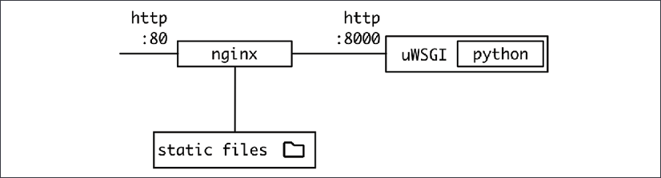

# 十二因素应用程序方法论

在设计软件系统时，每次为每个新项目重新发明轮子并不是一个好主意。软件的某些部分对于大多数 Web 服务项目都是通用的。学习一些随着时间的推移被证明是成功的已知实践对于避免犯容易修复的错误很重要。

在本章中，我们将重点介绍十二因素应用程序方法。此方法是一系列建议，这些建议已针对部署在 Web 上的 Web 服务得到充分证明。

> Twelve-Factor App 起源于 Heroku，这是一家提供轻松访问部署的公司。有些因素比其他因素更普遍，所有事情都应该被认为是一般性的建议，而不一定是强加的。该方法在 Web 云服务之外不太适用，但审查它并尝试提取有用信息仍然是一个好主意。

我们将在本章中介绍该方法的基本细节，并将花一些时间更详细地描述该方法所涵盖的一些最重要的因素。

在本章中，我们将介绍以下主题：

- 十二要素应用程序简介
- 持续集成
- 可扩展性
- 配置
- 十二因素
- 容器化十二要素应用程序

让我们从介绍十二要素应用程序的基本概念开始。

## 十二要素应用程序简介

Twelve-Factor App 是一种方法论，包含 12 个不同的方面或因素，涵盖了设计 Web 系统时要遵循的良好实践。它们旨在提供清晰度并简化一些可能性，详细说明已知有效的模式。

这些因素足够通用，不会规定如何实施它们或强制使用特定工具，同时给出明确的方向。十二要素应用程序方法论是固执己见的，它旨在以可扩展的方式涵盖云服务，并且还促进了持续集成 (CI) 的理念，将其作为此类操作的关键方面。这也减少了本地、开发环境和生产环境之间的差异。

这两个方面，本地和生产部署之间的一致性，以及 CI，相互作用，因为它允许以一致的方式测试系统，无论是在开发环境中还是在 CI 系统中运行测试时。

可扩展性是另一个关键因素。由于云服务需要处理可变的工作负载，我们需要让我们的服务能够增长并能够处理更多进入系统的请求而不会出现任何问题。

我们将介绍的第三个普遍问题，也是十二要素应用程序的核心，是配置的挑战。配置允许在不同的环境中设置相同的代码，同时还可以调整一些功能以在某些情况下调整它们。

## 持续集成

持续集成或 CI 是在将新代码提交到中央存储库时自动运行测试的实践。然而，当最初在 1991 年引入时，它可以被理解为运行“夜间构建”，因为运行测试需要时间并且成本高昂，而如今，它通常被理解为在每次提交新代码时运行一组测试。

目标是生成始终有效的代码。毕竟，如果不是，它会被失败的测试快速检测到。这种快速反馈循环可帮助开发人员提高速度并创建安全网，使他们能够专注于他们正在实施的任何功能，并将其留给 CI 系统来运行全部测试。自动运行测试并在每个测试中运行的原则极大地有助于确保高质量的代码，因为可以快速检测到任何错误。

这也取决于运行的测试的质量，因此为了拥有一个好的 CI 系统，了解好的测试的重要性并定期改进测试程序非常重要，以确保它给我们一个足够的信心，并且它运行得足够快而不会引起问题。

> 足够快，在处理 CI 系统时可能会有所不同。请记住，测试将在后台自动运行，无需开发人员参与，因此与开发人员在调试问题时期望的快速反馈相比，它们可能需要一段时间才能返回结果。作为一个非常普遍的近似值，如果可能的话，目标是在大约 20 分钟或更短的时间内完成你的测试管道。

CI 的基础是自动化任何用作代码中央存储库的系统的能力，因此一旦开发人员即将进行新的更改，就会启动测试。使用像 git 这样的源代码控制系统并添加一个自动运行测试的钩子是很常见的。

在更实用的方法中，git通常在像GitHub（https://github.com/）或GitLab（https://about.gitlab.com/）这样的云系统下使用。它们都有其他与之集成的服务，并允许通过一些配置自动运行操作。示例包括 TravisCI (https://www.travis-ci.com/) 和 CircleCI (https://circleci.com/)。对于 GitHub，他们有自己的本地系统，称为 GitHub Actions。所有这些都是基于添加一个特殊文件来配置服务的想法，从而简化了管道的设置和运行。

CI 管道是按顺序运行的一系列步骤。如果出现错误，它将停止管道的执行并报告检测到的任何问题，以便开发人员及早发现和反馈。通常，我们将软件构建为可测试状态，然后运行测试。如果有不同类型的测试，例如单元测试和集成测试，请同时运行它们，一个接一个或并行运行。

运行测试的典型管道可以执行以下操作：

1. 当它在一个新的空环境中启动时，安装所需的依赖工具来运行测试；例如，特定版本的 Python 和编译器，或将在步骤 3 中使用的静态分析工具。
2. 执行任何构建命令来准备代码，例如编译或打包。
3. 运行 flake8 等静态分析工具来检测样式问题。如果结果显示有问题，请在此停下并报告。
4. 运行单元测试。如果结果不正确，请在此处停止并显示错误。
5. 准备并运行其他测试，例如集成或系统测试。

在某些情况下，这些阶段可以并行运行。例如，第 3 步和第 4 步可以同时运行，因为案例之间没有依赖关系，而第 2 步需要在继续执行第 3 步之前完成。这些步骤可以在某些 CI 系统中进行描述，以允许更快地执行.

CI 管道中的关键词是自动化。为了让管道能够执行，所有步骤都需要能够自动运行，无需任何人工干预。这要求任何依赖项也能够自动设置。例如，如果测试需要，需要分配数据库或其他依赖项等元素。

> 一个常见的模式是 CI 工具分配一个允许数据库启动的虚拟机，以便它在环境中可用，包括常见的配套服务，如 MySQL、PostgreSQL 和 MongoDB。请记住，数据库初始为空，如果需要添加测试数据，则需要在设置环境期间完成。查看特定工具的文档以获取更多详细信息。

一种可能性是使用 Docker 构建一个或多个容器，这些容器将标准化流程并在构建过程中明确所有依赖项。这正成为一种越来越普遍的选择。

> 我们将在第 8 章“高级事件驱动结构”中详细讨论 Docker。

Twelve-Factor App 的一些因素在 CI 管道的设置中发挥了作用，因为它们旨在拥有易于构建的代码，以便部署用于测试或操作和配置。

## 可扩展性

云系统应该在高负载下正常运行，或者至少在不同负载之间进行调整。这要求软件具有可扩展性。可扩展性是允许软件增长和接受更多请求的能力，主要是通过增加资源。

有两种类型的可扩展性：

- 垂直扩展性：增加每个节点的资源，使其更强大。这相当于购买了更强大的计算机；添加更多 RAM、更多硬盘空间、更快的 CPU……
- 水平扩展性：向系统添加更多节点，但它们不一定更强大。例如，不要拥有两个 Web 服务器，而是将它们增加到五个。

一般来说，水平可扩展性被认为是更可取的。在云系统中，添加和删除节点的能力可以自动化，允许部署根据流入系统的当前请求数量自动调整。与传统的操作方式相比，系统必须在最大系统负载的时刻进行尺寸设计，这可以大大降低成本，因为在大多数情况下，系统将未被充分利用。

例如，让我们比较一个情况，在中午，系统需要 11 台服务器，此时大多数客户都已连接。午夜时分，系统处于最低利用率点，只需要 2 台服务器。

下图展示了服务器数量随负载增长的典型情况：


图 5.1：随着时间的推移服务扩展和缩减

传统情况会使用 264 个成本单位（11 台服务器 * 24 小时），而自动扩展使用大约 166 个成本单位，节省了大量资源。

更重要的是，传统系统需要额外的空间来应对可能发生的意外尖峰。通常，系统将设置为允许至少 30% 的额外负载，甚至更多。在这种情况下，成本会永久增加。

为了允许系统水平扩展，它需要是无状态的。这意味着每个节点是无法区分的。每个请求将以某种轮换方式分配给一个节点，将负载分布到所有节点上。每个请求的所有状态都需要来自请求本身（输入参数）或来自外部存储源。从应用程序的角度来看，每个请求都是空的，无论如何都不能被转移。这意味着在请求之间不要在本地硬盘驱动器或本地内存中存储任何内容。

> 在请求中存储信息，例如，使用来自数据库的信息组成一个文件以在请求中返回它是可以的，但如果可能的话，将它保存在内存中可能会比使用硬盘驱动器更快。

外部存储源通常是数据库，但也通常使用更面向存储文件或其他大块二进制数据的存储服务，例如 AWS S3。

> AWS S3 是一种 Web 服务，允许从 URL 存储和检索文件。它允许创建一个包含许多键或路径的存储桶；例如，访问类似于 https://s3.amazonaws.com/mybucket/path/to/file 的 URL，以便它可以上传和下载类似文件的对象。还有很多库可以帮助处理该服务，例如用于 Python 的 boto3。
>
> 该服务对于以可扩展的方式处理文件非常有用，并且它允许以可以公开进行读取访问的方式进行配置，从而启用通过系统存储数据的模式，然后允许用户读取它来自公共 URL，从而简化了系统。
>
> 有关更多信息，请参阅 AWS 文档：https://aws.amazon.com/s3/

还应使用 Riak 或 memcached 等工具将缓存保存在每个单独的节点之外。使用本地内存的内部缓存的问题是它们可能不会被使用，因为下一个相关请求可能会由系统中的另一个节点提供服务。使用外部服务允许所有节点访问缓存并提高系统的总体性能。

请记住，整个系统不可能是无状态的。特别是，数据库和缓存等存储元素需要不同的操作方式，因为它们是存储数据的元素。我们在第 3 章“数据建模”中讨论了如何扩展存储系统。

## 配置

Twelve-Factor App 的基本思想之一是代码是唯一的，但可以通过配置进行调整。这使得相同的代码可以在不同的环境中使用和部署。

不同环境的使用允许设置测试环境，可以在其中运行测试而不影响生产数据。它们是在沙盒中试验或尝试复制真实问题的更可控的地方。还有另一种通常不被认为是这样的环境，即本地开发环境，开发人员可以在其中检查系统是否正常工作。

> 创建一个全面且易于使用的本地环境是开发人员生产力的一个关键方面。当使用单个服务或进程（例如 Web 服务器）时，设置相对容易，因为大多数项目都允许以开发模式启动，但是一旦元素更多，设置就会变得更加困难。
>
> 多年来，复杂的设置已经相当普遍。最近出现了使用可以从头开始设置的虚拟机的推动，最近，容器化以确保从已知点轻松启动它。

配置系统比乍看起来要困难得多。总是有越来越多的参数需要处理。在复杂系统中，重要的是以某种方式构造参数，以便将它们划分为更易于管理的部分。

配置参数可以分为两大类：

- **操作配置**：这些是连接系统不同部分或与监控相关的参数；例如，数据库的地址和凭据、用于访问外部 API 的 URL，或将日志记录级别设置为 ```INFO```。这些配置参数只有在集群发生变化时才会发生变化，但应用程序的外部行为不会发生变化；例如，更改为仅记录 ```WARNING``` 日志或更高级别的日志，或者替换凭据以轮换它们。
    这些参数在操作的控制下，通常是透明的或在维护期间更改的。这些参数的错误配置通常是一个严重的问题，因为它会影响系统的功能。
- **功能配置**：这些参数改变外部行为，启用或禁用功能或改变软件的各个方面；例如，设置颜色和标题图像的主题参数；或启用高级功能以允许对高级访问收费，或更新数学模型的参数，以改变轨道内部计算的执行方式。
    这些参数与软件的操作无关。此处的错误配置可能不会导致问题，因为它将继续正常运行。此处的更改更多地由开发人员甚至业务经理控制，以在特定时间点启用功能。

> 旨在激活或停用完整功能的配置参数称为功能标志。它们用于在特定时间生成“业务版本”，将新代码部署到没有该功能的生产环境中，而该功能正在内部开发。
>
> 一旦功能准备好发布，经过彻底测试，代码可以预先部署到生产环境中，只需更改适当的配置参数即可激活完整功能。
>
> 这使我们能够继续朝着一个大功能进行小幅增量工作，例如改进用户界面，同时频繁地构建和发布小增量。功能发布后，可以重构代码以删除参数。

这两个类别有不同的目标，通常由不同的人维护。虽然操作配置参数与单个环境密切相关，并且需要对环境正确的参数，但功能配置通常在本地开发之间移动以对其进行测试，直到它在生产环境中更改为具有相同值。

传统上，配置存储在一个或多个文件中，通常按环境分组。这将创建一个名为 ```production.cnf``` 的文件和另一个名为 ```staging.cnf``` 的文件，它们附加到代码库，并且根据环境，使用其中一个。这会带来一些问题：

- 进行配置更改实际上是代码更改。这限制了可以执行的更改的速度并导致范围问题。
- 当环境数量增加时，文件数量也会同时增加。由于重复，这可能会导致错误；例如，更改错误文件的错误不会被还原，并且稍后会意外部署。旧文件也可能不会被删除。
- 在开发人员之间集中控制。正如我们所见，其中一些参数不一定在开发人员的控制之下，而是在运维团队的控制之下。将所有数据存储在代码库中使得创建作业之间的划分变得更加困难，这需要两个团队访问相同的文件。虽然这对小型团队来说很好，但随着时间的推移，尝试减少让一大群人访问同一个文件的需要，只关心其中的一半是有意义的。
- 将密码等敏感参数存储在文件中并将其存储在代码仓库中是一个明显的安全风险，因为任何有权访问仓库的人都可以使用这些凭据访问所有环境，包括生产环境。

这些问题使得将配置直接存储为代码库中的文件是不可取的。我们将在配置因素中看到十二因素应用程序如何专门处理它。

## 十二要素

十二因素应用程序的因素如下：

1. 代码库。将代码存储在单个存储库中，并仅通过配置进行区分。
2. 依赖关系。明确而清楚地声明它们。
3. 配置。通过环境配置。
4. 后备服务。任何支持服务都应被视为附加资源。
5. 构建、发布、运行。区分构建和运行状态。
6. 流程。将应用程序作为无状态进程执行。
7. 端口绑定。通过端口公开服务。
8. 并发。将服务设置为进程。
9. 可处置性。快速启动和优雅关闭。
10. 开发/产品平价。所有环境都应尽可能相似。
11. 日志。将日志发送到事件流。
12. 管理进程。独立运行一次性管理流程。

这些因素可以围绕不同的概念进行分组：

- 代码库、构建、发布、运行和开发/产品奇偶校验围绕生成在不同环境中运行的单个应用程序的想法工作，仅通过配置进行区分
- Config、Dependencies、Port binding 和 Backing 服务围绕不同服务的配置和连接工作
- 进程、可处置性和并发性与可伸缩性概念相关
- 日志和管理流程是涉及监控和一次性流程的实用理念

让我们来看看这四个组。

### 一次构建，多次运行

Twelve-Factor App 的关键概念之一是易于构建和管理，但同时它是一个统一的系统。这意味着没有从一个版本更改为另一个版本的临时代码，只有可配置的选项。

代码库因素的目的是，应用程序的所有软件都是一个单一的存储库，具有单一的状态，没有针对每个客户的特殊分支，或者仅在特定环境中可用的特殊功能。

> 非常具体的环境通常称为雪花环境。任何处理过它们的人都知道它们是多么难以维护，这就是为什么十二因素应用程序的目标是删除它们，或者至少使它们仅根据配置进行更改。

这意味着要部署的代码始终相同，只有配置发生变化。这允许轻松测试所有配置更改并且不会引入盲点。

请注意，单个系统可能有多个项目，存在于多个存储库中，它们分别满足十二要素应用程序并协同工作。其他因素涉及应用程序的互操作性。

> 通过协调的 API 保持多个应用程序协同工作始终是一项挑战，需要跨团队进行良好的协调。一些公司采用 monorepo 方法，其中有一个存储库，所有公司项目都位于多个子目录中，以确保整个系统的完整视图和整个组织的单一状态。
>
> 这也有其自身的挑战，需要跨团队进行更多的协调，并且可能会给大型回购带来巨大挑战。

单个代码库允许严格区分构建、发布、运行因素中的各个阶段。这个因素确保存在三个不同的阶段：

- 构建阶段将代码仓库的内容转换为稍后运行的包或可执行文件
- 发布阶段使用这个构建的包，将它与所选环境的适当配置结合起来，并准备好执行
- 运行阶段最终在选定的环境中执行包

> 正如我们之前所讨论的，配置与代码库位于不同的位置。这种分离是有道理的，它也可以在源代码控制之下。它可以存储为文件，但访问可以按环境分隔，这是有道理的，因为某些环境（如生产环境）比其他环境更重要。将配置存储为代码库的一部分使得执行这种分离变得困难。
>
> 请记住，可以组合多个文件，从而允许将参数分为功能配置和操作配置。

由于阶段是严格划分的，所以在部署代码后，无法更改配置或代码。无论如何，这都需要一个新版本。这使得版本非常明确，每个版本都应该独立执行。请注意，运行阶段可能需要再次执行，以防有新服务器或服务器崩溃，因此目标应该是尽可能简单地执行此操作。正如我们所看到的，十二因子应用程序的一个共同点是严格分离，以便每个元素都易于识别和操作。我们将检查如何在其他因素中定义配置。

> 在构建阶段之后执行测试还可以确保代码在测试与发布和操作之间保持不变。

由于这种严格的分离，特别是在构建阶段，很容易遵循 Dev/prod 平价。本质上，开发环境与生产环境相同，因为它们使用相同的构建阶段，但具有适当的配置以在本地运行。这一因素还使得使用相同（或尽可能接近）的支持服务（如数据库或队列）成为可能，以确保本地开发与生产环境一样具有代表性。 Docker 等容器工具或 Chef 或 Puppet 等供应工具也可以帮助自动设置包含所有必需依赖项的环境。

获得快速简便的开发、构建和部署流程对于加快周期和快速调整至关重要。

### 依赖和配置

Twelve-Factor App 提倡对依赖项和配置的明确定义，同时在如何执行它们方面固执己见，并提供经过验证的可靠标准。

这就是为什么在配置因素中，它谈到将系统的所有配置存储在环境变量中。环境变量独立于代码，这允许保留我们在构建、发布、运行因素中讨论的严格区分，并避免我们之前描述的将它们存储在代码库内的文件中的问题。它们也独立于语言和操作系统，并且易于使用。将环境变量注入新环境也很容易。

这比其他替代方案更受欢迎，例如将不同的文件设置到描述环境（如```staging```或```production```）的代码库中，因为它们允许更多粒度，并且因为这种处理最终会创建太多文件并更改环境的代码做作的;例如，必须为短暂的```demo```环境更新代码库。

> 尽管 Twelve-Factor App 鼓励以与变量无关的方式处理配置，但实际工作意味着环境数量有限，并且它们的配置应该存储在某个地方。关键元素是将其存储在与代码库不同的位置，仅在发布阶段进行管理。这允许很大的灵活性。
>
> 请记住，对于本地开发，可能需要单独更改这些环境变量以测试或调试不同的功能。

可以使用标准库直接从环境中获取配置文件中的配置；例如，在 Python 中：

```python
import os
PARAMETER = os.environ['PATH']
```

此代码将在常量 ```PARAMETER``` 中存储 ```PATH``` 环境变量的值。请注意，缺少 ```PATH``` 环境变量会生成 ```KeyError```，因为它不会出现在 ```environ``` 字典中。

> 对于以下示例，请记住需要在你的环境中定义已定义的环境变量。为了简化解释，不包括这些定义。你可以通过运行 ```$ MYENVVAR=VALUE python3``` 来运行 Python，添加本地环境。

要允许可选的环境变量并防止它们丢失，请使用 .get 设置默认值：

```python
PARAMETER = os.environ.get('MYENVVAR', 'DEFAULT VALUE')
```

> 作为一般建议，最好引发异常，因为缺少配置变量而不是继续使用默认参数。这使得配置问题更容易被发现，因为它会在进程开始时停止，并最终失败。请记住，遵循十二要素应用程序的想法，你想要明确地描述事物，并且任何问题都应该尽早失败，以便能够正确修复它而不是在没有检测到的情况下通过。

请注意，环境变量始终定义为文本。如果值需要采用不同的格式，则需要进行转换，例如：

```python
NUMBER_PARAMETER = int(os.environ['ENVINTEGERPARAMETER'])
```

这在定义```Boolean```时出现了一个常见问题。如下定义此翻译代码是不正确的：

```python
BOOL_PARAMETER = bool(os.environ['ENVBOOLPARAMETER'])
```

如果 ```ENVPARAMETER``` 的值为```"TRUE"```，则 ```BOOL_PARAMETER``` 的值为 ```True```（布尔值）。但如果 ENVPARAMETER 的值为```"FALSE"```，则 ```BOOL_PARAMETER``` 的值也为 ```True```。这是因为字符串```"FALSE"```是一个非空字符串并被转换为 ```True```。相反，可以使用标准库包 ```distutils```：

```python
import os
from distutils.util import strtobool
BOOL_PARAMETER = strtobool(os.environ['ENVBOOLPARAMETER'])
```

> ```strtobool``` 不以布尔值返回 ```True``` 或 ```False```，而是以整数形式返回 ```0``` 或 ```1```。这通常可以正常工作，但如果你需要严格的布尔值，请像这样添加 ```bool```：``` bool(strtobool(os.environ['ENVPARAMETER']))```

环境变量还允许注入敏感值（例如秘密），而无需将它们存储在代码库中。请记住，该密钥可在执行环境中进行检查，但通常它受到保护，因此只有授权的团队成员才能通过 ```ssh``` 或环境中的类似方式访问它。

作为此配置的一部分，应定义任何支持服务以及环境变量。支持服务是应用程序通过网络使用的外部服务。它们可以是数据库、队列、缓存系统等。它们可以位于同一网络或外部服务的本地，例如由外部公司或 AWS 服务处理的 API。

从应用程序的角度来看，这种区分应该是无关紧要的。资源应通过 URI 和凭据访问，并且作为配置的一部分，可以根据环境进行更改。这使得资源松散耦合，并且意味着它们可以很容易地被替换。如果有迁移并且数据库需要在两个网络之间移动，我们可以启动新数据库，执行新的发布并更改配置，应用程序将指向新数据库。这可以在不更改代码的情况下完成。

为了允许多个应用程序的串联，端口绑定因子确保任何暴露的服务都是一个端口，这可能因服务而异。这使得将每个应用程序视为支持服务变得很容易。最好，它应该在 HTTP 中公开，因为这使得连接起来非常标准。

> 对于应用程序，尽可能在端口 ```80``` 上使用 HTTP。这使得使用诸如 ```http://service-a.local/``` 之类的 URL 的所有连接变得容易。

一些应用程序需要结合多个协同工作的进程。例如，对于 Python 应用程序（如 Django）的 Web 服务器来说，通常使用像 uWSGI 这样的应用程序服务器来运行它，然后使用像 nginx 或 Apache 这样的 Web 服务器来提供它和静态文件。



图 5.2：连接 Web 服务器和应用程序服务器

它们都通过公开已知端口和协议进行连接，这使得设置变得容易。

同样，为了清楚起见，所有库依赖项都应该明确设置，而不是依赖于现有操作系统中某些包的预安装。依赖项应该通过依赖项声明来描述，例如 Python 的 ```requisites.txt``` pip 文件。

然后，应使用 ```pip install -r requirements.txt``` 等命令将依赖项安装为构建阶段的一部分。

> 请记住，特定的 Python 版本也是应严格控制的依赖项。其他所需的操作系统依赖项也是如此。理想情况下，应该从头开始创建操作系统环境并指定依赖项。

更重要的是，应该隔离依赖关系，以确保没有不严格控制的隐式依赖关系。依赖关系也应该尽可能的严格定义，以避免在上游发布新版本时安装不同版本的依赖关系的问题。

例如，在 pip 文件中，可以用不同的方式描述依赖项：

```
requests
requests>=v2.22.0
requests==v2.25.1
```

第一种方式接受任何版本，所以它通常会使用最新的。第二个描述了最小（和可选的最大）版本。第三个版本固定一个特定的版本。

> 这相当于操作系统中的其他包管理系统，例如 Ubuntu 中的 ```apt```。你可以使用 ```apt-get install dependency=version``` 安装特定版本。

使用非常明确的依赖关系使构建具有可重复性和确定性。它确保在构建阶段没有未知的更改，因为已经发布了新版本。虽然大多数新软件包都是兼容的，但它有时也可能会引入影响系统行为的更改。更糟糕的是，这些变化会在不经意间引入，造成严重的问题。

### 扩展性

我们在本章前面讨论了可扩展性的原因。 Twelve-Factor App 还讨论了如何成功地扩展或收缩系统。

进程因素谈到确保运行阶段包括启动一个或多个进程。这些进程应该是无状态的并且不共享任何内容，这意味着所有数据都需要从数据库等外部支持服务中检索。临时本地磁盘可用于同一请求中的临时数据，但应将它们的使用保持在最低限度。

> 例如，文件上传可以使用本地硬盘存储临时副本，然后处理数据。处理完数据后，应从磁盘中删除该文件。
>
> 如果可能，请尝试将内存用于此临时存储，因为它会使这种区分更加严格。

流程需要满足的下一个属性是它们的可处置性。这些流程需要能够随时快速启动和停止。

快速启动允许系统对发布或重新启动做出快速反应。目标应该是花费不超过几秒钟的时间来启动和运行该过程。快速周转对于允许系统快速增长也很重要，以防为规模目的而添加更多流程。

相反是允许进程正常关闭。这对于缩减情况可能是必需的，以确保在这种情况下任何请求都不会中断。按照惯例，应该通过发送 ```SIGTERM``` 信号来停止进程。

> 每当需要停止容器时，通过向主进程发送 ```SIGTERM``` 信号来使用 Docker 容器自动使用此对流。如果该进程在宽限期后没有自行停止，它将被终止。如果需要，可以配置宽限期。
>
> 确保容器的主进程可以接收 ```SIGTERM``` 并正确处理，以确保容器正常停止。

例如，对于一个 Web 请求，优雅的关闭首先会减少对任何新请求的接受，将完成队列中的所有请求，最后会关闭进程。 Web 请求通常会很快得到响应，但对于其他进程，例如长时间的异步任务，如果它们需要完成当前任务，可能需要很长时间才能停止。

相反，长任务工作者应该将作业返回到队列并取消执行。这样，任务将再次执行，并且为了确保这不会重复操作，我们需要确保所有任务都可以取消，方法是等到它结束以保存其结果并将它们包装到事务或类似物中.

> 在某些情况下，可能需要区分大部分准备工作和保存结果部分。如果作业在关闭时保存结果，我们要么等待，要么停止执行并将任务返回队列。一些保存操作可能需要调用不接受事务的系统。关闭长时间运行的进程的可接受时间可能比 Web 服务器更长。

流程还应该对意外停止具有鲁棒性。这些停止可能是由错误、硬件错误或通常出现在软件中的意外意外引起的。在这些情况下，创建一个可以在任务中断时重试的弹性队列系统将有很大帮助。

因为系统是通过流程创建的，在此基础上，我们可以通过创建更多流程来扩展。进程是独立的，可以在同一台服务器或其他服务器上同时运行。这是并发因素的基础。

请记住，同一个应用程序可以使用多个进程在它们之间进行协调以处理不同的任务，并且每个进程可能有不同数量的副本。在我们前面的示例中，使用一个 nginx 服务器和一个 uWSGI，最佳数量可能是拥有一个 nginx 进程的数量是 uWSGI 工作人员数量的许多倍。

> 传统的部署过程是为节点设置物理服务器（或虚拟机）并安装许多元素，这通常包括调整工作人员的数量，直到找到最佳数字以正确使用硬件。
>
> 使用容器，这个过程以某种方式被逆转。容器往往更轻量级，可以创建更多。虽然仍然需要优化过程，但对于容器，更多的是创建一个单元，然后检查单个节点可以容纳多少个单元，因为容器可以更容易地在节点周围移动，并且生成的应用程序往往更小。我们不是为给定的服务器找出应用程序的适当大小，而是计算一个服务器中有多少个小型应用程序的副本，知道我们可以使用不同的服务器大小或轻松添加更多服务器。

添加更多节点，因为它们是独立且无状态的，在十二因子应用程序下变得容易操作。这使得整个操作的大小可以根据系统的负载进行调整。这可以是手动操作，随着系统负载和请求的增长缓慢添加新节点，也可以自动完成，如本章前面所述。

> Twelve-Factor App 不要求自动完成此缩放，但明确启用它。应该谨慎对待自动调整，因为它需要仔细衡量系统负载。留出时间进行测试以进行适当的调整。

十二因素应用程序进程也应该由某种操作系统进程管理器运行，例如 ```upstart``` 或 ```systemd```。这些系统确保进程保持运行，即使在发生崩溃的情况下，也能正常处理手动重启，并能正常管理输出流。我们将更多地讨论作为日志的一部分的输出流。

> 在使用容器时，情况会有所改变，因为等价的主要是处理容器而不是进程。该工作由容器编排器执行，而不是操作系统进程管理器，以确保容器正常运行并捕获任何输出流。在容器内部，进程可以在不受管理器控制的情况下启动。如果进程停止，容器将停止。

自动重新启动进程，结合快速启动时间和关机情况下的弹性，使应用程序动态并能够自我修复，以防出现导致进程崩溃的意外问题。它还允许将受控关闭用作一般操作的一部分，以避免长时间运行的进程，并作为内存泄漏或其他类型的长期运行问题的应急计划。

> 这相当于关掉再打开的老把戏！如果能很快搞定，就可以节省很多情况！

### 监控和管理

一个全面的监控系统对于发现问题和分析系统的运行非常重要。虽然它不是唯一的监控工具，但日志是任何监控系统的关键部分。

日志是提供运行应用程序行为可见性的文本字符串。它们应始终包含生成时间的时间戳。它们是在执行代码时生成的，在它们发生时提供有关不同操作的信息。关于记录什么的细节可能因应用程序而异，但通常框架会根据常见做法自动创建日志。

例如，任何与网络相关的软件都会记录收到的请求，例如：

```
[16/May/2021 13:32:16] "GET /path HTTP/1.1" 200 10697
```

请注意，它包括：

- 生成时间的时间戳 [16/May/2021 13:32:16]
- HTTP GET 方法和 HTTP/1.1 协议
- 访问路径——/path
- 返回的状态码 – 200
- 请求的大小 – 10697

这种日志称为访问日志，会以不同的格式生成。至少，它应该始终包含时间戳、HTTP 方法、路径和状态码，但它可以配置为返回额外信息，例如发出请求的客户端的 IP 或处理时间请求。

> 访问日志也由包括 nginx 和 Apache 在内的 Web 服务器生成。正确配置它们以调整产生的信息对于操作目的很重要。

访问日志不是唯一有用的。应用程序日志也非常有用。应用程序日志在代码内部生成，可用于传达重要的里程碑或错误。 Web 框架会准备日志，因此很容易生成新的日志。例如，在 Django 中，你可以这样创建日志：

```python
import logging
logger = logging.getLogger(__name__)
...
def view(request, arg):
    logger.info('Testing condition')
    if something_bad:
        logger.warning('Something bad happened')
```

这将生成如下日志：

```sh
2021-05-16 14:01:37,269 INFO Testing condition
2021-05-16 14:01:37,269 WARNING Something bad happened
```

> 我们将在第 11 章，包管理中详细介绍日志。

日志因素表明日志不应由进程本身管理。相反，日志应该打印在它们自己的标准输出中，而不需要任何中间步骤。进程周围的环境，如并发因素中描述的操作系统进程管理器，应负责接收日志、组合它们，并将它们正确路由到长期归档和监控系统。请注意，此配置完全不受应用程序的控制。

> 对于本地开发，仅在终端中显示日志可能足以满足开发目的。

这与将日志作为日志文件存储在硬盘驱动器中形成对比。这存在需要轮换日志并确保有足够空间的问题。这也需要不同的进程在日志轮换和存储的类似策略方面进行协调。取而代之的是，标准输出可以组合和聚合在一起以形成系统的整个图像，而不是单个过程。

日志还可以定向到外部日志索引系统，例如 ELK Stack（Elasticsearch、Kibana 和 Logstash：https://www.elastic.co/products/），它将捕获日志并提供分析工具进行搜索通过他们。还可以使用外部工具，包括 Loggly (https://www.loggly.com/) 或 Splunk (https://www.splunk.com/)，以避免维护。所有这些工具都允许捕获标准输出日志并将其重定向到他们的解决方案。

> 在容器世界中，这个建议更有意义。 Docker 编排工具可以轻松地从容器中捕获标准输出，然后将它们重定向到其他地方。

这些其他工具可以提供诸如在特定时间窗口中搜索和查找特定事件、观察趋势（例如每小时请求数的变化）甚至根据某些规则创建自动警报（例如 ```ERROR``` 数量增加）等功能在一段时间内记录超过某个值。

管理进程因素涵盖了有时需要为特定操作运行但不属于应用程序正常操作的一部分的一些进程。示例包括以下内容：

- 数据库迁移
- 临时报告的生成，例如为某些销售生成一次性报告或检测有多少记录受到错误影响
- 运行控制台以进行调试

> 只有在没有其他替代方案可用时才应在生产环境中的控制台中执行命令，而不应作为一种无需为重复操作创建特定脚本的方法。应极其谨慎。请记住，生产环境中的错误可能会造成严重问题。以适当的尊重对待你的生产环境。

这些操作不是日常操作的一部分，但可能需要运行。界面明显不同。要执行它们，它们应该在与常规进程相同的环境中运行，使用相同的代码库和配置。这些管理操作应包含在代码库中，以避免代码不匹配的问题。

在传统环境中，可能需要通过 ssh 登录到服务器以允许执行此过程。在容器环境中，可以专门启动一个完整的容器来执行该过程。

例如，这在迁移的情况下非常常见。准备命令可能包括运行构建以执行迁移。

> 这应该在实际发布之前完成，以确保迁移数据库。有关迁移的更多详细信息，请参阅第 4 章。

要在容器中运行这些管理命令，容器镜像应该与运行应用程序的容器镜像相同，但使用不同的命令调用，因此代码和环境与运行应用程序中的相同。

## 容器化十二要素应用程序

尽管十二要素应用程序方法论比当前使用 Docker 和相关工具的容器化趋势更早，但它非常一致。这两种工具都面向云中的可扩展服务，容器有助于创建与十二因素方法中描述的模式相匹配的模式。

> 我们将在第 8 章“高级事件驱动结构”中详细讨论 Docker 容器。

可以说，最重要的是创建一个不变的容器镜像，然后运行该镜像非常适合构建、发布、运行因素，并且对依赖项非常明确，因为整个镜像将包含诸如要使用的特定操作系统和任何库。将构建过程作为存储库的一部分也有助于实现代码基础因素。

每个容器也作为一个进程工作，它允许通过使用并发模型创建同一容器的多个副本来进行扩展。

> 虽然容器通常在概念上被认为是轻量级虚拟机，但最好将它们视为包装在自己的文件系统中的进程。这更接近他们的运作方式。

容器的概念使它们易于启动和停止，倾向于 Disposability 因素，并通过 Kubernetes 等编排工具将它们相互连接，从而可以轻松设置 Backing services 因素，并且也可以轻松地在之间共享服务遵循端口绑定因子的容器中的特定端口。但是，在大多数情况下，它们将作为标准端口 80 上的 Web 界面共享。

在 Docker 和 Kubernetes 等编排工具中，很容易设置不同的环境注入环境变量，从而实现配置因素。此环境配置以及集群的描述可以存储在文件中，从而可以轻松创建多个环境。它还包括用于正确处理机密的工具，因此它们被正确加密并且不存储在配置文件中以避免泄漏机密。

容器的另一个关键优势是集群可以轻松地在本地复制，因为在生产中运行的同一映像可以在本地环境中运行，只需对其配置进行少量更改。这极大地有助于确保不同的环境保持最新，正如 Dev/Prod 奇偶校验因素所要求的那样。

> 一般来说，容器方法致力于定义一个集群并以一致的方式在不同的服务和容器之间建立明确的分离。这将不同的环境结合在一起，因为开发环境可以小规模复制生产设置。

根据日志因素将信息发送到标准输出也是存储日志的好方法，因为容器工具将充分接收和处理或重定向这些日志。

最后，可以通过使用运行特定管理命令的不同命令启动相同的容器映像来处理管理进程。如果它需要定期发生，例如在部署之前运行迁移，或者如果它是一个定期任务，则可以由协调器来处理它。

正如我们所看到的，使用容器是遵循十二要素应用程序建议的好方法，因为这些工具的工作方向相同。这并不意味着它们是免费完成的，而是在方法论和容器背后的想法之间存在很大程度的一致性。

这并不奇怪，因为两者都来自相似的背景，都处理需要在云中运行的 Web 服务。

## 概括

在本章中，我们看到拥有可靠的模式来构建软件是很好的，以确保我们站在可以用来塑造新设计的经过测试的决策的肩膀上。对于云中的 Web 服务，我们可以使用十二要素应用程序方法作为指导，以获得许多有用的建议。

我们讨论了十二要素应用程序如何与两个主要思想保持一致——CI 和可扩展性。

CI 是通过在共享代码后自动运行测试来不断验证任何新代码的做法。这创建了一个安全网，使开发人员能够快速行动，尽管在开发新功能时需要纪律来正确添加自动化测试。

我们还讨论了可扩展性的概念，或软件通过添加更多资源来允许更多负载的能力。我们讨论了为什么允许软件根据负载增长和减少非常重要，甚至能够动态调整。我们还看到了如何使系统无状态是实现可扩展软件的关键。

我们看到了配置方面的挑战，十二要素应用程序也处理了这些挑战，以及并非每个配置参数都是平等的。我们描述了如何将配置分为操作配置和功能配置，这可以帮助划分并为每个参数提供适当的上下文。

我们浏览了十二因素应用程序的每个因素，并将它们分成四个不同的组，将它们联系起来，并解释不同的因素如何相互支持。我们将这些因素分为几组：

- 一次构建，多次运行，基于生成在不同环境中运行的单个包的想法
- 依赖和配置，围绕应用的配置和软件和服务依赖
- 可扩展性，实现我们之前讲的可扩展性
- 监控和管理与其他元素一起处理软件在运行时的运行

最后，我们花了一些时间讨论了十二要素应用程序的想法如何与容器化的内容非常吻合，以及不同的 Docker 特性和概念如何让我们轻松创建十二要素应用程序。