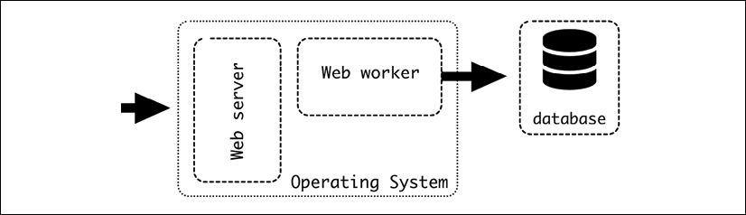
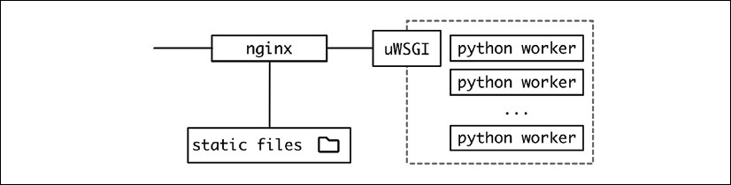
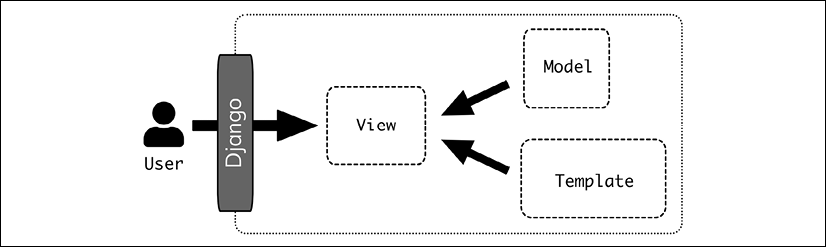
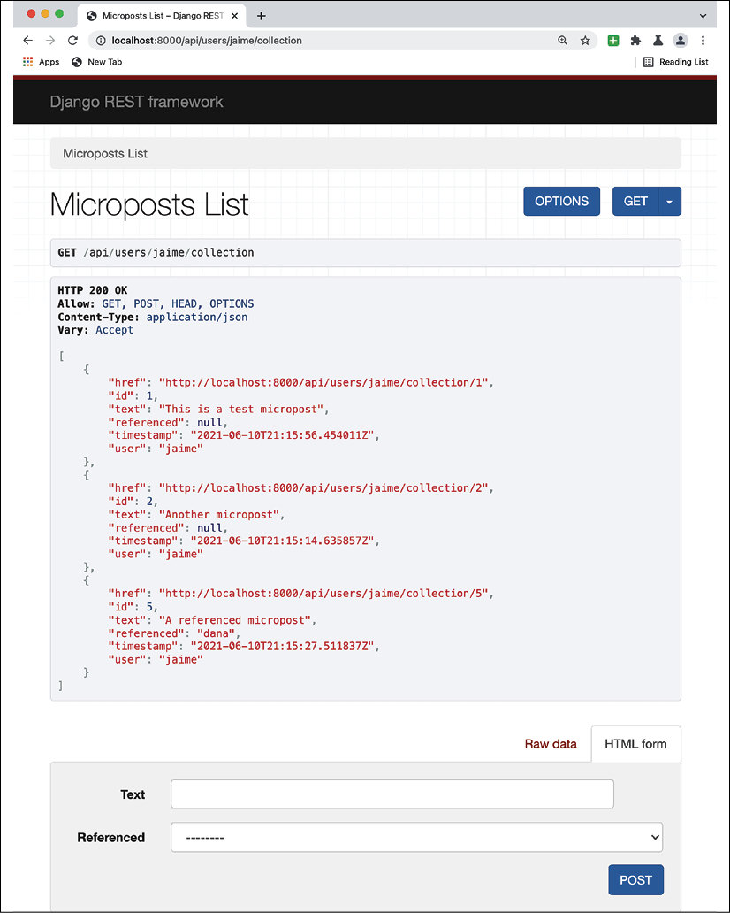
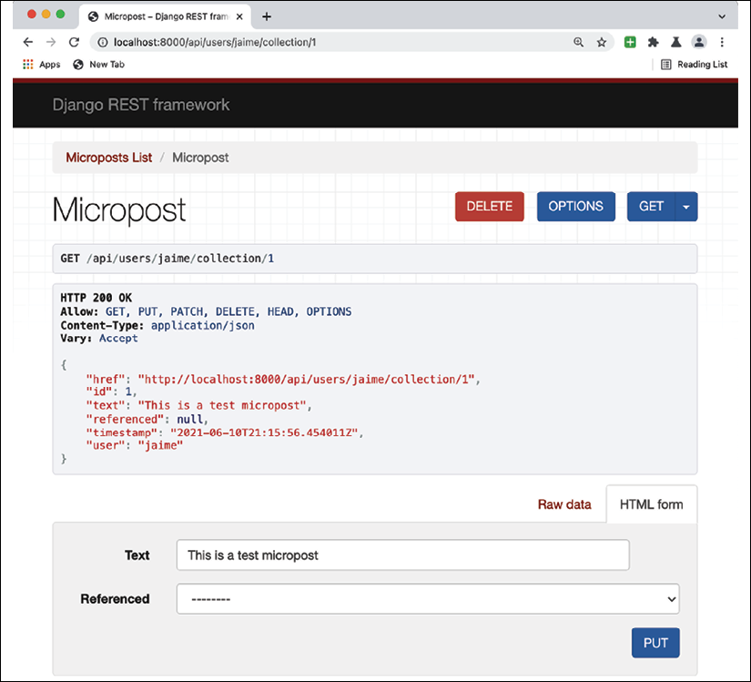
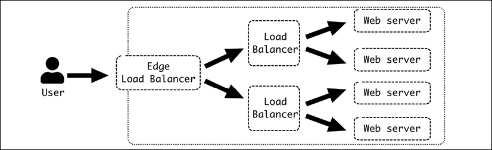

# Web 服务器结构

Web 服务器是目前最常用的远程访问服务器。基于 HTTP 的 Web 服务灵活而强大。

在本章中，我们将了解 Web 服务器是如何构建的，首先描述基本的请求-响应架构是如何工作的，然后深入了解 LAMP 式架构的三层结构：Web 服务器本身、执行代码的工作人员和控制这些工作人员并提供与 Web 服务器的标准化连接的中间层。

我们将详细描述每一层，展示一个特定的工具，例如用于 Web 服务器的 nginx，用于中间层的 uWSGI，以及用于工作器内部特定代码的 Python Django 框架。我们将详细描述它们中的每一个。

我们还将包括 Django REST 框架，因为它是一个构建在 Django 之上以生成 RESTful API 接口的工具。

最后，我们将描述如何在顶部添加额外的层以获得更大的灵活性、可扩展性和性能。

在本章中，我们将介绍以下主题：

- 请求-响应
- 网络架构
- 网络服务器
- uWSGI
- Python workers
- 外部层

让我们从描述请求-响应架构的基础开始。

## 请求-响应

经典的服务器架构很大程度上基于请求-响应进行通信。客户端向远程服务器发送请求，服务器对其进行处理并返回响应。

自大型机时代以来，这种通信模式一直很流行，并且以模拟方式工作，因为软件在内部与库进行通信，但通过网络。该软件调用一个库并从它接收响应。

一个重要的因素是发送请求和接收响应之间的时间延迟。在内部，一个调用需要超过几毫秒的情况很少见，但对于网络来说，它可能以数百毫秒和秒为单位进行测量，这非常常见。

> 网络调用非常依赖于服务器所在的位置。同一数据中心内的调用会很快，可能需要不到 100 毫秒，而与外部 API 的连接可能需要接近一秒或更长时间。

时间也将是高度可变的，因为网络条件可能会对它们产生很大影响。这个时间差使得正确处理它很重要。

发出请求时的常用策略是同步发出请求。这意味着代码停止并等待，直到响应准备好。这很方便，因为代码很简单，但效率也很低，因为当服务器计算响应并通过网络传输时，计算机不会做任何事情。

> 客户端可以改进为同时执行多个请求。当请求彼此独立时可以做到这一点，允许它使它们并行。实现这一点的一个简单方法是使用多线程系统来执行它们，这样它们就可以加快进程。
>
> 通常，将需要一个流，其中一些请求可以并行执行，而另一些则需要等待直到收到信息。例如，检索网页的常见请求将发出一个检索页面的请求，随后将并行下载多个引用的文件（例如头文件、图像）。
>
> 我们将在本章后面看到如何设计这种效果来提高网页的响应能力。

网络比本地呼叫更不可靠这一事实需要更好的错误处理来理解这一事实。任何请求-响应系统都应该特别注意捕获不同的错误并重试，因为网络问题通常是暂时的，如果在等待后重试可以恢复。

> 正如我们在第 2 章中看到的，API 设计来自 HTTP 的多个状态代码可以提供详细信息。

请求-响应模式的另一个特点是服务器不能主动调用客户端，只能返回信息。这简化了通信，因为它不是完全双向的。客户端需要发起请求，服务器只需要监听新的请求。这也使这两个角色不对称，并要求客户端知道服务器在哪里，通常通过其 DNS 地址和要访问的端口（默认情况下，端口 80 用于 HTTP，443 用于 HTTPS）。

这一特性使得一些通信模式难以实现。例如，完全双向通信，其中两个部分想要发起消息的发送，很难通过请求-响应来实现。

一个粗略的例子是只在请求-响应中实现的消息服务器。两个客户端需要使用中间服务器。

> 这种基本结构在论坛或社交网络等应用程序中很常见，这些应用程序允许用户在用户之间进行某种直接消息传递。

每个用户可以执行两个操作：

- 请求发给他们的任何新消息
- 向其他用户发送新消息

用户需要通过轮询定期检查是否有新消息可用。这很低效，因为对于任何新消息，可能会有大量检查返回“没有可用的新消息”。更糟糕的是，如果没有足够频繁地执行检查，在注意到有新消息可用之前可能会有很大的延迟。

> 在实际应用程序中，通常通过以主动向客户端发送通知的方式来避免这种轮询。例如，移动操作系统具有传递通知的系统，使服务器能够通过操作系统提供的外部 API 发送通知，以通知用户有新消息。一种较旧的替代方法是发送具有相同目标的电子邮件。
>
> 当然，还有其他选择。有 P2P 替代方案，其中两个客户端可以相互连接，并且通过可以保持打开状态的 websocket 与服务器建立连接，从而允许服务器通知用户新信息。它们都偏离了请求-响应架构。

即使有这些限制，请求-响应架构仍然是 Web 服务的基础，并且几十年来已被证明非常可靠。拥有一个控制通信并且可以在接受新请求中扮演被动角色的中央服务器的可能性使得该架构易于实现和快速发展，并简化了客户端的工作。集中方面允许大量控制。

## 网络架构

我们在本章的介绍中介绍了 LAMP 架构，它是 Web 服务器架构的基础：



图 6.1：LAMP 架构

LAMP 架构更通用，但我们将仔细研究 Web 服务器和 Web Worker。我们将使用基于 Python 生态系统的特定工具，但我们将讨论可能的替代方案。



图 6.2：Python 环境中更详细的架构

从传入请求的角度来看，Web 请求访问不同的元素。

## 网络服务器

Web 服务器公开 HTTP 端口，接受传入连接，并将它们重定向到后端。一种常见的选择是 nginx (https://www.nginx.com/)。另一个常见的选项是 Apache (https://httpd.apache.org/)。 Web 服务器可以直接为请求提供服务，例如，通过直接返回静态文件、永久重定向或类似的简单请求。如果请求需要更多计算，它将被定向到后端，充当反向代理。

在所呈现的架构中，Web 服务器的主要目标是充当反向代理，接受 HTTP 请求，稳定数据输入，并对传入请求进行排队。

nginx 的基本配置可能如下所示。该代码可在 GitHub 上的 https://github.com/PacktPublishing/Python-Architecture-Patterns/blob/main/chapter_06_web_server/nginx_example.conf 获得。

```
server {
    listen 80 default_server;
    listen [::]:80 default_server;
    error_log /dev/stdout;
    access_log /dev/stdout;
       root /opt/;
    location /static/ {
        autoindex on;
        try_files $uri $uri/ =404;
    }
    location / {
        proxy_set_header Host $host;
        proxy_set_header X-Real-IP $remote_addr;
         uwsgi_pass unix:///tmp/uwsgi.sock;
         include uwsgi_params;
    }
}
```

指令服务器打开和关闭基本块以定义如何提供数据。注意每一行都以分号结尾。

> 用 nginx 的说法，每个 server 指令定义一个虚拟服务器。通常只有一个，但可以配置多个，例如，根据所寻址的 DNS 定义不同的行为。

在里面，我们有一个关于服务端口的基本配置——在我们的例子中，端口 80 以及 IPv4 和 IPv6 地址。 ```default_server``` 子句意味着这是默认使用的服务器：

```
listen 80 default_server;
listen [::]:80 default_server;
```

> IPv4 是具有四个数字的通用地址，例如 127.0.0.1。 IPv6 更长，旨在替代 IPv4。例如，一个 IPv6 地址可以表示为 2001:0db8:0000:0000:0000:ff00:0042:7879。 IPv4 地址已经用尽，这意味着没有可用的新地址。从长远来看，IPv6 将提供足够的资源来避免这个问题，尽管 IPv4 仍然被广泛使用，并且可能还会继续使用很长时间。

接下来，我们根据外部 URL 定义静态文件的位置，以及与硬盘驱动器某些部分的映射关系。

注意需要在反向代理之前定义静态位置：

```
root /opt/;
    location /static/ {
        autoindex on;
        try_files $uri $uri/ =404;
    }
```

```root``` 定义起点，而 ```location``` 开始一个部分，该部分将从位于硬盘驱动器 ```/opt/static/file1.txt``` 的文件中提供 URL ```/static/file1.txt```。

```try_files``` 将扫描 URI 中的文件，如果不存在则引发 ```404``` 错误。

```autoindex``` 自动生成一个索引页来检查目录的内容。

> 此选项通常在生产服务器中禁用，但在测试模式下运行时检测静态文件问题非常方便。

在生产环境中，直接从 Web 服务器提供静态文件非常重要，而不是由 Python 程序处理。虽然可以做到，并且是在开发环境中工作的常见情况，但效率非常低。速度和内存使用量会更大，而 Web 服务器经过优化以提供静态文件。请始终记住通过 Web 服务器在生产环境中提供静态文件。

### 在外部提供静态内容

另一种方法是使用外部服务来处理文件，例如 AWS S3，它允许你提供静态文件。然后文件将位于与服务不同的 URL 下，例如：

- 服务 URL 是 ```https://example.com/index```
- 静态文件位于 ```https://mybucket.external-service/static/```

那么，服务网页内的所有引用都应该指向外部服务端点。

这种操作方式要求你将代码作为部署的一部分推送到外部服务。为了允许不间断的部署，请记住静态内容之前需要可用。另一个重要的细节是使用不同的路径上传它们，因此部署之间的静态文件不会混淆。

使用不同的根路径很容易做到这一点。例如：

1. 已部署服务的 v1 版本。这是起点。静态内容来自 ```https://mybucket.external-service/static/v1/```。
2. 对服务的调用，例如 ```https://example.com/index```，返回所有指向版本 v1 的静态内容。
    一旦服务的 v2 准备就绪，首先要做的就是将其推送到外部服务，因此它在 ```https://mybucket.external-service/static/v2/``` 中可用。请注意，此时，没有用户正在访问 ```/static/v2```；该服务仍在返回 ```/static/v1```。
    部署新服务。部署后，用户将在调用 ```https://example.com/index``` 时开始访问 /static/v2。

正如我们在前几章中所看到的，无缝部署的关键是执行小增量操作，并且每个步骤都必须执行可逆的操作并准备好地形，这样就不会出现需要的东西没有准备好的时候。

这种方法可用于大型操作。在 JavaScript 繁重的界面中，例如单页应用程序，有效地更改静态文件可能是一种新的部署。底层服务 API 可以保持不变，但会更改所有 JavaScript 代码和其他静态内容的下载版本，这实际上将部署一个新版本。

> 我们在第 2 章中讨论了单页应用程序。

这种结构使两个版本的静态内容同时可用。这也可用于进行测试或发布 beta 版本。当服务返回是否使用版本 A 或 B 时，可以动态设置。

例如，在任何调用中添加可选参数以覆盖返回的版本：

- 调用 ```https://example.com/index``` 会返回默认版本，例如 v2。
- 调用 ```https://example.com/index?overwrite_static=v3``` 会返回指定的版本，例如 v3。

其他选项是为特定用户返回 ```v3```，例如 beta 测试人员或内部员工。一旦 ```v3``` 被认为是正确的，就可以将其更改为新的默认值，只需对服务进行少量更改。

> 这种方法可以发挥到极致，将任何对源代码控制的单个提交推送到公共 S3 存储桶，然后在包括生产在内的任何环境中进行测试。这有助于生成一个非常快速的反馈循环，让 QA 或产品所有者可以在他们自己的浏览器中快速查看更改，而无需任何部署或特殊环境。
>
> 不要觉得仅限于唯一的整数作为版本号；它可以与自动生成的内容的随机 UUID 或 SHA 一起使用。 Web 存储非常便宜，因此需要很多版本非常大的文件才能真正开始担心成本问题。并且可以定期删除旧版本。
>
> 虽然这种方法可能非常激进并且并非对所有应用程序都可行，但对于需要在丰富的 JavaScript 界面中进行许多更改或对外观和感觉进行重大更改的应用程序，它可以非常高效。

这种外部服务可以与多区域代理的 **CDN**（内容交付网络）支持相结合。这会将文件分发到世界各地，以提供更接近用户的副本。

> 将 **CDN** 视为提供服务的公司的内部缓存。例如，我们有一项服务，其服务器位于欧洲，但用户从日本访问它。该公司在日本拥有存储静态内容副本的服务器。这意味着与请求必须到达 8,000 多公里外的欧洲服务器相比，用户访问文件的延迟要低得多。

对于真正的全球受众来说，使用 CDN 非常强大。它们对于在全球范围内提供需要低延迟的数据特别有用。例如，广播近乎实时的视频。

> 在线视频广播通常作为持续时间为几秒的小视频块传输。索引文件跟踪最新生成的块，因此客户端可以保持最新状态。这是 **HTTP Live Streaming** 或 **HLS** 格式的基础，非常常见，因为数据传输是直接通过 HTTP 完成的。

数据可以很快地在提供 CDN 服务的公司的不同服务器之间进行内部分发，因为它们之间将使用专用网络，而不是使用外部网络。

无论如何，使用外部服务来存储静态文件显然无需为它们配置 Web 服务器。

### 反向代理

让我们继续描述 Web 服务器配置。描述完静态文件后，我们需要定义一个到后端的连接，充当反向代理。

反向代理是一种代理服务器，可以将接收到的请求重定向到一个或多个定义的后端。在我们的示例中，后端是 uWSGI 进程。

> 反向代理的工作方式与负载均衡器类似，但负载均衡器可以处理更多协议，而反向代理只能处理 Web 请求。除了在不同服务器之间分发请求之外，它还可以添加一些功能，例如缓存、安全性、SSL 终止（以 HTTPS 接收请求并使用 HTTP 连接到其他服务器），或者在这种特殊情况下，接收 Web 请求并传输它通过 WSGI 连接。

Web 服务器将能够以多种方式与后端通信，从而实现灵活性。这可以使用不同的协议，例如 FastCGI、SCGI、纯代理的直接 HTTP，或者在我们的例子中，直接连接到 uWSGI 协议。我们需要将其定义为通过 TCP 套接字或 UNIX 套接字进行连接。我们将使用 UNIX 套接字。

> TCP 套接字旨在允许不同服务器之间的通信，而 UNIX 套接字旨在本地通信进程。 UNIX 套接字对于同一主机内的通信来说要轻一点，它们像文件一样工作，允许你为它们分配权限以控制哪个进程可以访问哪个套接字。

套接字需要与 uWSGI 的配置方式相协调。正如我们稍后将看到的，uWSGI 进程将创建它：

```
    location / {
       proxy_set_header Host $host;
       proxy_set_header X-Real-IP $remote_addr;
       include uwsgi_params;
        uwsgi_pass unix:///tmp/uwsgi.sock;
    }
```

首先，服务器的根在 / URL。在反向代理之前制作静态内容很重要，因为位置是按顺序检查的。因此，在检查 ```/``` 之前会检测到任何对 ```/static``` 请求的请求，并且会得到适当的处理。

反向代理配置的核心是 ```uwsgi_pass``` 子句。这指定了重定向请求的位置。 ```include uwgi_params``` 将添加一堆标准配置以传递到下一阶段。

> ```uwsgi_params``` 实际上是 nginx 配置中默认包含的一个已定义文件，它添加了许多带有 ```SERVER_NAME```、```REMOTE_ADDRESS``` 等元素的 ```uwsgi_param``` 语句。
>
> 如有必要，可以添加更多 ```uwsgi_param```，方法与标头类似。

可以添加额外的元素作为 HTTP 标头。它们将被添加到请求中，因此可以在请求的下方进一步使用。

```
       proxy_set_header Host $host;
       proxy_set_header X-Real-IP $remote_addr;
```

在这种情况下，我们将添加 ```Host``` 标头，其中包含有关所请求主机的信息。请注意，```$host``` 指示 nginx 用请求发送到的主机填充该值。同理，头 ```X-Real-IP``` 加上来自远程地址的 IP 地址。

> 正确设置标题以传递是不受欢迎的工作，但对于正确监控问题至关重要。设置标题可能需要在不同阶段进行。正如我们稍后将讨论的，单个请求可以通过多个代理，并且每个代理都需要充分转发标头。

在我们的配置中，我们只使用一个后端，因为 uWSGI 将在不同的工作人员之间进行平衡。但是，如有必要，可以定义多个后端，甚至混合 UNIX 和 TCP 套接字，定义一个集群。

```
upstream uwsgibackends {
  server unix:///tmp/uwsgi.sock;
  server 192.168.1.117:8080;
  server 10.0.0.6:8000;
}
```

稍后，定义 ```uwsgi_pass``` 以使用集群。请求将平均分布在不同的后端。

```uwsgi_pass uwsgibackends;```

### 日志

我们还需要跟踪任何可能的错误或访问。 ```nginx```（和其他 Web 服务器）产生两种不同的日志：

- 错误日志：错误日志跟踪 Web 服务器本身可能出现的问题，例如无法启动、配置问题等。
- 访问日志：访问日志报告访问系统的任何请求。这是关于系统流动的基本信息。它可用于在后端无法连接时查找特定问题，例如 502 错误，或者，当视为聚合时，它可以检测到错误状态码数量异常（4xx 或 5xx）等问题。

> 我们将在第 11 章更详细地讨论日志。

这两个日志都是需要充分检测的关键信息。遵循十二要素应用程序，我们应该将它们视为数据流。最简单的方法是将它们都重定向到标准输出。

```
    access_log /dev/stdout;
    error_log /dev/stdout;
```

这要求 nginx 不作为守护进程启动，或者如果是，则正确捕获标准输出。

另一种选择是使用适当的协议将日志重定向到集中式日志设施。这会将所有日志定向到捕获信息的集中式服务器。在此示例中，我们将其发送到 ```syslog_host``` 中的 ```syslog``` 主机。

```
    error_log syslog:server=syslog_host:514;
    access_log syslog:server=syslog_host:514,tag=nginx;
```

该协议允许你包含标签和额外信息，这些信息可以帮助以后区分每个日志的来源。

> 能够区分每个日志的来源是至关重要的，并且总是需要一些调整。请务必花一些时间使日志易于搜索。当生产中的错误需要收集信息时，它将大大简化工作。

### 高级用法

Web 服务器非常强大，不容小觑。除了纯粹充当代理之外，还有许多其他功能可以启用，例如返回自定义重定向、使用维护窗口的静态页面覆盖代理、重写 URL 以调整更改、提供 SSL 终止（解密接收 HTTPS 请求到通过常规 HTTP 将它们解密并加密返回）、缓存请求、根据 A/B 测试的百分比拆分请求、根据请求者的地理定位选择后端服务器等。

请务必阅读 http://nginx.org/en/docs/ 上的 ```nginx``` 文档以了解所有可能性。

## uWSGI

链的下一个元素是 uWSGI 应用程序。这个应用程序接收来自 ```nginx``` 的请求，并将它们重定向到独立的 Python 工作者，以 WSGI 格式。

> Web 服务器网关接口 (**WSGI**) 是处理 Web 请求的 Python 标准。它非常流行并受到许多软件的支持，无论是从发送端（如 nginx，也包括其他 Web 服务器，如 Apache 和 GUnicorn），还是从接收端（几乎每个 Python Web 框架，如 Django、Flask 或 Pyramid） .

uWSGI 还将启动和协调不同的进程，处理每个进程的生命周期。该应用程序充当中介，启动一组接收请求的工作人员。

uWSGI 通过 ```uwsgi.ini``` 文件进行配置。让我们看一个示例，该示例可在 GitHub 上的 https://github.com/PacktPublishing/Python-Architecture-Patterns/blob/main/chapter_06_web_server/uwsgi_example.uni 获得。

```ini
[uwsgi]
chdir=/root/directory
wsgi-file = webapplication/wsgi.py
master=True
socket=/tmp/uwsgi.sock
vacuum=True
processes=1
max-requests=5000
# Used to send commands to uWSGI
master-fifo=/tmp/uwsgi-fifo
```

第一个元素定义工作目录是什么。应用程序将在此处启动，其他文件引用将从此处开始：

```ini
chdir=/root/directory
```

然后，我们描述 ```wsgi.py``` 文件在哪里，它描述了我们的应用程序。

### WSGI 应用程序

在这个文件中是应用程序函数的定义，uWSGI 可以使用它以受控的方式处理内部 Python 代码。

例如：

```python
def application(environ, start_response):
    start_response('200 OK', [('Content-Type', 'text/plain')])
    return [b'Body of the response\n']
```

第一个参数是一个字典，其中包含详细说明请求的预定义变量（如 ```METHOD```、```PATH_INFO```、```CONTENT_TYPE``` 等）和与协议或环境相关的参数（例如 ```wsgi.version```）。

第二个参数 ```start_response``` 是一个可调用的，允许你设置返回状态和任何标头。

该函数应返回主体。注意它是如何以字节流格式返回的。

> 文本流（或字符串）和字节流之间的区别是 Python 3 中引入的最大区别之一。总而言之，字节流是原始二进制数据，而文本流通过特定编码解释数据来包含含义。
>
> 有时两者之间的区别可能有点令人费解，特别是因为 Python 3 明确表示了区别，这与以前的一些松散做法相冲突，尤其是在处理可以以相同方式表示的 ASCII 内容时。
>
> 请记住，文本流需要编码才能转换为字节流，而字节流需要解码为文本流。编码正在从文本的抽象表示转向二进制的精确表示。
>
> 例如，西班牙语单词“cañón”包含 ASCII 中不存在的两个字符 ```ñ``` 和 ```ó```。你可以看到通过 UTF8 编码它们如何用 UTF8 中描述的特定二进制元素替换它们：
>
> ```python
> >>> 'cañón'.encode('utf-8')
> b'ca\xc3\xb1\xc3\xb3n' 
> >>> b'ca\xc3\xb1\xc3\xb3n'.decode('utf-8')
> 'cañón'
> ```

该函数还可以用作生成器，并在需要流式传输返回的主体时使用关键字 ```yield``` 而不是 ```return```。

> 任何使用 ```yield``` 的函数都是 Python 中的生成器。这意味着当被调用时，它会返回一个迭代器对象，该对象一个一个地返回元素，通常用于循环中。
>
> 这对于循环的每个元素都需要一些时间来处理但可以返回而不需要计算每个项目的情况非常有用，从而减少延迟和内存使用，因为并非所有元素都需要在内存中维护。
>
> ```python
> >>> def mygenerator():
> ...   yield 1
> ...   yield 2
> ...   yield 3
> >>> for i in mygenerator():
> ...   print(i)
> ...
> 1
> 2
> 3

在任何情况下，WSGI 文件通常由使用的任何框架默认创建。例如，由 Django 创建的 wsgi.py 文件将如下所示。

```python
import os
from django.core.wsgi import get_wsgi_application
os.environ.setdefault("DJANGO_SETTINGS_MODULE", "webapplication.settings")
application = get_wsgi_application()
```

请注意函数 ```get_wsgi_application``` 将如何自动设置适当的应用程序函数，并将其与定义的其余代码连接起来——这是使用现有框架的一大优势！

### 与 Web 服务器交互

让我们继续使用套接字配置进行 ```uwsgi.ini``` 配置：

```ini
socket=/tmp/uwsgi.sock
vacuum=True
```

```socket``` 参数为要连接的 Web 服务器创建 UNIX 套接字。本章之前在讨论 Web 服务器时已经讨论过。这需要双方协调，以确保它们正确连接。

> uWSGI 还允许你使用本地 HTTP 套接字，使用选项``` http-socket```。例如，```http-socket = 0.0.0.0:8000``` 为端口 8000 上的所有地址提供服务。如果 Web 服务器不在同一台服务器上并且需要通过网络进行通信，则可以使用此选项。
>
> 如果可能，请避免通过 Internet 直接公开公开 uWSGI。 Web 服务器将更安全、更高效。它还将更有效地提供静态内容。如果你确实必须跳过 Web 服务器，请使用选项 ```http``` 而不是 ```http-socket```，它包含一定程度的保护。

当服务器关闭时，```vacuum``` 选项会清理套接字。

### 流程

下一个参数控制进程的数量以及如何控制它们：

```ini
master=True
processes=1
```

```master``` 参数创建一个主进程，以确保工作人员的数量是正确的，如果不正确则重新启动，并处理进程生命周期以及其他任务。它应始终在生产中启用以实现平稳运行。

```processes``` 参数非常简单，描述了应该启动多少 Python 工作者。收到的请求将在它们之间进行负载平衡。

uWSGI 生成新进程的方式是通过预分叉。这意味着启动单个进程，并在加载应用程序后（可能需要一段时间），通过 fork 进程克隆它。这明显加快了新进程的启动时间，但同时也表明可以复制应用程序的设置。

> 这种假设在极少数情况下可能会导致某些库出现问题，例如，在初始化期间打开无法安全共享的文件描述符。如果是这种情况，参数```lazy-apps``` 将使每个worker 独立地从头开始。这时速度较慢，但会产生更一致的结果。

选择正确数量的进程高度依赖于应用程序本身和支持它的硬件。硬件很重要，因为具有多个内核的 CPU 将能够有效地运行更多进程。应用程序中的 IO 与 CPU 使用量将决定 CPU 内核可以运行多少进程。

> 从理论上讲，一个不使用 IO 和纯粹处理数字的进程将使用整个核心而无需等待，同时不允许核心切换到另一个进程。一个高 IO 的进程，在等待数据库和外部服务的结果时核心处于空闲状态，将通过执行更多的上下文切换来提高其效率。应测试此数字以确保获得最佳结果。一个常见的起点是核心数量的两倍，但请记住监控系统以对其进行调整并获得最佳结果。

有关已创建进程的一个重要细节是它们默认停用新线程的创建。这是一个优化选择。在大多数 Web 应用程序中，无需在每个 worker 中创建独立线程，这允许你停用 Python GIL，从而加快代码速度。

> 全局解释器锁或 **GIL** 是一种互斥锁，它只允许单个线程控制 Python 进程。这意味着，在单个进程中，没有两个线程可以同时运行，这正是多核 CPU 架构所实现的。请注意，多个线程可能正在等待 IO 结果，而另一个线程正在运行，这在现实生活中的应用程序中很常见。 GIL 通常是不断持有和释放的，因为每个操作首先持有 GIL，然后在结束时释放它。
>
> GIL 通常被认为是 Python 效率低下的原因，尽管这种影响仅在本机 Python 中的高 CPU 多线程操作中才会显现（与使用 NumPy 等优化库相反），这些操作不像往常一样，而且开始时已经很慢.
>
> 这些与 GIL 的交互只有在没有线程运行时才会浪费，所以这就是为什么 uWSGI 默认禁用它的原因。

如果需要使用线程，选项 ```enable-threads``` 将启用它们。

### 流程生命周期

在运行期间，流程不会保持静止。任何工作的 Web 应用程序都需要定期重新加载新的代码更改。下一个参数与如何创建和销毁进程有关。

```ini
max-requests=5000
# Used to send commands to uWSGI
master-fifo=/tmp/uwsgi-fifo
```

```max-requests``` 指定单个工作人员在重新启动之前要处理的请求数。一旦 worker 达到这个数字，uWSGI 将销毁它并按照通常的过程从头开始创建另一个 worker（默认情况下是 fork，或者如果配置了则使用l```azy-apps```应用程序）。

这对于避免内存泄漏问题或其他类型的陈旧问题很有用，其中工作人员的性能会随着时间的推移而下降。回收worker是一种可以先发制人的保护措施，因此即使存在问题，也会在引起任何问题之前予以纠正。

请记住，基于十二要素应用程序，Web Worker 需要能够随时停止和启动，因此这种回收是无痛的。

uWSGI 也会在它空闲的时候回收它，在服务了它的第 5000 个请求之后，所以它是一个受控操作。

> 请记住，这种回收可能会干扰其他操作。根据启动时间的不同，启动工作器可能需要几秒钟或更长时间（尤其是在使用```lazy-apps```的情况下），这可能会导致请求积压。 uWSGI 将对传入的请求进行排队。在我们的示例配置中，```进程```中只定义了一个工作人员。如果有多个worker，这可以得到缓解，因为其余的worker将能够处理额外的负载。

当涉及多个Worker时，如果每个Worker在第 5,000 次请求后都将重新启动，则会产生踩踏问题，所有Worker都被逐个回收。请记住，负载通过worker平均分配，所以这个计数将在多个worker之间同步。虽然期望是，例如，有 16 名worker，其中至少 15 名将可用，但实际上我们可能会发现所有worker都在同时被回收。

要避免此问题，请使用 ```max-requests-delta``` 参数。此参数为每个worker添加一个可变编号。它将乘以worker ID 的增量（每个worker的唯一连续编号，从 1 开始）。因此，配置 200 的增量，每个工作人员将具有以下内容：

| Worker    | Base max-request | Delta    | Total requests to recycle |
| --------- | ---------------- | -------- | ------------------------- |
| Worker 1  | 5000             | 200      | 5200                      |
| Worker 2  | 5000             | 2 * 200  | 5400                      |
| Worker 3  | 5000             | 3 * 200  | 5600                      |
| ...       | ...              | ...      | ...                       |
| Worker 16 | 5000             | 16 * 200 | 8200                      |

这使得回收发生在不同的时间，增加了同时可用的worker数量，因为它们不会同时重新启动。

> 这个问题与所谓的缓存踩踏问题属于同一类型。这是在多个缓存值同时失效的情况下产生的，同时产生值的再生。因为系统预计在某些高速缓存加速下运行，所以突然不得不重新创建高速缓存的重要部分可能会产生严重的性能问题，直至系统完全崩溃。
>
> 为避免这种情况，请避免设置缓存到期的固定时间，例如时钟的某个小时。例如，如果后端在午夜更新了当天的新闻，这可能会发生这种情况，这使得此时缓存到期很诱人。相反，添加一个元素以使不同的密钥在稍微不同的时间过期以避免此问题。这可以通过为每个密钥的到期时间添加少量随机时间来实现，因此它们可以在不同时间可靠地刷新。

```master-fifo``` 参数创建了一种与 uWSGI 通信和发送命令的方式：

```ini
# Used to send commands to uWSGI
master-fifo=/tmp/uwsgi-fifo
```

这会在 ```/tmp/uwsgi-fifo``` 中创建一个 UNIX 套接字，它可以接收重定向到它的字符形式的命令。例如：

```ini
# Generate a graceful reload
echo r >> /tmp/uwsgi-fifo
# Graceful stop of the server
echo q >> /tmp/uwsgi-fifo
```

与发送信号相比，这种方法可以更好地处理情况，因为可用的命令更多，并且可以对进程和整个 uWSGI 进行非常精细的控制。

例如，发送 ```Q``` 将产生 uWSGI 的直接关闭，而 ```q``` 将产生一个优雅的关闭。优雅的关闭将从停止接受 uWSGI 中的新请求开始，然后等待内部 uWSGI 队列中的任何请求被处理，当工作人员完成其请求时，以有序的方式停止它。最后，当所有工作人员都完成后，停止 uWSGI 主进程。

使用``` r ```的优雅重新加载采用类似的方法，将请求保留在内部队列中并等待工作人员完成以停止它们并重新启动它们。它还将加载与 uWSGI 本身相关的任何新配置。请注意，在操作期间，内部的 uWSGI 侦听队列可能会被填满，从而导致问题。

> 监听队列的大小可以通过监听参数进行调整，但请记住，Linux 设置了一个限制，你可能还需要更改。监听默认值为 100，Linux 配置默认值为 128。
>
> 在将它们更改为大值之前进行测试，因为大量积压的任务有其自身的问题。

如果进程的加载是通过fork进程完成的，那么在启动第一个之后，剩下的都是副本，所以加载速度很快。相比之下，使用```lazy-apps```可能会延迟实现全部容量，因为每个工作人员都需要从头开始单独启动。这可能会在服务器上产生额外的负载，具体取决于工作人员的数量和启动过程。

> ```lazy-apps```的一个可能替代方案是使用``` c ```选项，通过链式重新加载来重新加载工作人员。这会独立地重新加载每个工作人员，等待一个工作人员完全重新加载，然后再移动到下一个工作人员。此过程不会重新加载 uWSGI 配置，但会处理工作程序中的代码更改。这将需要更长的时间，但它将以控制器的速度工作。

在负载下重新加载单个服务器可能很复杂。使用多个 uWSGI 服务器可以简化流程。在这种情况下，应该在不同的时间重新加载以允许你分配负载。

可以采用集群方式的方法来使用多台服务器来执行这种舞蹈，在多台服务器中创建 uWSGI 配置的副本，然后一次回收一个。当一个正在重新加载时，其他人将能够处理额外的负载。在极端情况下，可以使用额外的服务器在重新加载期间产生额外的容量。

> 这在可以使用额外服务器然后销毁的云环境中很常见。在 Docker 情况下，可以添加新容器来提供这种额外容量。

有关 ```master-fifo``` 和接受的命令的更多信息，包括如何暂停和恢复实例以及其他特殊操作，请查看 https://uwsgi-docs.readthedocs.io/en/latest/MasterFIFO.html 上的 uWSGI 文档.

> uWSGI 是一个非常强大的应用程序，具有几乎无限的配置可能性。它的文档包含的详细信息量是压倒性的，但它非常全面和富有洞察力。你可以学到很多东西，不仅是关于 uWSGI，还有关于整个 web 堆栈是如何工作的。我强烈建议慢慢学习，但肯定会学到很多东西。你可以在 https://uwsgi-docs.readthedocs.io/ 访问文档。

## Python worker

系统的核心是 Python WSGI worker。该工作人员在被外部 Web 服务器等路由后接收来自 uWSGI 的 HTTP 请求。

这就是神奇发生的地方，它特定于应用程序。这是一个比链的其他链接迭代更快的元素。

每个框架都会以稍微不同的方式与请求交互，但一般来说，它们会遵循相似的模式。我们将以 Django 为例。

我们不会讨论 Django 的所有方面，也不会深入探讨它的特性，而是会选择一些对其他框架有用的课程。

> Django 项目有很好的文档记录。说真的，自从项目开始以来，它一直以其世界级的文档而著称。你可以在这里阅读：http://www.djangoproject.com。

### Django MVT 架构

Django 大量借鉴了 MVC 结构，但将其稍微调整为所谓的 **MVT**（模型-视图-模板）：

- 模型保持不变，数据的表示和与存储的交互。
- 视图接收 HTTP 请求并对其进行处理，与可能需要的不同模型进行交互。
- 模板是一个从传递的值生成 HTML 文件的系统。

尽管结果相似，但这会稍微改变 Model-View-Controller。



图 6.3：模型-视图-控制器

该模型在两个系统中的工作方式相同。 Django View 充当 View 和 Controller 的组合，而 Template 是 Django View 的 View 组件的帮助系统。

模板系统不是严格要求使用的，因为并非每个 Django 界面都需要 HTML 页面。

> 虽然 Django 旨在创建 HTML 接口，但还有一些方法可以创建其他类型的接口。特别是对于 RESTful 接口，Django REST 框架 (https://www.django-rest-framework.org) 允许你扩展功能并轻松生成自记录的 RESTful 接口。
>
> 我们将在本章后面介绍 Django REST 框架。

Django 是一个强大而全面的框架，并且对事物应该如何运行有一些假设，例如使用 Django ORM 或使用它的模板系统。虽然这样做是“顺势而为”，但绝对有可能采用其他方法并定制系统的任何部分。这可能涉及不使用模板、使用不同的模板系统、使用不同的 ORM 库（如 SQLAlchemy）以及添加额外的库以连接到不同的数据库（包括 Django 本身不支持的数据库（如 NoSQL 数据库））等元素。不要让系统的约束限制你实现目标。

> Django 自以为是，它提出了许多与某些假设一起工作的元素。它们彼此紧密相关。例如，如果这是一个障碍，因为你需要使用截然不同的工具，那么 Pyramid (https://trypyramid.com) 是一个很好的替代方案，它是一个 Python Web 框架，旨在构建你自己的工具组合以确保灵活性。

### 将请求路由到视图

Django 提供了执行从特定 URL 到特定视图的正确路由的工具。

这是在 urls.py 文件中完成的。让我们看一个例子。

```python
from django.urls import path
from views import first_view, second_view
urlpatterns = [
    path('example/', first_view)
    path('example/<int:parameter>/<slug:other_parameter>', second_view)
]
```

所需的视图（通常声明为函数）从它们当前所在的任何模块导入到文件中。

```urlpatterns``` 列表定义了将针对输入 URL 进行测试的 URL 模式的有序列表。

第一个路径定义非常简单。如果 URL 是 ```example/```，它将调用 View ```first_view```。

第二个路径定义包含用于捕获参数的定义。它将正确转换定义的参数并将它们传递给视图。例如，URL ```example/15/example-slug``` 将创建这些参数：

- ```parameter=int(15)```
- ```other_parameter=str("example-slug")```

可以配置不同类型的参数。 ```int``` 是不言自明的，但 ```slug``` 是一个有限的字符串，仅包含字母数字、```_```（下划线）和 ```–```（破折号）符号，不包括 ```.```或其他符号。

> 有更多类型可用。还有一种 str 类型可能过于宽泛。字符 / 在 URL 中被理解为特殊字符，并且始终被排除在外。这允许容易地分离参数。类型 slug 应该涵盖 URL 内参数的更典型用例。

另一种选择是将路径直接生成为正则表达式。如果你熟悉 ```regex``` 格式，这可能非常强大并且可以进行大量控制。同时，正则表达式会变得非常复杂，难以阅读和使用。

```python
from django.urls import re_path
urlpatterns = [
    re_path('example/(?P<parameter>\d+)/', view)
]
```

> 这是以前 Django 中唯一可用的选项。正如你在示例中看到的，等效于 ```example/<int:parameter>/```，新的路径定义 URL 模式更易于阅读和处理。

一个中间选项是定义类型以确保它们匹配特定值，例如，创建一个类型以仅匹配 ```Apr``` 或 ```Jun``` 等月份。如果以这种方式定义类型，则 ```Jen``` 等不正确的模式将自动返回 ```404``` .在内部，这将需要编写一个正则表达式来匹配正确的字符串，但之后，它可以转换值。例如，要将月份 ```Jun``` 转换为数字 ```1```，将其规范化为 ```JUNE```，或稍后有意义的任何其他值。正则表达式的复杂性将由类型抽象出来。

请记住，模式是按顺序检查的。这意味着，如果一个模式可以满足两条路径，它将选择第一个。当前一个路径“隐藏”下一个路径时，这可能会产生意想不到的影响，因此限制最少的模式应该放在后面。

例如：

```python
from django.urls import path
urlpatterns = [
    path('example/<str:parameter>/', first_view)
    path('example/<int:parameter>/', second_view)
]
```

任何 URL 都不会传递给 ```second_view```，因为任何整数参数都将首先被捕获。

> 在 Web 框架中的大多数 URL 路由器中，这种错误通常是可能的，因为它们中的大多数都是基于模式的。请密切注意，以防它影响你的代码。

有趣的事情发生在 View 内部。

### 视图

视图是 Django 的核心元素。它接收请求信息以及来自 URL 的任何参数，并对其进行处理。 View 通常会使用不同的 Model 来组合信息，并最终返回一个响应。

View 负责根据请求决定行为是否有任何变化。请注意，指向视图的路由仅区分不同的路径，但此处需要区分 HTTP 方法或参数等其他区别。

这使得区分对同一 URL 的 POST 和 GET 请求成为一种非常常见的模式。网页中的一个常见用法是制作一个表单页面来显示空表单，然后 POST 到相同的 URL。例如，在具有单个参数的表单中，结构将类似于以下示例：

> 这是为了不使其复杂化的伪代码。

```python
def example_view(request):
    # create an empty form
    form_content = Form()
    if request.method == 'POST':
        # Obtain the value
           value = request.POST['my-value']
           if validate(value):
               # Perform actions based on the value
            do_stuff()
            content = 'Thanks for your answer'
        else:
            content = 'Sorry, this is incorrect' + form_content
    elif request.method == 'GET':
        content = form_content
    return render(content)
```

虽然 Django 确实包含一个表单系统来简化表单的验证和报告，但这种结构可能会长腿并变得令人厌烦。特别是，多个嵌套的 ```if``` 块令人困惑。

> 我们不会详细介绍 Django 中的表单系统。它非常完整，允许你呈现丰富的 HTML 表单，这些表单将验证并向用户显示可能的错误。阅读 Django 文档以了解更多信息。

取而代之的是，将 View 划分为两个不同的子功能可能会更清楚。

```python
def display_form(form_content, message=''):
    content = message + form_content
    return content
def process_data(parameters, form_content):
    # Obtain the value
       if validate(parameters):
           # Perform actions based on the value
        do_stuff()
        content = 'Thanks for your answer'
    else:
        message = 'Sorry, this is incorrect'
        content = display_form(form_content , message)
    return content
def example_view(request):
    # create an empty form
    form_content = Form()
    if request.method == 'POST':
        content = process_data(request.POST, form_content)
    elif request.method == 'GET':
        content = display_form(form_content)
    return render(content)
```

这里的挑战是保留这样一个事实，即当参数不正确时，需要再次呈现表单。根据 **DRY**（不要重复自己）的原则，我们应该尝试将代码定位在一个地方。在这里，在 ```display_form``` 函数中。我们允许对消息进行一些自定义以添加一些额外的内容，以防数据不正确。

> 在更完整的示例中，将调整表单以显示特定错误。 Django 表单能够自动执行此操作。该过程将使用请求中的参数创建一个表单，对其进行验证并打印它。它会根据每个字段的类型（包括自定义类型）自动生成正确的错误消息。同样，请参阅 Django 的文档以获取更多信息。

请注意，display_form 函数既可以从 example_view 调用，也可以在 process_data 内部调用。

#### HttpRequest
传递信息的关键元素是请求参数。该对象的类型是 HttpRequest，包含用户在请求中发送的所有信息。

它最重要的属性是：

- ```方法```，其中包含使用的 HTTP 方法。
- 如果方法是 ```GET```，它将包含一个带有 ```QueryDict```（字典子类）的 ```GET``` 属性，其中包含请求中的所有查询参数。例如，一个请求，例如：
    ```
    /example?param1=1&param2=text&param1=2
    ```
    将产生一个 ```request.GET``` 值，如下所示：
    ```python
    <QueryDict: {'param1': ['1', '2'], 'param2': ['text']}>
    ```
    请注意，参数在内部存储为值列表，因为查询参数接受具有相同键的多个参数，尽管通常情况并非如此。无论如何，它们都会在查询时返回一个唯一值：
    ```python
    >>> request.GET['param1']
    2
    >>> request.GET['param2']
    text
    ```

> 它们都将按顺序报告，并返回最新的值。如果你需要访问所有值，请使用 ```getlist``` 方法：
>
> ```python
> >>> request.GET.getlist('param1')
> ['1', '2']

所有参数都定义为字符串，必要时需要转换为其他类型。

- 如果方法是 ```POST```，将创建一个类似的 ```POST``` 属性。在这种情况下，它将首先由请求的主体填充，以允许编码表单帖子。如果正文为空，它将使用 ```GET``` 案例等查询参数填充值。

    > ```POST``` 多个值通常用于多选表单中。

- ```content_type``` 与请求的 ```MIME``` 类型。
- ```FILES```，包括请求中任何上传文件的数据，用于某些 ```POST``` 请求。
- ```headers```，包含请求的所有 ```HTTP``` 标头和标头的字典。另一个字典 ```META``` 包含来自可能引入但不一定基于 ```HTTP``` 的标头的额外信息，例如 ```SERVER_NAME```。一般来说，最好从 ```headers``` 属性中获取信息。

还有一些有用的方法可以从请求中检索信息，例如：

- ```.get_host()``` 获取主机名。它将解释不同的标头以确定正确的主机，因此它比直接读取 ```HTTP_HOST``` 标头更可靠。
- ```.build_absolute_uri(location)``` 生成完整的 ```URI```，包括主机、端口等。此方法对于创建完整引用以返回它们很有用。

这些属性和方法，结合请求中描述的参数，允许你检索处理请求所需的所有相关信息并调用所需的模型。

#### HttpResponse
HttpResponse 类处理 View 返回给 Web 服务器的信息。 View 函数的返回值必须是 HttpResponse 对象。

```python
from django.http import HttpResponse
def my_view(request):
    return HttpResponse(content="example text", status_code=200)
```

如果未指定，则响应的默认 ```status_code``` 为 200。

如果响应需要分多个步骤写入，可以通过 .write() 方法添加。

```python
response = HttpResponse()
response.write('First part of the body')
response.write('Second part of the body')
```

主体也可以组合为可迭代对象。

```python
body= ['Multiple ', 'data ', 'that ', 'will ', 'be ', 'composed']
response = HttpResponse(content=body)
```

> 来自 ```HttpResponse``` 的所有响应将在返回之前完全组合。可以以流式方式返回响应，这意味着将首先返回状态代码，并且随着时间的推移将发送主体块。为此，还有另一个名为 ```StreamingHttpResponse``` 的类将以这种方式工作，并且对于随着时间的推移发送大响应很有用。

与其使用整数来定义状态码，不如使用 Python 中可用的已定义常量，例如：

```python
from django.http import HttpResponse
from http import HTTPStatus
def my_view(request):
    return HttpResponse(content="example text", status_code=HTTPStatus.OK)
```

这使得每个状态代码的使用更加明确，并有助于提高代码的可读性，使它们成为明确的 ```HTTPStatus``` 对象。

> 你可以在此处查看 Python 中定义的所有状态代码：https://docs.python.org/3/library/http.html。请注意，名称是它们的标准 ```HTTP``` 状态代码名称，如多个 RFC 文档中所定义，例如 ```201 CREATED```、```404 NOT FOUND```、```502 BAD GATEWAY``` 等。

```content``` 参数定义请求的主体。它可以描述为 Python 字符串，但如果响应不是纯文本，它也接受二进制数据。如果是这种情况，则应添加 ```content_type``` 参数以使用适当的 MIME 类型充分标记数据。

```python
HttpResponse(content=img_data, content_type="image/png")
```

> 返回的 ```Content-Type``` 与正文的格式匹配非常重要。这将使任何其他工具（例如浏览器）正确地解释内容。

也可以使用 ```headers``` 参数将标头添加到响应中。

```python
headers = {
    'Content-Type': 'application/pdf',
    'Content-Disposition': 'attachment; filename="report.pdf"',
}
response = HttpResponse(content=img_data, headers=header)
```

> ```Content-Disposition``` 可用于将响应标记为应下载到硬盘驱动器的附件。
>
> 此外，我们可以通过 ```headers``` 参数手动设置 ```Content-Type``` 标头，也可以直接通过 ```content_type``` 参数设置。

当作为字典访问时，标头也存储在响应中：

```python
response['Content-Disposition'] = 'attachment; filename="myreport.pdf"'
del response['Content-Disposition']
```

常见情况有专门的子类。对于 ```JSON``` 编码的请求，最好不要使用通用的 ```HttpResponse```，而是使用 JsonResponse，它将正确填充 ```Content-Type``` 并对其进行编码：

```python
from django.http import JsonResponse
response = JsonResponse({'example': 1, 'key': 'body'})
```

同样的风格，```FileResponse``` 允许你直接下载文件，提供类似文件的对象并直接填充标题和内容类型，包括是否需要作为附件

```python
from django.http import FileResponse
file_object = open('report.pdf', 'rb')
response = FileResponse(file_object, is_attachment=True)
```

也可以通过渲染模板来创建响应。这是 HTML 接口的常用方法，这是 Django 最初设计的目的。 ```render``` 函数会自动返回一个 ```HttpResponse``` 对象。

```python
from django.shortcuts import render
def my_view(request):
    ...
    return render(request, 'mytemplate.html')
```

### 中间件

WSGI 请求中的一个关键概念是它们可以被链接。这意味着一个请求可以经历不同的阶段，在每个阶段将一个新请求包装在 orinal 周围，这样你就可以添加功能。

这就引出了中间件的概念。中间件通过简化请求的多个方面的处理、添加功能或简化它们的使用来改进系统之间的处理。

> 中间件是一个词，可以根据其使用的上下文引用不同的概念。在 ```HTTP``` 服务器环境中使用时，它通常指的是增强或简化请求处理的插件。

中间件的一个典型示例是以标准方式记录每个接收到的请求。中间件将接收请求，生成日志，并将请求交给下一级。

另一个例子是管理用户是否登录。有一个标准的 Django 中间件，它将检测存储在 cookie 中的任何会话，并在数据库中搜索相关用户。然后它将用正确的用户填充 ```request.user``` 对象。

另一个例子，在 Django 中默认启用，检查 ```POST``` 请求的 CSRF 令牌。如果 CSRF 令牌不存在或不正确，请求将立即被拦截，并在访问视图代码之前返回 ```403 FORBIDDEN```。

> 我们在第 2 章介绍了 CSRF 和令牌的概念。

中间件可以在收到请求时访问请求，也可以在请求准备好时访问响应，因此它们可以在任何一方或双方协同工作：

- Logging 中间件生成日志，其中包含接收到的请求的路径和方法，可以在将请求发送到 View 之前生成它。
- 也记录状态码的日志中间件需要有状态码的信息，所以一旦 View 完成并准备好响应就需要这样做。
- 记录生成请求所用时间的日志中间件需要首先注册接收请求的时间，以及响应准备就绪的时间，以记录差异。这需要视图前后的代码。

中间件是这样定义的：

```python
def example_middleware(get_response):
    # The example_middleware wraps the actual middleware
    def middleware(request):
        # Any code to be executed before the view
        # should be located here
        response = get_response(request)
        # Code to be executed after the view
        # should be located here
        return response
    return middleware
```

返回函数的结构允许链式元素的初始化。输入 ```get_reponse``` 可以是另一个中间件函数，也可以是最终视图。这允许这种结构：

```python
chain = middleware_one(middleware_two(my_view))
final_response = chain(request)
```

中间件的顺序也很重要。例如，日志记录应该发生在任何可以停止请求的中间件之前，就像以相反的顺序完成一样，任何被拒绝的请求（例如，没有添加正确的 CSRF）都不会被记录。

> 通常，中间件函数对它们的位置有一些建议。有些人对自己的立场比其他人更敏感。检查每个文档。

可以轻松添加中间件，无论是定制的还是使用第三方选项。有很多包为 Django 中的有用功能创建自己的中间件函数。在考虑添加新功能时，请花一些时间搜索是否有可用的东西。

### Django REST 框架

虽然 Django 最初是为支持 HTML 接口而设计的，但它的功能已经得到扩展，既作为 Django 项目本身的新功能，也作为增强 Django 的其他外部项目。

特别感兴趣的一个是 Django REST 框架。我们将使用它作为可用可能性的示例。

> Django REST 框架不仅是一个流行且功能强大的模块。它还使用多种编程语言的 REST 框架中常见的许多约定。

对于我们的示例，我们将实现我们在第 2 章中定义的一些端点。我们将使用以下端点来跟踪微博的整个生命周期。

| Endpoint                                              | Method           | Action                 |
| ----------------------------------------------------- | ---------------- | ---------------------- |
| ```/api/users/<username>/collection```                | ```GET```        | 检索用户的所有微博     |
| ```/api/users/<username>/collection```                | ```POST```       | 为用户创建一个新的微博 |
| ```/api/users/<username>/collection/<micropost_id>``` | ```GET```        | 检索单个微博           |
| ```/api/users/<username>/collection/<micropost_id>``` | ```PUT, PATCH``` | 更新微博               |
| ```/api/users/<username>/collection/<micropost_id>``` | ```DELETE```     | 删除微博               |

Django REST 框架背后的基本原理是创建不同的类，将公开的资源封装为 URL。

额外的概念是对象将通过序列化器从内部模型转换为外部 JSON 对象，反之亦然。序列化程序将处理创建并验证外部数据是否正确。

> 序列化程序不仅可以转换模型对象，还可以转换任何类型的内部 Python 类。你可以使用它们来创建可以从多个模型中提取信息的“虚拟对象”。
>
> Django REST 框架的一个特点是输入和输出的序列化器是相同的。在其他框架中，进出有不同的模块。

#### 模型

我们首先需要引入模型来存储信息。我们将为用户使用 Usr 模型和 Micropost 模型。

```python
from django.db import models
class Usr(models.Model):
    username = models.CharField(max_length=50)
class Micropost(models.Model):
    user = models.ForeignKey(Usr, on_delete=models.CASCADE,
                             related_name='owner')
    text = models.CharField(max_length=300)
    referenced = models.ForeignKey(Usr, null=True,
                                   on_delete=models.CASCADE,
                                   related_name='reference')
    timestamp = models.DateTimeField(auto_now=True
```

```Usr``` 模型非常简单，只存储用户名。```Micropost```模型存储一串文本和创建微博的用户。可选地，它可以存储引用的用户。

> 请注意，关系有自己的命名反向引用、引用和所有者。它们是由 Django 默认创建的，因此你可以搜索引用用户名的位置，例如。
>
> 另请注意，文本允许 300 个字符，而不是我们在 API 中所说的 255 个字符。这是为了在数据库中留出一点额外的空间。以后我们仍然会保护更多字符。

#### 网址路由
有了这些信息，我们创建了两个不同的视图，一个用于我们需要创建的每个 URL。它们将被称为 MicropostsListView 和 MicropostView。我们先来看看 urls.py 文件中的 URL 是如何定义的：

```python
from django.urls import path
from . import views
urlpatterns = [
    path('users/<username>/collection', views.MicropostsListView.as_view(),
         name='user-collection'),
    path('users/<username>/collection/<pk>', views.MicropostView.as_view(),
         name='micropost-detail'),
]
```

请注意，有两个 URL 对应于此定义：

```
/api/users/<username>/collection
/api/users/<username>/collection/<micropost_id>
```

并且每个都映射到相应的视图。

#### Views
每个视图都继承自适当的 API 端点，即来自 ```ListCreateAPIView``` 的集合之一，它定义了 ```LIST``` (```GET```) 和 ```CREATE``` (```POST```) 的操作：

```python
from rest_framework.generics import ListCreateAPIView
from .models import Micropost, Usr
from .serializers import MicropostSerializer
class MicropostsListView(ListCreateAPIView):
    serializer_class = MicropostSerializer
    def get_queryset(self):
        result = Micropost.objects.filter(
             user__username=self.kwargs['username']
        )
        return result
    def perform_create(self, serializer):
        user = Usr.objects.get(username=self.kwargs['username'])
        serializer.save(user=user)
```

我们稍后会检查序列化程序。该类需要定义查询集，当调用该类的 ```LIST``` 部分时，它将使用该查询集来检索信息。因为我们的 URL 包含用户名，所以我们需要识别它：

```python
def get_queryset(self):
    result = Micropost.objects.filter(
        user__username=self.kwargs['username']
    )
    return result
```

```self.kwargs['username']``` 将检索 URL 中定义的用户名。

对于 ```CREATE``` 部分，我们需要覆盖 ```perform_create``` 方法。此方法接收已包含已验证参数的序列化程序参数。

我们需要从同一个 ```self.kwargs``` 中获取用户名和用户，以确保将其添加到 ```Micropost``` 对象的创建中。

```python
def perform_create(self, serializer):
    user = Usr.objects.get(username=self.kwargs['username'])
    serializer.save(user=user)
```

新对象是结合用户和其余数据创建的，作为序列化程序的保存方法的一部分添加。

单个视图遵循类似的模式，但无需覆盖创建：

```python
from rest_framework.generics import ListCreateAPIView
from .models import Micropost, Usr
from .serializers import MicropostSerializer
class MicropostView(RetrieveUpdateDestroyAPIView):
    serializer_class = MicropostSerializer
    def get_queryset(self):
        result = Micropost.objects.filter(
            user__username=self.kwargs['username']
        )
        return result
```

在这种情况下，我们允许更多操作：```RETRIEVE``` (```GET```)、```UPDATE``` (```PUT``` 和 ```PATCH```) 和 ```DESTROY``` (```DELETE```)。

#### Serializer

序列化程序从模型的 Python 对象转换为 JSON 结果，反之亦然。序列化程序定义如下：

```python
from .models import Micropost, Usr
from rest_framework import serializers
class MicropostSerializer(serializers.ModelSerializer):
    href = MicropostHyperlink(source='*', read_only=True)
    text = serializers.CharField(max_length=255)
    referenced = serializers.SlugRelatedField(
        queryset=Usr.objects.all(),
        slug_field='username',
        allow_null=True
    )
    user = serializers.CharField(source='user.username', read_only=True)

    class Meta:
        model = Micropost
        fields = ['href', 'id', 'text', 'referenced', 'timestamp', 'user']
```

```ModelSerializer``` 将自动检测 ```Meta``` 子类中定义的模型中的字段。我们指定了要包含在字段部分中的字段。请注意，除了直接翻译的 ```id``` 和```时间戳```之外，我们还包括其他会更改的内容（```用户```、```文本```、```引用```）和一个额外的（```href```）。直接翻译的很简单；我们不需要在那里做任何事情。

```文本```字段再次被描述为 ```CharField```，但这一次，我们限制了最大字符数。

```用户```字段也被重新描述为 ```CharField```，但使用源参数我们将其定义为引用用户的用户名。该字段定义为只读。

```referenced``` 与它类似，但我们需要将其定义为 ```SlugRelatedField```，因此它理解为引用。 ```slug``` 是一个引用该值的字符串。我们将 ```slug_field``` 定义为引用的用户名，并添加查询集以允许对其进行搜索。

```href``` 字段需要一个额外定义的类来创建正确的 URL 引用。我们来详细看看：

```python
from .models import Micropost, Usr
from rest_framework import serializers
from rest_framework.reverse import reverse
class MicropostHyperlink(serializers.HyperlinkedRelatedField):
    view_name = 'micropost-detail'
    def get_url(self, obj, view_name, request, format):
        url_kwargs = {
            'pk': obj.pk,
            'username': obj.user.username,
        }
        result = reverse(view_name, kwargs=url_kwargs, request=request,
                         format=format)
        return result
class MicropostSerializer(serializers.ModelSerializer):
    href = MicropostHyperlink(source='*', read_only=True)
    ...
```

```view_name``` 描述了将使用的 URL。反向调用将参数转换为正确的完整 ```URL```。这包含在 ```get_url``` 方法中。该方法主要接收带有完整对象的```obj```参数。这个完整对象在序列化程序中对 ```MicropostHyperlink``` 类的 ```source='*'``` 调用中定义。

所有这些因素的结合使界面正常工作。 Django REST framework 还可以创建一个界面来帮助你可视化整个界面并使用它。

例如，一个列表将如下所示：



图 6.4：微博列表

微博页面看起来像这样，它允许你测试不同的操作，如 ```PUT```、```PATCH```、```DELETE``` 和 ```GET```。



图 6.5：微博页面

> Django REST 框架非常强大，可以以不同的方式使用，以确保它的行为完全符合你的预期。它有自己的怪癖，在参数配置得恰到好处之前，它往往会有点喜怒无常。同时，它允许你在各个方面自定义界面。请务必仔细阅读文档。
>
> 你可以在这里找到整个文档：https://www.django-rest-framework.org/。

## 外部层

在 Web 服务器之上，可以通过添加在 ```HTTP``` 层上工作的额外级别来继续链接。这允许你在多个服务器之间进行负载平衡并增加系统的总吞吐量。如有必要，这可以链接到多个层中。



图 6.6：链式负载均衡器

从用户到我们系统边缘的路由由互联网处理，但一旦到达边缘负载均衡器，它就会将请求定向到系统内部。边缘负载均衡器充当外部网络和我们网络的受控环境之间的网关。

> 边缘负载均衡器通常是唯一处理 HTTPS 连接的负载均衡器，允许系统的其余部分仅使用 HTTP。这很方便，因为 HTTP 请求更容易缓存和处理。 HTTPS 请求是端到端编码的，无法正确缓存或分析。内部流量受到外部访问的保护，并且应该具有强大的策略，以确保只有经过批准的工程师才能访问它并访问日志以审计访问。但同时也很容易调试，任何交通问题都可以轻松解决。

网络的配置变化很大，在很多情况下不需要多个负载均衡器，边缘负载均衡器可以直接处理多个 Web 服务器。在这种情况下，容量是关键，因为负载均衡器对其可以接受的请求数量有限制。

> 一些关键负载平衡器可以设置为专用硬件，以确保它们有能力处理所需数量的请求。

这种多层结构允许你在系统的任何位置引入缓存。这可以提高系统的性能，尽管需要小心处理以确保它足够。毕竟，软件开发中最困难的问题之一是正确处理缓存及其失效。

## 概括

在本章中，我们详细介绍了 Web 服务器的工作原理以及所涉及的不同层。

我们首先描述了请求-响应和 Web 服务器架构的基本细节。然后，我们继续描述一个具有三层的系统，使用 nginx 作为前端 Web 服务器，使用 uWSGI 来处理运行 Django 代码的多个 Python 工作者。

我们从 Web 服务器本身开始，它允许你提供 HTTP，直接返回存储在文件中的静态内容，并将其路由到下一层。我们分析了不同的配置元素，包括启用标头转发和日志记录。

我们继续描述了 uWSGI 是如何工作的，以及它如何能够创建和设置通过 Python 中的 WSGI 协议进行交互的不同进程。我们描述了如何设置与上一层（nginx Web 服务器）和下一层（Python 代码）的交互。我们还描述了如何有序地重新启动worker，以及如何定期自动回收它们以缓解某些类型的问题。

我们描述了 Django 如何定义 Web 应用程序，以及请求和响应如何在代码中流动，包括如何使用中间件链接流中的元素。我们还介绍了 Django REST 框架作为创建 RESTful API 的一种方式，并展示了如何通过 Django REST 框架提供的视图和序列化程序来实现第 2 章中介绍的示例。

最后，我们描述了如何通过顶层扩展结构，以确保将负载分布到多个服务器并扩展系统。

接下来我们将描述事件驱动系统。