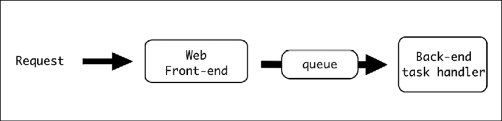
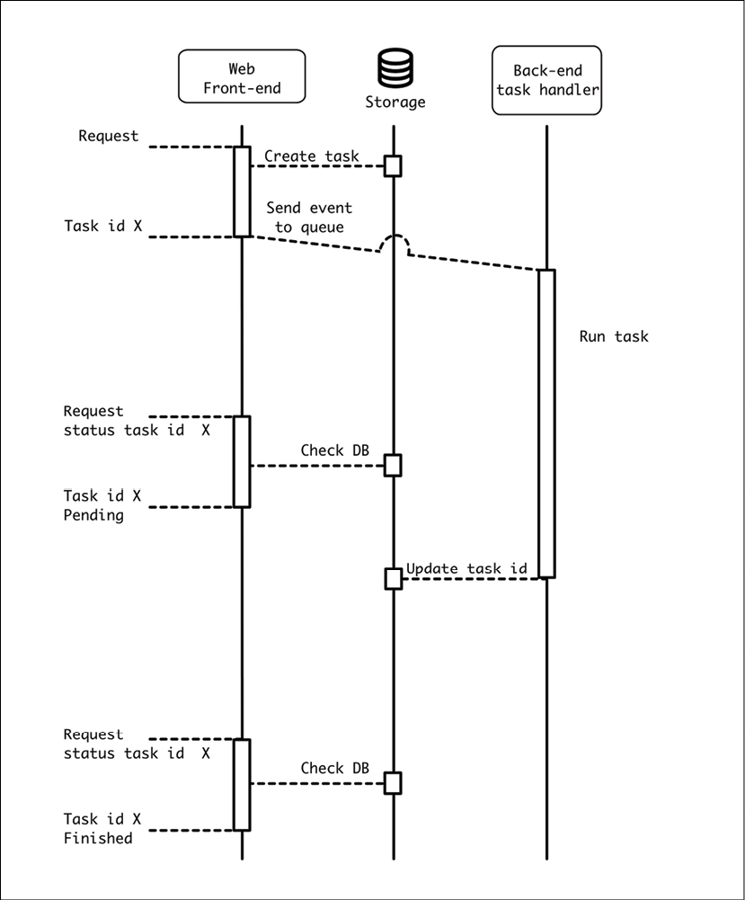
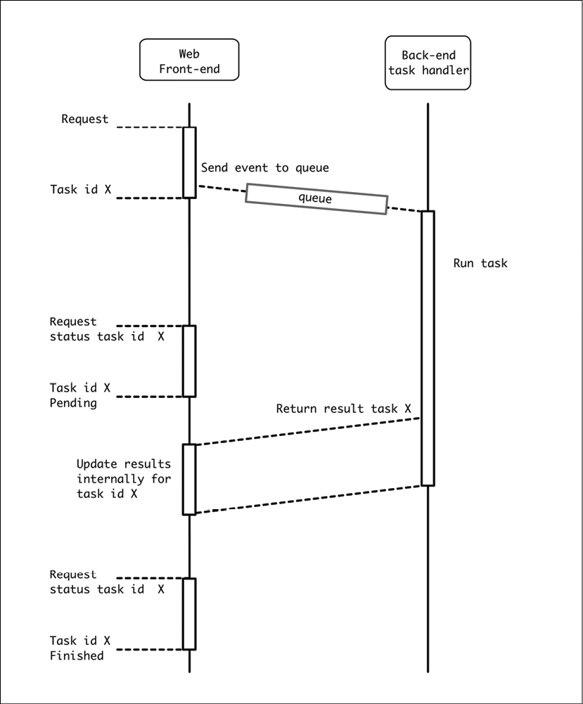
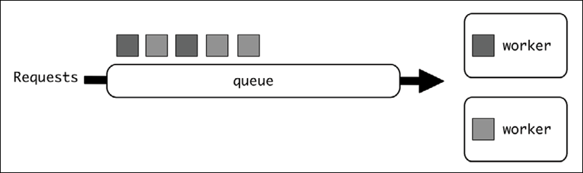
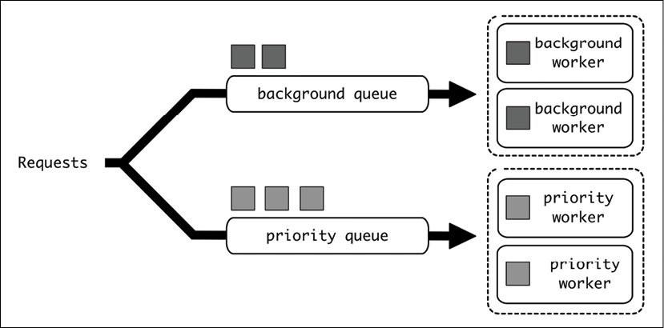
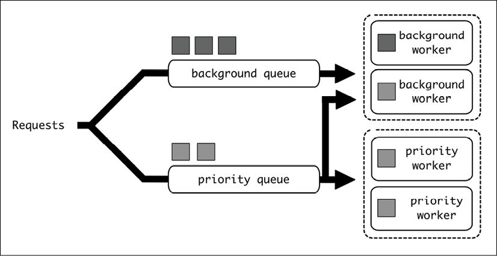
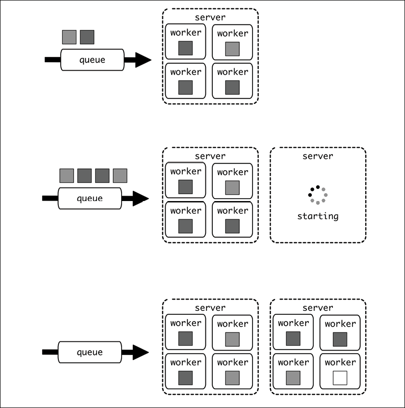
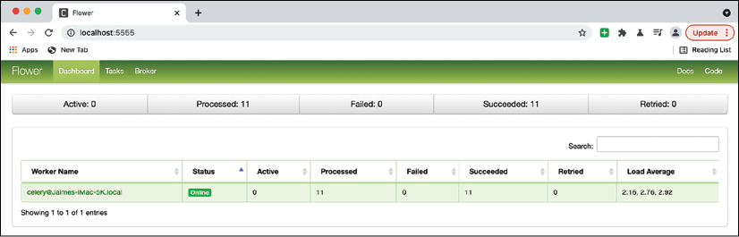
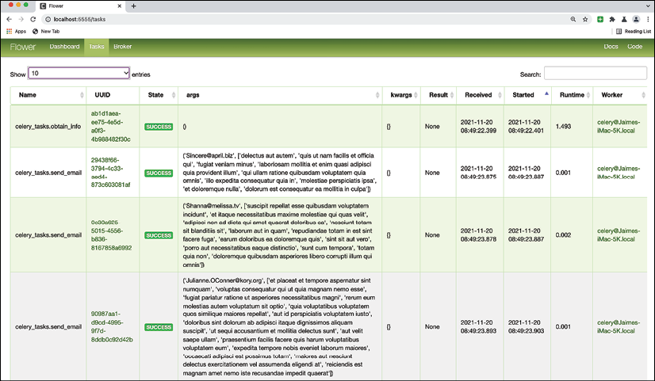
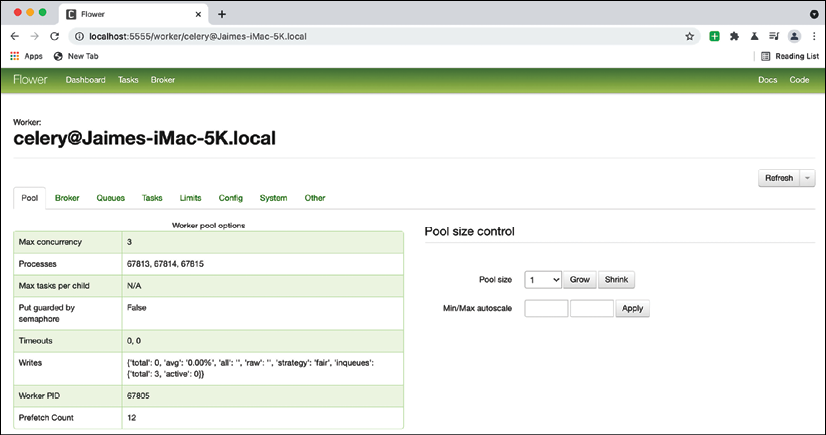

# 事件驱动的结构

请求-响应并不是系统中唯一可以使用的软件架构。也可能存在不需要立即响应的请求。也许对响应没有兴趣，因为任务可以在调用者不需要等待的情况下完成，或者可能需要很长时间并且调用者不想等待它。在任何情况下，从呼叫者的角度来看，都可以选择发送消息并继续。

该消息称为事件，这种系统有多种用途。在本章中，我们将介绍这个概念，并详细描述它最流行的用途之一：创建在后台执行的异步任务，同时任务的调用者继续不间断。

在本章中，我们将介绍异步任务的基础知识，包括排队系统的详细信息以及如何生成自动调度的任务。

我们将使用 Celery 作为 Python 中具有多种功能的流行任务管理器的示例。我们将展示如何执行常见任务的具体示例。我们还将探索 Celery Flower，这是一个创建 Web 界面来监控和控制 Celery 的工具，并有一个 HTTP API 允许你控制该界面，包括发送新任务以执行。

在本章中，我们将介绍以下主题：

- 发送事件
- 异步任务
- 细分任务
- 计划任务
- 队列效果
- Celery

让我们从描述事件驱动系统的基础开始。

## 发送事件

事件驱动结构基于“即发即弃”原则。它不是发送数据并等待另一部分返回响应，而是发送数据并继续执行。

这使它与我们在前一章中看到的请求-响应架构不同。请求-响应过程将等待，直到生成适当的响应。同时，更多代码的执行将停止，因为外部系统产生的新数据需要继续。

在事件驱动的系统中，没有响应数据，至少在同一意义上是不同的。相反，将发送包含请求的事件，并且任务将继续。可能会返回一些最少的信息，以确保以后可以跟踪事件。

> 事件驱动系统可以用请求响应服务器来实现。这并不能使它们成为纯粹的请求-响应系统。例如，创建事件并返回事件 ID 的 RESTful API。尚未完成任何工作，返回的唯一详细信息是能够检查任何后续任务状态的标识符。
>
> 这不是唯一的选择，因为此事件 ID 可能在本地生成，甚至根本不生成。

不同之处在于任务本身不会在同一时刻完成，因此从生成事件中恢复过来会非常快。事件一旦生成，将传送到另一个系统，该系统会将其传输到目的地。

该系统称为总线，用于使消息在系统中流动。架构可以使用单个总线作为跨系统发送消息的中心位置，也可以使用多个总线。

> 通常，建议使用单一总线与所有系统进行通信。有多种工具可以让我们实现多个逻辑分区，因此消息可以路由到正确的目的地和从正确的目的地路由。

每个事件都将被插入到一个队列中。队列是一个逻辑 FIFO 系统，它将事件从入口点传输到定义的下一个阶段。此时，另一个模块将接收该事件并对其进行处理。

这个新系统正在监听队列并提取所有接收到的事件来处理它们。该worker无法通过同一通道直接与事件的发送者通信，但它可以与其他元素交互，例如共享数据库或暴露的端点，甚至可以将更多事件发送到队列中以进一步处理结果。

> 队列两端的系统称为发布者和订阅者。

多个订阅者可以处理同一个队列，并且他们将并行提取事件。多个发布者也可以将事件生成到同一个队列中。队列的容量将通过可以处理的事件数量来描述，并且应该提供足够的订阅者以便可以足够快地处理队列。

可以作为总线工作的典型工具是 RabbitMQ、Redis 和 Apache Kafka。虽然可以“按原样”使用工具，但有多个库可以帮助你使用这些工具来创建自己的处理发送消息的方式。

## 异步任务

一个简单的事件驱动系统是一个允许你执行异步任务的系统。

事件驱动系统产生的事件描述了要执行的特定任务。通常，每个任务都需要一些时间来执行，这使得直接作为发布者代码流的一部分执行是不切实际的。

典型的例子是需要在合理的时间内响应用户的 Web 服务器。如果 HTTP 请求花费的时间过长，一些 HTTP 超时可能会产生错误，并且通常在一两秒内响应并不是很好的体验。

> 这些耗时较长的操作可能涉及诸如将视频编码为不同分辨率、使用复杂算法分析图像、向客户发送 1000 封电子邮件、批量删除一百万个寄存器、将数据从外部数据库复制到本地数据库、生成报告，或从多个来源提取数据。

解决方法是发送一个事件来处理这个任务，生成一个任务ID，并立即返回这个任务ID。该事件将被发送到一个消息队列，该队列将其传递到后端系统。然后后端系统将执行该任务，这可能需要它需要执行的时间。

同时，任务ID可以用来监控执行的进度。后端任务会更新共享存储中的执行状态，就像数据库一样，所以当它完成时，Web 前端可以通知用户。此共享存储还可以存储任何可能有趣的生成结果。



图 7.1：事件流程

由于任务的状态存储在前端 Web 服务器可访问的数据库中，因此用户可以通过任务 ID 识别来随时询问任务的状态。



图 7.2：使用共享存储检查异步任务的进度

如有必要，后端系统可以生成中间更新，显示何时完成了 25% 或 50% 的任务。这将需要存储在同一个共享存储中。

不过，这个过程是一种简化。队列通常能够返回任务是否已完成。只有当任务需要返回一些数据时才需要共享存储/数据库。数据库适用于小结果，但如果生成像文档这样的大元素作为任务的一部分，这可能不是一个有效的选项，并且可能需要不同类型的存储。

> 例如，如果任务是生成报告，后端会将其存储在 AWS S3 等文档存储中，以便用户稍后下载。

共享数据库并不是确保 Web 服务器前端能够接收信息的唯一方法。 Web 服务器可以公开一个允许后端发回信息的内部 API。总的来说，这与将数据发送到不同的外部服务相同。后端将需要访问 API、对其进行配置，并且可能需要进行身份验证。 API 可以专门为后端创建，也可以是通用的 API，它也接受后端系统将生成的特定数据。

> 在两个不同系统之间共享对数据库的访问可能很困难，因为数据库需要在两个系统中保持同步。我们需要分离系统，以便它们可以独立部署，而不会破坏向后兼容性。架构中的任何更改都需要格外小心，以确保系统可以在任何时候执行而不会中断。公开一个 API 并使数据库处于前端服务的完全控制之下是一个很好的解决方案，但请记住，来自后端的请求将与外部请求竞争，因此我们需要为两者提供足够的容量。

在这种情况下，所有信息、任务 ID、状态和结果都可以保留在 Web 服务器的内部存储中。

> 请记住，队列很可能存储任务 ID 和任务状态。为方便起见，可以将其复制到内部存储中。



图 7.3：向源服务发回信息

请记住，此 API 不必定向到相同的前端。 它还可以调用任何其他内部或外部服务，从而在元素之间生成复杂的流程。 它甚至创建自己的事件，这些事件将被重新引入队列以产生其他任务。

## 细分任务

完全有可能从初始任务生成更多任务。这是通过在任务中创建正确的事件并将其发送到正确的队列来完成的。

这允许单个任务分配其负载并并行化其操作。例如，如果一个任务生成报告并通过电子邮件将其发送给一组收件人，则该任务可以首先生成报告，然后通过创建仅专注于创建电子邮件和附加报告的新任务来并行发送电子邮件.

这将负载分散到多个worker身上，加快了进程。另一个优点是单个任务会更短，这使得它们更容易控制、监控和操作。

> 一些任务管理器可能允许创建分配任务的工作流，并返回和组合它们的结果。这可以在某些情况下使用，但实际上它并没有最初看起来那么有用，因为它引入了额外的等待，我们最终可能会花费更长的时间来完成任务。
>
> 但轻松获胜是在多个元素上执行类似操作的批量任务，而无需组合结果，这种情况很常见。

> 但请记住，这将使初始任务快速完成，使初始任务的 ID 状态成为检查整个操作是否已完成的不好方法。如果需要监控，初始任务可能会返回新任务的 ID。

如有必要，可以重复该过程，子任务可以创建自己的子任务。有些任务可能需要在后台创建大量信息，因此细分它们可能是有意义的，但它也会增加跟踪代码流的复杂性，因此请谨慎使用这种技术，并且只有在它创造了明显优势时才使用。

## 计划任务

异步任务不需要由前端直接生成，也不需要用户直接操作，也可以通过调度设置为在特定时间运行。

计划任务的一些示例包括在夜间生成每日报告、通过外部 API 每小时更新信息、预缓存值以便稍后快速使用、在一周开始时生成下周的计划以及每小时发送提醒电子邮件。

大多数任务队列都会允许生成计划任务，并在其定义中明确指出，因此它们将被自动触发。

> 我们将在本章后面看到如何为 Celery 生成计划任务。

一些计划任务可能非常大，例如每晚向成千上万的收件人发送电子邮件。划分一个定时任务非常有用，所以触发一个小的定时任务只是为了将所有单个任务添加到稍后将处理的队列中。这可以分配负载并允许任务更早完成，从而充分利用系统。

在发送电子邮件的示例中，每晚触发一个任务，读取配置并为找到的每封电子邮件创建一个新任务。然后新任务将接收电子邮件，从外部信息中提取正文，然后发送。

## 队列效果

异步任务的一个重要元素是引入队列可能产生的效果。正如我们所见，后台任务很慢，这意味着运行它们的任何worker都会忙碌一段时间。

同时，可以引入更多任务，这可能意味着队列开始建立。



图 7.4：单队列

一方面，这可能是容量问题。如果worker的数量不足以处理队列中引入的平均任务数，则队列将建立直到达到其限制，并且新任务将被拒绝。

但通常情况下，负载不会像不断涌入的任务那样工作。相反，有时没有要执行的任务，有时要执行的任务数量突然激增，填满了队列。此外，需要计算正确的worker数量以保持运行，以确保这些峰值的等待期（由于所有worker都很忙而导致任务延迟）不会造成问题。

> 计算“正确”的worker数量可能很困难，但通过一些尝试和错误，可以获得“足够好”的数字。有一个数学工具可以处理它，排队论，它根据几个参数计算它。
>
> 无论如何，如今每个worker的资源都很便宜，不必生成确切数量的worker，只要它足够接近，以便可以在合理的时间内处理任何可能的峰值。
>
> 你可以在 http://people.brunel.ac.uk/~mastjjb/jeb/or/queue.html 了解更多关于排队理论的信息。

正如我们在计划任务中看到的那样，一个额外的困难是，在特定时间，可以同时触发相当多的任务。这可能会在特定时间使队列饱和，可能需要一个小时来消化所有任务，例如，创建每日报告，每 4 小时在外部 API 中获取新更新，或者聚合一周的数据。

这意味着，例如，如果添加了 100 个创建后台报告的任务，它们将阻止一个任务生成用户发送的报告，这将产生不好的体验。如果用户在计划任务被触发后几分钟要求报告，他们将不得不等待太久。

一种可能的解决方案是使用多个队列，并从中拉出不同的worker。



图 7.5：优先级和后台队列

这使得这些不同的任务分配给不同的worker，从而可以为某些任务保留容量以不间断地运行。在我们的示例中，背景报告可以发送给他们自己的专用worker，而用户报告也有自己的worker。但是，这会浪费容量。如果后台报告每天只运行一次，则一旦处理了 100 个任务，worker将在一天的剩余时间里处于空闲状态，即使在为用户报告提供服务的worker中排长队也是如此。

取而代之的是，可以使用混合方法。



图 7.6：从多个队列中拉取的常规worker

在这种情况下，用户报告worker将继续使用相同的方法，但后台报告worker将从两个队列中提取任务。在这种情况下，我们限制了后台报告的容量，但同时，当有可用容量时，我们会为用户报告任务增加它。

我们为用户报告任务（优先级）保留容量，并使其余worker从所有可用任务中拉取，包括优先级和非优先级任务。

为了能够将工作分成这两个队列，需要仔细划分任务：

- 优先任务。它们是代表用户启动的。他们对时间很敏感。它们执行速度很快，因此延迟很重要。
- 后台任务。通常由自动化系统和计划任务启动。它们的时间敏感性较低。它们可以运行很长时间，因此更容易接受更高的延迟。

应保持它们之间的平衡。如果太多任务被标记为优先级，队列将很快被填满，使其毫无意义。

> 总是很想生成多个队列来设置不同的优先级并为每个队列保留容量。这通常不是一个好主意，因为它们会浪费容量。最有效的系统是具有单个队列的系统，因为将始终使用所有容量。但是，存在优先级问题，因为它会使某些任务花费太长时间。两个以上的队列过于复杂并有浪费容量的风险，因为大多数worker大部分时间都处于空闲状态，而其他队列却被填满。两个队列的简单性有助于培养只在两个选项之间做出决定的原则，并且可以很容易地理解我们为什么需要多个队列。

可以根据峰值的数量和频率以及预期的周转时间来调整优先worker的数量。只要这些高峰是可预测的，就需要足够的优先级worker在后台任务出现大峰值时覆盖常规流量。

> 好的指标对于监控和理解队列的行为至关重要。我们将在第 13 章“度量”中详细讨论度量。

另一种方法是根据特定优先级（如数字）生成优先级系统。这样，优先级为 3 的任务将在优先级为 2 的任务之前执行，然后在优先级为 1 的任务之前执行，以此类推。拥有优先级的最大好处是worker可以一直工作，而不会浪费任何能力。

但是这种方法存在一些问题：

- 许多队列后端不能有效地支持它。保持队列按优先级排序的成本不仅仅是将任务分配给普通队列。在实践中，它可能不会产生你期望的那么好的结果，需要进行许多调整和调整。
- 这意味着你需要处理优先通货膨胀。随着时间的推移，团队很容易开始增加任务的优先级，尤其是在涉及多个团队的情况下。关于应该首先返回哪个任务的决定可能会变得复杂，压力会随着时间的推移而增加优先级数。

虽然看起来排序队列是理想的，但两个级别（优先级和背景）的简单性使得理解系统非常容易，并且在开发和创建新任务时产生容易的期望。它更容易调整和理解，并且会以更少的工作产生更好的结果。

### 所有 worker 的单一代码

当有不同的worker从不同的队列中拉出时，workers可能有不同的代码库，一个具有优先任务，另一个具有后台任务。

> 请注意，要使其正常工作，需要严格分离任务。稍后再详细介绍。

这通常是不可取的，因为它会区分代码库并需要并行维护两个代码库，并存在一些问题：

- 某些任务或任务部分可能是优先级或背景，这取决于触发它们的系统或用户。例如，可以为用户即时生成报告，也可以每天作为批处理的一部分最终通过邮件发送它们。报告生成应该保持通用，因此任何更改都适用于两者。
- 处理两个代码库而不是一个代码库更不方便。通用代码的很大一部分是共享的，因此需要独立运行更新。
- 一个独特的代码库可以处理各种任务。这使得拥有一个同时处理优先级和后台任务的worker成为可能。两个代码库将需要严格的任务分离，而不是使用后台worker中可用的额外容量来帮助处理优先任务。

构建时最好使用单个工作器，并通过配置决定从一个队列或两个队列接收消息。这简化了本地开发和测试的架构。

> 当任务的性质可能会产生冲突时，这可能还不够。例如，如果某些任务需要很大的依赖关系或专门的硬件（就像一些与 AI 相关的任务那样），这可能需要特定的任务在专门的worker中运行，这使得它们共享相同的代码库是不切实际的。这些情况很少见，除非遇到，否则最好尝试合并并为所有任务使用同一个worker。

### 云队列和worker

云计算的主要特点是可以动态启动和停止服务，允许我们只使用特定时刻所需的资源。这允许系统快速增加和减少容量。

在云环境中，可以修改从队列中提取事件的worker数量。这缓解了我们上面讨论的资源问题。我们有一个完整的队列吗？按需增加worker！理想情况下，我们甚至可以为每个生成任务的事件生成一个worker，从而使系统具有无限可扩展性。

显然，这说起来容易做起来难，因为尝试在现场动态创建worker存在一些问题：

- 启动时间可以显着增加任务执行的时间，甚至超过任务本身的执行时间。根据创建worker的重量，启动它可能需要大量时间。
    在传统的云环境中，启动一个相对较重的新虚拟服务器所需的最低粒度至少需要几分钟。使用较新的工具（例如容器），这可以明显加快速度，但基本原理将保持不变，因为在某个时间点将需要生成新的虚拟服务器。
- 一个新的虚拟worker对于单个worker来说可能太大了，使得为每个任务生成一个虚拟worker效率低下。同样，容器化解决方案可以通过更轻松地区分创建新容器和需要在云服务中启动新虚拟服务器来提供帮助。
- 任何云服务都应该有限制。每个新创建的worker都需要花钱，如果在不受控制的情况下扩大规模，云服务可能会变得非常昂贵。如果对事物的成本方面没有一定的控制，由于高昂的意外成本，这可能会成为一个问题。通常这可能是偶然发生的，由于系统上的某些问题导致worker数量激增，但还有一种称为现金溢出的安全攻击，旨在使服务以尽可能高的成本运行，以迫使服务的所有者停止它甚至使他们破产。

由于这些问题，解决方案通常需要以批处理的方式工作，允许额外的空间增长并仅在需要它们以减少队列时生成额外的虚拟服务器。同样，当不再需要额外的容量时，它会被移除。

> 应特别注意确保位于同一虚拟服务器中的所有worker在停止之前都处于空闲状态。这是通过优雅地停止服务器自动完成的，因此它们将完成所有剩余任务，不启动新任务，并在一切完成后完成。

该过程应与此类似：



图 7.7：启动新服务器

确切地知道何时应该生成新服务器很大程度上取决于对延迟、流量和创建新服务器的速度的要求（如果服务器启动速度很快，那么在扩展时可能就不那么激进了）。

> 一个好的起点是，每当队列中的任务数量等于或大于单个服务器中的worker数量时，就创建一个新服务器。这会触发一个能够处理这些任务的新服务器。如果触发创建的任务少于此，它将创建一个未完全填充的服务器。如果启动时间很长，可以减少它以确保新服务器在大量队列建立之前启动。但这需要针对特定系统进行实验和测试。

## Celery

Celery 是用 Python 创建的最流行的任务队列。它允许我们轻松地创建新任务，并且可以处理触发新任务的事件的创建。

Celery 需要工作来建立一个代理，它将用作处理消息的队列。

> 在 Celery 中，代理是消息队列，而后端保留用于与存储系统交互以返回信息。

创建消息的代码会将其添加到代理，代理会将其传递给连接的worker之一。当一切都发生在 Python 代码中时，可以安装 ```celery``` 包，操作起来很简单。我们稍后会看到如何在其他情况下操作它。

Celery 可以使用多个系统作为代理。最受欢迎的是 Redis 和 RabbitMQ。

> 在我们的示例中，我们将使用 Redis，因为它可用于代理和后端，并且在云系统中广泛可用。它的可扩展性也很强，可以轻松处理大负载。

使用后端是可选的，因为任务不需要定义返回值，并且异步任务不直接返回除了任务状态之外的响应数据是很常见的。这里的关键词是“直接”；有时，一个任务会产生一个可以访问的外部结果，但不能通过 Celery 系统访问。

这些值的一些示例是可以存储在其他存储设施中的报告、在任务处理期间发送的电子邮件以及值的预缓存，其中没有直接结果，但在其他地方生成并存储了新数据。

返回值也需要足够小，以便可以存储在作为后端工作的系统中。另外，如果使用强持久性，建议使用数据库作为后端。

我们将使用 GitHub 上的示例：https://github.com/PacktPublishing/Python-Architecture-Patterns/tree/main/chapter_07_event_driven/celery_example。我们将使用该示例创建一个任务，以从外部 API 检索某些用户的待办 TO DO 操作，并生成一封电子邮件以作为提醒发送。

> 请记住通过运行 ```pip install -r requirements.txt ```来安装所需的依赖项。

让我们看一下代码。

### 配置 Celery

代码分为两个文件：```celery_tasks.py```，描述任务，```start_task.py```，连接队列并入队任务。

在每个开始时，我们需要配置要使用的代理。在这种情况下，我们将使用在 localhost 中运行的 Redis 服务器：

```python
from celery import Celery
app = Celery('tasks', broker='redis://localhost')
```

作为先决条件，我们需要设置一个在我们预期的 localhost 地址中运行的 Redis 服务器。如果你安装了 Docker，一个简单的方法是启动一个容器：

```sh
$ docker run -d -p 6379:6379 redis
```

这将启动标准 Redis 容器，该容器将通过标准端口 6379 公开服务。这将自动连接到之前的代理 URL ```redis://localhost```。

这是所需的所有配置，它将允许发布者和订阅者双方连接到队列。

### Celery worker

我们将使用 https://jsonplaceholder.typicode.com/ 来模拟调用外部 API。这个测试站点公开了一个可访问的 REST 端点来检索一些模拟信息。你可以看到它们的定义，但基本上，我们将访问 ```/todos``` 和 ```/users``` 端点。 ```/todos``` 端点公开了用户存储的操作，因此我们将查询它们以检索待处理的操作，并将其与 ```/users``` 端点中的信息相结合。

```celery_tasks.py``` worker 定义了一个主任务，```obtain_info```，和一个次要任务，```send_email```。第一个从 API 中提取信息并决定需要发送哪些电子邮件。第二个然后发送电子邮件。

> 电子邮件的发送只是被模拟以避免使系统复杂化并且需要处理模拟的电子邮件地址。留给读者作为练习。

该文件以队列的配置开始并导入：

```python
from celery import Celery
import requests
from collections import defaultdict
app = Celery('tasks', broker='redis://localhost')
logger = app.log.get_default_logger()
BASE_URL = 'https://jsonplaceholder.typicode.com'
```

```logger```定义允许使用本机 Celery 日志，这些日志将流式传输到 Celery 配置中的日志。默认情况下，这是标准输出。

让我们看一下```obtain_info```。请注意将函数定义为 Celery 任务的 @app.task：

```python
@app.task
def obtain_info():
    logger.info('Stating task')
    users = {}
    task_reminders = defaultdict(list)
    # Call the /todos endpoint to retrieve all the tasks
    response = requests.get(f'{BASE_URL}/todos')
    for task in response.json():
        # Skip completed tasks
        if task['completed'] is True:
            continue
        # Retrieve user info. The info is cached to only ask
        # once per user
        user_id = task['userId']
        if user_id not in users:
            users[user_id] = obtain_user_info(user_id)
        info = users[user_id]
        # Append the task information to task_reminders, that
        # aggregates them per user
        task_data = (info, task)
        task_reminders[user_id].append(task_data)
    # The data is ready to process, create an email per
    # each user
    for user_id, reminders in task_reminders.items():
        compose_email(reminders)
    logger.info('End task')
```

我们用 ```INFO``` 日志包装函数，为任务执行提供上下文。首先，它在这一行调用 ```/todos``` 端点，然后独立地执行每个任务，跳过任何已完成的任务。

```python
response = requests.get(f'{BASE_URL}/todos')
for task in response.json():
    if task['completed'] is True:
        continue
```

然后，它检查用户的信息并将其放入 ```info``` 变量中。因为这个信息可以在同一个循环中多次使用，所以它被缓存在```用户```字典中。一旦信息被缓存，它就不会再次被要求：

```python
        user_id = task['userId']
        if user_id not in users:
            users[user_id] = obtain_user_info(user_id)
        info = users[user_id]
```

单个任务数据被添加到为存储用户的所有任务而创建的列表中。 ```task_reminders``` 字典被创建为 ```defaultdict(list)```，这意味着第一次访问特定的 ```user_id``` 时，如果它不存在，它将被初始化为一个空列表，允许附加一个新元素。

```python
        task_data = (info, task)
        task_reminders[user_id].append(task_data)
```

最后，迭代 ```task_reminders``` 中存储的元素以撰写生成的电子邮件：

```python
        for user_id, reminders in task_reminders.items():
        compose_email(reminders)
```

调用了两个后续函数：```obtain_user_info``` 和 ```compose_email```。

```gain_user_info``` 直接从 ```/users/{user_id}``` 端点检索信息并返回：

```python
def obtain_user_info(user_id):
    logger.info(f'Retrieving info for user {user_id}')
    response = requests.get(f'{BASE_URL}/users/{user_id}')
    data = response.json()
    logger.info(f'Info for user {user_id} retrieved')
    return data
```

```compose_email``` 获取任务列表中的信息，其中包括一组```user_info```，```task_info```，提取每个```task_info```的标题信息，然后从匹配的```user_info```中提取```email```，然后调用```send_email```任务：

```python
def compose_email(remainders):
    # remainders is a list of (user_info, task_info)
    # Retrieve all the titles from each task_info
    titles = [task['title'] for _, task in remainders]
    # Obtain the user_info from the first element
    # The user_info is repeated and the same on each element
    user_info, _ = remainders[0]
    email = user_info['email']
    # Start the task send_email with the proper info
    send_email.delay(email, titles)
```

如你所见，```send_email``` 任务包含一个 ```.delay ```调用，它使用适当的参数将该任务排入队列。 ```send_email``` 是另一个 Celery 任务。这很简单，因为我们只是在模拟电子邮件传递。它只记录其参数：

```python
@app.task
def send_email(email, remainders):
    logger.info(f'Send an email to {email}')
    logger.info(f'Reminders {remainders}')
```

### 触发任务

```start_task.py``` 脚本包含触发任务的所有代码。这是一个从其他文件导入任务的简单脚本。

```python
from celery_tasks import obtain_info
obtain_info.delay()
```

请注意，它在进行导入时继承了 ```celery_tasks.py``` 的所有配置。

重要的是，它使用 ```.delay()``` 调用任务。这会将任务发送到队列，以便worker可以将其拉出并执行。

请注意，如果你直接使用 ```get_info()``` 调用任务，你将直接执行代码，而不是将任务提交到队列中。

现在让我们看看这两个文件是如何交互的。

### 连接点

为了能够设置发布者和消费者这两个部分，首先启动工作者调用样式：

```sh
$ celery -A celery_tasks worker --loglevel=INFO -c 3
```

> 注意：使用的某些模块，例如 Celery，可能与 Windows 系统不兼容。更多信息可以在 https://docs.celeryproject.org/en/stable/faq.html#does-celery-support-windows 找到。

这将使用 ```-A``` 参数启动 ```celery_tasks``` 模块（```celery_tasks.py ```文件）。它将日志级别设置为 ```INFO``` 并使用 ```-c 3``` 参数启动三个worker。它将显示一个与此类似的启动日志：

```sh
$ celery -A celery_tasks worker --loglevel=INFO -c 3
   v5.1.1 (sun-harmonics)
macOS-10.15.7-x86_64-i386-64bit 2021-06-22 20:14:09
[config]
.> app:         tasks:0x110b45760
.> transport:   redis://localhost:6379//
.> results:     disabled://
.> concurrency: 3 (prefork)
.> task events: OFF (enable -E to monitor tasks in this worker)
[queues]
.> celery           exchange=celery(direct) key=celery
[tasks]
  . celery_tasks.obtain_info
  . celery_tasks.send_email
[2021-06-22 20:14:09,613: INFO/MainProcess] Connected to redis://localhost:6379//
[2021-06-22 20:14:09,628: INFO/MainProcess] mingle: searching for neighbors
[2021-06-22 20:14:10,666: INFO/MainProcess] mingle: all alone
```

请注意，它显示了两个可用任务，```obtain_info``` 和 ```send_email```。在另一个窗口中，我们可以发送调用 ```start_task.py``` 脚本的任务：

```shell
$ python3 start_task.py
```

这将触发 Celery worker 中的任务，生成日志（为清晰和简洁而编辑）。我们将在接下来的段落中解释日志。

```sh
[2021-06-22 20:30:52,627: INFO/MainProcess] Task celery_tasks.obtain_info[5f6c9441-9dda-40df-b456-91100a92d42c] received
[2021-06-22 20:30:52,632: INFO/ForkPoolWorker-2] Stating task
[2021-06-22 20:30:52,899: INFO/ForkPoolWorker-2] Retrieving info for user 1
...
[2021-06-22 20:30:54,128: INFO/MainProcess] Task celery_tasks.send_email[08b9ed75-0f33-48f8-8b55-1f917cfdeae8] received
[2021-06-22 20:30:54,133: INFO/MainProcess] Task celery_tasks.send_email[d1f6c6a0-a416-4565-b085-6b0a180cad37] received
[2021-06-22 20:30:54,132: INFO/ForkPoolWorker-1] Send an email to Sincere@april.biz
[2021-06-22 20:30:54,134: INFO/ForkPoolWorker-1] Reminders ['delectus aut autem', 'quis ut nam facilis et officia qui', 'fugiat veniam minus', 'laboriosam mollitia et enim quasi adipisci quia provident illum', 'qui ullam ratione quibusdam voluptatem quia omnis', 'illo expedita consequatur quia in', 'molestiae perspiciatis ipsa', 'et doloremque nulla', 'dolorum est consequatur ea mollitia in culpa']
[2021-06-22 20:30:54,135: INFO/ForkPoolWorker-1] Task celery_tasks.send_email[08b9ed75-0f33-48f8-8b55-1f917cfdeae8] succeeded in 0.004046451000021989s: None
[2021-06-22 20:30:54,137: INFO/ForkPoolWorker-3] Send an email to Shanna@melissa.tv
[2021-06-22 20:30:54,181: INFO/ForkPoolWorker-2] Task celery_tasks.obtain_info[5f6c9441-9dda-40df-b456-91100a92d42c] succeeded in 1.5507660419999638s: None
...
[2021-06-22 20:30:54,141: INFO/ForkPoolWorker-3] Task celery_tasks.send_email[d1f6c6a0-a416-4565-b085-6b0a180cad37] succeeded in 0.004405897999959052s: None
[2021-06-22 20:30:54,192: INFO/ForkPoolWorker-2] Task celery_tasks.send_email[aff6dfc9-3e9d-4c2d-9aa0-9f91f2b35f87] succeeded in 0.0012900159999844618s: None
```

因为我们启动了三个不同的worker，所以日志是交织在一起的。注意第一个任务，对应```obtain_info```。这个任务在我们的执行中已经在```worker ForkPoolWorker-2```中执行过了。

```sh
[2021-06-22 20:30:52,627: INFO/MainProcess] Task celery_tasks.obtain_info[5f6c9441-9dda-40df-b456-91100a92d42c] received
[2021-06-22 20:30:52,632: INFO/ForkPoolWorker-2] Stating task
[2021-06-22 20:30:52,899: INFO/ForkPoolWorker-2] Retrieving info for user 1
...
[2021-06-22 20:30:54,181: INFO/ForkPoolWorker-2] Task celery_tasks.obtain_info[5f6c9441-9dda-40df-b456-91100a92d42c] succeeded in 1.5507660419999638s: None
```

在执行此任务时，```send_email``` 任务也正在排队并由其他worker执行。

例如：

```sh
[2021-06-22 20:30:54,133: INFO/MainProcess] Task celery_tasks.send_email[d1f6c6a0-a416-4565-b085-6b0a180cad37] received
[2021-06-22 20:30:54,132: INFO/ForkPoolWorker-1] Send an email to Sincere@april.biz
[2021-06-22 20:30:54,134: INFO/ForkPoolWorker-1] Reminders ['delectus aut autem', 'quis ut nam facilis et officia qui', 'fugiat veniam minus', 'laboriosam mollitia et enim quasi adipisci quia provident illum', 'qui ullam ratione quibusdam voluptatem quia omnis', 'illo expedita consequatur quia in', 'molestiae perspiciatis ipsa', 'et doloremque nulla', 'dolorum est consequatur ea mollitia in culpa']
[2021-06-22 20:30:54,135: INFO/ForkPoolWorker-1] Task celery_tasks.send_email[08b9ed75-0f33-48f8-8b55-1f917cfdeae8] succeeded in 0.004046451000021989s: None
```

在执行结束时，有一个日志显示它所花费的时间，以秒为单位。

> 如果只涉及一个worker，则任务将连续运行，从而更容易区分任务。

我们可以看到 ```send_email``` 任务是如何在 ```gain_info``` 任务结束之前启动的，并且在 ```gain_info``` 任务结束之后还有 ```send_email``` 任务在运行，可见这些任务是如何独立运行的。

### 计划任务

在 Celery 内部，我们还可以生成具有一定时间表的任务，因此它们可以在适当的时间自动触发。

为此，我们需要定义一个任务和一个时间表。我们在 ```celery_scheduled_tasks.py``` 文件中定义了它们。让我们来看看：

```python
from celery import Celery
from celery.schedules import crontab
app = Celery('tasks', broker='redis://localhost')
logger = app.log.get_default_logger()
@app.task
def scheduled_task(timing):
    logger.info(f'Scheduled task executed {timing}')
app.conf.beat_schedule = {
    # Executes every 15 seconds
    'every-15-seconds': {
        'task': 'celery_scheduled_tasks.scheduled_task',
        'schedule': 15,
        'args': ('every 15 seconds',),
    },
    # Executes following crontab
    'every-2-minutes': {
        'task': 'celery_scheduled_tasks.scheduled_task',
        'schedule': crontab(minute='*/2'),
        'args': ('crontab every 2 minutes',),
    },
}
```

该文件以与上一个示例相同的配置开始，我们定义了一个小而简单的任务，该任务仅在执行时显示。

```python
@app.task
def scheduled_task(timing):
    logger.info(f'Scheduled task executed {timing}')
```

有趣的是稍后会出现，因为时间表是在 ```app.conf.beat_schedule``` 参数中配置的。我们创建了两个条目。

```python
app.conf.beat_schedule = {
    # Executes every 15 seconds
    'every-15-seconds': {
        'task': 'celery_scheduled_tasks.scheduled_task',
        'schedule': 15,
        'args': ('every 15 seconds',),
    },
```

第一个定义每 15 秒执行一次正确的任务。任务需要包含模块名称（```celery_scheduled_tasks```）。 ```schedule``` 参数以秒为单位定义。 ```args``` 参数包含要为执行传递的任何参数。请注意，它被定义为参数列表。在这种情况下，我们创建一个具有单个条目的元组，因为只有一个参数。

第二个条目将计划定义为 crontab 条目。

```python
    # Executes following crontab
    'every-2-minutes': {
        'task': 'celery_scheduled_tasks.scheduled_task',
        'schedule': crontab(minute='*/2'),
        'args': ('crontab every 2 minutes',),
    },
```

此 ```crontab``` 对象作为 ```schedule``` 参数传递，每两分钟执行一次任务。 ```Crontab``` 条目非常灵活，允许执行各种可能的操作。

一些例子如下：

| Crontab entry                                    | Description                                                  |
| ------------------------------------------------ | ------------------------------------------------------------ |
| crontab()                                        | 每分钟执行一次，尽可能低的分辨率                             |
| crontab(minute=0)                                | 每小时执行一次，在第 0 分钟                                  |
| crontab(minute=15)                               | 每小时执行一次，在 15 分钟                                   |
| crontab(hour=0, minute=0)                        | 每天午夜执行（在你的时区）                                   |
| crontab(hour=6, minute=30, day_of_week='monday') | 每周一 6:30 执行                                             |
| crontab(hour='*/8', minute=0)                    | 每小时执行一次，可被 8 (0, 8, 16) 整除。 每天 3 次，每次都在第 0 分钟 |
| crontab(day_of_month=1, hour=0, minute=0)        | 在每个月的第一天午夜执行                                     |
| crontab(minute='*/2')                            | 可被 2 整除的每分钟执行一次。每两分钟执行一次                |

还有更多选项，包括将时间与太阳时间相关联，例如黎明和黄昏，或自定义调度程序，但大多数用例无论是每 X 秒一次还是使用 crontab 定义都可以。

> 你可以在此处查看完整文档：https://docs.celeryproject.org/en/stable/userguide/periodic-tasks.html#starting-the-scheduler。

要启动调度器，我们需要启动一个特定的 ```worker```，```beat worker```：

```sh
$ celery -A celery_scheduled_tasks beat
celery beat v4.4.7 (cliffs) is starting.
__    -    ... __   -        _
LocalTime -> 2021-06-28 13:53:23
Configuration ->
    . broker -> redis://localhost:6379//
    . loader -> celery.loaders.app.AppLoader
    . scheduler -> celery.beat.PersistentScheduler
    . db -> celerybeat-schedule
    . logfile -> [stderr]@%WARNING
    . maxinterval -> 5.00 minutes (300s)
```

我们以通常的方式启动 ```celery_scheduled_tasks worker```。

```sh
$ celery -A celery_scheduled_tasks worker --loglevel=INFO -c 3
```

但是你可以看到仍然没有传入任务。我们需要启动 ```celery beat```，这是一个将任务插入队列的特定工作者：

```sh
$ celery -A celery_scheduled_tasks beat
celery beat v4.4.7 (cliffs) is starting.
__    -    ... __   -        _
LocalTime -> 2021-06-28 15:13:06
Configuration ->
    . broker -> redis://localhost:6379//
    . loader -> celery.loaders.app.AppLoader
    . scheduler -> celery.beat.PersistentScheduler
    . db -> celerybeat-schedule
    . logfile -> [stderr]@%WARNING
    . maxinterval -> 5.00 minutes (300s)
```

一旦 ```celery beat ```启动，你将开始看到按预期安排和执行的任务：

```sh
[2021-06-28 15:13:06,504: INFO/MainProcess] Received task: celery_scheduled_tasks.scheduled_task[42ed6155-4978-4c39-b307-852561fdafa8]
[2021-06-28 15:13:06,509: INFO/MainProcess] Received task: celery_scheduled_tasks.scheduled_task[517d38b0-f276-4c42-9738-80ca844b8e77]
[2021-06-28 15:13:06,510: INFO/ForkPoolWorker-2] Scheduled task executed every 15 seconds
[2021-06-28 15:13:06,510: INFO/ForkPoolWorker-1] Scheduled task executed crontab every 2 minutes
[2021-06-28 15:13:06,511: INFO/ForkPoolWorker-2] Task celery_scheduled_tasks.scheduled_task[42ed6155-4978-4c39-b307-852561fdafa8] succeeded in 0.0016690909999965697s: None
[2021-06-28 15:13:06,512: INFO/ForkPoolWorker-1] Task celery_scheduled_tasks.scheduled_task[517d38b0-f276-4c42-9738-80ca844b8e77] succeeded in 0.0014504210000154671s: None
[2021-06-28 15:13:21,486: INFO/MainProcess] Received task: celery_scheduled_tasks.scheduled_task[4d77b138-283c-44c8-a8ce-9183cf0480a7]
[2021-06-28 15:13:21,488: INFO/ForkPoolWorker-2] Scheduled task executed every 15 seconds
[2021-06-28 15:13:21,489: INFO/ForkPoolWorker-2] Task celery_scheduled_tasks.scheduled_task[4d77b138-283c-44c8-a8ce-9183cf0480a7] succeeded in 0.0005252540000242334s: None
[2021-06-28 15:13:36,486: INFO/MainProcess] Received task: celery_scheduled_tasks.scheduled_task[2eb2ee30-2bcd-45af-8ee2-437868be22e4]
[2021-06-28 15:13:36,489: INFO/ForkPoolWorker-2] Scheduled task executed every 15 seconds
[2021-06-28 15:13:36,489: INFO/ForkPoolWorker-2] Task celery_scheduled_tasks.scheduled_task[2eb2ee30-2bcd-45af-8ee2-437868be22e4] succeeded in 0.000493534999975509s: None
[2021-06-28 15:13:51,486: INFO/MainProcess] Received task: celery_scheduled_tasks.scheduled_task[c7c0616c-857a-4f7b-ae7a-dd967f9498fb]
[2021-06-28 15:13:51,488: INFO/ForkPoolWorker-2] Scheduled task executed every 15 seconds
[2021-06-28 15:13:51,489: INFO/ForkPoolWorker-2] Task celery_scheduled_tasks.scheduled_task[c7c0616c-857a-4f7b-ae7a-dd967f9498fb] succeeded in 0.0004461000000333115s: None
[2021-06-28 15:14:00,004: INFO/MainProcess] Received task: celery_scheduled_tasks.scheduled_task[59f6a323-4d9f-4ac4-b831-39ca6b342296]
[2021-06-28 15:14:00,006: INFO/ForkPoolWorker-2] Scheduled task executed crontab every 2 minutes
[2021-06-28 15:14:00,006: INFO/ForkPoolWorker-2] Task celery_scheduled_tasks.scheduled_task[59f6a323-4d9f-4ac4-b831-39ca6b342296] succeeded in 0.0004902660000425385s: None
```

你可以看到这两种任务都被相应地安排了。在此日志中，检查时间并发现它们相隔 15 秒：

```sh
[2021-06-28 15:13:06,510: INFO/ForkPoolWorker-2] Scheduled task executed every 15 seconds
[2021-06-28 15:13:21,488: INFO/ForkPoolWorker-2] Scheduled task executed every 15 seconds
[2021-06-28 15:13:36,489: INFO/ForkPoolWorker-2] Scheduled task executed every 15 seconds
[2021-06-28 15:13:51,488: INFO/ForkPoolWorker-2] Scheduled task executed every 15 seconds
```

另一个任务恰好每 2 分钟发生一次。请注意，第一次执行可能并不完全准确。在这种情况下，调度是在 15:12 的晚些时候触发的，并且仍然在此之后执行。无论如何，它将在 crontab 的 1 分钟解析窗口内。

```sh
[2021-06-28 15:13:06,510: INFO/ForkPoolWorker-1] Scheduled task executed crontab every 2 minutes
[2021-06-28 15:14:00,006: INFO/ForkPoolWorker-2] Scheduled task executed crontab every 2 minutes
```

在创建周期性任务时，请记住不同的优先级，正如我们在本章前面所描述的那样。

> 使用周期性任务作为“心跳”来检查系统是否正常工作是一种很好的做法。此任务可用于监控系统中的任务是否按预期流动，没有大的延迟或问题。

这导致了监控不同任务如何被执行的方式，这种方式比仅仅通过检查日志更好。

### Celery Flower

如果你想了解执行的任务并发现和解决问题，那么在 Celery 中获得良好的监控非常重要。一个很好的工具是 Flower，它通过添加一个实时监控网页来增强 Celery，允许你通过网页和 HTTP API 控制 Celery。

> 你可以在 https://flower.readthedocs.io/en/latest/ 查看整个文档。

它也很容易设置并与 Celery 集成。首先，我们需要确保安装了flower包。包在上一步之后包含在 requirements.txt 中，但如果没有，你可以使用 pip3 独立安装。

```sh
$ pip3 install flower
```

安装完成后，你可以使用以下命令启动flower：

```sh
$ celery --broker=redis://localhost flower -A celery_tasks  --port=5555
[I 210624 19:23:01 command:135] Visit me at http://localhost:5555
[I 210624 19:23:01 command:142] Broker: redis://localhost:6379//
[I 210624 19:23:01 command:143] Registered tasks:
    ['celery.accumulate',
     'celery.backend_cleanup',
     'celery.chain',
     'celery.chord',
     'celery.chord_unlock',
     'celery.chunks',
     'celery.group',
     'celery.map',
     'celery.starmap',
     'celery_tasks.obtain_info',
     'celery_tasks.send_email']
[I 210624 19:23:01 mixins:229] Connected to redis://localhost:6379//
```

该命令与启动 Celery worker 非常相似，但包括使用 Redis 定义代理，正如我们之前看到的那样，使用 ```--broker=redis://localhost```，并指定要公开的端口，```--port=5555```。

该接口暴露在 ```http://localhost:5555``` 中。



图 7.8：Celery Flower界面

首页显示系统中的不同worker。请注意，它显示了活动任务的数量以及已处理的任务。在这种情况下，我们有 11 个任务对应于 ```start_task.py``` 的整个运行。你可以转到“任务”选项卡以查看执行的每个任务的详细信息，如下所示：



图 7.9：任务页面

你可以查看输入参数、任务状态、任务名称以及运行时间等信息。

每个 Celery 进程都将独立出现，即使它能够运行多个 ```worker```。你可以在 Worker 页面查看其参数。请参阅最大并发参数。



图 7.10：worker 页面

从这里，你还可以查看和更改每个 Celery 进程的worker数量的配置、设置速率限制等。

### Flower HTTP API

Flower 的一个重要补充是 HTTP API，它允许我们通过 HTTP 调用来控制 Flower。这可以实现系统的自动控制，并允许我们使用 HTTP 请求直接触发任务。这可以用来调用任何编程语言的任务，大大增加了 Celery 的灵活性。

异步调用任务的 URL 如下：

```sh
POST /api/task/async-apply/{task}
```

它需要一个 POST，并且调用的参数应该包含在正文中。例如，使用 ```curl``` 进行调用：

```sh
$ curl -X POST -d '{"args":["example@email.com",["msg1", "msg2"]]}' http://localhost:5555/api/task/async-apply/celery_tasks.send_email
{"task-id": "79258153-0bdf-4d67-882c-30405d9a36f0"}
```

任务在worker中执行：

```sh
[2021-06-24 22:35:33,052: INFO/MainProcess] Received task: celery_tasks.send_email[79258153-0bdf-4d67-882c-30405d9a36f0]
[2021-06-24 22:35:33,054: INFO/ForkPoolWorker-2] Send an email to example@email.com
[2021-06-24 22:35:33,055: INFO/ForkPoolWorker-2] Reminders ['msg1', 'msg2']
[2021-06-24 22:35:33,056: INFO/ForkPoolWorker-2] Task celery_tasks.send_email[79258153-0bdf-4d67-882c-30405d9a36f0] succeeded in 0.0021811629999999305s: None
```

使用相同的 API，可以使用 GET 请求检索任务的状态：

```sh
GET /api/task/info/{task_id}
```

例如：

```sh
$ curl  http://localhost:5555/api/task/info/79258153-0bdf-4d67-882c-30405d9a36f0
{"uuid": "79258153-0bdf-4d67-882c-30405d9a36f0", "name": "celery_tasks.send_email", "state": "SUCCESS", "received": 1624571191.674537, "sent": null, "started": 1624571191.676534, "rejected": null, "succeeded": 1624571191.679662, "failed": null, "retried": null, "revoked": null, "args": "['example@email.com', ['msg1', 'msg2']]", "kwargs": "{}", "eta": null, "expires": null, "retries": 0, "worker": "celery@Jaimes-iMac-5K.local", "result": "None", "exception": null, "timestamp": 1624571191.679662, "runtime": 0.0007789200000161145, "traceback": null, "exchange": null, "routing_key": null, "clock": 807, "client": null, "root": "79258153-0bdf-4d67-882c-30405d9a36f0", "root_id": "79258153-0bdf-4d67-882c-30405d9a36f0", "parent": null, "parent_id": null, "children": []}
```

注意 ```state``` 参数，这里显示任务已成功完成，但如果尚未完成，它将返回 ```PENDING```。

正如我们在本章前面所描述的，这可以用来轮询任务的状态，直到它完成或显示错误。

## 概括

在本章中，我们已经了解了什么是事件驱动结构。我们首先讨论了如何使用事件来创建与传统请求-响应结构不同的流。我们讨论了如何将事件引入队列以传输到其他系统。我们引入了发布者和订阅者的想法，以从该队列中引入或提取事件。

我们描述了如何使用这种结构来处理异步任务：在后台运行并允许界面的其他元素快速响应的任务。我们描述了将异步任务划分为较小的任务如何通过利用多个订阅者来执行这些较小的任务来帮助提高吞吐量。我们描述了如何在特定时间自动添加任务以允许定期执行预定任务。

由于任务的引入可能具有很大的可变性，我们讨论了队列如何工作的一些重要细节、我们可能遇到的不同问题以及处理它们的策略。我们讨论了后台队列和优先级队列的简单策略如何在大多数情况下工作，并警告不要过度复杂化。我们还解释说，本着同样的精神，最好在所有worker之间保持代码同步，即使在队列可能不同的情况下也是如此。我们还简要介绍了云计算应用于异步工作者的能力。

我们解释了如何使用流行的任务管理器 Celery 创建异步任务。我们介绍了如何设置不同的元素，包括后端代理、如何定义合适的worker以及如何从不同的服务生成任务。我们还包括一个关于如何在 Celery 中创建计划任务的部分。

我们展示了 Celery Flower，它是 Celery 的补充，它包括一个我们可以监控和控制 Celery 的 Web 界面。它还包括一个 HTTP API，允许我们通过发送 HTTP 请求来创建任务，允许任何编程语言与我们的 Celery 系统交互。