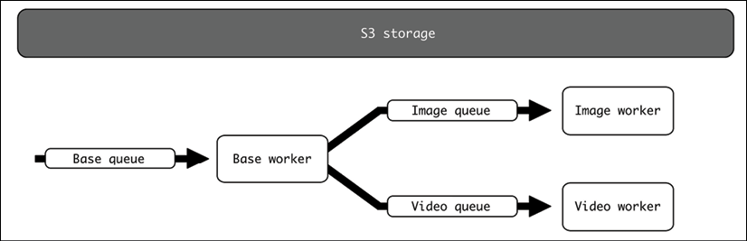

# 高级事件驱动结构

正如我们在前一章中看到的，事件驱动架构非常灵活，能够创建复杂的场景。在本章中，我们将了解涵盖更高级用例的可能的事件驱动结构以及如何处理它们的复杂性。

我们将看到一些常见的应用程序（如日志和指标）如何被视为事件驱动系统，并使用它们生成控制系统，这些控制系统将反馈到产生事件的系统中。

我们还将通过一个示例讨论如何创建复杂的管道，在这些管道中产生不同的事件并协调系统。我们还将转向更一般的概述，将总线作为一个概念来介绍所有事件驱动的组件。

我们将介绍一些关于更复杂系统的一般想法，以描述这些大型事件驱动系统可能产生的一些挑战，例如需要使用 CQRS 技术来检索跨多个模块的信息。最后，我们将给出一些关于如何测试系统的注意事项，注意不同级别的测试。

在本章中，我们将介绍以下主题：

- 流媒体事件
- 管道
- 定义总线
- 更复杂的系统
- 测试事件驱动系统

我们将从描述事件流开始。

## 流媒体事件

出于某些目的，最好只生成捕获信息并将其存储以供以后访问的事件。这种结构对于检测来说是典型的，例如，每次出现错误时我们都会创建一个事件。此事件将包含有关诸如生成错误的位置、能够理解它的调试详细信息等信息。然后发送事件，应用程序继续从错误中恢复。

对代码的特定部分也可以这样做。例如，要捕获对数据库的访问时间，可以捕获时间和相关数据（如特定查询）并在事件中发送。

所有这些事件都应该编译到一个位置，以允许它们被查询和聚合。

虽然通常不被认为是事件驱动的流程，但这几乎就是日志和指标的工作方式。在日志的情况下，事件通常是文本字符串，只要代码决定创建它们就会触发。日志被转发到允许我们稍后搜索它们的目的地。

> 日志可以以不同的格式存储。在 JSON 中创建它们以允许更好的搜索也很常见。

这些类型的事件很简单，但可以让我们发现程序在实时系统中执行的内容非常强大。

当某些条件匹配时，该仪器还可用于启用控制或警报。一个典型的例子是当日志捕获的错误数量超过某个阈值时提醒我们。


图 8.1：监控事件流程

这也可用于生成反馈系统，其中监控系统的仪器可用于确定是否更改系统本身的某些内容。例如，捕获指标以确定系统是需要扩大还是缩小，并根据请求数量或其他参数更改可用服务器的数量。


图 8.2：缩放事件的反馈

不过，这并不是监控系统的唯一方式。这种操作方法也可以用作检测配额的一种方式，例如，如果超过某个配额，则短路传入请求的处理。


图 8.3：监控以检测配额并停止额外请求

这种结构不同于设置控制系统的模块的前期方法，而是依靠仅在超出阈值时才采取行动，在后台进行计算。这可以减少前期所需的处理量。

例如，对于每分钟最大请求数的配额，该过程将类似于以下伪代码：

```python
def process_request(request):
    # Search for the owner of the request
    owner = request.owner
    info = retrieve_owner_info_from_db(owner)
    if check_quota_info(info):
        return process_request(request)
    else:
        return 'Quota exceeded'
```

```check_quota_info``` 在这两种情况下都会有所不同。前期方法需要维护和存储有关先前请求的信息：

```python
def check_quota_info(info):
    current_minute = get_current_minute()
 if current_minute != info.minute:
     # New minute, start the quota
     info.requests = 0
     info.minute = current_minute
 else:
     info.requests += 1
 # Update the information
 info.save()
 if info.requests > info.quota:
     # Quota exceeded
     return False
 # Quota still valid
 return False
```


如果验证是在外部系统中完成的，根据生成的事件，```check_quota_info``` 不需要存储信息，而只是检查是否超出配额：

```python
def check_quota_info(info): 
    # Generate the proper event for a new event
    generate_event('request', info.owner)
 if info.quota_exceeded:
     return False
 # Quota still valid
 return False
```

整个检查在后端监控系统中执行，基于生成的事件，然后存储在 ```info```.这将是否应用配额的逻辑与检查本身分离，从而减少延迟。对应的是，超过配额的检测可能会延迟，从而允许处理一些不应该根据配额的请求。

> 理想情况下，生成的事件应该已经用于监控收到的请求。此操作非常有用，因为它重用了为其他用途生成的事件，从而减少了收集额外数据的需要。

同时，检查可能更复杂，并且不需要在每个新请求出现时进行。例如，对于每秒收到多个请求的每小时配额，也许每分钟检查一次足以确保遵守配额。与每次收到请求时检查条件相比，这可以节省大量的处理能力。

> 当然，这在很大程度上取决于不同系统所涉及的具体规模、特征和要求。对于某些系统，前期可能是更好的选择，因为它更容易实施并且不需要监控系统。在实施之前，请始终验证选项是否适合你的系统。

我们将在第 12 章，日志记录和第 13 章，指标中更详细地讨论日志和指标。

## 管道

事件流不必包含在单个系统中。系统的接收端可以产生自己的事件，指向其他系统。事件将级联到多个系统中，生成一个流程。

这与前面介绍的情况类似，但在这种情况下，这是一个更深思熟虑的过程，旨在创建特定的数据管道，在这些管道中触发和处理系统之间的流。

一个可能的例子是将视频重新缩放为不同大小和格式的系统。当一个视频上传到系统中时，需要将其转换成多个版本，以便在不同的情况下使用。还应创建缩略图以在播放视频之前显示视频的第一帧。

我们将分三步进行。首先，队列将接收事件以开始处理。这将触发两个不同队列中的两个事件，以独立处理调整大小和缩略图生成。这将是我们的管道。

为了存储输入和输出数据，假设它们是视频和图像，我们需要外部存储。我们将使用 AWS S3，或者更准确地说，是 S3 的模拟。

> AWS S3 是亚马逊在云端提供的对象存储服务，因其易于使用且非常稳定而广受欢迎。我们将使用 S3 模拟，它允许我们启动一个行为类似于 S3 的本地服务，这将简化我们的示例。

这是系统的高级图：



图 8.4：视频和图像队列

首先，我们需要将源视频上传到模拟 S3 并启动任务。我们还需要某种方式来检查结果。为此，将提供两个脚本。

> 该代码可在 GitHub 上的 https://github.com/PacktPublishing/Python-Architecture-Patterns/tree/main/chapter_08_advanced_event_driven 获得。

让我们从设置配置开始。

### 准备

如上所述，我们有两个关键的先决条件：队列后端和模拟 S3 存储。

对于队列后端，我们将再次使用 Redis。 Redis 很容易为多个队列配置，我们稍后会看到。要启动 Redis 队列，我们将再次使用 Docker 下载并运行官方镜像：

```sh
$ docker run -d -p 6379:6379 redis
```

这将启动一个暴露在标准端口 ```6379``` 上的 Redis 容器。注意 ```-d``` 选项将使容器在后台运行。

对于模拟 S3 服务，我们将使用相同的方法，启动一个启动 S3 Mock 的容器，该系统复制 S3 API，但将文件存储在本地。这让我们可以避免设置真正的 S3 实例，这涉及获取 AWS 账户、为我们的使用付费等等。

> S3 Mock 是 S3 存储开发测试的绝佳选择，无需使用与 S3 的真实连接。稍后我们将看到如何使用标准模块连接到模拟。完整的文档可以在 https://github.com/adobe/S3Mock 找到。

要启动 S3 Mock，我们还将使用 Docker：

```sh
$ docker run -d -p 9090:9090 -t adobe/s3mock
```

容器在端口 ```9090``` 上公开端点。我们将 S3 请求定向到此本地端口。我们将使用```视频```存储桶来存储所有数据。

我们将定义三个不同的 Celery worker，它们将执行三个不同的任务：基础任务、图像任务和视频任务。每个人都将从不同的队列中提取事件。

> 这种针对不同工人的特定任务的区分是为了解释目的而故意进行的。在这个例子中，可能没有充分的理由进行这种区分，因为所有任务都可以在同一个 worker 中运行，并且新事件可以在同一个队列中重新引入，正如我们在前一章中看到的那样，这是推荐的。但有时，还有其他情况可能需要改变方法。
>
> 例如，一些任务可能需要特定的硬件来进行 AI 处理，使用更多的 RAM 或 CPU 能力，使得所有工人平等不切实际，或者其他需要分离工人的原因。不过，请确保有充分的理由进行拆分。这将使系统的操作和性能复杂化。

我们还将使用一些第三方库。这包括 Celery，正如我们在前一章中看到的，但也包括其他库，如 ```boto3```、```click``` 和 ```MoviePy```。所有必需的库都在 ```requirements.txt``` 文件中可用，因此可以使用以下命令安装它们：

```sh
$ pip3 install -r requirements.txt
```

让我们从流程的第一阶段开始，即重定向到其他两个的基本任务。

### 基础任务

主要任务将收到包含图像的路径。 然后它将创建两个任务，用于处理视频大小调整和提取缩略图。

这是 base_tasks.py 的代码：

```python
from celery import Celery
app = Celery(broker='redis://localhost/0')
images_app = Celery(broker='redis://localhost/1')
videos_app = Celery(broker='redis://localhost/2')
logger = app.log.get_default_logger()
@app.task
def process_file(path):
    logger.info('Stating task')
    logger.info('The file is a video, needs to extract thumbnail and '
                'create resized version')
    videos_app.send_task('video_tasks.process_video', [path])
    images_app.send_task('image_tasks.process_video', [path])
    logger.info('End task')
```

请注意，我们在这里创建了三个不同的队列：

```python
app = Celery(broker='redis://localhost/0')
images_app = Celery(broker='redis://localhost/1')
videos_app = Celery(broker='redis://localhost/2')
```

Redis 允许我们通过使用整数引用它们来轻松创建不同的数据库。 因此，我们为基本队列创建数据库 ```0```，为图像队列创建数据库 ```1```，为视频队列创建数据库 ```2```。

我们使用 ```.send_task``` 函数在这些队列中生成事件。 请注意，在每个队列上，我们发送正确的任务。 我们将路径作为参数包含在内。

> 请注意，任务的所有参数都在 ```.send_task``` 的第二个参数中定义。 这要求参数是参数列表。 在这种情况下，我们只有一个参数仍然需要用 ```[path] ```来描述为一个列表。

当任务被触发时，它会将下一个任务排入队列。 我们来看看图像任务。

### 图像任务

要生成视频的缩略图，我们需要两个第三方模块的帮助：

- boto3。这个通用库帮助我们连接到 AWS 服务。特别是，我们将使用它来下载和上传到我们自己的模拟 S3 服务。

    > 你可以在 https://boto3.amazonaws.com/v1/documentation/api/latest/index.html 查看整个 boto3 文档。它可用于控制所有 AWS API。

- MoviePy。这是一个用于处理视频的库。我们将使用此库将第一帧提取为独立文件。

    > 完整的 MoviePy 文档可在 https://zulko.github.io/moviepy/ 获得。

这两个库都包含在本章前面描述的 ```requirements.txt``` 文件中，并包含在 GitHub 存储库中。我们看一下```image_tasks.py```：

```python
from celery import Celery
import boto3
import moviepy.editor as mp
import tempfile
MOCK_S3 = 'http://localhost:9090/'
BUCKET = 'videos'
videos_app = Celery(broker='redis://localhost/1')
logger = videos_app.log.get_default_logger()


@videos_app.task
def process_video(path):
    logger.info(f'Stating process video {path} for image thumbnail')
    client = boto3.client('s3', endpoint_url=MOCK_S3)
    # Download the file to a temp file
    with tempfile.NamedTemporaryFile(suffix='.mp4') as tmp_file:
        client.download_fileobj(BUCKET, path, tmp_file)
        # Extract first frame with moviepy
        video = mp.VideoFileClip(tmp_file.name)
        with tempfile.NamedTemporaryFile(suffix='.png') as output_file:
            video.save_frame(output_file.name)
            client.upload_fileobj(output_file, BUCKET, path + '.png')
    logger.info('Finish image thumbnails')
```

请注意，我们使用正确的数据库定义了 Celery 应用程序。然后我们描述任务。让我们把它分成不同的步骤。我们首先将path中定义的源文件下载到一个临时文件中：

```python
client = boto3.client('s3', endpoint_url=MOCK_S3)
# Download the file to a temp file
with tempfile.NamedTemporaryFile(suffix='.mp4') as tmp_file:
    client.download_fileobj(BUCKET, path, tmp_file)
```

请注意，我们定义了与 ```MOCK_S3``` 连接的端点，这是我们的 S3 Mock 容器，如前所述，暴露在 ```http://localhost:9090/``` 上。

在它之后，我们生成一个临时文件来存储下载的视频。我们将临时文件的后缀定义为 ```.mp4```，以便稍后 VideoPy 可以正确检测到临时文件是视频。

> 请注意，接下来的步骤都在定义临时文件的 ```with``` 块内。如果它是在此块之外定义的，则该文件将被关闭且不可用。

下一步是在 ```MoviePy``` 中加载文件，然后将第一帧提取到另一个临时文件中。第二个临时文件的后缀为 ```.png``` 以将其标记为图像：

```python
video = mp.VideoFileClip(tmp_file.name)
with tempfile.NamedTemporaryFile(suffix='.png') as output_file:
    video.save_frame(output_file.name)
```

最后，将文件上传到 S3 Mock，在原名称末尾添加``` .png```：

```python
client.upload_fileobj(output_file, BUCKET, path + '.png')
```

再次注意缩进以确保临时文件在不同阶段可用。

调整视频大小的任务遵循类似的模式。让我们来看看。

### 视频任务

视频 Celery worker从视频队列中拉取并执行与图像任务类似的步骤：

```python
from celery import Celery
import boto3
import moviepy.editor as mp
import tempfile
MOCK_S3 = 'http://localhost:9090/'
BUCKET = 'videos'
SIZE = 720
videos_app = Celery(broker='redis://localhost/2')
logger = videos_app.log.get_default_logger()


@videos_app.task
def process_video(path):
    logger.info(f'Starting process video {path} for image resize')
    client = boto3.client('s3', endpoint_url=MOCK_S3)
    # Download the file to a temp file
    with tempfile.NamedTemporaryFile(suffix='.mp4') as tmp_file:
        client.download_fileobj(BUCKET, path, tmp_file)
        # Resize with moviepy
        video = mp.VideoFileClip(tmp_file.name)
        video_resized = video.resize(height=SIZE)
        with tempfile.NamedTemporaryFile(suffix='.mp4') as output_file:
            video_resized.write_videofile(output_file.name)
            client.upload_fileobj(output_file, BUCKET, path + f'x{SIZE}.mp4')
    logger.info('Finish video resize')
```

与图像任务的唯一区别是将视频大小调整为 720 像素的高度并上传结果：

```python
# Resize with moviepy
video = mp.VideoFileClip(tmp_file.name)
video_resized = video.resize(height=SIZE)
with tempfile.NamedTemporaryFile(suffix='.mp4') as output_file:
     video_resized.write_videofile(output_file.name)
```

但总体流程非常相似。请注意，它是从不同的 Redis 数据库中提取的，对应于视频队列。

### 连接任务

为了测试系统，我们需要启动所有不同的元素。每个都在不同的终端中启动，因此我们可以看到它们的不同日志：

```sh
$ celery -A base_tasks worker --loglevel=INFO
$ celery -A video_tasks worker --loglevel=INFO
$ celery -A image_tasks worker --loglevel=INFO
```

要开始这个过程，我们需要在系统中处理一个视频。

> 找到好的免费视频的一种方法是使用 https://www.pexels.com/，它有免费的库存内容。对于我们的示例运行，我们将下载 URL 为 https://www.pexels.com/video/waves-rushing-and-splashing-to-the-shore-1409899/ 的 4K 视频。

我们将使用以下脚本将视频上传到 S3 Mock 存储并启动任务：

```python
import click
import boto3
from celery import Celery
celery_app = Celery(broker='redis://localhost/0')
MOCK_S3 = 'http://localhost:9090/'
BUCKET = 'videos'
SOURCE_VIDEO_PATH = '/source_video.mp4'


@click.command()
@click.argument('video_to_upload')
def main(video_to_upload):
# Note the credentials are required by boto3, but we are using
# a mock S3 that doesn't require them, so they can be fake
    client = boto3.client('s3', endpoint_url=MOCK_S3,
                          aws_access_key_id='FAKE_ACCESS_ID',
                          aws_secret_access_key='FAKE_ACCESS_KEY')
    # Create bucket if not set
    client.create_bucket(Bucket=BUCKET)
    # Upload the file
    client.upload_file(video_to_upload, BUCKET, SOURCE_VIDEO_PATH)
    # Trigger the
    celery_app.send_task('base_tasks.process_file', [SOURCE_VIDEO_PATH])

    
if __name__ == '__main__':
    main()
```

脚本的开头描述了 Celery 队列，即基本队列，它将成为管道的开始。正如我们在前面的任务中看到的，我们定义了几个与配置相关的值。唯一添加的是 SOURCE_VIDEO_PATH，它将在 S3 Mock 中托管视频。

> 在此脚本中，我们使用相同的名称上传所有文件，如果再次运行脚本，则将其覆盖。如果以不同的方式做对你更有意义，请随意更改此设置。

我们使用 ```click``` 库来生成一个简单的**命令行界面 (CLI)**。以下几行生成一个简单的接口，请求上传视频的名称作为函数的参数。

```python
@click.command()
@click.argument('video_to_upload')
def main(video_to_upload):
           ….
```

```click``` 是快速生成 CLI 的绝佳选择。你可以在此处的文档中阅读有关它的更多信息：https://click.palletsprojects.com/。

主函数的内容只是简单地连接到我们的 S3 Mock，如果尚未设置，则创建存储桶，将文件上传到 ```SOURCE_VIDEO_PATH```，然后将任务发送到队列以启动该过程：

```python
client = boto3.client('s3', endpoint_url=MOCK_S3)
# Create bucket if not set
client.create_bucket(Bucket=BUCKET)
# Upload the file
client.upload_file(video_to_upload, BUCKET, SOURCE_VIDEO_PATH)
# Trigger the
celery_app.send_task('base_tasks.process_file', [SOURCE_VIDEO_PATH])
```


让我们运行它并查看结果。

### 运行任务

添加要上传的视频名称后，即可运行该脚本。请记住，```requirements.txt``` 中的所有库都需要安装：

```sh
$ python3 upload_video_and_start.py source_video.mp4
```

将文件上传到 S3 Mock 需要一些时间。一旦被调用，第一个做出反应的工人就是基地工人。该工作人员将创建两个新任务：

```sh
[2021-07-08 20:37:57,219: INFO/MainProcess] Received task: base_tasks.process_file[8410980a-d443-4408-8f17-48e89f935325]
[2021-07-08 20:37:57,309: INFO/ForkPoolWorker-2] Stating task
[2021-07-08 20:37:57,660: INFO/ForkPoolWorker-2] The file is a video, needs to extract thumbnail and create resized version
[2021-07-08 20:37:58,163: INFO/ForkPoolWorker-2] End task
[2021-07-08 20:37:58,163: INFO/ForkPoolWorker-2] Task base_tasks.process_file[8410980a-d443-4408-8f17-48e89f935325] succeeded in 0.8547832089971052s: None
```

其他两个将很快开始。图像工作者将显示新日志，开始创建图像缩略图：

```sh
[2021-07-08 20:37:58,251: INFO/MainProcess] Received task: image_tasks.process_video[5960846f-f385-45ba-9f78-c8c5b6c37987]
[2021-07-08 20:37:58,532: INFO/ForkPoolWorker-2] Stating process video /source_video.mp4 for image thumbnail
[2021-07-08 20:38:41,055: INFO/ForkPoolWorker-2] Finish image thumbnails
[2021-07-08 20:38:41,182: INFO/ForkPoolWorker-2] Task image_tasks.process_video[5960846f-f385-45ba-9f78-c8c5b6c37987] succeeded in 42.650344008012326s: None
```

视频工作者将需要更长的时间，因为它需要调整视频大小：

```sh
[2021-07-08 20:37:57,813: INFO/MainProcess] Received task: video_tasks.process_video[34085562-08d6-4b50-ac2c-73e991dbb58a]
[2021-07-08 20:37:57,982: INFO/ForkPoolWorker-2] Starting process video /source_video.mp4 for image resize
[2021-07-08 20:38:15,384: WARNING/ForkPoolWorker-2] Moviepy - Building video /var/folders/yx/k970yrd11hb4lmrq4rg5brq80000gn/T/tmp0deg6k8e.mp4.
[2021-07-08 20:38:15,385: WARNING/ForkPoolWorker-2] Moviepy - Writing video /var/folders/yx/k970yrd11hb4lmrq4rg5brq80000gn/T/tmp0deg6k8e.mp4
[2021-07-08 20:38:15,429: WARNING/ForkPoolWorker-2] t:   0%|          | 0/528 [00:00<?, ?it/s, now=None]
[2021-07-08 20:38:16,816: WARNING/ForkPoolWorker-2] t:   0%|          | 2/528 [00:01<06:04,  1.44it/s, now=None]
[2021-07-08 20:38:17,021: WARNING/ForkPoolWorker-2] t:   1%|          | 3/528 [00:01<04:17,  2.04it/s, now=None]
...
[2021-07-08 20:39:49,400: WARNING/ForkPoolWorker-2] t:  99%|#########9| 524/528 [01:33<00:00,  6.29it/s, now=None]
[2021-07-08 20:39:49,570: WARNING/ForkPoolWorker-2] t:  99%|#########9| 525/528 [01:34<00:00,  6.16it/s, now=None]
[2021-07-08 20:39:49,874: WARNING/ForkPoolWorker-2] t: 100%|#########9| 527/528 [01:34<00:00,  6.36it/s, now=None]
[2021-07-08 20:39:50,027: WARNING/ForkPoolWorker-2] t: 100%|##########| 528/528 [01:34<00:00,  6.42it/s, now=None]
[2021-07-08 20:39:50,723: WARNING/ForkPoolWorker-2] Moviepy - Done !
[2021-07-08 20:39:50,723: WARNING/ForkPoolWorker-2] Moviepy - video ready /var/folders/yx/k970yrd11hb4lmrq4rg5brq80000gn/T/tmp0deg6k8e.mp4
[2021-07-08 20:39:51,170: INFO/ForkPoolWorker-2] Finish video resize
[2021-07-08 20:39:51,171: INFO/ForkPoolWorker-2] Task video_tasks.process_video[34085562-08d6-4b50-ac2c-73e991dbb58a] succeeded in 113.18933968200872s: None
```

要检索结果，我们将使用 ```check_results.py``` 脚本，该脚本会下载 S3 Mock 存储的内容：

```python
import boto3
MOCK_S3 = 'http://localhost:9090/'
BUCKET = 'videos'
client = boto3.client('s3', endpoint_url=MOCK_S3)


for path in client.list_objects(Bucket=BUCKET)['Contents']:
    print(f'file {path["Key"]:25} size {path["Size"]}')
    filename = path['Key'][1:]
    client.download_file(BUCKET, path['Key'], filename)
```

通过运行它，我们将文件下载到本地目录：

```python
$ python3 check_results.py
file /source_video.mp4         size 56807332
file /source_video.mp4.png     size 6939007
file /source_video.mp4x720.mp4 size 8525077
```

你可以检查生成的文件并确认它们已正确生成。请注意，```source_video.mp4``` 将与你的输入视频相同。

这个例子演示了如何设置一个相对复杂的管道，其中不同的队列和工作人员以协调的方式被触发。请注意，虽然我们直接使用 Celery 将任务发送到队列，但我们也可以使用 Celery Flower 和 HTTP 请求来执行此操作。

## 定义总线

虽然我们谈到了队列后端系统，但这并没有真正扩展到总线的概念。术语总线起源于在硬件系统的不同组件之间传输数据的硬件总线。这使它们成为系统的中心、多源和多目的地部分。

软件总线是这个概念的概括，它允许我们互连几个逻辑组件。

> 本质上，总线是专门用于传输数据的组件。与通过网络直接连接到服务的通常替代方案相比，这是一种有序的通信，无需任何中间组件。

由于总线负责数据传输，这意味着发送方除了要传输的消息和要发送到的队列之外不需要知道太多。总线本身将传输到一个或多个目的地。

总线的概念与消息代理的概念密切相关。但是，消息代理通常包含比纯总线更多的容量，例如能够沿途转换消息并使用多种协议。消息代理可能非常复杂，并允许大量的定制和服务解耦。一般来说，大多数支持总线使用的工具都将被标记为消息代理，尽管有些工具比其他工具更强大。

> 尽管我们将使用术语“总线”，但某些功能将与路由消息等功能更密切相关，这需要被视为消息代理的工具。分析你的特定用例的需求并使用可以满足它们的工具。

然后，总线将被定义为所有与事件相关的通信将被定向到的中心点。这简化了配置，因为事件可以被路由到正确的目的地，而不需要不同的端点。


图 8.5：消息总线

但是，在内部，总线将包含不同的逻辑分区，以允许正确路由消息。这些是队列。

> 如果总线允许，路由可能会很复杂，这里就是这种情况。

在我们之前的示例中，我们使用 Redis 作为总线。虽然连接 URL 有点不同，但可以对其进行重构以使其更清晰：

```python
# Remember that database 0 is the base queue
BASE_BROKER = 'redis://localhost/0'
Base_app = Celery(broker=BROKER)
# Refactor for base
BROKER_ROOT = 'redis://localhost'
BROKER_BASE_QUEUE = 0
base_app = Celery(broker=f'{BASE_BROKER}/{BROKER_BASE_QUEUE}') 
# To address the image queue
BROKER_ROOT = 'redis://localhost'
BROKER_IMAGE_QUEUE = 1
image_app = Celery(broker=f'{BASE_BROKER}/{BROKER_IMAGE_QUEUE}')
```

这个中心位置使所有不同服务的配置变得容易，既可以将事件推送到队列，也可以从队列中提取。

## 更复杂的系统

可以创建更复杂的系统，其中事件通过多个阶段，甚至设计用于从同一队列工作的简单插件系统。

这可以创建复杂的设置，其中数据流经复杂的管道并由独立模块处理。这些场景通常出现在旨在分析和处理大量数据以尝试检测模式和行为的仪器上。

例如，想象一个为旅行社进行预订的系统。系统中会发生大量搜索和预订请求，以及相关的购买，例如汽车租赁、行李包、食品等。每个动作都会产生一个常规响应（搜索、预订、购买等），但描述该动作的事件将被引入队列中以在后台处理。不同的模块将根据不同的目标分析用户行为。

例如，可以将以下模块添加到该系统中：

- 按时间汇总经济结果，以获取有关服务如何随着时间推移而运行的全局视图。这可能涉及诸如每日购买量、收入、利润等细节。
- 分析普通用户的行为。关注用户以发现他们的模式。他们在预订之前在搜索什么？他们在使用优惠吗？他们多久订一次机票？他们的平均行程是多久？有异常值吗？
- 确保有足够的库存用于购买。根据在系统中购买的物品，延期交货任何必需的元素。这还包括根据预购情况为航班安排足够的食物。
- 根据搜索收集有关首选目的地的信息。
- 触发诸如完整航班之类的警报，这可能导致那些日子安排更多的飞机。

这些模块从根本上讲是关于不同的事情，并在系统上呈现不同的视图。有些更面向用户的行为和营销，而另一些则更多与物流相关。根据系统的大小，可以确定这些模块需要一个不同的、专门的团队来独立处理每个模块。


图 8.6：从前端系统到不同模块的总线

请注意，每个系统都可能有自己的存储空间来存储信息。这也可能导致他们创建自己的 API，以便在收集到这些信息后访问这些信息。

> 要查询信息，系统需要查询存储数据的模块的数据库。这可以是一个独立的服务，但它很可能是同一个系统的前端，因为它通常包含所有的外部接口和权限处理。
>
> 这使得前端系统有必要通过直接访问数据库或使用某些 API 来访问存储的信息。正如我们在第 3 章“数据建模”中所看到的，前端系统应该对数据的访问进行建模，并且很可能需要一个模型定义来抽象对数据的复杂访问。

相同的事件将被发送到总线，然后不同的服务将接收它。为此，你需要获得一个总线，该总线接受来自多个系统的订阅并将相同的消息传递给所有订阅的系统。

> 这种模式称为发布/订阅或发布/订阅。事件的消费者需要订阅主题，在 pub/sub 术语中，它相当于一个队列。大多数公共汽车都接受这个系统，尽管它可能需要一些工作来配置。
>
> 例如，在 https://github.com/Mulugruntz/celery-pubsub 上有一个库可以让 Celery 在这个系统下工作。

请注意，这种情况下的工作人员可以创建更多要引入的事件。例如，任何模块都可以创建警报，警报系统将收到通知。例如，如果库存太低，可能需要在延期交货的同时发出快速警报，以确保迅速采取行动。


图 8.7：注意模块和警报之间的通信也是通过总线完成的

复杂的事件驱动系统可以帮助你在不同组件之间分配工作。在此示例中，你可以看到即时响应（预订航班）如何完全独立于可用于长期计划的后台进一步详细分析。如果在处理请求时添加了所有组件，则可能会影响性能。在不影响前端系统的情况下，可以交换和升级后端组件。

为了正确实现这种系统，事件需要使用易于适应和扩展的标准格式，以确保任何接收到它的模块都可以快速扫描并在不需要时将其丢弃。

一个好主意是使用一个简单的 JSON 结构，如下所示：

```json
{
    "type": string defining the event type,
    "data": subevent content
}
```

例如，当产生搜索时，将创建这样的事件：

```json
{
    "type": "SEARCH",
    "data": {
        "from": "Dublin",
        "to": "New York",
        "depart_date": 2021-12-31,
        "return_date": null,
        "user": null
    }
}
```

如果任何模块都不感兴趣，```type``` 字段可以很容易地丢弃事件。例如，```经济分析```模块将丢弃任何 ```SEARCH``` 事件。其他模块可能需要进一步处理。例如，用户行为模块将分析数据中设置了用户字段的 ```SEARCH``` 事件。

请记住，事件驱动系统的一个重要元素是存储可能并非对所有人都通用。也许每个独立的模块都有自己的数据库。你需要使用我们在第 3 章“数据建模”中讨论的 CQRS 技术来对这些模块中的数据进行建模。本质上，你需要以不同的方式读取和保存新数据，因为写入新数据需要生成事件；你需要将它们建模为一个业务单位。更重要的是，模型在某些情况下可能需要合并来自多个模块的信息。例如，如果系统中有查询需要为用户获取一些经济信息，则需要同时查询```用户行为```模块和```经济分析```模块，同时将信息作为```EconomicInfoUser```的唯一模型呈现。

> 当信息被频繁访问时，在多个地方复制它可能是有意义的。这违背了单一职责原则（每个功能都应该是单个模块的唯一职责），但替代方法是创建复杂的访问方法来获取常用信息。在设计和划分系统时要小心，以避免这些问题。

灵活的数据结构将允许生成新事件，添加更多信息并通过强制更改的向后兼容性来允许跨模块进行受控更改。然后不同的团队可以并行工作，改进系统而不会过多地踩对方的脚趾。

但是确保它们正确运行可能很复杂，因为有多个部分相互交互。

## 测试事件驱动系统

事件驱动系统非常灵活，在某些情况下，在分离不同的元素方面非常有用。但是这种灵活性和超然性会使它们难以测试以确保一切都按预期工作。

一般来说，单元测试是生成速度最快的测试，但是事件驱动系统的分离特性使得它们对于正确测试事件的接收不是很有用。当然，可以模拟事件，并且可以测试接收事件的一般行为。但问题是：我们如何才能确保事件已正确生成？在正确的时刻？

唯一的选择是使用集成测试来检查系统的行为。但是这些测试的设计和运行成本更高。

> 关于命名测试，单元测试与集成测试、系统测试、验收测试等的比较，总是有无休止的争论。为避免在这里进行过深的讨论，这不是本书的目的，我们将使用术语单元测试来描述只能在单个模块中运行的测试，而集成测试是指那些需要两个或更多的模块相互交互才能成功。单元测试将模拟任何依赖关系，但集成测试实际上会调用依赖关系以确保模块之间的连接正常工作。
>
> 这两个级别在编写每个测试的成本方面存在显着差异。在同一时间段内可以编写和运行比集成测试更多的单元测试。

例如，在我们之前的示例中，为了测试购买食物是否正确触发警报，我们需要：

- 发出购买食品的电话。
- 产生适当的事件。
- 处理库存控制中的事件。当前库存应配置为低，这将产生警报事件。
- 正确处理警报事件。

所有这些步骤都需要在三个不同的系统（前端系统、库存控制模块和警报模块）中进行配置，并设置总线以连接它们。理想情况下，该测试将要求系统能够启动自动化系统以自动化测试。这要求所涉及的每个模块都是可自动化的。

正如我们所看到的，这是设置和运行测试的高标准，尽管它仍然值得做。为了在集成和单元测试之间取得平衡，我们应该扩展它们并应用一些策略来确保我们对两者都有合理的覆盖。

单元测试很便宜，所以每个案例都应该有单元测试的健康覆盖，其中外部模块被模拟。这包括不同输入格式、不同配置、所有流程、错误等情况。好的单元测试应该从隔离的角度涵盖大多数可能性，模拟数据的输入和任何发送的事件。

例如，继续库存控制示例，许多单元测试可以通过更改输入请求来控制以下必要条件：

- 购买高库存的元素。
- 购买低库存的元素。这应该会产生一个警报事件。
- 购买不存在的元素。这应该会产生错误。
- 格式无效的事件。这应该会产生错误。
- 购买零库存的元素。这应该会生成一个警报事件。
- 更多的案例，比如不同种类的购买、格式等等。

另一方面，集成测试应该只有少数测试，主要涵盖“一体化路径”。快乐路径意味着正在发送和处理常规的代表性事件，但不会产生预期的错误。集成测试的目的是确认所有部件都按预期连接和工作。鉴于集成测试的运行和操作成本更高，因此只实现最重要的测试，并留意任何不值得维护且可以修剪的测试。

> 在上面关于集成测试的讨论中，我们描述了一个一体化的路径场景。该事件会触发清单中的句柄并生成一个也已处理的警报。对于集成测试，这比不生成警报更可取，因为它会给系统带来更多压力。

虽然这取决于系统，但单元测试与集成测试的比例应该重于单元测试，有时是 20 倍或更多（意味着 20 个单元测试的 1 个集成测试）。

## 概括

在本章中，我们看到了更多的事件驱动系统，这些系统具有可以设计的各种先进和复杂的架构。我们已经展示了事件驱动设计可以为设计带来的一些灵活性和强大功能，以及事件驱动设计所面临的挑战。

我们首先将日志和指标等常见系统呈现为事件驱动系统，并考虑以这种方式看待它们如何使我们能够创建可用于控制事件源的警报和反馈系统。

我们还展示了一个使用 Celery 的更复杂管道的示例，包括使用多个队列和共享存储来生成多个协调任务，例如调整视频大小和提取缩略图。

我们提出了总线的概念，即系统中所有事件的共享访问点，并研究了如何生成更复杂的系统，其中事件被传递到多个系统并级联成复杂的动作。我们还讨论了解决这些复杂交互的挑战，包括需要使用 CQRS 技术对通过事件生成写入后可以读取的信息进行建模，以及在单元和集成的不同级别进行测试的需求测试。

在下一章中，我们将看到复杂系统的两种主要架构：单体和微服务。