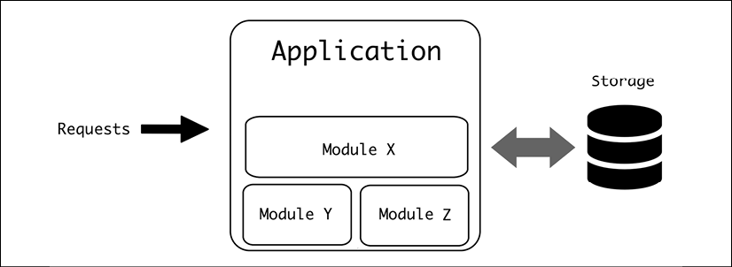
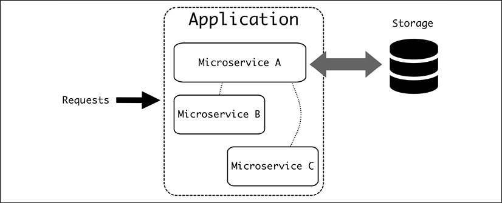
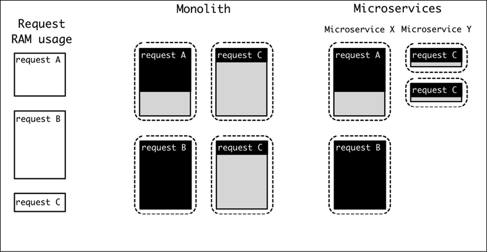
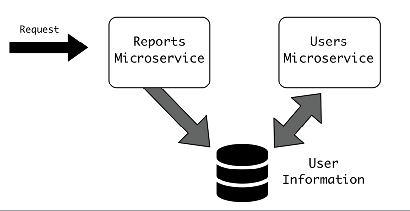
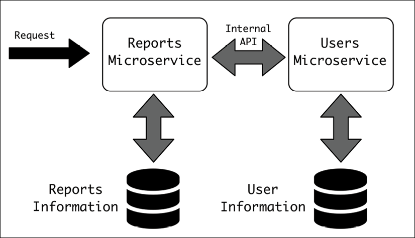
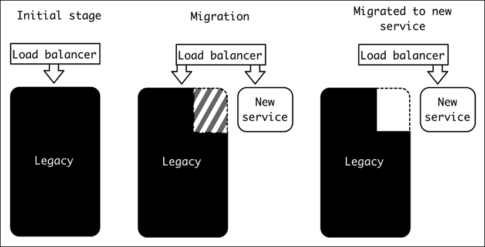
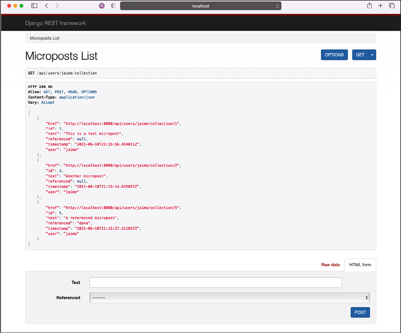

# 微服务与单体应用

在本章中，我们将介绍和评论两种最常见的复杂系统架构。单体架构创建了一个包含整个系统的单个块，并且易于操作。另一方面，微服务架构将系统划分为相互通信的更小的微服务，旨在让不同的团队拥有不同的元素，并帮助大团队并行工作。

我们将根据其不同的特点讨论何时选择每一种。我们还将介绍他们的团队合作方面，因为他们对工作的结构有不同的要求。

请记住，架构不仅与技术有关，而且在很大程度上与通信的结构有关！有关康威定律的进一步讨论，请参阅第 1 章，软件架构简介。

一种常见的模式是从旧的单体架构迁移到微服务架构。我们将讨论这种变化所涉及的阶段。

我们还将介绍 Docker 作为一种容器化服务的方式，这在创建微服务时非常有用，但也可以应用于单体应用。我们将对第 5 章“十二要素应用方法论”中介绍的 Web 应用程序进行容器化。

最后，我们将简要介绍如何使用编排工具部署和操作多个容器，并介绍当今最流行的容器——Kubernetes。

在本章中，我们将介绍以下主题：

- 单体架构
- 微服务架构
- 选择哪种架构
- 从单体应用到微服务
- 容器化服务
- 编排和 Kubernetes

让我们从更深入地讨论单体架构开始。

## 单体架构

当一个系统被有机地设计时，趋势是生成一个包含系统全部功能的单一软件块。

这是一个合乎逻辑的进展。设计软件系统时，它从小处着手，通常具有简单的功能。但是，随着软件的使用，它的使用量也在增长，并开始收到对新功能的请求以补充现有功能。除非有足够的资源和计划来构建增长，否则阻力最小的路径将是继续将所有内容添加到相同的代码结构中，几乎没有模块化。



图 9.1：单片应用程序

此过程确保所有代码和功能都捆绑在一个块中，因此称为单体架构。

> 而且，通过扩展，遵循这种模式的软件被称为单体。

虽然这种结构相当普遍，但总体来说，单体结构具有更好的模块化和内部结构。即使软件由单个块组成，它也可以在逻辑上划分为不同的部分，将不同的职责分配给不同的模块。

> 例如，在前面的章节中，我们讨论了 MVC 架构。这是一个单体架构。模型、视图和控制器都在同一个过程中，但是有一个明确的结构来区分职责和功能。
>
> 单体架构并不是缺乏结构的代名词。

单体应用的定义特征是模块之间的所有调用都是通过内部 API 在同一个进程中进行的。这提供了非常灵活的优点。部署新版本单体应用的策略也很简单。重新启动该过程将确保完全部署。

> 请记住，单体应用程序可以运行多个副本。例如，一个单一的 Web 应用程序可以让同一软件的多个副本并行运行，负载均衡器会向所有这些副本发送请求。在这种情况下，重新启动将分多个阶段。

单体的版本很容易知道，因为所有的代码都是同一个结构的一部分。代码，如果它在源代码控制下，都将在同一个 repo 下。

## 微服务架构

微服务架构是作为一个包含所有代码的单个块的替代方案而开发的。

遵循微服务架构的系统是松散耦合的专业服务的集合，它们协同工作以提供全面的服务。让我们划分定义以便更清楚：

1. 专业服务的集合，这意味着有不同且定义明确的模块
2. 松耦合，因此每个微服务都可以独立部署和开发
3. 那工作是一致的。每个微服务都需要与其他微服务进行通信
4. 提供全面的服务，意味着整个系统创建一个完整的系统，具有明确的动机和功能

与单体相比，它不是将整个软件分组在同一个进程下，而是使用多个独立的功能部分（每个微服务）通过定义良好的 API 进行通信。这些元素可以在不同的进程中，并且通常从不同的服务器中移出以允许适当地扩展系统。



图 9.2：请注意，并非所有微服务都将连接到存储。每个微服务可能有自己独立的存储

定义特征是不同服务之间的调用都是通过外部API。这些 API 充当了功能之间明确、明确的屏障。正因为如此，微服务架构需要提前规划，需要明确定义组件之间的差异。

> 特别是，微服务架构需要良好的前期设计，以确保不同元素正确连接在一起，因为任何跨服务问题的处理成本都很高。

遵循微服务架构的系统不是自然发生的，而是事先制定并仔细执行的计划的结果。这种架构通常不是从头开始针对系统的，而是从以前存在的、成功的单体架构迁移而来。

## 选择哪种架构

有一种趋势认为，像微服务架构这样更进化的架构会更好，但这是过于简单化了。每个人都有自己的一套长处和短处。

第一个事实是几乎每个小型应用程序都将作为单体应用程序开始。这是因为这是启动系统最自然的方式。一切都在手边，模块数量减少了，这是一个简单的起点。

另一方面，微服务需要制定计划，将功能仔细划分为不同的模块。这项任务可能很复杂，因为某些设计在以后可能会被证明是不合适的。

> 请记住，没有任何设计可以完全面向未来。任何完全有效的架构决策都可能在一两年后被证明是不正确的，因为系统的变化需要调整。虽然考虑未来是个好问题，但试图涵盖所有可能性是徒劳的。在为当前功能设计和为系统的未来愿景设计之间的适当平衡是软件架构中的一个持续挑战。

这需要事先做相当多的工作，这需要对微服务架构进行投资。

也就是说，随着单体应用的增长，它们可以通过代码的庞大规模开始提出问题。单体架构的主要特点是所有代码都放在一起，它会开始呈现很多可能导致开发人员困惑的连接。复杂性可以通过良好的实践和持续的警惕来降低，以确保良好的内部结构，但这需要现有开发人员进行大量工作来执行它。在处理一个庞大而复杂的系统时，将不同的区域划分为不同的流程可能更容易呈现清晰和严格的界限。

这些模块还可能需要不同的特定知识，因此很自然地将不同的团队成员分配到不同的领域。为了建立对模块的正确归属感，他们可以在代码标准、适合工作的编程语言、执行任务的方式等方面有不同的看法；例如，一个照片系统，它有一个上传照片的界面和一个用于分类照片的人工智能系统。虽然第一个模块将作为 Web 服务工作，但训练和处理 AI 模型以对数据进行分类所需的能力将大不相同，从而使模块分离自然而高效。它们都在同一个代码库中，尝试同时工作可能会产生问题。

单体应用程序的另一个问题是资源利用效率低下，因为单体应用程序的每次部署都会继承每个模块的每个副本。例如，将针对跨多个模块的最坏情况确定所需的 RAM。当存在多个单体副本时，这将浪费大量 RAM，为可能很少见的最坏情况做准备。另一个例子是，如果任何模块需要与数据库的连接，则将创建一个新连接，无论是否使用。

相比之下，使用微服务可以根据自己最坏的用例调整每个服务，并独立控制每个服务的副本数量。从整体上看，这可以在大型部署中节省大量资源。



图 9.3：请注意，使用不同的微服务可以通过将请求分成不同的微服务来减少 RAM 使用，而在单体应用程序中，最坏的情况会驱动 RAM 使用

部署在单体和微服务之间的工作方式也大不相同。由于需要一次性部署单体应用程序，因此每次部署实际上都是整个团队的任务。如果团队很小，创建一个新部署并确保新功能在模块之间正确协调并且不会错误地干扰并不是很复杂。然而，随着团队变得越来越大，如果代码结构不严格，这可能会带来严重的挑战。特别是，系统一小部分中的错误可能会完全破坏整个系统，因为单体中的任何严重错误都会影响整个代码。

单体部署需要模块之间的协调，这意味着它们需要相互协作，这通常会导致团队密切合作，直到功能准备好发布，并且需要某种监督，直到部署准备好。当多个团队在同一个代码库上工作时，这很明显，目标相互竞争，这模糊了部署的所有权和责任。

相比之下，不同的微服务是独立部署的。 API 应该是稳定的并且向后兼容旧版本，这是需要强制执行的强项之一。但是，边界非常明确，如果出现严重错误，可能发生的最坏情况是特定微服务出现故障，而其他不相关的微服务继续不受影响。

与单体应用的“全有或全无”方法相比，这使得系统工作在“降级状态”。它限制了灾难性故障的范围。

> 当然，某些微服务可能比其他微服务更重要，因此它们的稳定性值得特别关注和关注。但是，在这种情况下，可以提前将它们定义为关键，并执行更严格的稳定性规则。

当然，在这两种情况下，都可以使用可靠的测试技术来提高所发布软件的质量。

与单体相比，微服务可以独立部署，无需与其他服务紧密协调。这为处理它们的团队带来了独立性，并允许更快、持续的部署，而需要更少的中央协调。

> 这里的关键词是较少的协调。仍然需要协调，但微服务架构的目标必然是每个微服务都可以独立部署并由一个团队拥有，因此大多数更改可以完全由所有者决定，而不需要警告其他团队的过程。

单体应用程序，因为它们通过内部操作与其他模块通信，这意味着它们通常可以比通过外部 API 更快地执行这些操作。这允许模块之间进行非常高水平的交互，而无需付出显着的性能代价。

与使用外部 API 和通过网络进行通信相关的开销会产生明显的延迟，尤其是在对不同微服务发出过多内部请求的情况下。需要仔细考虑以避免重复外部呼叫并限制单个任务中可以联系的服务数量。

> 在某些情况下，使用工具来抽象与其他微服务的联系可能会产生绝对必要的额外调用。例如，处理文档的任务需要获取一些用户信息，这需要调用不同的微服务。文件开头需要姓名，结尾需要电子邮件。一个简单的实现可能会产生两个请求来获取信息，而不是一次请求所有信息。

微服务另一个有趣的优势是技术要求的独立性。在单片应用程序中，由于不同模块需要不同版本的库，可能会出现问题。例如，更新 Python 的版本需要为此准备整个代码库。这些库更新可能很复杂，因为不同的模块可能有不同的要求，并且一个模块可以通过需要升级两者使用的某个库的版本来有效地与另一个模块混合。

另一方面，微服务包含自己的一组技术要求，因此没有这个限制。由于使用了外部 API，甚至可以用不同的编程语言对不同的微服务进行编程。这允许为不同的微服务使用专门的工具，为每个目的定制每个工具，从而避免冲突。

> 仅仅因为不同的微服务可以用不同的语言进行编程并不意味着它们应该这样做。避免在微服务架构中使用太多编程语言的诱惑，因为这会使维护复杂化，并使不同团队的成员难以提供帮助，从而创建更多孤立的团队。
>
> 拥有一两种可用的默认语言和框架，然后允许特殊的合理案例是一种明智的做法。

正如我们所看到的，微服务的大多数特性使它更适合更大的操作，当开发人员的数量足够多以至于需要将他们分成不同的团队并且需要更加明确的协调时。一般来说，大型应用程序的快速变化还需要更好的方式来独立部署和工作。

一个小团队可以很好地自我协调，并且能够在一个整体中快速有效地工作。

这并不是说单体可以很大。有些是。但是，在一般意义上，微服务架构只有在有足够多的开发人员使得不同的团队在同一个系统中工作并且需要在他们之间实现良好的独立性时才有意义。

### 关于类似设计的旁注

虽然单体与微服务的决定通常是在 Web 服务的上下文中讨论的，但这并不是一个新想法，也不是唯一存在类似想法和结构的环境。

操作系统的内核也可以是单片的。在这种情况下，如果一个内核结构都在内核空间内运行，则它被称为单片内核结构。在计算机的内核空间中运行的程序可以直接访问整个内存和硬件，这对于操作系统的使用至关重要，同时这也是危险的，因为它具有很大的安全性和安全性。因为内核空间中的代码与硬件的工作非常密切，所以这里的任何故障都可能导致系统完全失败（内核恐慌）。另一种方法是在用户空间中运行，在用户空间中，程序只能访问自己的数据，并且必须与操作系统显式交互以检索信息。

例如，用户空间中的程序要读取文件需要调用操作系统，而内核空间中的操作系统将访问该文件，检索信息，并将其返回给请求的程序，复制到程序可以访问的内存的一部分。

单片内核的想法是，它可以最大限度地减少不同内核元素（例如库或硬件驱动程序）之间的这种移动和上下文切换。

单片内核的替代方案称为微内核。在微内核结构中，内核部分大大减少，文件系统、硬件驱动程序和网络堆栈等元素在用户空间而不是内核空间中执行。这需要这些元素通过微内核传递消息来进行通信，这样效率较低。

同时，它可以提高元素的模块化和安全性，因为用户空间的任何崩溃都可以轻松重启。

鉴于 Linux 是作为单片内核创建的，Andrew S. Tanenbaum 和 Linus Torvalds 之间有一个关于哪种架构更好的著名争论。从长远来看，内核已经向混合模型发展，它们同时兼顾这两个元素，将微内核思想融入现有的整体内核以实现灵活性。

发现和分析相关的架构理念有助于改进优秀架构师可以使用的工具，并提高架构理解和知识。

## 关键因素——团队沟通

微服务和单体架构之间差异的一个关键因素是它们支持的通信结构的差异。

如果单体应用程序是从一个小项目有机地发展而来的，通常情况下，内部结构可能会变得混乱，并且需要具有系统经验的开发人员能够改变并适应任何变化。在糟糕的情况下，代码会变得非常混乱并且使用起来越来越复杂。

增加开发团队的规模变得复杂，因为每个工程师都需要大量的上下文信息，并且学习如何浏览代码很困难。已经在身边的老队友可以帮助培训新的团队成员，但他们会成为瓶颈，而指导是一个缓慢的过程，也是有限度的。团队的每个新成员都需要大量的培训时间，直到他们能够高效地修复错误和添加新功能。

团队也有最大自然规模限制。管理一个成员过多的团队，而不将其分成更小的小组，是很困难的。

> 团队的理想规模取决于许多不同的因素，但通常认为 5 到 9 人是高效工作的理想规模。
>
> 比这更大的团队倾向于自我组织成他们自己的小团体，失去作为一个整体的焦点，并创建小型信息孤岛，团队的一部分人不知道发生了什么。
>
> 成员较少的团队在管理和与其他团队的沟通方面会产生过多的开销。他们将能够以稍大的尺寸更快地工作。

如果不断增长的代码量需要它，那么现在是使用我们在本书中描述的所有技术来生成更多结构、构建系统的时候了。这将涉及定义具有明确职责和明确边界的模块。这种划分允许团队被分成小组，并允许他们为每个团队创建所有权和明确的目标。

这允许团队在没有太多干扰的情况下并行工作，因此额外的成员可以增加功能方面的吞吐量。正如我们之前评论过的，清晰的界限将有助于定义每个团队的工作。

然而，在单体应用中，这些限制是软的，因为整个系统都是可访问的。当然，在专注于某些领域方面存在一定的纪律，并且趋势是一个团队将能够访问所有内容，并且会调整和弯曲内部 API。

> 这种特性不一定是坏事，尤其是在较小的规模上。这种与小型、专注的团队合作的方式可以产生出色的结果，因为他们将能够快速调整软件的所有相关部分。缺点是团队成员需要经验丰富并且熟悉软件，随着时间的推移，这通常会变得越来越困难。

当迁移到微服务架构时，工作分工变得更加明确。团队之间的 API 成为硬性限制，需要更多的前期工作来实现团队之间的沟通。权衡是团队更加独立，因为他们可以：

- 完全拥有微服务，无需其他团队在同一代码库中编码
- 独立于其他团队部署

由于代码库将更小，团队的新成员将能够快速学习并更早地提高工作效率。由于与其他微服务交互的外部 API 将被显式定义，因此将应用更高级别的抽象，使其更易于交互。

> 请注意，这也意味着与单体应用程序相比，不同的团队对其他微服务的内部结构了解得更少，前提是至少对它有肤浅的了解。在将人员从一个团队转移到另一个团队时，这可能会产生一些摩擦。

正如我们在第一章中看到的，在做出影响组织内沟通的架构决策时，必须牢记康威定律。让我们记住，该软件法规定软件的结构将复制组织的通信结构。

康威定律的一个很好的例子是 DevOps 实践的创建。旧的划分工作的方式是有不同的团队，一个负责开发新功能，另一个负责部署和操作软件。毕竟，每个任务所需的能力是不同的。

这种结构的风险是“我不知道它是什么/我不知道它在哪里运行”的划分，这可能导致负责开发新功能的团队不知道与操作软件相关的错误和问题，而运维团队在几乎没有反应时间的情况下发现变化，并在不了解软件内部运行的情况下识别错误。

这种划分在许多组织中仍然存在，但 DevOps 背后的想法是，开发软件的同一团队负责部署它，从而创建一个良性反馈循环，让开发人员了解部署的复杂性并可以做出反应和修复生产中的错误并改进软件的运行。

请注意，这通常涉及创建一个多功能团队，其中包含了解运营和开发的人员，尽管他们不一定需要相同。有时，外部团队负责创建一组通用工具，供其他团队在其运营中使用。

> 这是一个很大的变化，从旧结构到 DevOps 结构的改变涉及以一种对企业文化非常具有破坏性的方式混合团队。正如我们在这里试图强调的那样，这涉及到人的变化，这些变化很慢，并且伴随着大量的痛苦。例如，可能有一种良好的运营文化，他们可以分享知识并一起玩乐，现在他们需要拆分这些团队并将他们与新人整合。
>
> 这种过程是困难的，应该仔细计划，了解其人类和社会规模。

同一团队内部的沟通不同于不同团队之间的沟通。与其他团队沟通总是更加困难和昂贵。这可能说起来容易，但它对团队合作的影响很大。示例包括以下内容：

- 因为要在团队外部使用的 API 将被内部没有相同专业知识水平的其他工程师使用，所以使它们通用且易于使用以及创建适当的文档是有意义的。

- 如果新设计遵循现有团队的结构，那么实施起来会比其他方式更容易。团队之间的架构变更需要组织变更。改变组织结构是一个漫长而痛苦的过程。任何参与公司重组的人都可以证明这一点。这些组织变化将自然地反映在软件中，因此理想情况下将生成一个计划来允许它。

- 在同一服务中工作的两个团队会产生问题，因为每个团队都会试图将其拉向自己的目标。这种情况可能发生在一些通用库或多个团队使用的“核心”微服务中。尝试为他们强制执行明确的所有者，以确保单个团队负责任何更改。

    > 明确的所有者明确了谁负责更改和新功能。即使某些事情是由其他人实施的，所有者也应该负责批准它并给予指导和反馈。他们还应该准备好有长远的眼光并处理任何技术债务。

- 鉴于不同的物理位置和时区自然会施加自己的沟通障碍，它们通常用于建立不同的团队，描述他们自己的结构化通信，如时区之间的 API 定义。

    > 由于 COVID-19 危机，远程工作显着增加。与在同一个房间一起工作的团队相比，这也产生了以不同方式构建沟通的需要。这已经发展和提高了沟通技巧，从而可以更好地组织工作。在任何情况下，团队划分不仅仅是物理上位于同一地点的问题，而是创建团队合作的纽带和结构。

沟通方面的发展是工作的重要组成部分，不应低估。请记住，对它们的更改是“人员更改”，这比技术更改更难实施。

## 从单体应用到微服务

一个常见的情况是需要从现有的单体架构迁移到新的微服务架构。

想要实施此更改的主要原因是系统的大小。正如我们之前所讨论的，微服务系统的主要优势是创建多个可以并行开发的独立部分，从而通过允许更多工程师同时工作来扩展开发并加快步伐。

如果单体应用程序已经增长到超过可管理的大小并且在发布、干扰功能和互相踩踏方面存在足够多的问题，那么这一举措是有意义的。但是，与此同时，这是一个巨大而痛苦的表演过渡。

### 迁移的挑战

虽然最终结果可能比显示其年代久远的单体应用程序要好得多，但迁移到新架构是一项艰巨的任务。现在，我们将看看在这个过程中我们可以预料到的一些挑战和问题：

- 迁移到微服务需要付出巨大的努力，积极改变组织的运作方式，并且需要大量的前期投资，直到它开始获得回报。过渡时间将是痛苦的，并且需要在迁移速度和服务的常规操作之间做出妥协，因为完全停止操作将不是一种选择。这将需要大量的会议和文档来计划迁移并将其传达给每个人。它需要在执行层获得积极的支持，以确保完全承诺完成它，并清楚地了解为什么要这样做。

- 它还需要深刻的文化变革。正如我们在上面看到的，微服务的关键元素是团队之间的交互，与单体架构中的操作方式相比，这将发生显着变化。这可能涉及更换团队和更换工具。团队必须更严格地使用和记录外部 API。
    他们在与其他团队的互动中需要更加正式，并且可能会采取他们以前没有的归因方式。一般来说，人们不喜欢改变，这可能会以一些团队成员的抵抗形式来回应。确保将这些元素考虑在内。

- 另一个挑战是培训方面。肯定会使用新工具（我们将在本章后面介绍 Docker 和 Kubernetes），因此一些团队可能需要适应使用它们。管理一个服务集群可能很复杂，而且可能涉及与以前使用的工具不同的工具。例如，本地开发商可能会非常不同。如果沿着这条路线学习如何操作和使用容器，将需要一些时间。这需要计划并需要支持团队成员，直到他们对新系统感到满意为止。

    > 一个非常明显的例子是调试进入系统的请求的额外复杂性，因为它可以在不同的微服务之间跳转。以前，这个请求在单体应用中可能更容易跟踪。了解请求如何移动并找到由此产生的细微错误可能很困难。为了确定解决这个问题，可能需要在本地开发中复制和修复它们，正如我们所见，这将需要使用不同的工具和系统。

- 将现有的单体划分为不同的服务需要仔细规划。服务之间的不良划分会使两个服务紧密耦合，从而不允许独立部署。这可能导致实际上对一项服务的任何更改都需要对另一项服务进行更改，即使理论上这可以独立完成。这会造成工作重复，因为通常处理单个功能需要更改和部署多个微服务。微服务可以在以后发生变异并重新定义边界，但与之相关的成本很高。以后添加新服务时也应注意同样的问题。

- 创建微服务会产生开销，因为每个服务都会复制一些工作。通过允许独立和并行开发来补偿这种开销。但是，要充分利用这一点，你需要数字。一个最多 10 人的小型开发团队可以非常有效地协调和处理单体应用。只有当规模增长并形成独立团队时，迁移到微服务才开始有意义。公司越大，越有意义。

- 在允许每个团队做出自己的决定和标准化一些共同的元素和决定之间取得平衡是必要的。如果团队的方向太少，他们就会一遍又一遍地重新发明轮子。他们最终还会创建知识孤岛，公司某个部门的知识完全无法转移到另一个团队，这使得集体学习课程变得困难。团队之间需要可靠的沟通，以达成共识并重用通用解决方案。允许受控实验，将其标记为这样，并全面吸取教训，以便其他团队受益。共享和可重用的想法与独立的、多重实现的想法之间存在张力。

    > 在跨服务引入共享代码时要小心。如果代码增长，它将使服务相互依赖。这会降低微服务的独立性。

- 遵循敏捷原则，我们知道工作软件比大量文档更重要。然而，在微服务中，最大化每个单独的微服务的可用性以减少团队之间的支持量是很重要的。这涉及某种程度的文档。最好的方法是创建自我记录服务。

- 正如我们之前所讨论的，每次调用不同的微服务都会增加响应的延迟，因为必须涉及多个层。这可能会产生延迟问题，外部响应需要更长的时间。它们还将受到连接微服务的内部网络的性能和容量的影响。

转向微服务时应谨慎并仔细分析其优缺点。在一个成熟的系统中完成迁移可能需要数年时间。但对于一个大型系统，最终的系统将更加灵活且易于更改，从而使你能够有效地解决技术债务问题，并使开发人员能够完全掌控和创新、构建通信并提供高质量、可靠的服务。

### 迁移中的步骤

从一种架构迁移到另一种架构应该分四个步骤来考虑：

- 仔细分析现有系统。
- 设计以确定所需的目的地是什么。
- 计划。创建一条从当前系统逐步移动到第一阶段设计的愿景的路线。
- 执行计划。这个阶段需要缓慢而谨慎地完成，并且在每一步，都需要重新评估设计和计划。

让我们更详细地了解每个步骤。

#### 1.分析

第一步是对现有单体应用的起点有一个很好的了解。这可能看起来微不足道，但事实是，可以想象没有特定的人对系统的所有细节有很好的了解。它可能需要信息收集、编译和深入挖掘以了解系统的复杂性。

> 现有代码可以描述为遗留代码。虽然目前正在争论究竟哪些代码可以归类为遗留代码，但它的主要属性是已经存在的代码，并且没有遵循新代码所具有的最佳和新实践。
>
> 换句话说，遗留代码是一段时间前的旧代码，很可能与当前实践不同步。但是，遗留代码至关重要，因为它正在使用中，并且可能是组织日常运营的关键。

此阶段的主要目标应该是确定更改是否真的有益，并初步了解迁移将产生哪些微服务。执行此迁移是一项重大承诺，并且仔细检查是否会产生切实的好处总是一个好主意。即使在这个阶段无法估计所需的工作量，它也会开始影响任务的规模。

> 这种分析将极大地受益于良好的指标和实际数据，这些数据显示了系统中实际产生的请求和交互的数量。这可以通过良好的监控来实现，并向系统添加指标和日志以允许衡量当前行为。这可以导致了解哪些部分是常用的，甚至更好的是，几乎从未使用过的部分可能会被弃用和删除。可以继续使用监控来确保流程按计划进行。
>
> 我们将在第 11 章，包管理和第 12 章，日志记录中更详细地讨论监控。

如果系统已经构建良好且维护得当，这种分析几乎可以立即进行，但如果单体是一堆混乱的代码，则可能会延长几个月的会议和深入研究代码。然而，这个阶段将使我们能够建立在坚实的基础上，了解当前的系统是什么。

#### 2. 设计
该过程的下一个阶段是根据将整体分解为多个微服务后系统的外观来生成愿景。

每个微服务都需要单独考虑，并作为其余部分的一部分。想想什么是有意义的分开。可以帮助你构建设计的一些问题如下：

- 应该创建哪些微服务？你能用明确的目标和控制区域来描述每个微服务吗？
- 是否有任何需要更多关注或特殊要求的关键或核心微服务？例如，更高的安全性或性能要求。
- 团队将如何构建以涵盖微服务？团队支持的人太多了吗？如果是这种情况，是否可以将多个请求或区域合并为同一个微服务的一部分？
- 每个微服务的先决条件是什么？
- 将引进哪些新技术？是否需要任何培训？
- 微服务是独立的吗？微服务之间的依赖关系是什么？是否有任何微服务比其他微服务访问更多？
- 微服务可以相互独立部署吗？如果引入了需要更改依赖依赖项的新更改，流程是什么？
- 哪些微服务将对外公开？哪些微服务只在内部公开？
- 在所需的 API 限制方面是否有任何先决条件？例如，是否有任何需要特定 API 的服务，例如 SOAP 连接？

其他对设计有用的事情可以是绘制需要与多个微服务交互的请求的预期流程图，以便分析服务之间的预期移动。

应特别注意为每个微服务决定的任何存储。一般来说，一个微服务的存储不应该与另一个共享，以隔离数据。

这有一个非常具体的应用，即不通过两个或多个微服务直接访问数据库或其他类型的原始存储。相反，一个微服务应该控制格式并公开数据，并允许通过可访问的 API 更改数据。

例如，假设有两个微服务，一个控制报告，另一个控制用户。对于某些报告，我们可能需要访问用户信息以提取，例如生成报告的用户的姓名和电子邮件。我们可以通过允许报表服务直接访问包含用户信息的数据库来打破微服务的责任。



图 9.4：不正确使用示例，直接从存储中访问信息

相反，报表服务需要通过 API 访问用户微服务并拉取数据。这样，每个微服务都负责自己的存储和格式。



图 9.5：这是正确的结构。每个微服务都有自己独立的存储。这样，任何信息都只能通过定义明确的 API 共享

正如我们之前所评论的，创建一些请求的流程图将有助于加强这种分离并找到可能的改进点；例如，从 API 返回数据，直到流程后期才需要。

> 虽然前提条件是不混合存储，并保持分离，但你可以使用相同的后端服务来为不同的微服务提供支持。同一个数据库服务器可以处理两个或多个可以存储不同信息的逻辑数据库。
>
> 不过，一般来说，大多数微服务不需要存储自己的数据，可以完全无状态地工作，而是依赖其他微服务来存储数据。

在这个阶段，没有必要在微服务之间设计详细的 API，但是关于哪些服务处理哪些数据以及微服务之间所需的流是什么的一些一般性想法将是有益的。

#### 3. 计划
一旦明确了一般区域，就该进入更多细节并开始计划如何将系统从起点更改为终点线。

这里的挑战是在系统始终保持功能的同时迭代地进入新系统。可能会引入新功能，但让我们暂时搁置它，只讨论迁移本身。

为了能够做到这一点，我们需要使用所谓的扼杀者模式。这种模式旨在逐步用新的系统替换部分系统，直到整个以前的系统被“扼杀”并且可以安全地移除。这种模式被迭代地、缓慢地应用，以小增量将功能从旧系统迁移到新系统。



图 9.6：扼杀者模式

要创建新的微服务，有三种可能的策略：

- 用替换旧代码的新代码替换功能，在功能上产生相同的结果。在外部，代码对外部请求的反应完全相同，但在内部，实现是新的。此策略允许你从头开始并修复旧代码的一些奇怪之处。它甚至可以在较新的工具中完成，例如框架甚至编程语言。
    同时，这种方法可能非常耗时。如果遗留系统未记录和/或未经测试，则可能难以保证相同的功能。此外，如果这个微服务所涵盖的功能正在快速变化，它可能会进入新系统和旧系统之间的追赶游戏，没有时间复制任何新功能。

    > 这种方法在要复制的遗留部分很小且过时的情况下最有意义，例如使用被认为已弃用的技术堆栈。

- 将单体中存在的功能、复制和粘贴代码划分为新的微服务结构。如果现有代码结构良好且结构良好，这种方法相对较快，只需将一些内部调用替换为外部 API 调用即可。

    > 可能需要在整体中包含新的访问点，以确保新的微服务可以回调以获取一些信息。
    >
    > 也有可能需要重构单体架构以澄清元素并将它们划分为更符合新系统的结构。

这个过程也可以进行迭代，首先从迁移到新微服务的单个功能开始，然后一个接一个地移动代码，直到功能完全迁移。此时，从旧系统中删除代码是安全的。

- 划分和替换的结合。相同功能的某些部分可能可以直接复制，但对于其他部分，则首选新方法。

这将通知每个微服务计划，尽管我们需要创建一个全局视图来确定以什么顺序创建哪些微服务。

以下是一些有用的要点，可以用来确定最佳行动方案：

- 考虑到将产生的依赖关系，首先需要哪些微服务可用。
- 了解最大的痛点是什么，以及解决这些痛点是否是优先事项。痛点是经常更改的代码或其他元素，而当前在单体中处理它们的方式使它们变得困难。这可以在迁移后产生巨大的好处。
- 有什么难点和罐头虫？可能会有一些。承认它们的存在并尽量减少它们对其他服务的影响。请注意，它们可能与痛点相同，也可能不同。例如，非常稳定的旧系统是困难点，但根据我们的定义并不痛苦，因为它们不会改变。
- 现在有几个快速的胜利，这将保持项目的发展势头。快速向你的团队和利益相关者展示优势！这也将使每个人都了解你想要迁移到的新操作模式并开始以这种方式工作。
- 了解团队需要的培训以及你想要引入的新元素。此外，你的团队是否缺乏任何技能——你可能正在计划招聘。
- 任何团队变更和新服务的所有权。考虑团队的反馈很重要，这样他们就可以表达他们对创建计划期间的任何疏忽的担忧。让团队参与并重视他们的反馈。

一旦我们制定了如何进行的计划，就该行动了。

#### 4. 执行
最后，我们需要按照我们的计划采取行动，开始从过时的单体架构迁移到微服务的新奇境！

这实际上将是四个阶段中最长的阶段，并且可以说是最困难的阶段。正如我们之前所说，目标是在整个过程中保持服务运行。

成功过渡的关键要素是保持向后兼容性。这意味着从外部角度来看，该系统始终表现得像单体系统。这样，我们可以在不影响客户的情况下改变系统工作方式的内部结构。

> 理想情况下，新架构将使我们更快，这意味着唯一感知到的变化将是系统更具响应性！

这显然说起来容易做起来难。生产环境中的软件开发被称为驾驶福特 T 开始一场汽车比赛，然后驾驶法拉利冲过终点线，不停地改变它的每一部分。幸运的是，软件非常灵活，我们甚至可以讨论这一点。

为了能够做出改变，从单体应用到新的微服务或处理相同功能的微服务，关键工具是在请求入口处使用顶层的负载均衡器。如果新的微服务直接替换请求，这将特别有用。负载均衡器可以接收请求并以受控方式将它们重定向到适当的服务。

> 我们将假设所有传入的请求都是 HTTP 请求。负载均衡器可以处理其他类型的请求，但 HTTP 是迄今为止最常见的。

这可用于将请求从单体应用缓慢迁移到应接收此请求的新微服务。请记住，负载均衡器可以通过不同的 URL 配置以将请求定向到不同的服务，因此它可以使用那个小粒度在不同的服务之间正确分配负载。

这个过程看起来有点像这样。首先，负载均衡器将所有请求定向到遗留单体。一旦部署了新的微服务，就可以通过引入新的微服务来平衡请求。最初，余额应该只向新系统转发一些请求，以确保行为是相同的。

慢慢地，随着时间的推移，它会增长，直到所有请求都被迁移。例如，第一周只能移动 10% 的请求，第二周 30%，第三周 50%，然后一周后 100% 的所有请求。

> 迁移期为 4 周。在此期间，不应引入新功能和更改，因为旧单体和新微服务之间的接口需要稳定。确保所有相关方都了解该计划和每个步骤。

那时，遗留单体应用程序中的请求处理是未使用的，如果有意义，可以将其删除以进行清理。

这个过程类似于我们之前讨论的扼杀者模式，但在这种情况下适用于单个请求。负载均衡器将成为完整实施模式的宝贵盟友，以更大的模式扩展此过程，因为我们正在添加更多功能并缓慢迁移它以确保可以及早检测到任何问题而不会影响大量的请求。

##### 执行阶段

整个执行计划应包括三个阶段：

1. 试点阶段。任何计划都需要仔细测试。试点阶段将在计划的可行性和测试工具方面进行检查。一个团队应该领导这项工作，以确保他们专注于它，并且可以快速学习和分享。尝试从几个小服务和低垂的果实开始，这样对团队的改进是显而易见的。好的候选是非关键服务，所以如果有问题，它不会产生很大的影响。此阶段将允许你为迁移做好准备，并进行调整并从不可避免的错误中吸取教训。
2. 巩固阶段。至此，了解了迁移的基础知识，但仍有大量代码需要迁移。然后，试点团队可以开始培训其他团队并传播知识，以便每个人都了解应该如何进行。到这个时候，基本的基础设施将就位，希望最明显的问题已经得到纠正，或者至少对如何处理它们有了很好的理解。
    为了帮助传播知识，记录标准将帮助团队协调并减少对一遍又一遍地提出相同问题的依赖。强制执行要在生产中部署和运行的新微服务的先决条件列表将明确需要什么。确保还保留反馈渠道，以便新团队可以分享他们的发现并改进流程。
    这个阶段可能会看到一些计划的变化，因为现实将克服预先制定的任何计划。在解决问题时，一定要适应并密切关注目标。
    在这个阶段，步伐将会加快，因为随着越来越多的代码被迁移，不确定性正在减少。在某些时候，创建和迁移新的微服务将成为团队的例行公事。
3. 最后阶段。在这个阶段，单体架构已经被拆分，任何新的开发都在微服务中完成。可能仍然存在一些被视为不重要或低优先级的单体。如果是这样的话，边界应该是清晰的，以包含旧的做事方式。
    现在，团队可以完全拥有他们的微服务并开始承担更雄心勃勃的任务，例如通过使用另一种编程语言创建等效的微服务来完全替换微服务，或者通过合并或拆分微服务来更改架构。这是最后阶段，从现在开始，你将生活在微服务架构中。请务必与团队相应地庆祝它。

大致就是这样的过程。当然，这可能是一个漫长而艰巨的过程，可能跨越数月甚至数年。一定要保持可持续的步伐和对目标的长远看法，以便能够继续下去，直到达到目标。

## 容器化服务

运营服务的传统方式是使用使用完整操作系统的服务器，例如 Linux，然后在其上安装所有必需的包（例如 Python 或 PHP）和服务（例如 nginx、uWSGI）。服务器作为单元，所以每台物理机都需要独立维护和管理。从硬件利用率的角度来看，它也可能不是最佳的。

这可以通过用虚拟机替换物理服务器来改善，因此单个物理服务器可以处理多个虚拟机。这有助于提高硬件利用率和灵活性，但仍需要将每台服务器作为独立的物理机器进行管理。

> 多种工具可帮助进行此管理，例如 Chef 或 Puppet 等配置管理工具。他们可以管理多个服务器并保证他们已经安装了正确的版本并运行了正确的服务。

容器为这个领域带来了不同的方法。它不是使用具有已安装操作系统、包和依赖项的成熟计算机（服务器），然后在其上安装你的软件，它比底层系统更频繁地发生变异，而是创建一个包（容器镜像) 这一切都带来了。

容器有自己的文件系统，包括操作系统、依赖项、包和代码，并作为一个整体进行部署。与其拥有一个稳定的平台并在其之上运行服务，容器作为一个整体运行，自包含所需的一切。平台（主机）是一个薄层，只需要能够运行容器。与可能需要模拟整个服务器的虚拟机相比，容器与主机共享相同的内核，使其运行效率更高。

例如，这允许不同的容器在同一物理机器上运行，并且每个容器运行不同的操作系统、不同的包和不同版本的代码。

> 有时，容器被认为是“轻量级虚拟机”。这是不正确的。相反，将它们视为包装在自己的文件系统中的进程。该进程是容器的主进程，完成后容器停止运行。

用于构建和运行容器的最流行工具是 Docker (https://www.docker.com/)。我们现在将研究如何使用它。

> 要安装 Docker，你可以转到 https://docs.docker.com/get-docker/ 上的文档并按照说明进行操作。使用版本 20.10.7 或更高版本。

安装后，你应该能够检查正在运行的版本并获得类似于以下内容的内容：

```sh
$ docker version
Client:
 Cloud integration: 1.0.17
 Version:           20.10.7
 API version:       1.41
 Go version:        go1.16.4
 Git commit:        f0df350
 Built:             Wed Jun  2 11:56:22 2021
 OS/Arch:           darwin/amd64
 Context:           desktop-linux
 Experimental:      true
Server: Docker Engine - Community
 Engine:
  Version:          20.10.7
  API version:      1.41 (minimum version 1.12)
  Go version:       go1.13.15
  Git commit:       b0f5bc3
  Built:            Wed Jun  2 11:54:58 2021
  OS/Arch:          linux/amd64
  Experimental:     false
 containerd:
  Version:          1.4.6
  GitCommit:        d71fcd7d8303cbf684402823e425e9dd2e99285d
 runc:
  Version:          1.0.0-rc95
  GitCommit:        b9ee9c6314599f1b4a7f497e1f1f856fe433d3b7
 docker-init:
  Version:          0.19.0
  GitCommit:        de40ad0
```

现在我们需要构建一个可以运行的容器镜像。

### 构建和运行镜像

容器镜像是整个文件系统和启动时运行的指令。要开始使用容器，我们需要构建构成系统基础的适当镜像。

> 记住前面的描述，容器是一个被自己的文件系统包围的进程。构建镜像会创建此文件系统。

镜像是通过应用 ```Dockerfile``` 来创建的，```Dockerfile``` 是通过逐层执行不同层来创建镜像的配方。

让我们看一个非常简单的 ```Dockerfile```。创建一个名为 ```sometext.txt``` 的文件，其中包含一些小示例文本，以及另一个名为 ```Dockerfile.simple``` 的文件，其中包含以下文本：

```dockerfile
FROM ubuntu 
RUN mkdir -p /opt/
COPY sometext.txt /opt/sometext.txt
CMD cat /opt/sometext.txt
```

第一行 ```FROM``` 将使用 Ubuntu 镜像启动镜像。

> 你可以使用许多镜像作为起点。你拥有所有常见的 Linux 发行版，例如 Ubuntu、Debian 和 Fedora，还有用于成熟系统（例如存储系统（MySQL、PostgreSQL 和 Redis））的镜像或与特定工具（例如 Python、Node）一起使用的镜像.js 或 Ruby。检查 Docker Hub (https://hub.docker.com) 以获取所有可用的镜像。
>
> 一个有趣的起点是使用 Alpine Linux 发行版，该发行版设计为小型且专注于安全性。查看 https://www.alpinelinux.org 了解更多信息。

容器的主要优势之一是能够直接使用和共享已创建的容器，或者作为增强它们的起点。现在，创建一个容器并将其推送到 Docker Hub 以允许其他人直接使用它是很常见的。这是容器的一大优点！它们非常易于共享和使用。

第二行在容器内运行一个命令。在这种情况下，它会在 ```/opt``` 中创建一个新的子目录：

```sh
RUN mkdir -p /opt/
```

接下来，我们将当前的 ```sometext.txt``` 文件复制到新的子目录中：

```sh
COPY sometext.txt /opt/sometext.txt
```

最后，我们定义了镜像运行时要执行的命令：

```sh
CMD cat /opt/sometext.txt
```

要构建镜像，我们运行以下命令：

```sh
docker build -f <Dockerfile> --tag <tag name> <context>
```

在我们的例子中，我们使用定义的 Dockerfile 和 example 作为标签。上下文是。 （当前目录），它根据引用所有 COPY 命令的位置定义根点：

```sh
$ docker build -f Dockerfile.sample -–tag example .
[+] Building 1.9s (8/8) FINISHED
 => [internal] load build definition from Dockerfile.sample                                              
 => => transferring dockerfile: 92B                                                                                   
 => [internal] load .dockerignore                                                                                     
 => => transferring context: 2B                                                                                       
 => [internal] load metadata for docker.io/library/ubuntu:latest                                                      
 => [1/3] FROM docker.io/library/ubuntu@sha256:82becede498899ec668628e7cb0ad87b6e1c371cb8a1e597d83a47fac21d6af3       
 => [internal] load build context                                                                                     
 => => transferring context: 82B                                                                                      
 => CACHED [2/3] RUN mkdir -p /opt/                                                                                   
 => CACHED [3/3] COPY sometext.txt /opt/sometext.txt                                                                  
 => exporting to image                                                                                                
 => => exporting layers                                                                                               
 => => writing image sha256:e4a5342b531e68dfdb4d640f57165b704b1132cd18b5e2ba1220e2d800d066cb
```

如果我们列出可用的镜像，你将能够看到示例之一：

```sh
$ docker images
REPOSITORY      TAG          IMAGE ID       CREATED         SIZE
example         latest       e4a5342b531e   2 hours ago     72.8MB
ubuntu          latest       1318b700e415   47 hours ago    72.8MB
```

我们现在可以运行容器，它会在里面执行 cat 命令：

```sh
$ docker run example
Some example text
```

容器将在命令完成时停止执行。你可以使用 docker ps -a 命令查看停止的容器，但停止的容器通常不是很有趣。

> 一个常见的例外是生成的文件系统存储在磁盘上，因此停止的容器可能会生成有趣的文件作为命令的一部分。

虽然这种运行容器的方式有时对编译二进制文件或其他类似类型的操作很有用，但通常更常见的是创建始终运行的 ```RUN``` 命令。在这种情况下，它将一直运行到外部停止，因为该命令将永远运行。

### 构建和运行 Web 服务

正如我们所见，Web 服务容器是最常见的微服务类型。为了能够构建和运行一个，我们需要有以下部分：

- 将 Web 服务运行到容器中的端口的适当基础架构
- 我们的代码将运行

按照前面章节中介绍的常用架构，我们将使用以下技术堆栈：

- 我们的代码将用 Python 编写并使用 Django 作为 Web 框架
- Python代码将通过uWSGI执行
- 该服务将通过 nginx Web 服务器暴露在 8000 端口

让我们来看看不同的元素。

> 该代码位于 https://github.com/PacktPublishing/Python-Architecture-Patterns/tree/main/chapter_09_monolith_microservices/web_service。

代码结构在两个主要目录和一个文件中：

- ```docker```：这个子目录包含了与 Docker 和其他基础设施的运行相关的文件。
- ```src``` ：Web服务本身的源代码。源代码与我们在第 5 章“十二要素应用程序方法论”中看到的相同。
- ```requirements.txt```：包含运行源代码的 Python 要求的文件。

```Dockerfile``` 镜像位于 ```./docker``` 子目录中。我们将按照它来解释不同部分是如何连接的：

```dockerfile
FROM ubuntu AS runtime-image
# Install Python, uwsgi and nginx
RUN apt-get update && apt-get install -y python3 nginx uwsgi uwsgi-plugin-python3
RUN apt-get install -y python3-pip
# Add starting script and config
RUN mkdir -p /opt/server
ADD ./docker/uwsgi.ini /opt/server
ADD ./docker/nginx.conf /etc/nginx/conf.d/default.conf
ADD ./docker/start_server.sh /opt/server
# Add and install requirements
ADD requirements.txt /opt/server
RUN pip3 install -r /opt/server/requirements.txt
# Add the source code
RUN mkdir -p /opt/code
ADD ./src/ /opt/code
WORKDIR /opt/code
# compile the static files
RUN python3 manage.py collectstatic --noinput
EXPOSE 8000
CMD ["/bin/sh", "/opt/server/start_server.sh"]
```

文件的第一部分从标准 Ubuntu Docker 镜像启动容器并安装基本要求：Python 解释器、nginx、uWSGI 和几个补充包——运行 python3 代码的 uWSGI 插件和能够安装 Python 的 pip包：

```sh
FROM ubuntu AS runtime-image
# Install Python, uwsgi and nginx
RUN apt-get update && apt-get install -y python3 nginx uwsgi uwsgi-plugin-python3
RUN apt-get install -y python3-pip
```

下一阶段是添加所有必需的脚本和配置文件以启动服务器并配置 uWSGI 和 nginx。所有这些文件都在 ```./docker``` 子目录中，并存储在容器内的 ```/opt/server ```中（除了存储在默认 ```/etc/nginx``` 子目录中的 nginx 配置）。

我们确保启动脚本是可执行的：

```sh
# Add starting script and config
RUN mkdir -p /opt/server
ADD ./docker/uwsgi.ini /opt/server
ADD ./docker/nginx.conf /etc/nginx/conf.d/default.conf
ADD ./docker/start_server.sh /opt/server
RUN chmod +x /opt/server/start_server.sh
```

接下来安装 Python 要求。添加``` requirements.txt ```文件，然后通过 ```pip3``` 命令安装：

```sh
# Add and install requirements
ADD requirements.txt /opt/server
RUN pip3 install -r /opt/server/requirements.txt
```

> 一些 Python 包可能需要在第一阶段在容器中安装某些包，以确保某些工具可用；例如，安装某些数据库连接模块将需要安装正确的客户端库。

我们接下来将源代码添加到 ```/opt/code``` 中。使用 ```WORKDIR``` 命令，我们在该子目录中执行任何 ```RUN``` 命令，然后使用 Django ```manage.py``` 命令运行 ```collectstatic``` 以在适当的子目录中生成静态文件：

```sh
# Add the source code
RUN mkdir -p /opt/code
ADD ./src/ /opt/code
WORKDIR /opt/code
# compile the static files
RUN python3 manage.py collectstatic --noinput
```

最后，我们描述暴露的端口（```8000```）和运行启动容器的 ```CMD```，之前复制的 ```start_server.sh``` 脚本：

```sh
EXPOSE 8000
CMD ["/bin/bash", "/opt/server/start_server.sh"]
```

#### uWSGI 配置

uWSGI 配置与第 5 章“十二要素应用方法论”中介绍的配置非常相似：

```sh
[uwsgi]
plugins=python3
chdir=/opt/code
wsgi-file = microposts/wsgi.py
master=True
socket=/tmp/uwsgi.sock
vacuum=True
processes=1
max-requests=5000
uid=www-data
# Used to send commands to uWSGI
master-fifo=/tmp/uwsgi-fifo
```

唯一的区别是需要包含 ```plugins``` 参数以表明它运行 ```python3``` 插件（这是因为 Ubuntu 安装的 ```uwsgi``` 包默认没有激活它）。此外，我们将使用与 ```nginx``` 相同的用户运行该进程，以允许它们通过 ```/tmp/uwsgi.sock``` 套接字进行通信。这是使用 uid=```www-data``` 添加的，```www-data``` 是默认的 ```nginx``` 用户。

#### nginx配置

nginx 配置也与第 5 章“十二要素应用方法论”中介绍的配置非常相似：

```sh
server {
    listen 8000 default_server;
    listen [::]:8000 default_server;
    root /opt/code/;
    location /static/ {
        autoindex on;
        try_files $uri $uri/ =404;
    }
    location / {
        proxy_set_header Host $host;
        proxy_set_header X-Real-IP $remote_addr;
        uwsgi_pass unix:///tmp/uwsgi.sock;
        include uwsgi_params;
    }
}
```

唯一的区别是暴露的端口是```8000```。注意根目录是```/opt/code```，使得静态文件目录是```/opt/code/static```。这需要与 Django 的配置同步。

#### 启动脚本

我们看一下启动服务的脚本，start_script.sh：

```sh
#!/bin/bash
_term() {
  # See details in the uwsgi.ini file and
  # in http://uwsgi-docs.readthedocs.io/en/latest/MasterFIFO.html
  # q means "graceful stop"
  echo q > /tmp/uwsgi-fifo
}
trap _term TERM
nginx
uwsgi --ini /opt/server/uwsgi.ini &
# We need to wait to properly catch the signal, that's why uWSGI is started
# in the background. $! is the PID of uWSGI
wait $!
# The container exits with code 143, which means "exited because SIGTERM"
# 128 + 15 (SIGTERM)
# http://www.tldp.org/LDP/abs/html/exitcodes.html
# http://tldp.org/LDP/Bash-Beginners-Guide/html/sect_12_02.html
echo "Exiting, bye!"
```

start 的核心在中心，在这几行中，nginx：

```sh
uwsgi --ini /opt/server/uwsgi.ini &
wait $!
```

这会同时启动 ```nginx``` 和 ```uwsgi```，并一直等到 ```uwsgi``` 进程未运行。在 ```Bash``` 中，```$!```是最后一个进程（```uwsgi``` 进程）的 ```PID```。

当 Docker 试图停止一个容器时，它会首先向容器发送一个 ```SIGTERM``` 信号。这就是我们创建捕获此信号并执行 ```_term()``` 函数的```trap```命令的原因。这个函数向 ```uwsgi``` 队列发送一个优雅的停止命令，正如我们在第 5 章，十二因素应用程序方法中所描述的，它以优雅的方式结束进程：

```sh
_term() {
  echo q > /tmp/uwsgi-fifo
}
trap _term TERM
```

如果初始 ```SIGTERM``` 信号不成功，Docker 将在宽限期后停止容器将其杀死，但这将有可能导致进程的非优雅结束。

#### 构建和运行

我们现在可以构建镜像并运行它。要构建镜像，我们执行与之前类似的命令：

```sh
$ docker build -f docker/Dockerfile --tag example .
[+] Building 0.2s (19/19) FINISHED
 => [internal] load build definition from Dockerfile
 => => transferring dockerfile: 85B
 => [internal] load .dockerignore 
 => => transferring context: 2B
 => [internal] load metadata for docker.io/library/ubuntu:latest
 => [ 1/14] FROM docker.io/library/ubuntu
 => [internal] load build context
 => => transferring context: 4.02kB
 => CACHED [ 2/14] RUN apt-get update && apt-get install -y python3 nginx uwsgi uwsgi-plugin-pytho  
 => CACHED [ 3/14] RUN apt-get install -y python3-pip
 => CACHED [ 4/14] RUN mkdir -p /opt/server 
 => CACHED [ 5/14] ADD ./docker/uwsgi.ini /opt/server
 => CACHED [ 6/14] ADD ./docker/nginx.conf /etc/nginx/conf.d/default.conf
 => CACHED [ 7/14] ADD ./docker/start_server.sh /opt/server
 => CACHED [ 8/14] RUN chmod +x /opt/server/start_server.sh
 => CACHED [ 9/14] ADD requirements.txt /opt/server
 => CACHED [10/14] RUN pip3 install -r /opt/server/requirements.txt
 => CACHED [11/14] RUN mkdir -p /opt/code 
 => CACHED [12/14] ADD ./src/ /opt/code
 => CACHED [13/14] WORKDIR /opt/code
 => CACHED [14/14] RUN python3 manage.py collectstatic --noinput
 => exporting to image
 => => exporting layers
 => => writing image sha256:7be9ae2ab0e16547480aef6d32a11c2ccaa3da4aa5efbfddedb888681b8e10fa
 => => naming to docker.io/library/example
```

要运行该服务，请启动容器，将其端口 ```8000``` 映射到本地端口，例如本地 ```8000```：

```sh
$ docker run -p 8000:8000 example
[uWSGI] getting INI configuration from /opt/server/uwsgi.ini
*** Starting uWSGI 2.0.18-debian (64bit) on [Sat Jul 31 20:07:20 2021] ***
compiled with version: 10.0.1 20200405 (experimental) [master revision 0be9efad938:fcb98e4978a:705510a708d3642c9c962beb663c476167e4e8a4] on 11 April 2020 11:15:55
os: Linux-5.10.25-linuxkit #1 SMP Tue Mar 23 09:27:39 UTC 2021
nodename: b01ce0d2a335
machine: x86_64
clock source: unix
pcre jit disabled
detected number of CPU cores: 2
current working directory: /opt/code
detected binary path: /usr/bin/uwsgi-core
setuid() to 33
chdir() to /opt/code
your memory page size is 4096 bytes
detected max file descriptor number: 1048576
lock engine: pthread robust mutexes
thunder lock: disabled (you can enable it with --thunder-lock)
uwsgi socket 0 bound to UNIX address /tmp/uwsgi.sock fd 3
Python version: 3.8.10 (default, Jun  2 2021, 10:49:15)  [GCC 9.4.0]
*** Python threads support is disabled. You can enable it with --enable-threads ***
Python main interpreter initialized at 0x55a60f8c2a40
your server socket listen backlog is limited to 100 connections
your mercy for graceful operations on workers is 60 seconds
mapped 145840 bytes (142 KB) for 1 cores
*** Operational MODE: single process ***
WSGI app 0 (mountpoint='') ready in 1 seconds on interpreter 0x55a60f8c2a40 pid: 11 (default app)
*** uWSGI is running in multiple interpreter mode ***
spawned uWSGI master process (pid: 11)
spawned uWSGI worker 1 (pid: 13, cores: 1)
```

完成后，你可以访问你的本地地址，```http://localhost:8000```，并访问服务；例如，访问 URL ```http://localhost:8000/api/users/jaime/collection```：



图 9.7：微博列表

你将在启动容器的屏幕中看到访问日志：

```sh
[pid: 13|app: 0|req: 2/2] 172.17.0.1 () {42 vars in 769 bytes} [Sat Jul 31 20:28:56 2021] GET /api/users/jaime/collection => generated 10375 bytes in 173 msecs (HTTP/1.1 200) 8 headers in 391 bytes (1 switches on core 0)
```

可以使用 ```docker stop``` 命令优雅地停止容器。为此，你需要首先使用 ```docker ps``` 发现容器 ID：

```sh
$ docker ps
CONTAINER ID   IMAGE     COMMAND                  CREATED          STATUS          PORTS                                       NAMES
b01ce0d2a335   example   "/bin/bash /opt/serv…"   23 minutes ago   Up 23 minutes   0.0.0.0:8000->8000/tcp, :::8000->8000/tcp   hardcore_chaum
$ docker stop b01ce0d2a335
b01ce0d2a335
```

容器日志将显示捕获 Docker 发送的 ```SIGTERM``` 信号时的详细信息，然后将退出：

```sh
Caught SIGTERM signal! Sending graceful stop to uWSGI through the master-fifo
Exiting, bye!
```

为了能够树立这个榜样，与典型服务相比，我们做出了一些有意识的决定来简化操作。

#### 注意事项

记得查看第 5 章，十二要素应用程序方法，以查看定义的 API 并更好地理解它。

Django ```settings.py``` 文件中的 ```DEBUG``` 模式设置为 ```True```，这允许我们在触发 404 或 500 错误时查看更多信息。此参数应在生产中禁用，因为它可能会泄露关键信息。

```STATIC_ROOT``` 和 ```STATIC_URL``` 参数需要在 Django 和 nginx 之间协调，指向同一个地方。这样，```collectstatic``` 命令会将数据存储在 nginx 提取数据的相同位置。

最重要的细节是使用 SQLite 数据库而不是内部数据库。该数据库存储在容器文件系统中的 ```src/db.sqlite3``` 文件中。这意味着如果容器停止并重新启动，任何更改都将被销毁。

GitHub 存储库中的 ```db.sqlite3``` 文件包含一些为方便起见而存储的信息，两个用户 ```jaime``` 和 ```dana```，每个用户都有几个微博。到目前为止，还没有以这种方式定义 API 来创建新用户，因此它需要中继到使用 Django 工具或直接操作 SQL 来创建它们。这些用户是出于演示目的而添加的。

> 作为练习，创建一个脚本，在构建过程中为数据库提供信息。

一般来说，这种数据库使用不太适合生产使用，需要连接到容器外部的数据库。这显然需要一个可用的外部数据库，这使设置变得复杂。

既然我们知道如何使用容器，我们或许可以启动另一个带有数据库的 Docker 容器，例如 MySQL，以获得更好的配置。

> 容器化数据库对于生产来说不是一个好主意。一般来说，容器非常适合经常更改的无状态服务，因为它们可以轻松启动和停止。数据库往往非常稳定，并且有许多服务可以为托管数据库提供服务。容器带来的优势与典型的数据库根本无关。
>
> 这并不意味着有一些用途已停产。例如，它是本地开发的绝佳选择，因为它允许轻松创建可复制的本地环境。

如果我们想创建多个容器并将它们连接起来，比如一个 Web 服务器和一个充当存储数据的后端的数据库，我们可以使用编排工具，而不是单独启动所有容器。

## 编排和 Kubernetes

管理多个容器并连接它们被称为编排它们。部署在容器中的微服务必须对其进行编排，以确保多个微服务相互连接。

这个概念包括诸如发现其他容器在哪里、服务之间的依赖关系以及生成同一容器的多个副本等细节。

> 编排工具非常强大，也很复杂，需要你熟悉很多术语。完全解释它们超出了本书的范围，但我们将指出一些并做一个简短的介绍。请参阅以下部分中的链接文档以获取更多信息。

有几种工具可以执行编排，最常见的两个是 ```docker-compose``` 和 ```Kubernetes```。

```docker-compose``` 是 Docker 通用产品的一部分。它非常适合小型部署或本地开发。它定义了一个 YAML 文件，其中包含不同服务的定义以及它们可以使用的名称。它可以用来替换很多 ```docker build``` 和 ```docker run``` 命令，因为它可以定义 YAML 文件中的所有参数。

> 你可以在此处查看 Docker Compose 的文档：https://docs.docker.com/compose/。

Kubernetes 的目标是更大的部署和集群，并允许为容器生成完整的逻辑结构，以定义它们如何相互连接，从而允许对底层基础设施进行抽象。

在 Kubernetes 中配置的任何物理（或虚拟）服务器都称为节点。所有节点都定义了集群。每个节点都由 Kubernetes 处理，Kubernetes 将在节点之间创建一个网络，并为每个节点分配不同的容器，以处理它们上的可用空间。这意味着服务不需要处理节点的数量、位置或种类。

相反，集群中的应用程序分布在逻辑层。可以定义几个元素：

- Pod。 Pod 是 Kubernetes 中定义的最小单元，它被定义为作为一个单元运行的一组容器。通常，Pod 将仅包含一个容器，但在某些情况下，它们可能包含多个容器。 Kubernetes 中的一切都在 Pod 中运行。
- 部署。 Pod 的集合。 Deployment 将定义所需的副本数量，并创建适当数量的 Pod。同一部署的每个 Pod 可以存在于不同的节点中，但这在 Kubernetes 的控制之下。
    因为 Deployment 控制 Pod 的数量，所以如果一个 Pod 崩溃，Deployment 会重新启动它。此外，可以操纵 Deployment 来更改数量，例如，通过创建自动缩放器。如果要在 Pod 中部署的镜像发生更改，Deployment 将根据滚动更新或其他策略，使用正确的镜像创建新的 Pod，并相应地删除旧的 Pod。
- 服务。可用于将请求路由到某些 Pod 的标签，充当 DNS 名称。通常，这将指向为部署创建的 Pod。这允许系统中的其他 Pod 向已知位置发送请求。请求将在不同 Pod 之间进行负载平衡。
- Ingress。对服务的外部访问。这会将传入的 DNS 映射到服务。入口允许应用程序暴露在外部。外部请求会经过一个 Ingress 进入，被定向到一个 Service，然后由一个特定的 Pod 处理的过程。

一些组件可以在 Kubernetes 集群中进行描述，例如 ```ConfigMaps```，定义可用于配置目的的键值对；用于跨 Pod 共享存储的```Volumes```；和 ```Secrets``` 定义可以注入 Pod 的加密值。

Kubernetes 是一个很棒的工具，可以处理具有数百个节点和数千个 Pod 的相当大的集群。它也是一个复杂的工具，需要你了解如何使用它并且具有重要的学习曲线。这些天它非常流行，并且有很多关于它的文档。官方文档可以在这里找到：https://kubernetes.io/docs/home/。

## 概括

在本章中，我们描述了单体架构和微服务架构。我们首先介绍了单体架构以及它如何趋向于成为“默认架构”，在设计应用程序时有机地生成。巨石被创建为包含单个块中的所有代码的单一块。

相比之下，微服务架构将整个应用程序的功能划分为更小的部分，以便它们可以并行工作。为了使该策略发挥作用，它需要定义清晰的边界并记录如何互连不同的服务。与单体架构相比，微服务旨在生成更结构化的代码并通过将大型代码库划分为更小、更易于管理的系统来控制它们。

我们讨论了最好的架构是什么，以及如何选择将系统设计为单体还是微服务。每种方法都有其优点和缺点，但总的来说，系统开始时是单体的，将代码库划分为更小的微服务是在代码库和开发它的开发人员数量达到一定规模之后进行的。

两种架构之间的区别不仅仅是技术上的。它主要涉及在系统上工作的开发人员需要如何沟通和划分团队。我们讨论了要考虑的不同方面，包括团队的结构和规模。

由于从旧的单体架构迁移到新的微服务架构是如此常见，我们讨论了如何使用四个阶段的路线图来处理、分析和执行工作：分析、设计、计划和执行。

然后，我们讨论了容器化服务（尤其是微服务）如何发挥作用。我们探讨了如何使用 Docker 作为容器化服务的工具及其多种优势和用途。我们包含了一个容器化示例 Web 服务的示例，如第 5 章“十二要素应用程序方法论”中所述。

最后，我们简要描述了使用编排工具在多个容器之间进行协调和相互通信，以及最流行的 Kubernetes。然后我们简要介绍了 Kubernetes。

> 你可以在本书作者的《Hands-On Docker for Microservices with Python》一书中获得有关微服务以及如何从单体架构迁移到微服务的更多信息，该书扩展了这些概念并进行了更深入的研究. 