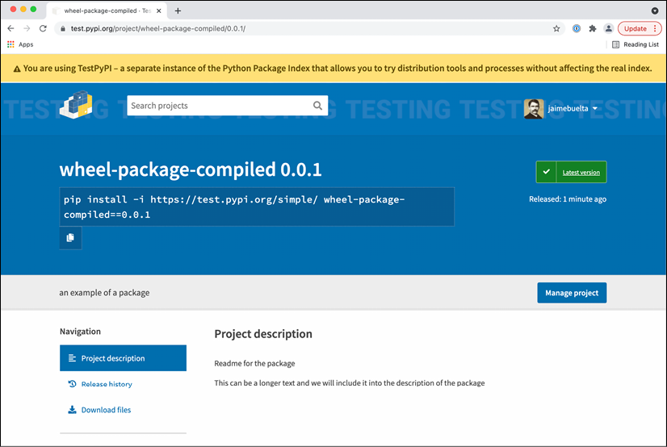

# 包管理

在复杂系统中工作时，尤其是在微服务或类似架构中，有时需要共享代码，以便在系统的不同、未连接的部分可用。这通常是有助于抽象一些功能的代码，这些功能可能会有很大差异，从安全目的（例如，以必须验证它的其他系统理解的方式计算签名），到连接到数据库或外部 API，甚至帮助持续监控系统。

我们可以多次重用相同的代码，以确保它经过适当的测试和验证，并且在整个系统中保持一致，而不是每次都重新发明轮子。一些模块可能很有趣，不仅可以在组织内共享，甚至可以在组织外部共享，创建其他人可以利用的标准模块。

其他人以前做过，很多常见的用例，例如连接现有数据库，使用网络资源，访问操作系统功能，理解各种格式的文件，计算各种领域的常用算法和公式，创建和操作 AI 模型，以及除此之外的一长串其他案例。

为了增强所有这些能力的共享和利用，现代编程语言都有自己的创建和共享包的方式，因此语言的有用性大大增加。

在本章中，我们将主要从 Python 的角度讨论包的使用，包括何时以及如何决定创建一个包。我们将探索可用的不同选项，从简单的结构到包含编译代码的包，以便可以针对特定任务进行优化。

在本章中，我们将介绍以下主题：

- 新包的创建
- Python中的简单打包
- Python 打包生态系统
- 创建一个包
- Cython
- 带有二进制代码的 Python 包
- 将你的包上传到 PyPI
- 创建自己的私有索引

让我们首先定义哪些代码可以作为创建包的候选者。

## 新包的创建

在任何软件中，都会有可以在代码的不同部分共享的代码片段。在处理小型的单体应用程序时，这可以像创建一些内部模块或函数一样简单，这些模块或函数可以通过直接调用来共享功能。

随着时间的推移，这个或多个公共功能可以在一个模块下组合在一起，以明确它们将在整个应用程序中使用。

> 避免将名称 ```utils``` 用于具有预期在不同位置使用的代码的模块的诱惑。虽然这很常见，但它也不是很具有描述性并且有点懒惰。有人如何知道函数是否在 ```utils``` 模块中？取而代之的是，尝试使用描述性名称。
>
> 如果不可能，请将其划分为子模块，以便你可以创建类似 ```utils.communication``` 或 ```utils.math``` 的内容来避免这种影响。

这将正常工作到一定的大小。随着代码的增长和变得更加复杂，可能出现的一些问题如下：

- 创建一个更通用的 API 来与模块交互，旨在在模块利用方面获得更大的灵活性。这可能涉及创建更具防御性的编程风格，以确保模块按预期使用并返回正确的错误。
- 需要为模块提供特定的文档，以便不熟悉模块的开发人员能够使用它。
- 可能需要澄清模块的所有权并指定其自己的维护者。这可以采取在更改代码之前进行更严格的代码审查的形式，指定一些开发人员或开发人员作为模块的联系人。
- 最关键的一个，模块的功能，需要存在于两个或多个独立的服务或代码库中。如果发生这种情况，与其只是在不同的代码库之间复制/粘贴代码，不如创建一个可以导入的独立模块。这可能是预先深思熟虑的选择，以标准化某些操作（例如，跨多个服务生成和验证签名消息），或者它可能是在一个代码库中成功实现功能后的事后想法，在其他代码库中可能很方便系统的服务。例如，检测发给你的通信消息会生成一个日志。此日志在其他服务中可能很有用，因此，它会从原始服务迁移到其他服务。

通常，模块开始获得自己的实体，而不仅仅是作为用于合并将要共享的代码的共享位置。那时，将其视为一个独立的库而不是附加到特定代码库的模块开始变得有意义。

一旦决定创建一些代码作为一个独立的包，应该考虑几个方面：

- 正如我们之前看到的，最重要的是新包的所有权。包存在于不同团队和组之间的边界中，因为它们被不同的团队使用。确保提供有关任何软件包的明确所有权，以确保可以联系到负责它的团队，无论是进行任何可能的查询还是设置自己的维护。
- 任何新包都需要时间来开发新功能和调整，尤其是在包正在使用时，可能会因为它用于多种服务和更多方式而扩大其限制。请务必考虑到这一点，并相应地调整负责团队的负荷。这将在很大程度上取决于软件包的成熟程度以及需要多少新功能。
- 同样，一定要预算时间来维护包。即使没有新功能，也会检测到错误，并且需要继续进行其他常规维护，例如根据安全修复或与新操作系统版本的兼容性来更新依赖项。

所有这些要素都应考虑在内。通常，建议创建某种路线图，负责的团队可以在其中定义目标是什么以及实现目标的时间框架。

> 最重要的是，一个新包就是一个新项目。你需要这样对待它。

我们将专注于在 Python 中创建一个新包，但是在使用其他语言创建其他包时，基础是相似的。

## Python中的简单打包

在 Python 中，只需在代码中添加一个子目录即可轻松创建要导入的包。虽然这很简单，但最初就足够了，因为可以复制子目录。例如，可以将代码直接添加到源代码控制系统中，甚至可以通过压缩代码并在原地解压缩来安装。

这不是一个长期的解决方案，因为它不会处理多个版本、依赖项等，但在某些情况下它可以作为第一步工作。至少在最初，所有要打包的代码都需要存储在同一个子目录中。

Python 中模块的代码结构可以计算为具有单个入口点的子目录。例如，当创建一个名为 naive_package 的模块时，其结构如下：

```
└── naive_package
    ├── __init__.py
    ├── module.py
    └── submodule
        ├── __init__.py
        └── submodule.py
```

我们可以看到该模块包含一个子模块，所以让我们从那里开始。 ```submodule``` 目录包含两个文件，包含代码的 submodule.py 文件和一个空的 ```__init__.py``` 文件以允许导入另一个文件，我们稍后会看到。

> ```__init__.py``` 是一个特殊的 Python 文件，表示该目录包含 Python 代码，可以外部导入。它象征着目录本身，我们稍后会看到。

```submodule.py``` 的内容就是这个示例函数：

```python
def subfunction():
    return 'calling subfunction'
```

顶层是模块本身。我们有 ```module.py``` 文件，它定义了调用子模块的 ```some_function``` 函数：

```python
from .submodule.submodule import subfunction
def some_function():
    result = subfunction()
    return f'some function {result}'
```

```import```行有一个详细信息，即位于同一目录中的子模块形式的点。这是 Python 3 中的特定语法，用于在导入时更精确。如果没有点，它将尝试从库中导入。

> 你可以在此处了解有关 PEP-328 中相对导入的更多信息，其中描述了它：https://www.python.org/dev/peps/pep-0328/。 PEP（Python 增强提案）是描述与 Python 语言相关的新功能或与社区相关的信息的文档。它是提出更改和推进语言的官方渠道。

函数的其余部分调用 ```subfunction``` 并组合结果以返回一串文本。

在这种情况下，```__init__.py``` 文件不是空的，而是导入了 ```some_function``` 函数：

```python
from .module import some_function
```


再次注意前面的点所示的相对导入。这允许将 ```some_function``` 函数作为 ```naive_package``` 模块顶层的一部分。

我们现在可以创建一个文件来调用该模块。我们将编写 ```call_naive_package.py``` 文件，该文件需要与 ```native_package``` 目录处于同一级别：

```python
from naive_package import some_function
print(some_function())
```

该文件只调用模块定义的函数并打印结果：

```sh
$ python3 call_naive_package.py
some function calling subfunction
```

不推荐这种处理要共享的模块的方法，但是这个小模块可以帮助我们了解如何创建包以及模块的结构是什么。分离模块并创建独立包的第一步将是创建一个具有清晰 API 的子目录，包括使用它的清晰入口点。

但是为了获得更好的解决方案，我们需要能够从那里创建一个完整的 Python 包。让我们来看看这到底是什么意思。

## Python 打包生态系统

Python 拥有一个非常活跃的第三方开源包生态系统，涵盖了广泛的主题，并且可以增强任何 Python 程序的功能。你可以使用 pip 来安装它们，它会为任何新的 Python 安装自动安装。

例如，要安装名为 requests 的包，该包允许编译更简单和更强大的 HTTP 请求，命令是：

```sh
$ pip3 install requests
```

```pip``` 自动在 Python 包索引中搜索以查看包是否可用，如果可用，它将下载并安装它。

> 请注意，pip 命令可以采用 pip3 的形式。这取决于系统中 Python 的安装。我们将模糊地使用它们。

我们将在本章后面看到更详细的 pip 用法，但首先，我们需要讨论下载包的主要来源。

### PyPI

Python 包索引（PyPI，通常发音为 Pie-P-I，而不是 Pie-Pie）是 Python 中包的官方来源，可以在 https://pypi.org 上查看：


图 11.1：pypi.org 主页

在 PyPI 网页上，搜索可以找到特定的包以及有用的信息，包括部分匹配的可用包。它们也可以被过滤。


图 11.2：搜索包

一旦指定了单个包，就可以找到有关简短文档、指向项目源和主页的链接以及其他类似类型的许可证或维护者的更多信息。

> 主页和文档页面对于大型软件包非常重要，因为它们将包含有关如何使用该软件包的更多信息。较小的软件包通常只包含此页面上的文档，但始终值得检查其页面的源代码，因为它可能链接到 GitHub 页面，其中包含有关错误的详细信息以及提交补丁或报告的可能性。

在编写本书时，```requests```如下所示：


图 11.3：关于模块的详细信息

直接在 PyPI 中搜索可以帮助定位一些有趣的模块，并且在某些情况下会非常简单，例如找到连接到数据库的模块（例如，通过数据库名称搜索）。但是，这通常涉及大量的试验和错误，因为名称可能并不表示模块对你的用例有多好。

花一些时间在互联网上为用例搜索最佳模块是一个好主意，它将提高为你的用例找到正确包的机会。

> 在这种情况下，一个重要的知识来源是 StackOverflow (https://stackoverflow.com/)，其中包含许多可用于确定有趣模块的问题和答案。一般的谷歌搜索也会有所帮助。

无论如何，鉴于 Python 可用包的数量、质量和成熟度各不相同，留出一些时间来研究替代方案总是值得的。

```pypi.org``` 不会以任何方式管理包，因为任何人都可以公开提交他们的包，尽管恶意包将被消除。一个包有多受欢迎，需要更多间接的方法，比如搜索下载量或通过搜索器在线搜索以查看其他项目是否在使用它。最终，需要执行一些概念验证程序来分析候选包是否涵盖所有必需的功能。

### 虚拟环境

打包链中的下一个元素是创建虚拟环境以隔离模块的安装。

在处理安装包时，使用系统中的默认环境会导致将包安装在那里。这意味着 Python 解释器的一般安装将受此影响。

这可能会导致问题，因为在将 Python 解释器用于其他目的时，你可能会安装具有副作用的包，因为包中的依赖项可能会相互干扰。

例如，如果同一台机器有一个需要 package1 包的 Python 程序和另一个需要 package2 的 Python 程序，并且它们都不兼容，则会产生冲突。无法同时安装 package1 和 package2。

> 请注意，这也可能通过版本不兼容发生，特别是在包的依赖项中，或者在依赖项的依赖项中。例如，```package1``` 需要安装依赖版本 5，而 ```package2``` 需要安装依赖版本 6 或更高版本。他们将无法与彼此一起运行。

这个问题的解决方案是创建两个不同的环境，因此每个包及其依赖项都是独立存储的——彼此独立，但也独立于系统 Python 解释器，因此不会影响任何可能依赖于Python 系统解释器。

要创建一个新的虚拟环境，你可以使用标准模块 venv，它包含在 Python 3 3.3 之后的所有安装中：

```sh
$ python3 -m venv venv
```

这将创建 ```venv``` 子目录，其中包含虚拟环境。可以使用以下```source```命令激活环境：

> 请注意，我们为创建的虚拟环境使用了一个名称 ```venv```，它与模块的名称相同。那没有必要。可以使用任何名称创建虚拟环境。请务必使用在你的用例中具有描述性的名称。

```sh
$ source ./venv/bin/activate
(venv) $ which python
./venv/bin/python
(venv) $ which pip
./venv/bin/python
```

你可以看到被执行的```python```解释器和```pip```是位于虚拟环境中的，而不是系统中的，并且提示中还指示虚拟环境venv处于活动状态。

虚拟环境也有自己的库，所以任何安装的包都会存放在这里，而不是系统环境中。

> 可以通过调用 ```deactivate``` 命令来停用虚拟环境。你可以看到 ```(venv)``` 指示消失了。

一旦进入虚拟环境，任何对 ```pip``` 的调用都会在虚拟环境中安装包，因此它们独立于任何其他环境。然后每个程序都可以在其自己的虚拟环境中执行。

> 在虚拟环境无法直接通过命令行激活，需要直接执行命令的情况下，例如```cronjob```的情况，可以直接在虚拟环境中通过其全路径调用```python```解释器，如```/path /to/venv/python/your_script.py```。

在合适的环境下，我们可以使用 pip 来安装不同的依赖项。

### 准备环境

创建虚拟环境是第一步，但我们需要为我们的软件安装所有依赖项。

为了能够在所有情况下复制环境，最好的方法是创建一个定义应安装的所有依赖项的需求文件。 ```pip``` 允许使用通常称为 ```requirements.txt``` 的文件来安装依赖项。

这是创建可复制环境的绝佳方式，必要时可以从头开始。

例如，我们看一下下面的 ```requirements.txt``` 文件：

```sh
requests==2.26.0
pint==0.17
```

该文件可以从 GitHub 下载，网址为 https://github.com/PacktPublishing/Python-Architecture-Patterns/blob/main/chapter_11_package_management/requirements.txt。

> 注意格式是```package==version```。这指定了要用于包的确切版本，这是安装依赖项的推荐方式。这避免了仅使用```package```的问题，该```package```将安装最新版本，并且可能导致未计划的升级，这可能会破坏兼容性。
>
> 可以使用其他选项（例如 ```package>=version```）来指定最低版本。

该文件可以使用以下命令安装在虚拟环境中（记得激活它）：

```sh
(venv) $ pip install -r requirements.txt
```

之后，所有指定的需求都将安装在环境中。

请注意，你指定的依赖项的依赖项可能不会完全固定到特定版本。这是因为依赖项有自己的定义，在交付新包时会产生对二级依赖项的未知升级。

为避免出现该问题，你可以使用第一级依赖项创建初始安装，然后使用 ```pip freeze``` 命令获取已安装的所有依赖项：

```sh
(venv) $ pip freeze
certifi==2021.5.30
chardet==3.0.4
charset-normalizer==2.0.4
idna==2.10
packaging==21.0
Pint==0.17
pyparsing==2.4.7
requests==2.26.0
urllib3==1.26.6
```

你可以使用输出直接更新 requirements.txt，因此下一次安装将同时固定所有二级依赖项。

> 请注意，添加新需求将需要生成相同的过程，首先安装，然后运行冻结，然后使用输出更新 requirements.txt 文件。

#### 关于容器的说明

当以容器方式工作时，系统解释器和程序解释器之间的区别更加淡化，因为容器封装了自己的操作系统，从而实现了强分离。

在部署服务的传统方式中，它们安装并运行在同一台服务器中，由于我们之前谈到的限制，因此有必要在解释器之间保持分离。

通过使用容器，我们已经为每个服务创建了一个封装到它们自己的操作系统文件系统中，这意味着我们可以跳过虚拟环境的创建。在这种情况下，容器充当虚拟环境，强制不同容器之间的分离。

正如我们之前在第 8 章“高级事件驱动结构”中讨论的那样，在谈到容器时，每个容器应该只服务一个服务，协调不同的容器以生成不同的服务器。这样，它消除了必须共享同一个解释器的情况。

这意味着我们可以放宽我们通常在传统环境中施加的一些限制，并且只关心一个环境，而能够更少关心污染系统环境。只有一个环境，所以我们可以更自由地玩它。如果我们需要更多的服务或环境，我们总是可以创建更多的容器。

### Python 包

可以使用的 Python 模块本质上是一个包含特定 Python 代码的子目录。这个子目录安装在适当的库子目录中，解释器在这个子目录中搜索。该目录称为```site-packages```。

> 这个子目录在虚拟环境中是可用的，如果你正在使用的话。你可以检查以下子目录：```venv/lib/python3.9/site-packages/```。

为了分发它，子目录被打包成两个不同的文件，一个是 ```Egg``` 文件，一个是 ```Wheel``` 文件。但重要的是，```pip``` 只能安装 ```Wheel``` 文件。

> 也可以创建源包。在这种情况下，该文件是一个包含所有代码的 tar 文件。

```Egg``` 文件被认为已弃用，因为它们的格式较旧，并且基本上是包含一些元数据的压缩文件。```Wheel```有几个优点：

- 它们被更好地定义并允许更多用例。有一个特定的 PEP，PEP-427 (https://www.python.org/dev/peps/pep-0427/)，它定义了格式。 ```Egg``` 文件从未被正式定义。
- 它们可以被定义为具有更好的兼容性，允许创建在不同版本的 Python 之间兼容的 ```Wheel``` 文件，包括 ```Python 2``` 和 ```Python 3```。
- ```Wheel``` 文件可以包含已编译的二进制代码。 Python 允许包含用 C 编写的库，但这些库需要针对正确的硬件架构。在 ```Egg``` 文件中，源文件是在安装时包含并编译的，但这需要安装机器中有适当的编译工具和环境，这很容易导致编译问题。
- 取而代之的是，```Wheel``` 文件可以使用二进制文件进行预编译。 ```Wheel``` 文件具有更好的基于硬件架构和操作系统定义的兼容性，因此将下载并安装正确的 ```Wheel``` 文件（如果可用）。这使得安装速度更快，因为在安装过程中不需要执行编译，并且不需要目标机器中可用的编译工具。也可以创建带有源文件的 ```Wheel``` 文件，以允许将其安装在尚未预编译的机器上，但在这种情况下，它将需要编译器。
- ```Wheel``` 文件可以加密签名，而 ```Eggs``` 不支持此选项。这增加了一个额外的层，以避免受损和修改包。

目前，在 Python 中打包的标准是 ```Wheel``` 文件，一般来说应该首选它们。 ```Egg``` 文件应仅限于尚未升级到新格式的旧软件包。

> ```Egg``` 文件可以使用较旧的 ```easy_install``` 脚本安装，尽管最新版本的 ```Python``` 中不再包含该脚本。查看有关如何使用 ```easy_install``` 的安装工具文档：https://setuptools.readthedocs.io/en/latest/deprecated/easy_install.html。

我们现在将看到如何创建自己的包。

## 创建一个包

即使在大多数情况下，我们将使用第三方包，在某些时候，你也可能需要创建自己的包。

为此，你需要创建一个 ```setup.py``` 文件，它是包的基础，描述其中的内容。基本包代码如下所示：

```
package
├── LICENSE
├── README
├── setup.py
└── src
    └─── <source code>
```

```LICENSE``` 和 ```README``` 文件不是强制性的，但可以很好地包含以添加有关包的信息。```LICENSE```将自动包含在包中。

>选择自己的开源许可证可能很困难。你可以使用网络 (https://choosealicense.com/)，其中显示了不同的选项并对其进行了解释。我们将使用 MIT 许可证作为示例。

```README``` 文件不包括在内，但作为构建过程的一部分，我们会将其内容包含在包的完整描述中，我们将在后面看到。

该过程的代码是 ```setup.py ```文件。我们来看一个例子：

```python
import setuptools
with open('README') as readme:
    description = readme.read()
setuptools.setup(
    name='wheel-package',
    version='0.0.1',
    author='you',
    author_email='me@you.com',
    description='an example of a package',
    url='http://site.com',
    long_description=description,
    classifiers=[
        'Programming Language :: Python :: 3',
        'Operating System :: OS Independent',
        'License :: OSI Approved :: MIT License',
    ],
    package_dir={'': 'src'},
    install_requires=[
        'requests',
    ],
    packages=setuptools.find_packages(where='src'),
    python_requires='>=3.9',
)
```

```setup.py``` 文件本质上包含 ```setuptools.setup``` 函数，它定义了包。它定义了以下内容：

- ```name```：包的名称。
- ```version```：包的版本。它将在安装特定版本或确定哪个是最新版本时使用。
- ```author``` 和 ```author_email```：最好包含这些以接收任何可能的错误报告或请求。
- ```description```：简短的描述。
- ```url```：项目的 URL。
- ```long_description```：更长的描述。在这里，我们正在读取 ```README``` 文件，将内容存储在```description```中：
  
    ```python
    with open('README') as readme:
        description = readme.read()
    ```
    ```setup.py``` 的一个重要细节是它是动态的，因此我们可以使用代码来确定任何参数的值。
- ```classifier```：允许在不同领域对包进行分类的类别，例如许可证和语言的种类，或者该包是否应该与 Django 等框架一起使用。你可以在以下链接中查看分类器的完整列表：https://pypi.org/classifiers/。
- ```package_dir```：包的代码所在的子目录。在这里，我们指定 src。默认情况下，它会使用与 setup.py 相同的目录，但最好进行分区以保持代码整洁。
- ```install_requires```：需要与你的软件包一起安装的任何依赖项。在这里，我们以添加请求为例。请注意，还将安装任何二阶依赖项（请求的依赖项）。
- ```packages```：使用 ```setuptools.find_packages``` 函数，包含 src 目录中的所有内容。
- ```python_requires```：定义哪些 Python 解释器与包兼容。在这种情况下，我们为 Python 3.9 或更高版本定义它。

文件准备好后，你可以直接运行 ```setup.py``` 脚本，例如，检查数据是否正确：

```sh
$ python setup.py check
running check
```

此命令将验证 ```setup.py``` 定义是否正确以及是否缺少任何必需元素。

### 开发模式

```setup.py``` 文件可用于在开发模式下安装包。这会以链接的方式将包安装在当前环境中。这意味着在解释器重新启动后，对代码的任何更改都将直接应用于包，从而易于更改和使用测试。请记住在虚拟环境中运行它：

```sh
(venv) $ python setup.py develop
running develop
running egg_info
writing src/wheel_package.egg-info/PKG-INFO
writing dependency_links to src/wheel_package.egg-info/dependency_links.txt
writing requirements to src/wheel_package.egg-info/requires.txt
writing top-level names to src/wheel_package.egg-info/top_level.txt
reading manifest file 'src/wheel_package.egg-info/SOURCES.txt'
adding license file 'LICENSE'
...
Using venv/lib/python3.9/site-packages
Finished processing dependencies for wheel-package==0.0.1
```

开发版可以轻松卸载，清理环境：

```sh
(venv) $ python setup.py develop --uninstall
running develop
Removing  /venv/lib/python3.9/site-packages/wheel-package.egg-link (link to src)
Removing wheel-package 0.0.1 from easy-install.pth file
```

你可以在此处的官方文档中阅读有关开发模式的更多信息：https://setuptools.readthedocs.io/en/latest/userguide/development_mode.html。

此步骤直接在当前环境中安装包，并可用于运行测试并验证包在安装后是否按预期工作。一旦完成，我们就可以准备包本身。

### 纯Python包

要创建一个包，我们首先需要定义我们想要创建什么样的包。如前所述，我们有三个选项：源分发、```Egg``` 或 ```Wheel```。每个都由 ```setup.py``` 中的不同命令定义。

要创建源代码分发，我们将使用 ```sdist```（源代码分发）：

```sh
$ python setup.py sdist
running sdist
running egg_info
writing src/wheel_package.egg-info/PKG-INFO
writing dependency_links to src/wheel_package.egg-info/dependency_links.txt
writing requirements to src/wheel_package.egg-info/requires.txt
writing top-level names to src/wheel_package.egg-info/top_level.txt
reading manifest file 'src/wheel_package.egg-info/SOURCES.txt'
adding license file 'LICENSE'
writing manifest file 'src/wheel_package.egg-info/SOURCES.txt'
running check
creating wheel-package-0.0.1
creating wheel-package-0.0.1/src
creating wheel-package-0.0.1/src/submodule
creating wheel-package-0.0.1/src/wheel_package.egg-info
copying files to wheel-package-0.0.1...
copying LICENSE -> wheel-package-0.0.1
copying README.md -> wheel-package-0.0.1
copying setup.py -> wheel-package-0.0.1
copying src/submodule/__init__.py -> wheel-package-0.0.1/src/submodule
copying src/submodule/submodule.py -> wheel-package-0.0.1/src/submodule
copying src/wheel_package.egg-info/PKG-INFO -> wheel-package-0.0.1/src/wheel_package.egg-info
copying src/wheel_package.egg-info/SOURCES.txt -> wheel-package-0.0.1/src/wheel_package.egg-info
copying src/wheel_package.egg-info/dependency_links.txt -> wheel-package-0.0.1/src/wheel_package.egg-info
copying src/wheel_package.egg-info/requires.txt -> wheel-package-0.0.1/src/wheel_package.egg-info
copying src/wheel_package.egg-info/top_level.txt -> wheel-package-0.0.1/src/wheel_package.egg-info
Writing wheel-package-0.0.1/setup.cfg
creating dist
Creating tar archive
removing 'wheel-package-0.0.1' (and everything under it)
```

```dist``` 包在新创建的 ```dist``` 子目录中可用：

```sh
$ ls dist
wheel-package-0.0.1.tar.gz
```

要生成合适的 ```Wheel``` 包，我们需要先安装 ```wheel``` 模块：

```sh
$ pip install wheel
Collecting wheel
  Using cached wheel-0.37.0-py2.py3-none-any.whl (35 kB)
Installing collected packages: wheel
Successfully installed wheel-0.37.0
```

这会将 ```bdist_wheel``` 命令添加到 ```setup.py``` 中的可用命令中，从而生成一个轮子：

```sh
$ python setup.py bdist_wheel
running bdist_wheel
running build
running build_py
installing to build/bdist.macosx-11-x86_64/wheel
...
adding 'wheel_package-0.0.1.dist-info/LICENSE'
adding 'wheel_package-0.0.1.dist-info/METADATA'
adding 'wheel_package-0.0.1.dist-info/WHEEL'
adding 'wheel_package-0.0.1.dist-info/top_level.txt'
adding 'wheel_package-0.0.1.dist-info/RECORD'
removing build/bdist.macosx-11-x86_64/wheel
```

```wheel```在 ```dist``` 子目录中再次可用：

```sh
$ ls dist
wheel_package-0.0.1-py3-none-any.whl
```

请注意，它还包括 Python 版本 3。

> 可以使用兼容 Python 2 和 Python 3 的 Wheel 包。这些轮子被称为通用。这在两个版本之间进行转换时很有用。希望到目前为止，Python 中的大多数新代码都使用版本 3，我们不必担心这一点。

所有这些创建的包都可以直接使用 pip 安装：

```sh
$ pip install dist/wheel-package-0.0.1.tar.gz
Processing ./dist/wheel-package-0.0.1.tar.gz
... 
Successfully built wheel-package
Installing collected packages: wheel-package
Successfully installed wheel-package-0.0.
$ pip uninstall wheel-package
Found existing installation: wheel-package 0.0.1
Uninstalling wheel-package-0.0.1:
  Would remove:
    venv/lib/python3.9/site-packages/submodule/*
    venv/lib/python3.9/site-packages/wheel_package-0.0.1.dist-info/*
Proceed (Y/n)? y
  Successfully uninstalled wheel-package-0.0.1
$ pip install dist/wheel_package-0.0.1-py3-none-any.whl
Processing ./dist/wheel_package-0.0.1-py3-none-any.whl
Collecting requests
  Using cached requests-2.26.0-py2.py3-none-any.whl (62 kB)
...
Collecting urllib3<1.27,>=1.21.1
  Using cached urllib3-1.26.6-py2.py3-none-any.whl (138 kB)
...
Installing collected packages: wheel-package
Successfully installed wheel-package-0.0.
```

请注意，依赖项（在本例中为```requests```）以及任何二级依赖项（例如 ```urllib3```）都会自动安装。

打包的威力不仅仅适用于只包含 ```Python``` 代码的包。 ```Wheels``` 最有趣的功能之一是生成预编译包的能力，其中包括为目标系统编译的代码。

为了能够证明这一点，我们需要生成一些 Python 模块，其中包含将要编译的代码。为此，我们需要绕道而行。

## Cython

Python 能够创建编译并与 Python 代码交互的 C 和 C++ 语言扩展。 Python 本身是用 C 编写的，所以这是一个自然的扩展。

虽然 Python 有很多很棒的特性，但在执行某些运算（例如数值运算）时，纯粹的速度并不是它的强项。这就是 C 扩展发挥作用的地方，因为它们可以访问低级代码，这些代码可以被优化并且比 Python 运行得更快。不要低估创建一个小型的、本地化的 C 扩展来加速代码关键部分的可能性。

但是，创建 C 扩展可能很困难。 Python 和 C 之间的接口并不简单，而且 C 中所需的内存管理可能令人生畏，除非你具有使用 C 语言的丰富经验。

> 如果你想深入了解该主题并创建自己的 C/C++ 扩展，可以从阅读 https://docs.python.org/3/extending/index.html 的官方文档开始。
>
> 其他选项可用，例如在 Rust 中创建扩展。你可以在以下文章中查看如何执行此操作：https://developers.redhat.com/blog/2017/11/16/speed-python-using-rust。

幸运的是，有一些替代方法可以使任务更容易。一个非常好的是 Cython。

Cython 是一个用 C 语言编译带有一些扩展的 Python 代码的工具，因此编写 C 扩展就像编写 Python 代码一样简单。代码被注释以描述变量的 C 类型，但除此之外，它看起来非常相似。

> Cython 及其所有可能性的完整描述超出了本书的范围。我们只做一个简单的介绍。请查看完整的文档以获取更多信息：https://cython.org/。

Cython 文件存储为 ```.pyx``` 文件。让我们看一个例子，它将在 ```wheel_package_compiled.pyx``` 文件的帮助下确定一个数字是否为质数：

```python
def check_if_prime(unsigned int number):
    cdef int counter = 2
    if number == 0:
        return False
    while counter < number:
        if number % counter ==  0:
            return False
        counter += 1
    return True
```

该代码正在检查正数是否为质数：

- 如果输入为零，则返回 ```False```。
- 它试图将数字除以从 2 到数字的数字。如果任何除法是精确的，则返回 ```False```，因为该数字不是质数。
- 如果没有精确的除法，或者数字小于 2，则返回 ```True```。

代码并不完全是 Pythonic，因为它将被翻译成 C。避免 Python 调用（如 range 或类似调用）更有效。不要害怕测试不同的方法，看看哪些方法执行起来更快。

> 代码不是特别好；它总体上尝试了太多的划分。它只是为了展示可能对编译有意义且不太复杂的示例代码。

一旦 ```pyx``` 文件准备就绪，就可以使用 ```Cython``` 将其编译并导入 ```Python```。首先，我们需要安装 ```Cython```：

```sh
$ pip install cython
Collecting cython
  Using cached Cython-0.29.24-cp39-cp39-macosx_10_9_x86_64.whl (1.9 MB)
Installing collected packages: cython
Successfully installed cython-0.29.24
```

现在，使用 ```pyximport```，我们可以像 py 文件一样直接导入模块。如有必要，Cython 会自动编译它：

```python
>>> import pyximport
>>> pyximport.install()
(None, <pyximport.pyximport.PyxImporter object at 0x10684a190>)
>>> import wheel_package_compiled
venv/lib/python3.9/site-packages/Cython/Compiler/Main.py:369: FutureWarning: Cython directive 'language_level' not set, using 2 for now (Py2). This will change in a later release! File: wheel_package_compiled.pyx
  tree = Parsing.p_module(s, pxd, full_module_name)
.pyxbld/temp.macosx-11-x86_64-3.9/pyrex/wheel_package_compiled.c:1149:35: warning: comparison of integers of different signs: 'int' and 'unsigned int' [-Wsign-compare]
    __pyx_t_1 = ((__pyx_v_counter < __pyx_v_number) != 0);
                  ~~~~~~~~~~~~~~~ ^ ~~~~~~~~~~~~~~
1 warning generated.
>>> wheel_package_compiled.check_if_prime(5)
   True
```

你可以看到编译器产生了错误，因为 ```unsigned int``` 和 ```int``` 之间（计数器和数字之间）存在比较。

> 这是故意留下来清楚地显示编译发生的时间以及任何编译反馈，例如警告或错误，将被显示。

编译代码后，Cython 会创建目录本地的 ```wheel_package_compiled.c``` 文件和已编译的 ```.so``` 文件，默认情况下，该文件存储在 ```$HOME/.pyxbld``` 中：

> 请注意，这将特定于你的系统。在这里，我们展示了一个为 macOS 编译的模块。

```python
$ ls ~/.pyxbld/lib.macosx-11-x86_64-3.9/
wheel_package_compiled.cpython-39-darwin.so
```

使用 ```pyximport``` 对本地开发很有好处，但是我们可以创建一个包来编译和打包它作为构建过程的一部分。

## 带有二进制代码的 Python 包

我们将使用我们使用 Cython 创建的代码来展示如何构建一个将 Python 代码与预编译代码相结合的包。我们将生成一个 Wheel 文件。

我们创建了一个名为 ```wheel_package_compiled``` 的包，它扩展了前面的示例包 ```wheel_package```，并提供了要在 Cython 中编译的代码。

> 该代码可在 GitHub 上的 https://github.com/PacktPublishing/Python-Architecture-Patterns/tree/main/chapter_11_package_management/wheel_package_compiled 获得。

包的结构将是这样的：

```
wheel_package_compiled
    ├── LICENSE
    ├── README
    ├── src
    │   ├── __init__.py
    │   ├── submodule
    │   │   ├── __init__.py
    │   │   └── submodule.py
    │   ├── wheel_package.py
    │   └── wheel_package_compiled.pyx
    └── setup.py
```

这与之前介绍的包相同，但增加了 ```.pyx``` 文件。 ```setup.py``` 文件需要添加一些更改：

```sh
import setuptools
from Cython.Build import cythonize
from distutils.extension import Exteldnsion
extensions = [
    Extension("wheel_package_compiled", ["src/wheel_package_compiled.pyx"]),
]
with open('README') as readme:
    description = readme.read()
setuptools.setup(
    name='wheel-package-compiled',
    version='0.0.1',
    author='you',
    author_email='me@you.com',
    description='an example of a package',
    url='http://site.com',
    long_description=description,
    classifiers=[
        'Programming Language :: Python :: 3',
        'Operating System :: OS Independent',
        'License :: OSI Approved :: MIT License',
    ],
    package_dir={'': 'src'},
    install_requires=[
        'requests',
    ],
    ext_modules=cythonize(extensions),
    packages=setuptools.find_packages(where='src'),
    python_requires='>=3.9',
)
```

引入的更改，除了包的```名称```更改外，都与新扩展有关：

```python
from Cython.Build import cythonize
from distutils.extension import Extension
extensions = [
    Extension("wheel_package_compiled", ["src/wheel_package_compiled.pyx"]),
]
...
ext_modules=cythonize(extensions),
```

扩展定义以要添加的模块的名称和源的位置为目标。使用 ```cythonize``` 函数，我们表明我们想使用 ```Cython``` 来编译它。

> 扩展模块是用 C/C++ 编译的模块。在这种情况下，Cython 将运行中间步骤以确保正确的 .c 文件是正在编译的文件。

配置完成后，我们可以运行代码来生成```wheel```，调用 ```setup.py```：

```python
$ python setup.py bdist_wheel
Compiling src/wheel_package_compiled.pyx because it changed.
[1/1] Cythonizing src/wheel_package_compiled.pyx
...
running bdist_wheel
running build
running build_py
...
creating 'dist/wheel_package_compiled-0.0.1-cp39-cp39-macosx_11_0_x86_64.whl' and adding 'build/bdist.macosx-11-x86_64/wheel' to it
adding 'wheel_package_compiled.cpython-39-darwin.so'
adding 'submodule/__init__.py'
adding 'submodule/submodule.py'
adding 'wheel_package_compiled-0.0.1.dist-info/LICENSE'
adding 'wheel_package_compiled-0.0.1.dist-info/METADATA'
adding 'wheel_package_compiled-0.0.1.dist-info/WHEEL'
adding 'wheel_package_compiled-0.0.1.dist-info/top_level.txt'
adding 'wheel_package_compiled-0.0.1.dist-info/RECORD'
removing build/bdist.macosx-11-x86_64/wheel
```

和以前一样，编译后的 ```Wheel``` 在 ```dist``` 子目录中可用。

```sh
$ ls dist
wheel_package_compiled-0.0.1-cp39-cp39-macosx_11_0_x86_64.whl
```


与之前创建的 ```Wheel``` 相比，我们可以看到它增加了平台和硬件架构（macOS 11 和 x86 64 位，这是编写本书时用来编译它的计算机）。 ```cp39``` 部分显示它使用了 Python 3.9 ABI（应用程序二进制接口）。

创建的 ```Wheel``` 可以用于相同的架构和系统。 ```Wheel``` 包直接包含所有编译后的代码，因此安装速度很快，只涉及复制文件。此外，无需安装编译工具和依赖项。

当使用需要安装在多个架构或系统中的包时，你需要为每个案例创建一个单独的 ```Wheel``` 并添加源分发文件以允许其他系统使用它。

但是，除非你创建一个提交给 PyPI 的通用包，否则该包将用于自用，通常你只需要为你的特定用例创建一个 ```Wheel``` 文件。

这导致相同的步骤。如果你想与整个 Python 社区共享你的模块怎么办？

## 将你的包上传到 PyPI

PyPI 开放接受来自任何开发者的包。我们可以创建一个新帐户并将我们的包上传到官方 Python 存储库以允许任何项目使用它。

> 开源项目（如 Python 及其生态系统）的一大特点是能够使用由其他开发人员优雅共享的代码。虽然不是强制性的，但回馈和分享其他开发人员可能感兴趣的代码以提高 Python 库的实用性总是好的。
>
> 成为 Python 生态系统的优秀参与者，并分享可能对其他人有用的代码。

为了帮助进行测试并确保我们可以验证该过程，在 https://test.pypi.org/ 上有一个名为 TestPyPI 的测试站点，可用于执行测试并首先上传你的包。


图 11.4：TestPyPI 主页

该站点与生产站点相同，但用横幅表示它是测试站点。

你可以在 https://test.pypi.org/account/register/ 注册新用户。之后，你需要创建一个新的 API 令牌以允许上传包。

> 请记住验证你的电子邮件。如果没有经过验证的电子邮件，你将无法创建 API 令牌。

如果 API 令牌有问题或丢失，你可以随时将其删除并重新开始。


图 11.5：你需要授予完整范围才能上传新包

创建一个新令牌并将其复制到安全的地方。出于安全原因，令牌（以 pypi- 开头）只会显示一次，所以要小心。

> 上传包时，令牌会替换登录名和密码。我们稍后会看到如何使用它。

下一步是安装 ```twine``` 包，它简化了上传的过程。请务必将其安装在我们的虚拟环境中：

```sh
(venv) $ pip install twine
Collecting twine
  Downloading twine-3.4.2-py3-none-any.whl (34 kB)
...
Installing collected packages: zipp, webencodings, six, Pygments, importlib-metadata, docutils, bleach, tqdm, rfc3986, requests-toolbelt, readme-renderer, pkginfo, keyring, colorama, twine
Successfully installed Pygments-2.10.0 bleach-4.1.0 colorama-0.4.4 docutils-0.17.1 importlib-metadata-4.8.1 keyring-23.2.0 pkginfo-1.7.1 readme-renderer-29.0 requests-toolbelt-0.9.1 rfc3986-1.5.0 six-1.16.0 tqdm-4.62.2 twine-3.4.2 webencodings-0.5.1 zipp-3.5.0
```

现在我们可以上传在 dist 子目录中创建的包。

>对于我们的示例，我们将使用之前创建的相同包，但请记住，尝试重新上传它可能无法正常工作，因为在 TestPyPI 中可能已经有一个名为该包的包。 TestPyPI 不是永久性的，会定期删除包，但作为本书写作过程的一部分上传的示例仍然存在。要进行测试，请创建你自己的具有唯一名称的包。

我们现在已经构建了编译后的 ```Wheel``` 和源代码分发：

```sh
(venv) $ ls dist
wheel-package-compiled-0.0.1.tar.gz
wheel_package_compiled-0.0.1-cp39-cp39-macosx_11_0_x86_64.whl
```

让我们上传包。我们需要表明我们要上传到 ```testpy``` 存储库。我们将使用 ```__token__``` 作为用户名，使用完整的令牌（包括 ```pypi-``` 前缀）作为密码：

```sh
(venv) $ python -m twine upload --repository testpypi dist/*
Uploading distributions to https://test.pypi.org/legacy/
Enter your username: __token__
Enter your password:
Uploading wheel_package_compiled-0.0.1-cp39-cp39-macosx_11_0_x86_64.whl
100%|███████████████████████████████████████████████████████████████████████| 12.6k/12.6k [00:01<00:00, 7.41kB/s]
Uploading wheel-package-compiled-0.0.1.tar.gz
100%|███████████████████████████████████████████████████████████████████████| 24.0k/24.0k [00:00<00:00, 24.6kB/s]
View at:
https://test.pypi.org/project/wheel-package-compiled/0.0.1/
```

包现已上传！我们可以查看 TestPyPI 网站上的页面。



图 11.6：包的主页

你可以通过单击下载文件来验证上传的文件：


图 11.7：验证上传的文件

你还可以通过搜索功能访问文件：


图 11.8：搜索中可用的包

现在可以直接通过 ```pip``` 下载包了，但是需要指明要使用的索引是 ```TestPyPI``` 的。为确保干净安装，请创建一个新的虚拟环境，如下所示：

```sh
$ python3 -m venv venv2
$ source ./venv2/bin/activate
(venv2) $ pip install --index-url https://test.pypi.org/simple/ wheel-package-compiled
Looking in indexes: https://test.pypi.org/simple/
Collecting wheel-package-compiled
  Downloading https://test-files.pythonhosted.org/packages/87/c3/881298cdc8eb6ad23456784c80d585b5872581d6ceda6da3dfe3bdcaa7ed/wheel_package_compiled-0.0.1-cp39-cp39-macosx_11_0_x86_64.whl (9.6 kB)
Collecting requests
  Downloading https://test-files.pythonhosted.org/packages/6d/00/8ed1b6ea43b10bfe28d08e6af29fd6aa5d8dab5e45ead9394a6268a2d2ec/requests-2.5.4.1-py2.py3-none-any.whl (468 kB)
     |████████████████████████████████| 468 kB 634 kB/s
Installing collected packages: requests, wheel-package-compiled
Successfully installed requests-2.5.4.1 wheel-package-compiled-0.0.1
```

请注意，下载的版本是 ```Wheel one```，因为它是编译版本的正确目标。它还正确下载了指定的请求依赖项。

你现在可以通过 ```Python``` 解释器测试包：

```sh
(venv2) $ python
Python 3.9.6 (default, Jun 29 2021, 05:25:02)
[Clang 12.0.5 (clang-1205.0.22.9)] on darwin
Type "help", "copyright", "credits" or "license" for more information.
>>> import wheel_package_compiled
>>> wheel_package_compiled.check_if_prime(5)
True
```

该软件包现已安装并可以使用。下一步是将此包上传到生产 PyPI 而不是 TestPyPI。这与我们在这里看到的过程完全相似，在 PyPI 中创建一个帐户并从那里开始。

但是，如果包的目标不是创建一个公开可用的包怎么办？我们可能需要用我们的包创建我们自己的索引。

## 创建自己的私有索引

有时，你需要有自己的私有索引，这样你就可以提供自己的包，而无需将它们打开到完整的互联网，用于需要在整个公司范围内使用但上传没有意义的内部包将它们发送到公共 PyPI。

你可以创建自己的私有索引，用于共享这些包并通过调用该索引来安装它们。

为了提供这些包，我们需要在本地运行一个 PyPI 服务器。就可以使用的可用服务器而言，有几个选项，但一个简单的选项是 pypiserver (https://github.com/pypiserver/pypiserver)。

> ```pypiserver``` 可以通过多种方式安装；我们将了解如何在本地运行它，但要正确提供它，你需要以网络中可用的方式安装它。查看文档以查看几个选项，但一个不错的选择是使用可用的官方 ```Docker``` 映像。

要运行 ```pypiserver```，首先，使用 pip 安装包并创建一个目录来存储包：

```sh
$ pip install pypiserver
Collecting pypiserver
  Downloading pypiserver-1.4.2-py2.py3-none-any.whl (77 kB)
     |████████████████████████████████| 77 kB 905 kB/s
Installing collected packages: pypiserver
Successfully installed pypiserver-1.4.2
$ mkdir ./package-library
```

启动服务器。我们使用参数``` -p 8080``` 在该端口、存储包的目录和 ```-P``` 中提供服务。``` -a``` 。方便上传无需认证的包：

```sh
$ pypi-server -P . -a . -p 8080 ./package-library
```

打开浏览器并检查 http://localhost:8080。


图 11.9：本地 pypi 服务器

你可以通过访问 ```http://localhost:8080/simple/``` 来检查此索引中的可用包。


图 11.10：到目前为止的空索引

我们现在需要上传包，再次使用 ```twine```，但指向我们的私有 URL。由于我们无需身份验证即可上传，我们可以输入一个空的用户名和密码：

```sh
$ python -m twine upload --repository-url http://localhost:8080 dist/*
Uploading distributions to http://localhost:8080
Enter your username:
Enter your password:
Uploading wheel_package_compiled-0.0.1-cp39-cp39-macosx_11_0_x86_64.whl
100%|████████████████████████████████| 12.6k/12.6k [00:00<00:00, 843kB/s]
Uploading wheel-package-compiled-0.0.1.tar.gz
100%|████████████████████████████████| 24.0k/24.0k [00:00<00:00, 2.18MB/s]
```

索引现在显示可用的包。


图 11.11：显示上传的包


图 11.12：包的所有上传文件

这些文件也被上传到 ```package-library``` 目录：

```sh
$ ls package-library
wheel-package-compiled-0.0.1.tar.gz
wheel_package_compiled-0.0.1-cp39-cp39-macosx_11_0_x86_64.whl
```

添加到```package-library```的任何文件也将被提供，允许通过将包移动到目录来添加包，尽管一旦服务器通过网络正确部署到包中，这可能会很复杂。

现在可以下载并安装该包，使用 ```–index-url``` 参数指向你的私有索引：

```sh
$ pip install --index-url http://localhost:8080 wheel-package-compiled
Looking in indexes: http://localhost:8080
Collecting wheel-package-compiled
  Downloading http://localhost:8080/packages/wheel_package_compiled-0.0.1-cp39-cp39-macosx_11_0_x86_64.whl (9.6 kB)
…
Successfully installed certifi-2021.5.30 charset-normalizer-2.0.4 idna-3.2 requests-2.26.0 urllib3-1.26.6 wheel-package-compiled-0.0.1
$ python
Python 3.9.6 (default, Jun 29 2021, 05:25:02)
[Clang 12.0.5 (clang-1205.0.22.9)] on darwin
Type "help", "copyright", "credits" or "license" for more information.
>>> import wheel_package_compiled
>>> wheel_package_compiled.check_if_prime(5)
True
```

这测试了模块在安装后是否可以导入和执行。

## 概括

在本章中，我们描述了何时创建标准包是一个好主意，以及我们应该添加的注意事项和要求，以确保我们做出正确的决定。从本质上讲，创建一个新包就是创建一个新项目，我们应该像组织中的其他项目一样给予适当的所有权、文档等。

我们仅通过结构化代码描述了 Python 中最简单的包，但没有创建适当的包。这可以作为以后如何构建代码的基线。

我们继续描述当前的打包环境是什么以及它的不同元素是什么，例如 PyPI，它是公开可用包的官方来源，以及如何创建虚拟环境以在需要不同的环境时不交叉污染不同的环境依赖关系。我们还描述了 Wheel 包，它将是我们稍后将创建的那种包。

接下来，我们描述了如何创建这样的包，创建一个 ```setup.py``` 文件。我们描述了如何在开发模式下安装它以便能够进行测试以及如何构建和准备好包。

> 有一些替代方法可以创建包而不是使用标准 ```setup.py``` 文件。你可以查看 Poetry 包 (https://python-poetry.org/) 以了解如何以更集成的方式管理包，尤其是在包有许多依赖项的情况下。

我们绕了一个小弯来解释如何生成要使用 Cython 编译的代码，这是一种创建 Python 扩展的简单方法，用 Python 代码编写一些扩展，以自动生成 C 代码。

我们使用 Cython 代码展示了如何生成编译的 Wheel，允许分发已经预编译的代码，而无需在安装时进行编译。

我们展示了如何将包上传到 PyPI 以公开分发（展示如何上传到 TestPyPI，允许上传要测试的包），并描述了如何创建自己的个人索引，以便你可以私下分发自己的包。