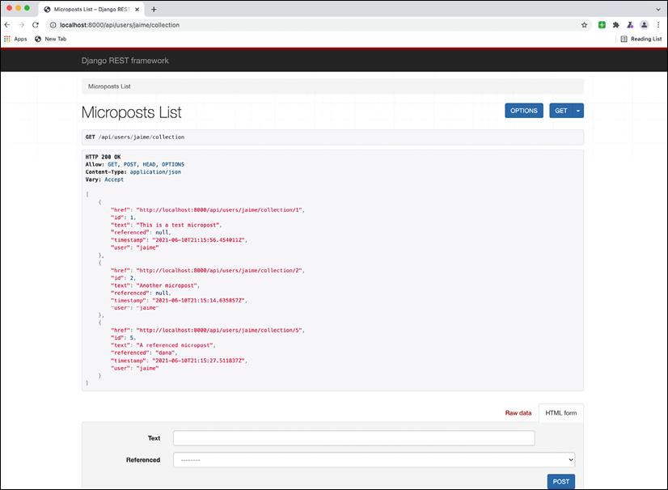
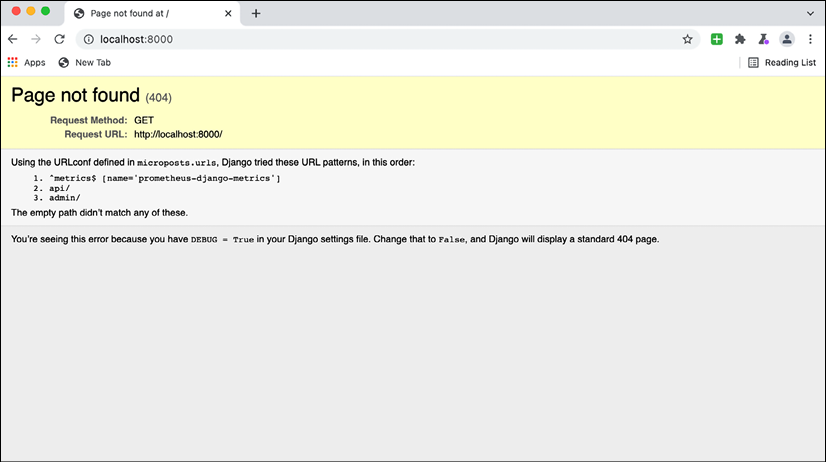
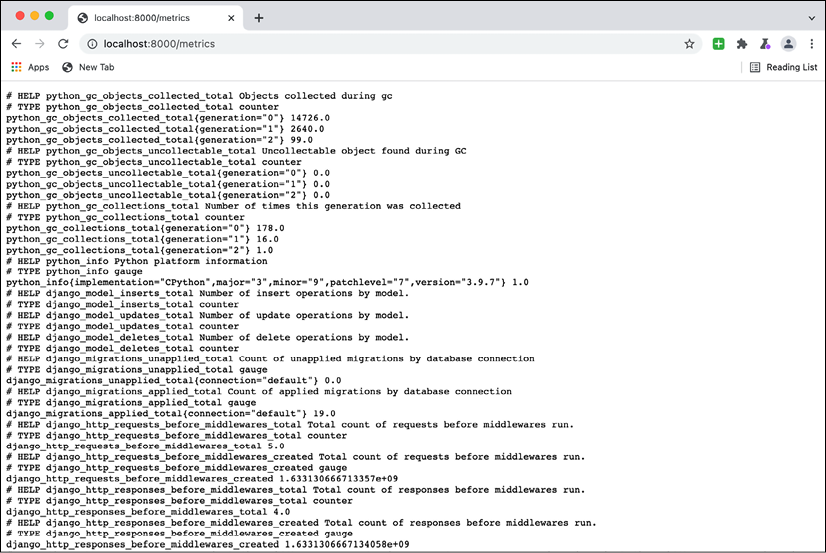
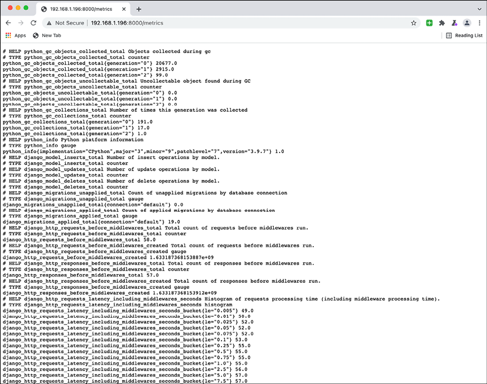
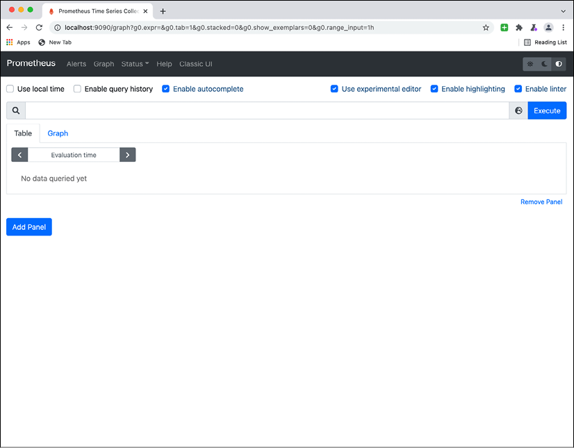
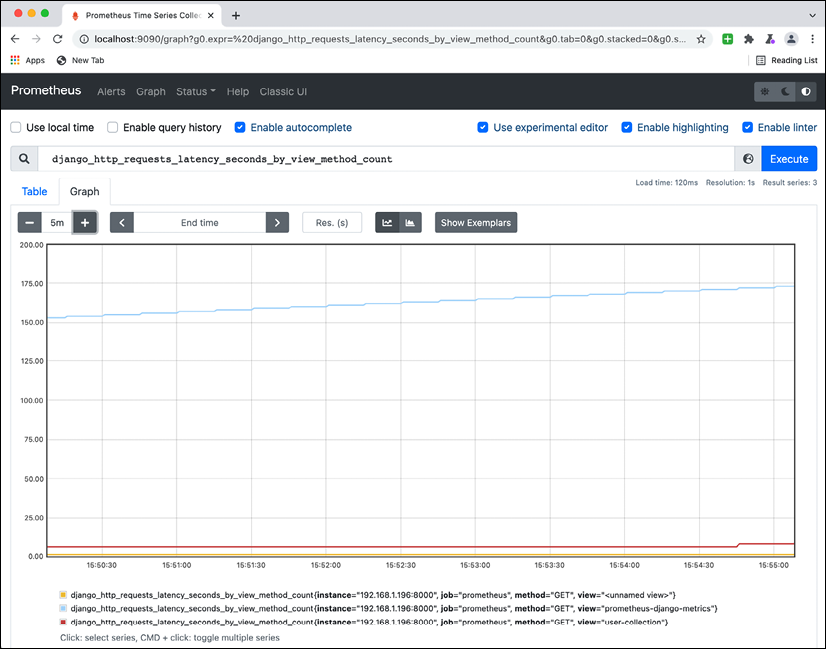
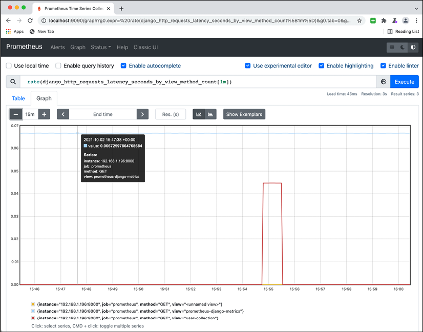
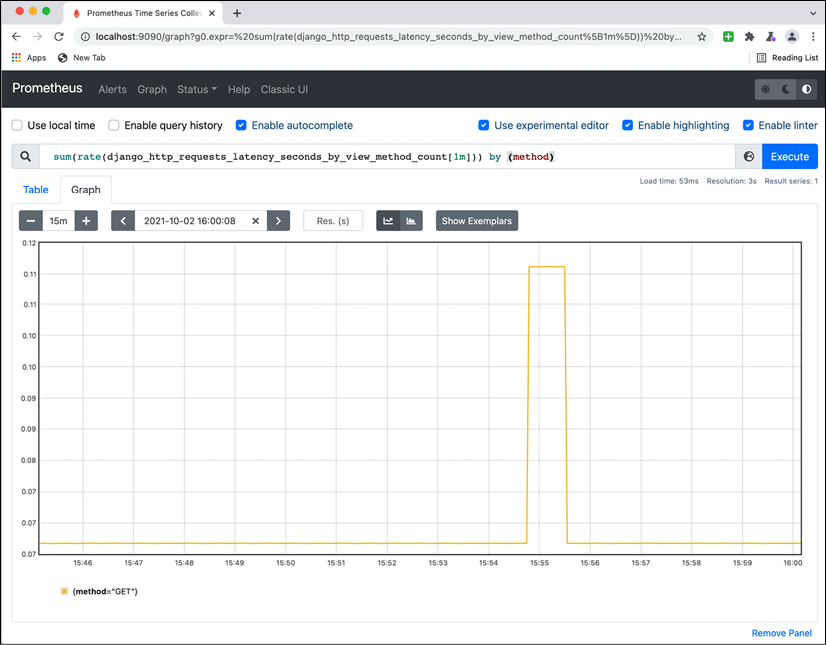
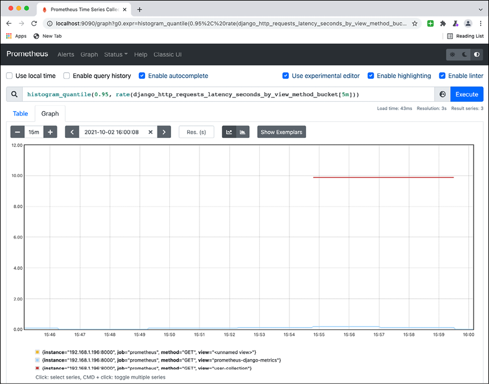

# 指标

除了日志记录，可观察性的另一个关键要素是指标。指标允许你查看系统的一般状态并观察趋势和情况，这些趋势和情况主要是由同时执行的多个甚至可能是多个任务引起的。

> 在本章中，我们将主要使用 Web 服务的示例，例如请求指标。不要感到被他们束缚；你可以在各种服务中生成指标！

在监控实时系统时，通常指标是主要关注点，因为它们让你一眼就能看出一切是否正常运行。通常使用指标，可以检测系统是否正在挣扎，例如，传入请求数量的突然增加，但也可以通过显示趋势来预测问题，例如请求数量的小幅但持续增加。这使你可以先发制人，而无需等到问题严重时才采取行动。

生成一个好的度量系统来监控系统的生命周期对于在出现问题时能够快速做出反应是非常宝贵的。指标也可以用作自动警报的基础，可以帮助警告正在发生的某些情况，通常是需要调查或纠正的事情。

在本章中，我们将介绍以下主题：

- 指标与日志
- 使用 Prometheus 生成指标
- 查询Prometheus
- 主动使用指标
- 警报

首先，我们将比较指标与其他主要的可观察性工具日志。

## 指标与日志

正如我们在前一章中看到的，日志是代码执行时产生的文本消息。它们擅长提供系统正在执行的每个特定任务的可见性，但它们会生成大量数据，难以大量消化。相反，在任何给定时间只能分析一小部分日志。

> 通常，分析的日志都将与单个任务相关。我们在上一章中看到了如何使用请求 ID。但在某些情况下，可能需要检查特定时间窗口内发生的所有日志以查看交叉影响，例如在特定时间影响所有任务的一台服务器中的问题。

但有时重要的信息不是特定的请求，而是要了解整个系统的行为。与昨天相比，系统的负载是否在增加？我们返回了多少错误？处理任务所需的时间是否在增加？还是减少？

所有这些问题都无法用日志来回答，因为它们需要更高层次的更广阔视野。为了能够实现这一点，需要汇总数据以能够理解整个系统。

存储在指标中的信息也不同。虽然每个记录的日志都是一条文本消息，但每个生成的指标都是一个数字。这些数字稍后将进行统计处理以汇总信息。

> 我们将在本章后面讨论可以作为度量产生的不同类型的数字。

每条记录中产生的信息量之间的差异意味着与日志相比，指标要轻得多。为了进一步减少存储的数据量，数据会自动聚合。

> 指标的分辨率可能取决于工具和设置配置。请记住，更高的分辨率将需要更多资源来存储所有数据。典型的分辨率是一分钟，它足够小，可以显示详细信息，除非你有一个非常活跃的系统，通常每秒接收 10 个或更多任务。

指标应捕获和分析与性能相关的信息，例如处理任务的平均时间。这使你可以检测可能的瓶颈并迅速采取行动，以提高系统的性能。以聚合方式更容易做到这一点，因为单个任务的信息（如生成的日志）可能无法捕获足够的信息来查看全局。这样做的一个重要结果是能够在问题变得太大之前看到趋势并发现问题，并及早进行补救。与此相比，日志大多是事后使用，很难作为预防措施使用。

### 指标种类

可以产生不同种类的指标。根据用于生成指标的特定工具，这可能会有所不同，但总的来说，大多数系统中都有一些常见的工具，如下所示：

- 计数器：每次发生某事时都会生成一个触发器。这将被计算和汇总为一个总数；例如，在 Web 服务中，请求的数量或生成的错误的数量。计数器有助于了解某个操作在系统中发生了多少次。
- 仪表：整个系统中的单个数字。仪表编号可以上升或下降，但最后一个值会覆盖前一个值，因为它存储了系统的一般状态；例如，队列中的元素数量，或系统中现有工作人员的数量。
- 度量：具有与其关联的数值的事件。这些数字可以以某种方式平均、求和或聚合。与量规相比，不同的是以前的措施仍然是独立的；例如，当我们发出一个以毫秒为单位的请求时间和以字节为单位的请求大小的指标时。

度量也可以用作计数器，因为每个发出的事件本质上都是一个计数器。例如，跟踪请求时间也会计算请求的数量，因为它会在每个请求中生成一次。工具通常会为每个度量自动创建关联的计数器。
定义哪个指标足以衡量特定值很重要。在大多数情况下，它们将是度量，以允许存储由事件产生的值。计数器通常是显而易见的（它们是没有值的度量），而量规通常是不太明显的，并且在何时使用它们时可能会带来更多挑战。

指标也可以从其他指标派生以生成新指标。例如，我们可以将返回错误代码的请求数除以请求总数来产生错误百分比。此类派生指标可以帮助你以有意义的方式理解信息。

还有两种度量系统，具体取决于度量的产生方式：

- 每次产生指标时，都会向指标收集器推送一个事件
- 每个系统都在内部维护自己的指标，这些指标会定期从指标收集器中提取

每个系统都有自己的优点和缺点。推送事件会产生更高的流量和活动，因为每个单独的事件都会立即发送，这可能会导致瓶颈和延迟。拉取事件只会对信息进行采样，并产生较低分辨率的数据，因为它可能会错过样本之间发生的事情，但它更稳定，因为请求的数量不会随着事件的数量而增加。

> 两种方法都被使用，但目前的趋势是拉动系统。它们减少了推动系统所需的维护量，并且更容易扩展。

我们将使用 Prometheus 的一些示例，这是一个使用拉取方法的度量系统。推送方法中最常用的指数是 Graphite。

## 使用 Prometheus 生成指标

Prometheus 是一个流行的指标系统，它得到很好的支持并且易于使用。我们将在本章中使用它作为示例来展示如何收集指标以及它如何与其他工具互连以显示指标。

正如我们之前看到的，Prometheus 使用 pull 方法来生成指标。这意味着任何生成指标的系统都将运行自己的内部 Prometheus 客户端来跟踪指标。

对于 Web 服务，可以将其添加为提供指标的额外端点。这是 ```django-prometheus``` 模块采用的方法，它会自动收集 Django Web 服务的许多常用指标。

> 我们将从第 6 章“Web 服务器结构”中介绍的 Django 应用程序代码构建，以展示一个工作应用程序。在 https://github.com/PacktPublishing/Python-Architecture-Patterns/tree/main/chapter_13_metrics/microposts 检查 GitHub 中的代码。

### 准备环境

我们需要设置环境以确保安装代码的所有必需包和依赖项。

让我们从创建一个新的虚拟环境开始，正如第 11 章，包管理中介绍的那样，确保创建我们自己的隔离沙箱来安装包：

```sh
$ python3 -m venv venv
$ source venv/bin/activate
```

我们现在可以安装存储在 requirements.txt 中的准备好的需求列表。这包含 Django 和 Django REST 框架模块，如第 6 章，Web 服务器结构中所示，还包含 Prometheus 依赖项：

```sh
(venv) $ cat requirements.txt
django
django-rest-framework
django-prometheus
(venv) $ pip install -r requirements.txt
Collecting Django
  Downloading Django-3.2.7-py3-none-any.whl (7.9 MB)
     |████████████████████████████████| 7.9 MB 5.7 MB/s
...
Installing collected packages: djangorestframework, django-rest-framework
    Running setup.py install for django-rest-framework ... done
Successfully installed django-rest-framework-0.1.0 djangorestframework-3.12.4
```

要启动服务器，请转到 ```micropost``` 子目录并运行 ```runserver``` 命令：

```sh
(venv) $ python3 manage.py runserver 0.0.0.0:8000
Watching for file changes with StatReloader
Performing system checks...
System check identified no issues (0 silenced).
October 01, 2021 - 23:24:26
Django version 3.2.7, using settings 'microposts.settings'
Starting development server at http://0.0.0.0:8000/
Quit the server with CONTROL-C.
```

现在可以在根地址访问应用程序：```http://localhost:8000```，例如 ```http://localhost:8000/api/users/jaime/collection```。

> 请注意，我们在地址 0.0.0.0 处启动了服务器。这将打开 Django 以服务任何 IP 地址，而不仅仅是来自 localhost 的请求。这是一个重要的细节，稍后会澄清。
>
> 另请注意，根地址将返回 404 错误，因为那里没有定义端点。

如果你还记得第 3 章，数据建模，我们添加了一些初始数据，因此你可以访问 URL ```http://localhost:8000/api/users/jaime/collection``` 和 ```http://localhost:8000/api/users/dana/collection` 查看一些数据。``



图 13.1：访问应用程序中的可用 URL

访问这些页面几次以生成我们以后可以访问的指标。

### 配置 Django 普罗米修斯

```django-prometheus``` 模块的配置是在 ```microposts/settings.py``` 文件中完成的，这里我们需要做两件事。

首先，将 ```django-prometheus``` 应用程序添加到启用模块的已安装应用程序列表中：

```python
INSTALLED_APPS = [
    'django.contrib.admin',
    'django.contrib.auth',
    'django.contrib.contenttypes',
    'django.contrib.sessions',
    'django.contrib.messages',
    'django.contrib.staticfiles',
    'django_prometheus',
    'rest_framework',
    'api',
]
```

我们还需要包含适当的中间件来跟踪请求。我们需要在请求过程的开头放置一个中间件，在最后放置另一个中间件，以确保捕获和测量整个过程：

```python
MIDDLEWARE = [
    'django_prometheus.middleware.PrometheusBeforeMiddleware',
    'django.middleware.security.SecurityMiddleware',
    'django.contrib.sessions.middleware.SessionMiddleware',
    'django.middleware.common.CommonMiddleware',
    'django.middleware.csrf.CsrfViewMiddleware',
    'django.contrib.auth.middleware.AuthenticationMiddleware',
    'django.contrib.messages.middleware.MessageMiddleware',
    'django.middleware.clickjacking.XFrameOptionsMiddleware',
    'django_prometheus.middleware.PrometheusAfterMiddleware',
]
```

检查 ```django.prometheus.middleware.PrometheusBeforeMiddleware``` 和 ```django_prometheus.middleware.PrometheusAfterMiddleware``` 的位置。

> 我们还将 ```ALLOWED_HOSTS``` 值更改为```“*”```并允许来自任何主机名的请求。稍后将解释这个细节。

通过此配置，Prometheus 集合现已启用。但是我们还需要一种访问它们的方法。请记住，Prometheus 系统的一个重要元素是每个应用程序都服务于自己的指标集合。

在这种情况下，我们可以将端点添加到文件 ```microposts/url.py```，它处理系统的顶级 URL：

```python
from django.contrib import admin
from django.urls import include, path
urlpatterns = [
    path('', include('django_prometheus.urls')),
    path('api/', include('api.urls')),
    path('admin/', admin.site.urls),
]
```

```path('', include('django_prometheus.urls'))``` 行设置了我们现在可以访问的 ```/metrics``` URL。

### 检查指标

主 URL 根显示有一个新端点 ```- /metrics```：



图 13.2：此页面出现是因为 DEBUG 模式处于活动状态。请记住在生产中部署之前停用它

访问 ```/metrics``` 端点时，它会显示所有收集的指标。请注意，收集了很多指标。这都是文本格式，预计将由 Prometheus 度量服务器收集。

>一定要访问几次端点 http://localhost:8000/api/users/jaime/collection 和 http://localhost:8000/api/users/dana/collection 以产生一些指标。你可以检查一些指标，例如 django_http_requests_total_by_view_transport_method_total{method="GET",transport="http",view="user-collection"} 是如何增加的。



图 13.3：应用程序收集的原始 Prometheus 指标

下一步是启动一个 Prometheus 服务器，它可以拉取信息并显示它。

### 启动 Prometheus 服务器

Prometheus 服务器将定期向所有正在收集其指标的已配置应用程序拉取指标。这些元素被 Prometheus 称为目标。

启动 Prometheus 服务器最简单的方法是启动官方 Docker 镜像。

> 我们在第 9 章“微服务与单体应用”中介绍了 Docker。有关详细信息，请参阅该章节。

我们需要启动服务器，但在此之前，我们需要在 prometheus.yml 文件中设置配置。你可以在 GitHub 上查看示例：https://github.com/PacktPublishing/Python-Architecture-Patterns/blob/main/chapter_13_metrics/prometheus.yml：

```yaml
# my global config
global:
  scrape_interval: 15s # Set the scrape interval to every 15 seconds. Default is every 1 minute.
  # scrape_timeout is set to the global default (10s).
scrape_configs:
  # The job name is added as a label `job=<job_name>` to any timeseries scraped from this config.
  - job_name: "prometheus"
    # metrics_path defaults to '/metrics'
    # scheme defaults to 'http'.
    static_configs:
      # The target needs to point to your local IP address
      # 192.168.1.196 IS AN EXAMPLE THAT WON'T WORK IN YOUR SYSTEM
      - targets: ["192.168.1.196:8000"]
```

配置文件有两个主要部分。第一个带```global```的表示刮（从目标读取信息）和其他常规配置值的频率。

第二个，```scrape_config```，描述了从什么中抓取，主要参数是```targets```。在这里，我们需要配置我们所有的目标。这个特别需要用它的外部 IP 来描述，这将是你计算机的 IP。

此地址不能是 ```localhost```，因为在 Prometheus Docker 容器中，它将解析为同一个容器，这不是你想要的。你需要找出你的本地 IP 地址。

>如果你不知道如何通过 ipconfig 或 ifconfig 找到它，你可以查看这篇关于如何找到它的文章：https://lifehacker.com/how-to-find-your-local-and-external- ip 地址 5833108。请记住，这是你的本地地址，而不是外部地址。

这是为了确保 Prometheus 服务器可以访问本地运行的 Django 应用程序。正如你所记得的，我们在启动服务器并允许配置参数 ```ALLOWED_HOSTS``` 中的所有主机时，使用选项 ```0.0.0.0``` 打开了允许来自任何主机名的连接的访问权限。

仔细检查你是否可以访问本地 IP 中的指标。



图 13.4：记下用于访问的 IP；请记住，你应该使用自己的本地

有了所有这些信息，你现在就可以使用自己的配置文件在 Docker 中启动 Prometheus 服务器了。

请注意，此命令要求你找到 ```prometheus.yml``` 文件的完整路径。如果你在同一目录中，则可以将其寻址为 ```$(pwd)/prometheus.yml```。

为此，运行以下 ```docker``` 命令，将整个路径添加到配置文件以与新容器共享：

```
$ docker run -p 9090:9090  -v /full/path/to/file/prometheus.yml:/etc/prometheus/prometheus.yml prom/prometheus
level=info ts=2021-10-02T15:24:17.228Z caller=main.go:400 msg="No time or size retention was set so using the default time retention" duration=15d
level=info ts=2021-10-02T15:24:17.228Z caller=main.go:438 msg="Starting Prometheus" version="(version=2.30.2, branch=HEAD, revision=b30db03f35651888e34ac101a06e25d27d15b476)"
... 
level=info ts=2021-10-02T15:24:17.266Z caller=main.go:794 msg="Server is ready to receive web requests."
```

docker 命令的结构如下：

- ```-p 9090:9090``` 将本地9090端口映射到容器内的9090端口
- ```-v /full/path/to/file/prometheus.yml:/etc/prometheus/prometheus.yml``` 在预期的配置路径中挂载本地文件（记得添加完整路径或者使用```$(pwd)/prometheus.yml```）对于prometheus
- ```docker run prom/Prometheus``` 是运行 ```prom/Prometheus``` 镜像的命令，也就是官方的 Prometheus 镜像

Prometheus 服务器启动并运行后，可通过 ```http://localhost:9090``` 访问该服务器。



图 13.5：Prometheus 页面的空图

从这里，我们可以开始查询系统。

## 查询 Prometheus

Prometheus 有自己的查询系统，称为 PromQL，以及使用指标操作的方法，虽然功能强大，但一开始可能会有点混乱。部分原因是它对指标的拉取方法。

例如，请求一个有用的指标，如 ```django_http_requests_latency_seconds_by_view_method_count```，将显示每个视图为每个方法调用了多少次。



图 13.6：注意 prometheus-django-metrics 视图是如何被更频繁地调用的，因为 Prometheus 每 15 秒自动调用一次以抓取结果

这表示为随时间增长的累积值。这不是很有用，因为很难理解它的确切含义。

相反，该值更有可能以```rate```表示，表示每秒检测到多少请求。例如，分辨率为 1 分钟时，```rate(django_http_requests_latency_seconds_by_view_method_count[1m])``` 显示如下图：



图 13.7：注意不同的方法和视图显示为不同的行

如你所见，来自 ```prometheus-django-metrics``` 的请求数量恒定，即 Prometheus 请求指标信息。这种情况每 15 秒发生一次，或大约每秒 0.066 次。

在图中，```user-collection```的另一个峰值发生在 15:55，此时我们手动生成了一些对服务的请求。如你所见，分辨率是每分钟，如速率中所述。

如果我们想在一个图中聚合所有这些，我们可以使用 sum 运算符，指定我们想要聚合的内容。总结所有 ```GET``` 请求，例如：

```
sum(rate(django_http_requests_latency_seconds_by_view_method_count[1m])) by (method)
```

这会产生另一个图表：



图 13.8：注意底部值是基于调用 prometheus-django-metrics 创建的基线

相反，要绘制时间，要使用的度量标准是 ```django_http_requests_latency_seconds_by_view_method_bucket``` 之一。桶度量的生成方式可以与 ```histogram_quantile``` 函数结合以显示特定的分位数，这对于给出正确的时间感觉很有用。

> 例如，分位数 0.95 表示时间是 95% 请求中的最高时间。这比创建平均值更有用，因为它们可能会被大量数字所扭曲。相反，你可以绘制分位数 0.50（一半请求所需的最长时间）、分位数 0.90（大多数请求的最长时间）和分位数 0.99 表示返回请求所需的最长时间。这使你可以更好地了解情况，因为它不同于分位数 0.50 增长（大多数请求需要更长的时间才能返回）和分位数 0.99 增长（一些慢查询变得更糟）的情况。

要在 5 分钟内绘制 0.95 分位数，可以生成以下查询：

```
histogram_quantile(0.95,rate(django_http_requests_latency_seconds_by_view_method_bucket[5m]))
```

运行它时，你应该收到以下信息：



图 13.9：注意指标收集比用户收集请求快得多

相反，要绘制时间，要使用的度量标准是 ```django_http_requests_latency_seconds_by_view_method_bucket``` 之一。桶度量的生成方式可以与 ```histogram_quantile``` 函数结合以显示特定的分位数，这对于给出正确的时间感觉很有用。

也可以过滤度量以仅显示特定标签，并且可以使用大量的乘法、除法、加法、创建平均值和各种操作的函数。

> 当尝试显示多个指标的结果时，Prometheus 查询可能有点长且复杂，例如成功请求占总数的百分比。请务必测试结果是否符合你的预期，并分配时间稍后调整查询以不断改进它们。

该界面已自动完成，可以帮助你找到某些指标。

> Prometheus 通常与 Grafana 配对。 Grafana 是一个开源的交互式可视化工具，可以与 Prometheus 连接以创建丰富的仪表板。这利用了指标的集合，并有助于以更易于理解的方式可视化系统状态。描述如何使用 Grafana 超出了本书的范围，但强烈建议使用它来显示指标：https://grafana.com/。

查看有关查询的 Prometheus 文档以了解更多信息：https://prometheus.io/docs/prometheus/latest/querying/basics/。

## 主动使用指标

正如我们所见，指标显示了整个集群状态的聚合观点。它们允许你检测趋势问题，但很难查明单个虚假错误。

这不应该阻止我们将它们视为成功监控的关键工具，因为它们可以判断整个系统是否健康。在一些公司中，最关键的指标永久显示在屏幕上，以便运营团队可以看到它们并对任何突发问题做出快速反应。

在服务的关键指标之间找到适当的平衡并不像看起来那么简单，它需要时间和经验，甚至可能需要反复试验。

但是，有四个在线服务指标被认为始终很重要。他们是：

- 延迟：系统响应请求需要多少毫秒。根据服务的不同，有时可以使用秒。根据我的经验，毫秒通常是足够的时间尺度，因为大多数 Web 应用程序需要 50 毫秒到 1 秒来响应，具体取决于请求。耗时超过 1 秒的请求通常比较少见，尽管总有一些，具体取决于系统。
- 流量：单位时间内流经系统的请求数，例如每分钟的请求数。
- 错误：收到的返回错误的请求的百分比。
- 饱和度：描述集群的容量是否有足够的空间。这包括可用硬盘空间、内存等元素。例如，系统中有 15% 的可用 RAM。

> 检查饱和度的主要工具是多个默认导出器，可用于自动收集大部分硬件信息，如内存、CPU 和硬盘空间。使用云提供商时，他们通常会公开自己的一组相关指标，例如 AWS 中的 CloudWatch。

这些指标可以作为四个黄金信号在 Google SRE 书中找到，并且被认为是成功监控的最重要的高级元素。

## 警报

当通过指标检测到问题时，应触发自动警报。 Prometheus 有一个警报系统，当定义的指标满足定义的警报时会发出警报。

> 查看有关警报的 Prometheus 文档以获取更多信息：https://prometheus.io/docs/alerting/latest/overview/。

通常，当指标值超过某个阈值时，将配置警报。例如，错误数高于 X，或者返回请求的时间太长。

> 警报也可能是某些元素太低；例如，如果系统中的请求数降至零，则可能表明系统已关闭。

内置的 Alertmanager 可以通过某些方式发出警报，例如发送电子邮件，但它也可以连接到其他工具以执行更复杂的操作。例如，连接到像 Opsgenie (https://www.atlassian.com/software/opsgenie) 这样的集成事件解决方案允许你创建警报流，例如发送电子邮件和 SMS、呼叫。

> 虽然可以直接从指标生成警报，但也有一些工具可以让你直接从日志中生成警报。例如，Sentry (https://sentry.io/) 将根据日志汇总错误，并可以设置阈值以升级为更活跃的警报，例如发送电子邮件。另一种选择是使用外部日志系统从日志中导出指标。例如，这允许你根据错误日志的数量或更复杂的指标创建计数器。这些系统再次允许你根据这些派生指标触发警报。

与指标一样，警报是一个持续的过程。一些关键阈值在系统启动时并不明显，只有经验才能让你发现它们。同样，很可能会创建一些不需要主动监控的警报，应该断开连接以确保系统中的警报准确无误并具有高信噪比。

## 概括

在本章中，我们描述了指标是什么以及它们如何与日志进行比较。我们描述了指标如何有助于分析系统的一般状态，而日志描述特定任务，更难以描述聚合情况。

我们列举了可以生成和描述的不同类型的指标 Prometheus，这是一个通用的指标系统，它使用拉取方法来捕获指标。

我们设置了一个示例，说明如何通过安装和配置 ```django-prometheus``` 模块在 Django 中自动生成指标，以及如何启动一个 Prometheus 服务器来抓取生成的指标。

> 请记住，你还可以生成自己的自定义指标，而不必仅依赖外部模块中的指标。检查 Prometheus 客户端以了解如何使用 Python，例如：https://github.com/prometheus/client_python。

接下来，我们介绍了如何在 Prometheus 中查询指标，介绍了 PromQL，并展示了一些常见示例，说明如何显示指标、绘制速率以清楚地查看指标如何随时间变化，以及如何使用 histogram_quantile 函数处理时间。

我们还在本章中展示了如何主动工作以尽快发现常见问题，以及 Google 描述的四个黄金信号是什么。最后，我们引入了警报，作为在指标超出正常范围时收到通知的一种方式。使用警报是一种无需手动查看指标即可获得通知的智能方式。