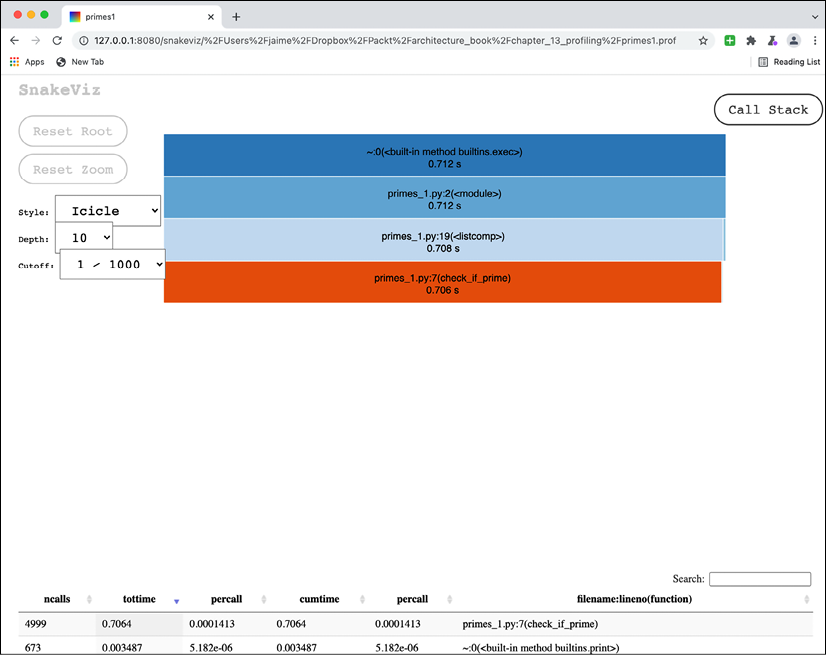
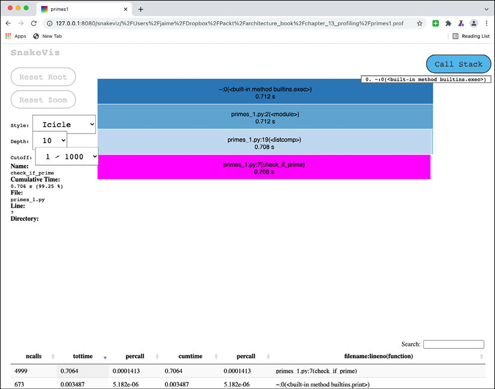
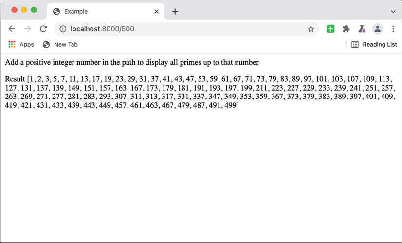
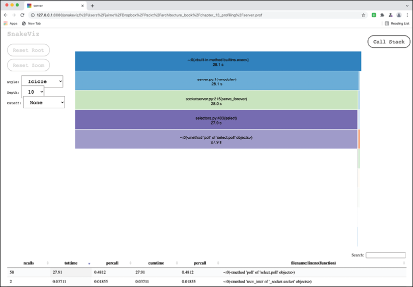
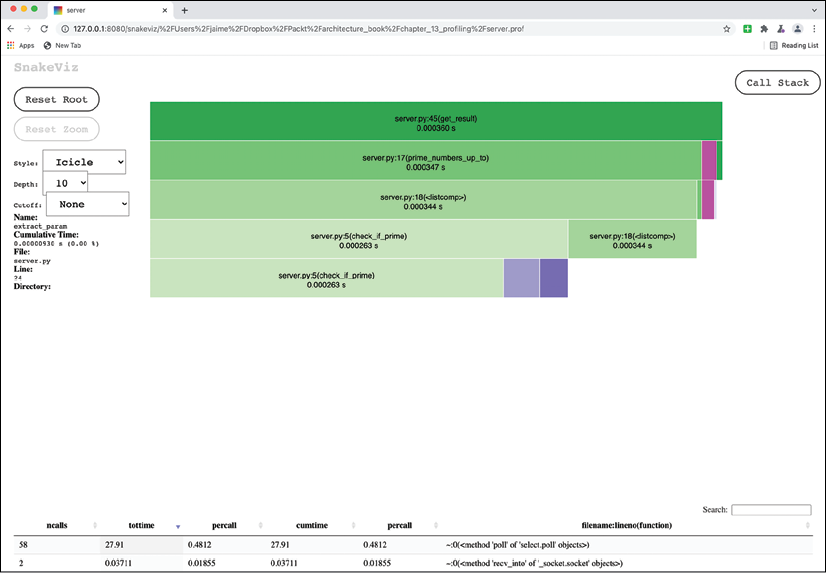
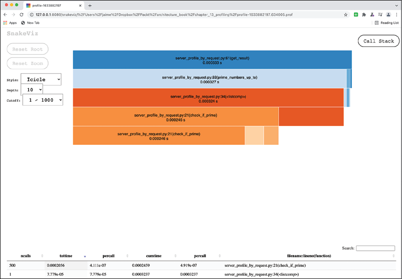

# 剖析

在使用真实数据进行测试后，编写的代码表现不佳是很常见的。除了bug，我们还可以发现代码性能不够的问题。也许某些请求花费了太多时间，或者内存使用率太高。

在这些情况下，很难确切知道哪些关键元素是占用最多时间或内存的。虽然可以尝试遵循逻辑，但通常一旦代码发布，瓶颈将出现在几乎不可能事先知道的地方。

为了获得关于到底发生了什么的信息并遵循代码流，我们可以使用分析器来动态分析代码并更好地了解代码是如何执行的，尤其是大部分时间都花在了哪里。这可能会导致影响代码最重要元素的调整和改进，由数据驱动，而不是模糊的推测。

在本章中，我们将介绍以下主题：

- 分析基础知识
- 探查器的类型
- 时间分析代码
- 部分剖析
- 内存分析

首先，我们将看一下 profiling 的基本原理。

## 分析基础知识

分析是一种动态分析，它可以检测代码以了解其运行方式。当代码照常运行时，这些信息的提取和编译方式可用于更好地了解基于真实案例的特定行为。此信息可用于改进代码。

> 与动态相反，某些静态分析工具可以提供对代码各个方面的洞察。例如，它们可用于检测某些代码是否为死代码，这意味着它不会在整个代码中的任何地方调用。或者，他们可以检测到一些错误，例如使用以前未定义的变量，例如出现拼写错误。但是它们不适用于实际运行的代码的细节。分析将根据所检测的用例带来特定数据，并将返回有关代码流的更多信息。

profiling 的正常应用是为了提高被分析代码的性能。通过了解它在实践中的执行方式，它揭示了可能导致问题的代码模块和部分的动态。然后，可以在这些特定领域采取行动。

性能可以通过两种方式来理解：时间性能（代码执行需要多长时间）或内存性能（代码执行需要多少内存）。两者都可能成为瓶颈。某些代码可能需要很长时间才能执行或使用大量内存，这可能会限制执行它的硬件。

> 我们将在本章中更多地关注时间性能，因为它通常是一个更大的问题，但我们还将解释如何使用内存分析器。

软件开发中的一个常见情况是，在代码执行之前，你并不真正知道代码将要做什么。涵盖出现罕见的极端情况的子句可能执行得比预期的要多得多，并且当存在大数组时，软件的工作方式会有所不同，因为某些算法可能不够用。

问题在于，在系统运行之前进行分析非常困难，而且在大多数情况下是徒劳的，因为有问题的代码段很可能完全出乎意料。

> 程序员浪费大量时间来思考或担心程序中非关键部分的速度，而在考虑调试和维护时，这些提高效率的尝试实际上会产生强烈的负面影响。我们应该忘记小的效率，比如大约 97% 的时间：过早优化是万恶之源。然而，我们不应该放弃那关键的 3% 的机会。
> -- Donald Knuth - 使用 GOTO 语句进行结构化编程 - 1974 年。

Profiling 为我们提供了理想的工具，它不会过早地进行优化，而是根据真实、有形的数据进行优化。这个想法是你无法优化你无法测量的东西。探查器进行测量，以便对其采取行动。

> 上面的名言有时会简化为“过早的优化是万恶之源”，这有点简化并且没有细微差别。有时仔细设计元素很重要，并且可以提前计划。尽管分析（或其他技术）可能很好，但它们只能做到这一点。但重要的是要理解，在大多数情况下，最好采用简单的方法，因为性能会足够好，并且在少数情况下可以在稍后改进它。

分析可以通过不同的方式实现，每种方式都有其优点和缺点。

## 探查器的类型

有两种主要的时间分析器：

- 确定性分析器，通过跟踪过程。确定性分析器检测代码并记录每个单独的命令。这使得确定性分析器非常详细，因为它们可以跟踪每个步骤的代码，但同时，代码的执行速度比没有检测的情况下要慢。
- 确定性分析器不适合连续执行。相反，它们可以在特定情况下被激活，例如在离线运行特定测试时，以找出问题。
- 通过抽样获取统计资料。这种探查器不是检测代码并检测每个操作，而是以一定的时间间隔唤醒并获取当前代码执行堆栈的样本。如果这个过程完成的时间足够长，它就会捕获程序的一般执行情况。

> 对堆栈进行采样类似于快照。想象一个火车或地铁大厅，人们从一个站台移动到另一个站台。采样类似于定期拍照，例如每 5 分钟一次。当然，不可能准确地知道谁来自一个平台并去另一个平台，但一整天后，它会提供足够好的信息，说明有多少人去过周围，哪些平台最受欢迎。

虽然它们没有提供像确定性配置文件那样详细的信息，但统计分析器更轻量级并且不会消耗很多资源。他们可以在不影响其性能的情况下持续监控实时系统。

统计分析器仅对处于相对负载下的系统有意义，因为在没有压力的系统中，它们会显示大部分时间都花在等待上。

统计分析器可以是内部的，如果采样是直接在解释器上完成的，或者甚至是外部的，如果它是一个不同的程序正在采样。外部分析器的优点是，即使采样过程出现任何问题，它也不会干扰被采样的程序。

两种分析器都可以看作是互补的。统计分析器是很好的工具，可以帮助你了解代码中访问量最大的部分以及系统汇总后在哪里花费时间。他们生活在实时系统中，真实案例的使用决定了系统的行为。

确定性分析器是用于分析开发人员笔记本电脑培养皿中特定用例的工具，其中可以对存在问题的特定任务进行仔细剖析和分析，以进行改进。

> 在某些方面，统计分析器类似于指标，而确定性分析器类似于日志。一个显示聚合元素，另一个显示特定元素。但是，与日志相反，确定性分析器并不是在实时系统中随意使用的理想工具。

通常，代码会呈现热点，即经常执行的慢速部分。找到需要关注的特定部分然后采取行动是提高整体速度的好方法。

这些热点可以通过分析来揭示，或者通过使用统计分析器检查全局热点或使用确定性分析器检查任务的特定热点。第一个将显示通常最常用的代码的特定部分，这使我们能够了解更频繁地受到攻击并总体上花费最多时间的部分。对于特定任务，确定性分析器可以显示每行代码需要多长时间，并确定什么是慢元素。

> 我们不会考虑统计分析器，因为它们需要负载下的系统，并且很难在适合本书范围的测试中创建它们。你可以检查 ```py-spy``` (https://pypi.org/project/py-spy/) 或 ```pyinstrument``` (https://pypi.org/project/pyinstrument/)。

另一种分析器是内存分析器。内存分析器记录内存何时增加和减少，跟踪内存使用情况。分析内存通常用于找出内存泄漏，这对于 Python 程序来说很少见，但它们可能会发生。

Python 有一个垃圾收集器，当一个对象不再被引用时，它会自动释放内存。这无需采取任何行动即可发生，因此与手动分配内存的程序（如 C/C++）相比，内存管理更容易处理。用于 Python 的垃圾收集机制称为引用计数，与其他类型的等待的垃圾收集器相比，一旦内存对象没有被任何人使用，它就会立即释放内存。

在 Python 的情况下，内存泄漏可能由三个主要用例造成，从更可能到最小：

- 一些对象仍然被引用，即使它们不再被使用。如果存在将小元素保留在大元素中的长期对象，例如添加和未删除时的字典列表，则通常会发生这种情况。
- 内部 C 扩展未正确管理内存。这可能需要使用特定的 C 分析工具进行进一步研究，这超出了本书的范围。
- 复杂的参考周期。引用循环是一组相互引用的对象，例如对象 A 引用 B 和对象 B 引用 A。尽管 Python 有算法来检测它们并释放内存，但垃圾收集器被禁用或任何其他错误问题的可能性很小。你可以在此处查看有关 Python 垃圾收集器的更多信息：https://docs.python.org/3/library/gc.html。

额外使用内存的最可能情况是使用大量内存的算法，并且可以在内存分析器的帮助下检测何时分配内存。

> 内存分析通常比时间分析更复杂并且需要更多的精力。

让我们介绍一些代码并对其进行分析。

## 时间分析代码

我们将从创建一个简短的程序开始，该程序将计算和显示直到特定数字的所有素数。素数是只能被自身和一整除的数字。

我们将首先采用一种原始的方法：

```python
def check_if_prime(number):
    result = True
    for i in range(2, number):
        if number % i == 0:
            result = False
    return result
```

此代码将从 2 到被测数字（不包括它）中的每个数字，并检查该数字是否可整除。如果它在任何时候都可以整除，那么这个数就不是质数。

为了从 1 到 5,000 一直计算，为了验证我们没有犯任何错误，我们将包括第一个低于 100 的素数并进行比较。这是在 GitHub 上，在 https://github.com/PacktPublishing/Python-Architecture-Patterns/blob/main/chapter_14_profiling/primes_1.py 上以 ```primes_1.py``` 的形式提供。

```python
PRIMES = [1, 2, 3, 5, 7, 11, 13, 17, 19, 23, 29, 31, 37, 41, 43, 47, 53,
          59, 61, 67, 71, 73, 79, 83, 89, 97]
NUM_PRIMES_UP_TO = 5000


def check_if_prime(number):
    result = True
    for i in range(2, number):
        if number % i == 0:
            result = False
    return result


if __name__ == '__main__':
    # Calculate primes from 1 to NUM_PRIMES_UP_TO
    primes = [number for number in range(1, NUM_PRIMES_UP_TO)
              if check_if_prime(number)]
    # Compare the first primers to verify the process is correct
    assert primes[:len(PRIMES)] == PRIMES
    print('Primes')
    print('------')
    for prime in primes:
        print(prime)
    print('------')
```

素数的计算是通过创建所有数字的列表（从 1 到 ```NUM_PRIMES_UP_TO```）并验证每个数字来执行的。仅保留返回 ```True``` 的值：

```python
    # Calculate primes from 1 to NUM_PRIMES_UP_TO
    primes = [number for number in range(1, NUM_PRIMES_UP_TO) if check_if_prime(number)]
```

下一行断言第一个素数与 PRIMES 列表中定义的相同，这是一个低于 100 的第一个素数的硬编码列表。

```python
assert primes[:len(PRIMES)] == PRIMES
```

素数终于打印出来了。让我们执行程序，计时它的执行：

```sh
$ time python3 primes_1.py
Primes
------
1
2
3
5
7
11
13
17
19
… 
4969
4973
4987
4993
4999
------
Real      0m0.875s
User      0m0.751s
sys 0m0.035s
```

从这里开始，我们将开始分析代码，看看内部发生了什么，看看我们是否可以改进它。

### 使用内置的 cProfile 模块

分析模块的最简单、更快的方法是直接使用 Python 中包含的 cProfile 模块。该模块是标准库的一部分，可以作为外部调用的一部分进行调用，如下所示：

```sh
$ time python3 -m cProfile primes_1.py
Primes
------
1
2
3
5
...
4993
4999
------
         5677 function calls in 0.760 seconds
   Ordered by: standard name
   ncalls  tottime  percall  cumtime  percall filename:lineno(function)
        1    0.002    0.002    0.757    0.757 primes_1.py:19(<listcomp>)
        1    0.000    0.000    0.760    0.760 primes_1.py:2(<module>)
     4999    0.754    0.000    0.754    0.000 primes_1.py:7(check_if_prime)
        1    0.000    0.000    0.760    0.760 {built-in method builtins.exec}
        1    0.000    0.000    0.000    0.000 {built-in method builtins.len}
      673    0.004    0.000    0.004    0.000 {built-in method builtins.print}
        1    0.000    0.000    0.000    0.000 {method 'disable' of '_lsprof.Profiler' objects}
Real      0m0.895s
User      0m0.764s
sys 0m0.032s
```

注意这通常调用脚本，但也提供了配置文件分析。该表显示：

- ```ncalls```：每个元素被调用的次数
- ```tottime```：在每个元素上花费的总时间，不包括子调用
- ```percall```：每个元素每次调用的时间（不包括子调用）
- ```cumtime```: 累积时间——花费在每个元素上的总时间，包括子调用
- ```percall```：每次调用元素的时间，包括子调用
- ```filename:lineno```: 分析中的每个元素

在这种情况下，可以清楚地看到调用了 4,999 次的 check_if_prime 函数所花费的时间，并且花费了实际的总时间（744 毫秒，而总数为 762 毫秒）。

> 虽然由于它是一个小脚本，所以在这里不容易看到，cProfile 增加了执行代码所需的时间。有一个名为 profile 的等效模块，它可以直接替代，但在纯 Python 中实现，而不是 C 扩展。我们一般使用 cProfile，因为它更快，但 profile 在某些时候可能很有用，例如尝试扩展功能时。

虽然这个文本表对于像这样的简单脚本来说已经足够了，但输出可以显示为一个文件，然后用其他工具显示：

```sh
$ time python3 -m cProfile -o primes1.prof  primes_1.py
$ ls primes1.prof
primes1.prof
```

现在我们需要安装可视化工具 SnakeViz，通过 pip 安装它：

```sh
$ pip3 install snakeviz
```

最后，使用snakeviz 打开文件，这将打开一个包含信息的浏览器：

```sh
$ snakeviz primes1.prof
snakeviz web server started on 127.0.0.1:8080; enter Ctrl-C to exit
http://127.0.0.1:8080/snakeviz/%2FUsers%2Fjaime%2FDropbox%2FPackt%2Farchitecture_book%2Fchapter_13_profiling%2Fprimes1.prof
```



图 14.1：分析信息的图形表示。整个页面太大而无法放在这里，并且已被故意裁剪以显示一些信息。

该图是交互式的，我们可以单击并悬停在不同的元素上以获取更多信息：



图 14.2：检查有关 check_if_prime 的信息。整个页面太大而无法放在这里，并且已被故意裁剪以显示一些信息。

我们可以在这里确认大部分时间都花在了 ```check_if_prime``` 上，但我们没有得到关于其中内容的信息。

这是因为 ```cProfile``` 只有函数粒度。你将看到每个函数调用需要多长时间，但不会看到较低的分辨率。对于这个特别简单的功能，这可能还不够。

> 不要小看这个工具。提供的代码示例故意简单，以避免花费太多时间来解释其使用。大多数情况下，本地化花费大部分时间的功能足以直观地检查它并发现花费的时间太长。请记住，在大多数实际情况下，花费的时间将用于外部调用，如数据库访问、远程请求等。

我们将看到如何使用具有更高分辨率的分析器来分析每一行代码。

### 线性分析

分析check_if_prime函数，我们需要先安装模块line_profiler

```sh
$ pip3 install line_profiler
```

安装好之后，我们对代码做一点小改动，保存为 primes_2.py。我们将为 ```check_if_prime``` 函数添加装饰器 ```@profile```，以指示行分析器查看它。

> 请记住，你应该只分析你希望以这种方式了解更多信息的代码部分。如果所有代码都以这种方式进行分析，则需要花费大量时间进行分析。

代码将是这样的（其余的将不受影响）。你可以在 GitHub 上的 https://github.com/PacktPublishing/Python-Architecture-Patterns/blob/main/chapter_14_profiling/primes_2.py 查看整个文件。

```python
@profile
def check_if_prime(number):
    result = True
    for i in range(2, number):
        if number % i == 0:
            result = False
    return result
```

现在用```kernprof```执行代码，安装```line_profiler```后会安装。

```python
$ time kernprof -l primes_2.py
Primes
------
1
2
3
5
…
4987
4993
4999
------
Wrote profile results to primes_2.py.lprof
Real      0m12.139s
User      0m11.999s
sys 0m0.098s
```

请注意，与未启用分析器的亚秒级执行相比，执行时间明显延长了 12 秒。现在我们可以使用以下命令查看结果：

```python
$ python3 -m line_profiler primes_2.py.lprof
Timer unit: 1e-06 s
Total time: 6.91213 s
File: primes_2.py
Function: check_if_prime at line 7
Line #      Hits         Time  Per Hit   % Time  Line Contents
==============================================================
     7                                           @profile
     8                                           def check_if_prime(number):
     9      4999       1504.0      0.3      0.0      result = True
    10
    11  12492502    3151770.0      0.3     45.6      for i in range(2, number):
    12  12487503    3749127.0      0.3     54.2          if number % i == 0:
    13     33359       8302.0      0.2      0.1              result = False
    14
    15      4999       1428.0      0.3      0.0      return result
```

在这里，我们可以开始分析所使用算法的细节。主要问题似乎是我们正在做很多比较。尽管每次点击的时间很短，但第 11 行和第 12 行都被调用了太多次。我们需要找到一种方法来减少他们被调用的次数。

第一个很容易。一旦我们找到一个 ```False``` 结果，我们就不需要再等待了；我们可以直接返回，而不是继续循环。代码将是这样的（存储在 ```primes_3.py``` 中，可在 https://github.com/PacktPublishing/Python-Architecture-Patterns/blob/main/chapter_14_profiling/primes_3.py 获得）：

```python
@profile
def check_if_prime(number):
    for i in range(2, number):
        if number % i == 0:
            return False
    return True
Let's take a look at the profiler result.
$ time kernprof -l primes_3.py
... 
Real      0m2.117s
User      0m1.713s
sys       0m0.116s
$ python3 -m line_profiler primes_3.py.lprof
Timer unit: 1e-06 s
Total time: 0.863039 s
File: primes_3.py
Function: check_if_prime at line 7
Line #      Hits         Time  Per Hit   % Time  Line Contents
==============================================================
     7                                           @profile
     8                                           def check_if_prime(number):
     9
    10   1564538     388011.0      0.2     45.0      for i in range(2, number):
    11   1563868     473788.0      0.3     54.9          if number % i == 0:
    12      4329       1078.0      0.2      0.1              return False
    13
    14       670        162.0      0.2      0.0      return True
```

我们看到时间是如何大幅减少的（2 秒与之前的 12 秒相比，按时间衡量），我们看到用于比较的时间大大减少（之前的 3,749,127 微秒，然后是 473,788 微秒），主要是由于事实上，比较次数减少了 10 倍，即 1,563,868 次与 12,487,503 次比较。

我们还可以通过限制循环的大小来改进并进一步减少比较次数。

现在，循环将尝试在所有数字之间划分源数字，直到它自己。例如，对于 19，我们尝试这些数字（因为 19 是质数，它不能被除自身之外的任何元素整除）。

```python
Divide 19 between
[2, 3, 4, 5, 6, 7, 8, 9, 10, 11, 12, 13, 14, 15, 16, 17, 18, 19]
```

没有必要尝试所有这些数字。至少，我们可以跳过其中的一半，因为没有一个数可以被一个大于一半的数整除。例如，19 除以 10 或更高小于 2。

```python
Divide 19 between
[2, 3, 4, 5, 6, 7, 8, 9, 10]
```

此外，数字的任何因数都将低于其平方根。这可以解释如下：如果一个数字是两个或多个数字的因数，它们可能是整数的平方根。所以我们只检查直到平方根的数字（向下舍入）：

```python
Divide 19 between
[2, 3, 4]
```

但我们可以进一步减少它。我们只需要检查 2 之后的奇数，因为任何偶数都可以被 2 整除。所以，在这种情况下，我们甚至进一步减少它。

```python
Divide 19 between
[2, 3]
```

要应用所有这些，我们需要再次调整代码并将其存储在 ```primes_4.py``` 中，可在 GitHub 上的 https://github.com/PacktPublishing/Python-Architecture-Patterns/blob/main/chapter_14_profiling/primes_4.py 中获得：

```python
def check_if_prime(number):
    if number % 2 == 0 and number != 2:
        return False
    for i in range(3, math.floor(math.sqrt(number)) + 1, 2):
        if number % i == 0:
            return False
    return True
```

除非数字为 2，否则代码始终检查是否可被 2 整除。这是为了保持正确返回 2 作为素数。

然后，我们创建一个从 3 开始的数字范围（我们已经测试了 2）并一直持续到数字的平方根。我们使用数学模块来执行操作并将数字设置为最接近的较低整数。 range 函数需要这个数字的 +1，因为它不包括定义的数字。最后，范围在时间上步进 2 个整数，因此所有数字都是奇数，因为我们从 3 开始。

例如，要测试像 1,000 这样的数字，这是等效的代码。

```python
>>> import math
>>> math.sqrt(1000)
31.622776601683793
>>> math.floor(math.sqrt(1000))
31
>>> list(range(3, 31 + 1, 2))
[3, 5, 7, 9, 11, 13, 15, 17, 19, 21, 23, 25, 27, 29, 31]
```

请注意，当我们添加 +1 时会返回 31。

让我们再次分析代码。

```python
$ time kernprof -l primes_4.py
Primes
------
1
2
3
5
…
4973
4987
4993
4999
------
Wrote profile results to primes_4.py.lprof
Real      0m0.477s
User      0m0.353s
sys       0m0.094s
```

我们看到性能又一次大幅提升。让我们看看线路轮廓。

```python
$ python3 -m line_profiler primes_4.py.lprof
Timer unit: 1e-06 s
Total time: 0.018276 s
File: primes_4.py
Function: check_if_prime at line 8
Line #      Hits         Time  Per Hit   % Time  Line Contents
==============================================================
     8                                           @profile
     9                                           def check_if_prime(number):
    10
    11      4999       1924.0      0.4     10.5      if number % 2 == 0 and number != 2:
    12      2498        654.0      0.3      3.6          return False
    13
    14     22228       7558.0      0.3     41.4      for i in range(3, math.floor(math.sqrt(number)) + 1, 2):
    15     21558       7476.0      0.3     40.9          if number % i == 0:
    16      1831        506.0      0.3      2.8              return False
    17
    18       670        158.0      0.2      0.9      return True
```

当我们开始线路分析时，我们已将循环迭代次数从 ```primes_3.py``` 中的 150 万次和 ```primes_2.py``` 中的超过 1200 万次大幅减少到 22,228 次。这是重大的改进！

> 你可以尝试进行测试以增加 primes_2.py 和 primes_4.py 中的 NUM_PRIMES_UP_TO 并比较它们。这种变化将是显而易见的。

线法应该只用于小部分。一般来说，我们已经看到 cProfile 如何变得更有用，因为它更易于运行并提供信息。

前面的部分假设我们能够运行整个脚本然后接收结果，但这可能不正确。让我们看一下如何在程序的各个部分进行分析，例如，何时收到请求。

## 部分分析

在许多情况下，分析器在系统正在运行的环境中很有用，我们不能等到进程完成才能获取分析信息。典型的场景是 Web 请求。

如果我们想分析一个特定的 Web 请求，我们可能需要启动一个 Web 服务器，产生一个请求，然后停止该过程以获得结果。由于我们将看到的一些问题，这并不像你想象的那么好。

但首先，让我们创建一些代码来解释这种情况。

### 示例 Web 服务器返回质数

我们将使用函数 ```check_if_prime``` 的最终版本并创建一个 Web 服务，该服务返回所有素数，直到请求路径中指定的数量。代码如下，它在 GitHub 上的 ```server.py``` 文件中完全可用，网址为 https://github.com/PacktPublishing/Python-Architecture-Patterns/blob/main/chapter_14_profiling/server.py。

```python
from http.server import BaseHTTPRequestHandler, HTTPServer
import math


def check_if_prime(number):
    if number % 2 == 0 and number != 2:
        return False
    for i in range(3, math.floor(math.sqrt(number)) + 1, 2):
        if number % i == 0:
            return False
    return True


def prime_numbers_up_to(up_to):
    primes = [number for number in range(1, up_to + 1) if check_if_prime(number)]
    return primes


def extract_param(path):
    '''
    Extract the parameter and transform into
    a positive integer. If the parameter is
    not valid, return None
    '''
    raw_param = path.replace('/', '')
    # Try to convert in number
    try:
        param = int(raw_param)
    except ValueError:
        return None
    # Check that it's positive
    if param < 0:
        return None
    return param


def get_result(path):
    param = extract_param(path)
    if param is None:
        return 'Invalid parameter, please add an integer'
    return prime_numbers_up_to(param)


class MyServer(BaseHTTPRequestHandler):
    def do_GET(self):
        result = get_result(self.path)
        self.send_response(200)
        self.send_header("Content-type", "text/html")
        self.end_headers()
        return_template = '''
            <html>
                <head><title>Example</title></head>
                <body>
                    <p>Add a positive integer number in the path to display
                    all primes up to that number</p>
                    <p>Result {result}</p>
                </body>
            </html>
        '''
        body = bytes(return_template.format(result=result), 'utf-8')
        self.wfile.write(body)
        
        
if __name__ == '__main__':
    HOST = 'localhost'
    PORT = 8000
    web_server = HTTPServer((HOST, PORT), MyServer)
    print(f'Server available at http://{HOST}:{PORT}')
    print('Use CTR+C to stop it')
    # Capture gracefully the end of the server by KeyboardInterrupt
    try:
        web_server.serve_forever()
    except KeyboardInterrupt:
        pass
    web_server.server_close()
    print("Server stopped.")
```

如果从头开始，代码会更好地理解。最后一个块使用 Python 模块 ```http.server``` 中的基本 ```HTTPServer``` 定义创建一个 Web 服务器。之前，我们创建了 ```MyServer``` 类，它定义了在 ```do_GET``` 方法中有 ```GET``` 请求时要做什么。

```do_GET``` 方法返回一个 ```HTML``` 响应，其结果由 ```get_result``` 计算得出。它添加了所有必需的标题并在 HTML 中格式化正文。

该过程的有趣部分发生在下一个函数中。

```get_result``` 是根目录。它首先调用 ```extract_param``` 来获取一个数字，直到它计算阈值数，以便我们计算素数。如果正确，则将其传递给 ```prime_numbers_up_to```。

```python
def get_result(path):
    param = extract_param(path)
    if param is None:
        return 'Invalid parameter, please add an integer'
    return prime_numbers_up_to(param)
```

函数 ```extract_params``` 将从 URL 路径中提取一个数字。它首先删除任何 ```/``` 字符，然后尝试将其转换为整数并检查整数是否为正。对于任何错误，它返回 ```None```。

```python
def extract_param(path):
    '''
    Extract the parameter and transform into
    a positive integer. If the parameter is
    not valid, return None
    '''
    raw_param = path.replace('/', '')
    # Try to convert in number
    try:
        param = int(raw_param)
    except ValueError:
        return None
    # Check that it's positive
    if param < 0:
        return None
    return param
```

最后，函数 ```prime_numbers_up_to``` 计算素数，直到传递的数字。这类似于我们在本章前面看到的代码。

```python
def prime_numbers_up_to(up_to):
    primes = [number for number in range(1, up_to + 1)
              if check_if_prime(number)]
    return primes
```

最后，我们在本章前面广泛讨论过的 ```check_if_prime``` 与 ```primes_4.py``` 中的相同。

该过程可以从以下开始：

```python
$ python3 server.py
Server available at http://localhost:8000
Use CTR+C to stop it
```

然后通过访问 ```http://localhost:8000/500``` 进行测试，以尝试获取最大为 500 的素数。



图 14.3：显示所有素数最多 500 的界面

如你所见，我们有一个可以理解的输出。让我们继续分析我们用来获取它的过程。

### 剖析整个过程

我们可以通过在 cProfile 下启动它然后捕获它的输出来分析整个过程。我们像这样启动它，向 http://localhost:8000/500 发出单个请求，然后检查结果。

```sh
$ python3 -m cProfile -o server.prof server.py
Server available at http://localhost:8000
Use CTR+C to stop it
127.0.0.1 - - [10/Oct/2021 14:05:34] "GET /500 HTTP/1.1" 200 -
127.0.0.1 - - [10/Oct/2021 14:05:34] "GET /favicon.ico HTTP/1.1" 200 -
^CServer stopped.
```

我们已将结果存储在文件 ```server.prof```中。然后可以像以前一样使用```snakeviz``` 分析这个文件。

```python
$ snakeviz server.prof
snakeviz web server started on 127.0.0.1:8080; enter Ctrl-C to exit
```

显示下图：



图 14.4：完整剖面图。整个页面太大而无法放在这里，并且已被故意裁剪以显示一些信息。

如你所见，该图显示在绝大多数测试期间，代码都在等待新请求，并在内部执行轮询操作。这是服务器代码的一部分，而不是我们的代码。

要找到我们关心的代码，我们可以在下面的长列表中手动搜索 ```get_result```，它是我们代码中有趣部分的根源。请务必选择 ```Cutoff: None``` 以显示所有功能。

选择后，图表将从那里开始显示。请务必向上滚动以查看新图表。



图 14.5：从 get_result 显示的图表。整个页面太大而无法放在这里，并且已被故意裁剪以显示一些信息。

在这里，你可以看到更多代码执行的一般结构。你可以看到大部分时间都花在了多个 ```check_if_prime``` 调用上，这些调用包含了 ```prime_numbers_up_to``` 的大部分内容和其中包含的列表推导，而花在 ```extract_params``` 上的时间很少。

但是这种方法存在一些问题：

- 首先，我们需要在启动和停止进程之间完成一个完整的循环。这对请求来说很麻烦。
- 循环中发生的一切都包括在内。这给分析增加了噪音。幸运的是，我们知道有趣的部分在 get_result 中，但这可能并不明显。这个案例也使用了一个最小的结构，但是在像 Django 这样的复杂框架的情况下，可能会导致很多 .
- 如果我们处理两个不同的请求，它们将被添加到同一个文件中，再次混合结果。

这些问题可以通过仅将分析器应用于感兴趣的部分并为每个请求生成一个新文件来解决。

### 根据请求生成配置文件

为了能够为每个请求生成包含信息的不同文件，我们需要创建一个装饰器以便于访问。这将分析并生成一个独立的文件。

在文件 ```server_profile_by_request.py``` 中，我们得到与 ```server.py``` 中相同的代码，但添加了以下装饰器。

```python
from functools import wraps
import cProfile
from time import time


def profile_this(func):
    @wraps(func)
    def wrapper(*args, **kwargs):
        prof = cProfile.Profile()
        retval = prof.runcall(func, *args, **kwargs)
        filename = f'profile-{time()}.prof'
        prof.dump_stats(filename)
        return retval
    return wrapper
```

装饰器定义了一个替换原始函数的包装函数。我们使用 ```wraps``` 装饰器来保留原始名称和文档字符串。

> 这只是一个标准的装饰器过程。 Python 中的装饰器函数是一个返回一个函数，然后替换原始函数的函数。如你所见，原始函数 ```func``` 仍然在替换它的包装器内部调用，但它添加了额外的功能。

在内部，我们启动一个分析器并使用 runcall 函数运行它下面的函数。这一行是它的核心——使用生成的分析器，我们运行带有参数的原始函数 func 并存储它的返回值。

```python
retval = prof.runcall(func, *args, **kwargs)
```

之后，我们生成一个包含当前时间的新文件，并使用 .dump_stats 调用转储其中的统计信息。

我们还装饰了 ```get_result``` 函数，所以我们从那里开始我们的分析。

```python
@profile_this
def get_result(path):
    param = extract_param(path)
    if param is None:
        return 'Invalid parameter, please add an integer'
    return prime_numbers_up_to(param)
```

完整代码可在文件 ```server_profile_by_request.py``` 中找到，该文件可在 GitHub 上的 https://github.com/PacktPublishing/Python-Architecture-Patterns/blob/main/chapter_14_profiling/server_profile_by_request.py 获得。

现在让我们启动服务器并通过浏览器进行一些调用，一个调用 ```http://localhost:8000/500```，另一个调用 ```http://localhost:8000/800```。

```python
$ python3 server_profile_by_request.py
Server available at http://localhost:8000
Use CTR+C to stop it
127.0.0.1 - - [10/Oct/2021 17:09:57] "GET /500 HTTP/1.1" 200 -
127.0.0.1 - - [10/Oct/2021 17:10:00] "GET /800 HTTP/1.1" 200 -
```

我们可以看到新文件是如何创建的：

```python
$ ls profile-*
profile-1633882197.634005.prof 
profile-1633882200.226291.prof
```

这些文件可以使用snakeviz显示：



图 14.6：单个请求的配置文件信息。整个页面太大而无法放在这里，并且已被故意裁剪以显示一些信息。

每个文件只包含从 ```get_result``` 开始的信息，它只获取一个点的信息。更重要的是，每个文件仅显示特定请求的信息，因此可以单独对其进行分析，并具有高度的详细信息。

可以调整代码以更具体地调整文件名以包含调用参数等详细信息，这可能很有用。另一个有趣的可能调整是创建一个随机样本，因此 X 调用中只有 1 个生成分析代码。这有助于减少分析的开销，并允许你完全分析某些请求。

> 这与统计分析器不同，因为它仍然会完全分析某些请求，而不是检测特定时间发生的事情。这可以帮助跟踪特定请求发生的情况。

接下来，我们将了解如何执行内存分析。

## 内存分析

有时，应用程序使用太多内存。最坏的情况是随着时间的推移，他们使用越来越多的内存，通常是由于所谓的内存泄漏，由于编码中的一些错误，维护不再使用的内存。其他问题还可能包括内存的使用可能会得到改善，因为它是一种有限的资源。

要分析内存并分析使用内存的对象是什么，我们首先需要创建一些示例代码。我们将生成足够多的莱昂纳多数。

莱昂纳多数字是遵循以下定义的序列的数字：

- 第一个莱昂纳多数是一
- 第二个莱昂纳多数也是一
- 任何其他莱昂纳多数是前两个莱昂纳多数加一

莱昂纳多数类似于斐波那契数。它们实际上与它们有关。我们使用它们而不是斐波那契来展示更多的多样性。数字很有趣！

我们通过创建递归函数来呈现前 35 个莱昂纳多数并将其存储在 leonardo_1.py 中，该文件可在 GitHub 上的 https://github.com/PacktPublishing/Python-Architecture-Patterns/blob/main/chapter_14_profiling/leonardo_1.py 上获得。

```python
def leonardo(number):
    if number in (0, 1):
        return 1
    return leonardo(number - 1) + leonardo(number - 2) + 1


NUMBER = 35
for i in range(NUMBER + 1):
    print('leonardo[{}] = {}'.format(i, leonardo(i)))
```

你可以运行代码并看到它需要的时间越来越长。

```sh
$ time python3 leonardo_1.py
leonardo[0] = 1
leonardo[1] = 1
leonardo[2] = 3
leonardo[3] = 5
leonardo[4] = 9
leonardo[5] = 15
...
leonardo[30] = 2692537
leonardo[31] = 4356617
leonardo[32] = 7049155
leonardo[33] = 11405773
leonardo[34] = 18454929
leonardo[35] = 29860703
real      0m9.454s
user      0m8.844s
sys 0m0.183s
```

为了加快这个过程，我们看到可以使用记忆技术，这意味着存储结果并使用它们，而不是一直计算它们。

我们像这样更改代码，创建 leonardo_2.py 文件（可在 GitHub 上的 https://github.com/PacktPublishing/Python-Architecture-Patterns/blob/main/chapter_14_profiling/leonardo_2.py 获得）。

```python
CACHE = {}
def leonardo(number):
    if number in (0, 1):
        return 1
    if number not in CACHE:
        result = leonardo(number - 1) + leonardo(number - 2) + 1
        CACHE[number] = result
    return CACHE[number]


NUMBER = 35000
for i in range(NUMBER + 1):
    print(f'leonardo[{i}] = {leonardo(i)}')
```

这使用全局字典 ```CACHE``` 来存储所有莱昂纳多数字，从而加快处理速度。请注意，我们将要计算的数字数量从 35 增加到 35000，增加了一千倍。该过程运行得非常快。

```python
$ time python3 leonardo_2.py
leonardo[0] = 1
leonardo[1] = 1
leonardo[2] = 3
leonardo[3] = 5
leonardo[4] = 9
leonardo[5] = 15
...
leonardo[35000] = ...
real      0m15.973s
user      0m8.309s
sys       0m1.064s
```

现在让我们看看内存使用情况。

### 使用 memory_profiler

现在我们的应用程序已经存储了信息，让我们使用分析器来显示内存的存储位置。

我们需要安装包 ```memory_profiler```。这个包类似于 ```line_profiler```。

```python
$ pip install memory_profiler
```

我们现在可以在 leonardo 函数中添加一个@profile 装饰器（存储在 leonardo_2p.py 中，在 GitHub 上的 https://github.com/PacktPublishing/Python-Architecture-Patterns/blob/main/chapter_14_profiling/leonardo_2p.py），以及使用 memory_profiler 模块运行它。你会注意到这次它运行得较慢，但是在通常的结果之后，它会显示一个表格。

```python
$ time python3 -m memory_profiler leonardo_2p.py
...
Filename: leonardo_2p.py
Line #    Mem usage    Increment  Occurences   Line Contents
============================================================
     5  104.277 MiB   97.082 MiB      104999   @profile
     6                                         def leonardo(number):
     7
     8  104.277 MiB    0.000 MiB      104999       if number in (0, 1):
     9   38.332 MiB    0.000 MiB           5           return 1
    10
    11  104.277 MiB    0.000 MiB      104994       if number not in CACHE:
    12  104.277 MiB    5.281 MiB       34999           result = leonardo(number - 1) + leonardo(number - 2) + 1
    13  104.277 MiB    1.914 MiB       34999           CACHE[number] = result
    14
    15  104.277 MiB    0.000 MiB      104994       return CACHE[number]
Real      0m47.725s
User      0m25.188s
sys 0m10.372s
```

此表首先显示内存使用情况、增量或减量，以及每行出现的次数。

你可以看到以下内容：

- 第 9 行只执行了几次。执行此操作时，内存量约为 38 MiB，这将是程序使用的最小内存。
- 使用的总内存几乎是 105 MiB。
- 当我们创建一个新的莱昂纳多数并将其存储在 CACHE 字典中时，整个内存增加位于第 12 行和第 13 行。请注意我们是如何在这里从不释放内存的。

我们真的不需要一直将所有以前的莱昂纳多数字都保存在内存中，我们可以尝试一种不同的方法来只保留一些。

### 内存优化

我们使用以下代码创建文件 leonardo_3.py，可在 GitHub 上的 https://github.com/PacktPublishing/Python-Architecture-Patterns/blob/main/chapter_14_profiling/leonardo_3.py 获得：

```python
CACHE = {}


@profile
def leonardo(number):
    if number in (0, 1):
        return 1
    if number not in CACHE:
        result = leonardo(number - 1) + leonardo(number - 2) + 1
        CACHE[number] = result
    ret_value = CACHE[number]
    MAX_SIZE = 5
    while len(CACHE) > MAX_SIZE:
        # Maximum size allowed,
        # delete the first value, which will be the oldest
        key = list(CACHE.keys())[0]
        del CACHE[key]
    return ret_value


NUMBER = 35000
for i in range(NUMBER + 1):
    print(f'leonardo[{i}] = {leonardo(i)}')
```

请注意，我们保留 ```@profile``` 装饰器以再次运行内存分析器。大部分代码是相同的，但我们添加了以下额外块：

```python
MAX_SIZE = 5
while len(CACHE) > MAX_SIZE:
    # Maximum size allowed,
    # delete the first value, which will be the oldest
    key = list(CACHE.keys())[0]
    del CACHE[key]
```

此代码将使 ```CACHE``` 字典中的元素数量保持在限制范围内。当达到限制时，它将删除 ```CACHE.keys()``` 返回的第一个元素，这将是最旧的。

> 从 Python 3.6 开始，所有 Python 字典都是有序的，因此它们将按照之前输入的顺序返回它们的键。我们利用这一点。请注意，我们需要将 ```CACHE.keys() ```（一个 ```dict_keys``` 对象）的结果转换为列表以允许获取第一个元素。

字典将无法增长。现在让我们尝试运行它并查看分析的结果。

```python
$ time python3 -m memory_profiler leonardo_3.py
...
Filename: leonardo_3.py
Line #    Mem usage    Increment  Occurences   Line Contents
============================================================
     5   38.441 MiB   38.434 MiB      104999   @profile
     6                                         def leonardo(number):
     7
     8   38.441 MiB    0.000 MiB      104999       if number in (0, 1):
     9   38.367 MiB    0.000 MiB           5           return 1
    10
    11   38.441 MiB    0.000 MiB      104994       if number not in CACHE:
    12   38.441 MiB    0.008 MiB       34999           result = leonardo(number - 1) + leonardo(number - 2) + 1
    13   38.441 MiB    0.000 MiB       34999           CACHE[number] = result
    14
    15   38.441 MiB    0.000 MiB      104994       ret_value = CACHE[number]
    16
    17   38.441 MiB    0.000 MiB      104994       MAX_SIZE = 5
    18   38.441 MiB    0.000 MiB      139988       while len(CACHE) > MAX_SIZE:
    19                                                 # Maximum size allowed,
    20                                                 # delete the first value, which will be the oldest
    21   38.441 MiB    0.000 MiB       34994           key = list(CACHE.keys())[0]
    22   38.441 MiB    0.000 MiB       34994           del CACHE[key]
    23
    24   38.441 MiB    0.000 MiB      104994       return ret_value
```

在这种情况下，我们看到内存如何保持稳定在 38 MiB 左右，这是我们看到的最小值。在这种情况下，请注意没有增量或减量。实际上这里发生的是增量和减量太小而无法注意到。因为它们相互抵消，所以报告接近于零。

```memory-profiler```模块还能够执行更多操作，包括根据时间显示内存使用情况并绘制它，因此你可以看到内存随时间增加或减少。在 https://pypi.org/project/memory-profiler/ 上查看其完整文档。

## 概括

在本章中，我们描述了分析是什么以及何时应用它。我们描述了分析是一种动态工具，可以让你了解代码的运行方式。此信息有助于理解实践情况下的流程并能够使用该信息优化代码。可以正常优化代码以更快地执行，但其他替代方案是开放的，例如使用更少的资源（通常是内存），减少外部访问等。

我们描述了探查器的主要类型：确定性探查器、统计探查器和内存探查器。前两个主要面向提高代码性能，内存分析器分析代码在执行中使用的内存。确定性分析器检测代码以在代码执行时详细说明代码流。统计分析器定期对代码进行采样，以提供更频繁执行的代码部分的总体视图。

然后，我们展示了如何使用确定性分析器对代码进行分析，并提供了一个示例。我们首先使用内置模块 cProfile 对其进行分析，该模块提供了函数解析。我们看到了如何使用图形工具来显示结果。为了深入挖掘，我们使用了第三方模块 line-profiler，它会遍历每个代码行。一旦理解了代码的流程，就会对其进行优化以大大减少其执行时间。

下一步是了解如何分析打算继续运行的进程，例如 Web 服务器。我们展示了在这些情况下尝试分析整个应用程序的问题，并描述了我们如何分析每个单独的请求而不是为了清楚起见。

> 这些技术也适用于其他情况，例如条件分析，仅在某些情况下进行分析，例如在某些时间或每 100 个请求中的一个。

最后，我们还展示了一个分析内存的示例，并通过使用模块 ```memory-profiler``` 来了解它是如何使用的。

在下一章中，我们将详细了解如何通过调试技术查找和修复代码中的问题，包括在复杂情况下。