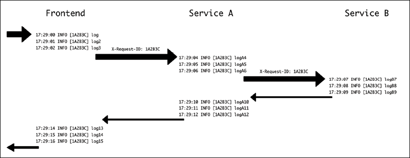

# 调试

一般来说，调试问题的循环有以下步骤：

检测问题。发现新问题或缺陷
分析这个问题并分配优先级，以确保我们将时间花在有意义的问题上并专注于最重要的问题
调查究竟是什么导致了问题。理想情况下，这应该以在本地环境中复制问题的方式结束
在本地复制问题，并深入了解问题发生原因的具体细节
解决问题
如你所见，一般的策略是首先定位并了解问题，这样我们才能正确调试和修复它。

在本章中，我们将介绍以下主题，以了解如何完成所有这些阶段的有效技术：

- 检测和处理缺陷
- 生产考察
- 了解生产中的问题
- 本地调试
- Python自省工具
- 使用日志进行调试
- 使用断点调试

让我们看一下处理缺陷的第一步。

## 检测和处理缺陷

第一步实际上是检测问题。这听起来有点傻，但这是一个非常关键的阶段。

> 虽然我们将主要使用术语“错误”来描述任何缺陷，但请记住，它可能包括诸如性能不佳或意外行为等可能无法正确归类为“错误”的细节。解决问题的适当工具可能不同，但检测通常以类似的方式完成。

检测问题可以通过不同的方式完成，有些可能比其他的更明显。通常，一旦代码投入生产，用户将在内部（最好的情况）或外部（最坏的情况）或通过监控来检测缺陷。

> 请记住，监控只能捕获明显且通常是严重的错误。

根据问题的检测方式，我们可以将它们分类为不同的严重性，例如：

- 完全停止操作的灾难性问题。这些错误意味着没有任何东西，甚至是同一系统中不相关的任务，都不起作用
- 停止执行某些任务但不停止执行其他任务的关键问题
- 将停止或导致某些任务出现问题的严重问题，但仅在某些情况下。例如，未检查参数并产生异常，或者某种组合产生的任务太慢以至于产生超时
- 轻度问题，包括包含错误或不准确的任务。例如，任务在某些情况下会产生空结果，或者 UI 中的问题不允许调用功能
- 外观或小问题，如拼写错误和类似问题

因为每个开发团队都是有限的，所以总会有太多的错误，并且有正确的方法来关注什么以及首先修复什么是至关重要的。通常，第一组中的错误显然会非常紧迫地修复，并且需要立即做出全体反应。但是分类和优先级很重要。

对下一步要寻找什么有一个明确的信号，这将有助于开发人员通过将时间花在重要问题上而不是最新问题上来获得清晰的观点并提高效率。团队自己可以执行一些问题分类，但最好添加一些上下文。

请记住，通常，你需要更正错误并实现新功能，并且这些任务中的每一个都可能分散彼此的注意力。

修复错误很重要，不仅是为了提高服务质量，因为任何用户都会发现使用有错误的服务非常令人沮丧。但这对开发团队也很重要，因为使用低质量的服务也会让开发人员感到沮丧。

> 需要在错误修复和引入新功能之间取得适当的平衡。还要记住为新功能引入的相应新错误分配时间。一个功能在发布时还没有准备好，当它的错误被修复时它已经准备好了。

任何检测到的问题，除了与上下文无关的灾难性问题外，都应捕获围绕产生错误所需步骤的上下文。这样做的目的是能够重现错误。

> 重现错误是修复错误的关键要素。最坏的情况是错误是间歇性的或似乎是随机发生的。需要更多的挖掘才能了解它发生时为什么会发生。

当一个问题可以被复制时，你就成功了一半。问题可以理想地复制到测试中，因此可以反复测试，直到问题被理解和解决。在最好的情况下，这个测试可以是一个单元测试，如果问题影响一个单一的系统并且所有的条件都被理解并且可以被复制。如果问题影响多个系统，则可能需要创建集成测试。

> 调查期间的一个常见问题是找出引发问题的具体情况，例如，在生产中以特定方式设置并触发某些问题的数据。在这种环境下，准确找出导致问题的原因可能会很复杂。我们将在本章后面讨论如何在生产中发现问题。

一旦问题被分类和可复制，调查就可以继续了解原因。

目视检查代码并试图推断问题和错误所在通常是不够的。就其执行方式而言，即使是非常简单的代码也会让你大吃一惊。能够分析在特定情况下如何精确执行代码对于分析和修复发现的问题至关重要。

## 生产分析

一旦我们意识到我们在生产中存在问题，我们就需要了解正在发生的事情以及产生问题的关键要素是什么。

> 评论能够复制问题的重要性非常重要。如果是这种情况，可以进行测试以产生错误并遵循后果。

在分析为什么会产生特定问题时，最重要的工具是可观察性工具。这就是为什么提前做好准备工作很重要，以确保能够在需要时发现问题。

我们在前面的章节中讨论了日志和指标。调试时，指标通常是不相关的，除了显示错误的相对重要性。检查返回错误的增加对于检测是否存在错误可能很重要，但检测什么错误将需要更精确的信息。

不过，不要低估指标。它们可以帮助快速确定哪个特定组件出现故障，或者是否与其他元素有任何关系，例如，是否有单个服务器产生错误，或者它是否已耗尽内存或硬盘空间。

> 例如，如果外部请求被定向到不同的服务器，并且故障与针对特定服务器的特定请求的组合有关，那么有问题的服务器可能会产生明显的随机错误。

但无论如何，日志通常更有助于确定代码的哪一部分表现不佳。正如我们在第 12 章日志中看到的，我们可以将错误日志描述为检测两种问题：

- 预期的错误。在这种情况下，我们事先进行了调试错误的工作，并且知道发生了什么应该很容易。这方面的示例可以是返回错误的外部请求、无法连接的数据库等。
    这些错误中的大多数将与行为不端的外部服务有关（从引发错误的角度来看）。这可能表示网络问题、配置错误或其他服务中的问题。错误通过系统传播并不罕见，因为错误可能会引发级联故障。但是，通常情况下，起源将是一个意外错误，其余的将是预期的，因为它们将从外部源接收错误。
- 意外错误。这些错误的标志是指示出现问题的日志，并且在大多数现代编程语言中，日志中的某种堆栈跟踪详细说明了产生错误时的代码行。

> 默认情况下，任何执行任务的框架，如 Web 框架或任务管理系统，都会产生错误，但会保持系统稳定。这意味着只有产生错误的任务才会被中断，任何新任务都将从头开始处理。

系统应该为任务提供适当的处理。例如，Web 服务器将返回 500 错误，而任务管理系统可能会在延迟一段时间后重试该任务。正如我们之前看到的，这可能会导致错误被传播。

在这两种情况下，检测问题所在的主要工具将是日志。日志显示已捕获并正确标记的已知问题，或者日志显示堆栈跟踪，应指示代码的哪个特定部分显示错误。

找到作为错误来源的元素和代码部分对于理解问题和调试特定问题很重要。这在微服务架构中尤为重要，因为它们将具有多个独立的元素。

> 我们在第 9 章“微服务与单体应用”中讨论了微服务和单体架构。 Monolith 更容易处理 bug，因为所有代码都在同一个站点上处理，但无论如何，随着它们的增长，它们会变得越来越复杂。

请记住，有时不可能完全避免错误。例如，如果存在调用外部 API 的外部依赖项并且出现问题，则可能会触发内部错误。这些问题可以得到缓解、正常失败或生成“服务不可用”状态。但错误的根源可能无法完全修复。

> 减轻外部依赖可能需要创建冗余，甚至使用不同的供应商以免依赖于单点故障，尽管这可能不现实，因为它可能非常昂贵。

我们可以将这些案例通知给我们，但不需要采取进一步的短期行动。

在其他情况下，当错误不是立即明显并且需要进行进一步调查时，将需要进行一些调试。

## 了解生产中的问题

复杂系统中的挑战在于检测问题变得更加复杂。随着多个层和模块的添加并相互交互，错误可能变得更加微妙和复杂。

> 正如我们之前看到的，微服务架构可能特别难以调试。不同微服务之间的交互会产生复杂的交互，这可能会在其不同部分的集成中产生微妙的问题。这种集成可能很难在集成测试中进行测试，或者问题的根源可能在于集成测试的盲点。
>
> 但随着部件变得越来越复杂，单体也可能出现问题。由于以意想不到的方式交互的特定生产数据的交互，可能会产生困难的错误。单体系统的一大优势是测试将覆盖整个系统，从而更容易通过单元或集成测试进行复制。

但是，此步骤的目标应该是分析生产中的足够问题，以便能够在本地环境中复制它，在本地环境中，较小规模的环境将使探测和更改更容易且侵入性更小。一旦收集到足够的信息，最好不要管任何生产环境，专注于问题的细节。

> 请记住，拥有一个可复制的错误已经成功了一半！一旦问题可以在本地归类为一组可复制的步骤，就可以创建一个测试来一遍又一遍地产生它并在受控环境中进行调试。

有时，启用常规日志记录足以确定确切的错误是什么或如何在本地复制它。在这些情况下，可能有必要研究引发问题的情况。

### 记录请求 ID

分析大量日志时的问题之一是将它们关联起来。为了正确地对彼此相关的日志进行分组，我们可以按生成它们的主机进行过滤并选择一个较短的时间窗口，但这可能还不够好，因为两个或多个不同的任务可以同时运行。我们需要每个任务或请求的唯一标识符来跟踪来自同一来源的所有日志。我们将此标识符称为请求 ID，因为它们是在许多框架中自动添加的。这有时在任务管理器中称为任务 ID。

在涉及多个服务的情况下，例如在微服务架构中，保留一个通用的请求 ID 非常重要，该 ID 可以用来跟踪不同服务之间的不同请求。这使你可以跟踪和关联来自具有相同来源的不同服务的系统中的不同日志。

下图显示了一个前端和两个内部调用的后端服务之间的流程。请注意，```X-Request-ID``` 标头由前端设置并转发给服务 A，然后服务 A 将其转发给服务 B。



图 15.1：跨多个服务的请求 ID

因为它们都共享相同的请求 ID，所以可以通过该信息过滤日志以获取有关单个任务的所有信息。

为此，我们可以使用模块 ```django_log_request_id``` 在 Django 应用程序中创建请求 ID。

> 你可以在此处查看整个文档：https://github.com/dabapps/django-log-request-id/。

我们在 GitHub 上的 https://github.com/PacktPublishing/Python-Architecture-Patterns/tree/main/chapter_15_debug 中展示了一些代码，下面是本书中的示例。这需要创建一个虚拟环境并安装软件包，以及其他要求。

```sh
$ python3 -m venv ./venv
$ source ./venv/bin/activate
(venv) $ pip install -r requirements.txt
```

代码已更改为在 ```microposts/api/views.py``` 文件中包含一些额外的日志（见 https://github.com/PacktPublishing/Python-Architecture-Patterns/blob/main/chapter_15_debug/microposts/api/views.py):

```python
from rest_framework.generics import ListCreateAPIView
from rest_framework.generics import RetrieveUpdateDestroyAPIView
from .models import Micropost, Usr
from .serializers import MicropostSerializer
import logging


logger = logging.getLogger(__name__)


class MicropostsListView(ListCreateAPIView):
    serializer_class = MicropostSerializer
    def get_queryset(self):
        logger.info('Getting queryset')
        result = Micropost.objects.filter(user__username=self.kwargs['username'])
        logger.info(f'Querysert ready {result}')
        return result
    def perform_create(self, serializer):
        user = Usr.objects.get(username=self.kwargs['username'])
        serializer.save(user=user)
        
        
class MicropostView(RetrieveUpdateDestroyAPIView):
    serializer_class = MicropostSerializer
    def get_queryset(self):
        logger.info('Getting queryset for single element')
        result = Micropost.objects.filter(user__username=self.kwargs['username'])
        logger.info(f'Queryset ready {result}')
        return result
```

请注意，现在在访问列表集合页面和单个微博页面时，这是如何添加一些日志的。我们将使用示例 URL ```/api/users/jaime/collection/5```。

要启用请求 ID 的使用，我们需要在 microposts/settings.py 中正确设置配置（https://github.com/PacktPublishing/Python-Architecture-Patterns/blob/main/chapter_15_debug/microposts/microposts/settings.py）：

```python
LOG_REQUEST_ID_HEADER = "HTTP_X_REQUEST_ID"
GENERATE_REQUEST_ID_IF_NOT_IN_HEADER = True
LOGGING = {
    'version': 1,
    'disable_existing_loggers': False,
    'filters': {
        'request_id': {
            '()': 'log_request_id.filters.RequestIDFilter'
        }
    },
    'formatters': {
        'standard': {
            'format': '%(levelname)-8s [%(asctime)s] [%(request_id)s] %(name)s: %(message)s'
        },
    },
    'handlers': {
        'console': {
            'level': 'INFO',
            'class': 'logging.StreamHandler',
            'filters': ['request_id'],
            'formatter': 'standard',
        },
    },
    'root': {
        'handlers': ['console'],
        'level': 'INFO',
    },
}
```

```LOGGING``` 字典是 Django 中描述如何记录的特性。 ```filters``` 添加了额外的信息，在这种情况下，我们的 ```request_id```, ```formatter``` 描述了要使用的具体格式（注意我们添加 ```request_id``` 作为参数，将在括号中表示）。

```handlers``` 描述了每条消息会发生什么，将过滤器和格式化程序与有关要显示的级别和发送信息的位置的信息结合起来。在这种情况下，```StreamHandler``` 会将日志发送到标准输出。我们将所有日志设置在根级别以使用此处理程序。

> 查看 Django 文档以获取更多信息：https://docs.djangoproject.com/en/3.2/topics/logging/。登录 Django 可能需要一些经验才能正确设置所有参数。配置时花点时间。

线条，

```python
LOG_REQUEST_ID_HEADER = "HTTP_X_REQUEST_ID"
GENERATE_REQUEST_ID_IF_NOT_IN_HEADER = True
```

声明如果在输入中未找到作为标头的新请求 ID 参数，则应创建新的请求 ID 参数，并且标头的名称将为 X-Request-ID。

一旦所有这些都配置好了，我们可以运行一个测试启动服务器：

```sh
(venv) $ python3 manage.py runserver
Watching for file changes with StatReloader
2021-10-23 16:11:16,694 INFO     [none] django.utils.autoreload: Watching for file changes with StatReloader
Performing system checks...
System check identified no issues (0 silenced).
October 23, 2021 - 16:11:16
Django version 3.2.8, using settings 'microposts.settings'
Starting development server at http://127.0.0.1:8000/
Quit the server with CONTROL-C
```

在另一个屏幕上，使用 curl 调用测试 URL：

```sh
(venv) $ curl http://localhost:8000/api/users/jaime/collection/5
{"href":"http://localhost:8000/api/users/jaime/collection/5","id":5,"text":"A referenced micropost","referenced":"dana","timestamp":"2021-06-10T21:15:27.511837Z","user":"jaime"}
```

同时，你将在服务器屏幕上看到日志：

```python
2021-10-23 16:12:47,969 INFO     [66e9f8f1b43140338ddc3ef569b8e845] api.views: Getting queryset for single element
2021-10-23 16:12:47,971 INFO     [66e9f8f1b43140338ddc3ef569b8e845] api.views: Queryset ready <QuerySet [<Micropost: Micropost object (1)>, <Micropost: Micropost object (2)>, <Micropost: Micropost object (5)>]>
[23/Oct/2021 16:12:47] "GET /api/users/jaime/collection/5 HTTP/1.1" 200 177
```

如你所见，它添加了一个新的请求 ID 元素，在本例中为 ```66e9f8f1b43140338ddc3ef569b8e845```。

但也可以通过使用正确的标头调用来创建请求 ID。让我们再试一次，发出另一个 ```curl``` 请求和 ```-H``` 参数以添加标头。

```sh
$ curl -H "X-Request-ID:1A2B3C" http://localhost:8000/api/users/jaime/collection/5
{"href":"http://localhost:8000/api/users/jaime/collection/5","id":5,"text":"A referenced micropost","referenced":"dana","timestamp":"2021-06-10T21:15:27.511837Z","user":"jaime"}
```

你可以再次检查服务器中的日志：

```sh
2021-10-23 16:14:41,122 INFO     [1A2B3C] api.views: Getting queryset for single element
2021-10-23 16:14:41,124 INFO     [1A2B3C] api.views: Queryset ready <QuerySet [<Micropost: Micropost object (1)>, <Micropost: Micropost object (2)>, <Micropost: Micropost object (5)>]>
[23/Oct/2021 16:14:41] "GET /api/users/jaime/collection/5 HTTP/1.1" 200 177
```

这表明请求 ID 已由标头中的值设置。

请求 ID 可以通过使用包含在同一模块中的 ```Session``` 传递给其他服务，该 ```Session``` 充当```requests```中的 Session。

```python
from log_request_id.session import Session
session = Session()
session.get('http://nextservice/url')
```

这将在请求中设置正确的标头，将其传递到链的下一步，例如服务 A 或服务 B。

> 请务必查看 django-log-request-id 文档。

### 分析数据

如果默认日志不足以理解问题，那么在这些情况下，下一步就是理解与问题相关的数据。通常，可能会检查数据存储以跟踪任务的相关数据，以查看是否有任何迹象。

> 此步骤可能会因缺少数据或数据限制而变得复杂，从而难以或不可能获得数据。有时组织中只有少数人可以访问所需的数据，这可能会延迟调查。另一种可能性是数据无法检索。例如，数据策略可能不存储数据，或者数据可能被加密。这在涉及个人身份信息 (PII)、密码或类似数据的情况下经常发生。

分析存储的数据可能需要对数据库或其他类型的数据存储执行临时手动查询，以查明相关数据是否一致或是否存在任何不期望的参数组合。

> 请记住，目标是从生产中获取信息，以便能够独立地理解和复制问题。在某些情况下，在调查生产中的问题时，手动更改数据可能会解决问题。这在某些紧急情况下可能是必要的，但目标仍然需要了解为什么会出现这种数据不一致的情况，或者应该如何更改服务以允许你处理这种数据情况。然后可以相应地更改代码，以确保将来不会发生问题。

如果调查数据不足以理解问题，则可能需要增加日志上的信息。

### 增加日志记录

如果常规日志和数据调查没有结果，则可能需要在出现问题后使用特殊日志提高日志记录级别。

这是不得已而为之的方法，因为它有两个主要问题：

- 日志中的任何更改都需要部署，这使得运行成本高昂。
- 系统中的日志数量将增加，这将需要更多空间来存储它们。根据系统中的请求数量，这可能会对日志记录系统造成压力。

这些额外的日志应该始终是短期的，并且应该尽快恢复。

虽然启用额外级别的日志记录（例如将日志设置为 DEBUG 级别）在技术上是可行的，但这可能会过多地增加日志，并且很难知道大量日志中的关键日志是什么。使用一些 DEBUG 日志，可以将正在调查的区域的细节暂时提升为 INFO 或更高，以确保它们被正确记录。

对临时记录的信息要格外小心。不应记录 PII 等机密信息。相反，尝试记录可以帮助找出问题的周围信息。

例如，如果怀疑某些意外字符可能会导致检查密码的算法出现问题，则可以添加一些代码来检测是否存在无效字符，而不是记录密码。

例如，假设带有表情符号的密码或密码有问题，我们可以只提取非 ASCII 字符来找出问题所在，如下所示：

```python
>>> password = 'secret password '
>>> bad_characters = [c for c in password if not c.isascii()]
>>> bad_characters
['']
```

然后可以记录 bad_characters 中的值，因为它不包含完整密码。

> 请注意，这种假设可能更容易通过单元测试快速测试并且没有任何秘密数据。这只是一个例子。

添加临时日志很麻烦，因为它通常会涉及多次部署，直到找出问题所在。将日志数量保持在最低限度始终很重要，尽快清理无用的日志，并记住在工作完成后将它们完全删除。

请记住，工作只是为了能够在本地重现问题，以便你可以更有效地在本地调查和修复问题。有时在一些时间日志之后问题可能会被认为是显而易见的，但是，良好的 TDD 实践，正如我们在第 10 章，测试和 TDD 中看到的，测试显示然后修复错误。

一旦我们可以在本地检测到问题，就该进行下一步了。

## 本地调试

本地调试意味着一旦我们进行本地复制就暴露和修复问题。

调试的基本步骤是重现问题，知道当前的错误结果是什么，以及知道正确的结果应该是什么。有了这些信息，我们就可以开始调试了。

> 如果可能的话，一个很好的重现问题的方法是进行测试。正如我们在第 10 章，测试和 TDD 中看到的，这是 TDD 的基础。创建一个失败的测试，然后更改代码以使其通过。这种方法在修复错误时非常有用。

退后一步，任何调试过程都遵循以下过程：

- 你意识到有问题
- 你了解正确的行为应该是什么
- 你调查并发现当前系统行为不正确的原因
- 你解决问题

从本地调试的角度来看，牢记这个过程也很有用，尽管此时，步骤 1 和 2 可能已经解决。在绝大多数情况下，困难的步骤是第 3 步，正如我们在整章中看到的那样。

要理解，一旦出现代码，为什么代码会如此运行，可以使用类似于科学方法的方法来系统化该方法：

1. 测量并观察代码
2. 提出一个假设，说明为什么会产生某个结果
3. 通过分析生成的状态（如果可能）或创建特定的“实验”（一些特定的代码，如测试）来强制生成它来验证或反驳假设
4. 使用结果信息迭代过程，直到完全理解问题的根源

请注意，此过程不一定需要应用于整个问题。它可以专注于可能影响问题的代码的特定部分。例如，在这种情况下是否激活了此设置？这个循环在被访问的代码中吗？计算出的值是否低于阈值，这将在稍后将我们发送到不同的代码路径？

所有这些答案都将增加对代码行为方式的了解。

调试是一种技能。有人可能会说这是一门艺术。无论如何，随着时间的推移，它可以得到改进，因为投入了更多的时间。实践在培养直觉方面发挥着重要作用，这种直觉涉及知道何时更深入地研究某些领域而不是其他领域，以确定代码可能失败的有希望的领域。

在进行调试时，有一些通用的想法可能非常有用：

- 分而治之。采取小步骤并隔离代码区域，以便简化代码并使其易于理解。与了解代码中何时出现问题一样重要的是检测何时没有问题，以便我们可以将注意力集中在相关位上。
  
    > Edward J. Gauss 在 1982 年的一篇文章中描述了这种方法，他称之为“狼围栏算法”：
    > 阿拉斯加有一只狼；你是怎么找到它的？首先在该州的中部建一个栅栏，等待狼嚎叫，确定它在栅栏的哪一侧。只在那一侧重复这个过程，直到你可以看到狼。
    
- 从可见错误向后移动。很常见的问题的根源不是错误出现或明显的地方，而是更早产生的错误。一个好的方法是从问题明显的位置向后移动，然后验证流程。这使你可以忽略问题之后出现的所有代码，并拥有清晰的分析路径。
- 你可以做一个假设，只要你能证明这个假设是正确的。代码很复杂，你将无法将整个代码库牢记在心。相反，需要小心地将焦点转移到不同的部分，对其余部分返回的内容做出假设。

正如夏洛克·福尔摩斯曾经说过的：

当你消除了不可能的事情后，剩下的无论多么不可能，都必须是真相。

适当地消除一切可能是艰巨的，但是从头脑中消除经过验证的假设将减少要分析和验证的代码量。

但是这些假设需要经过验证才能真正证明它们是正确的，否则我们就有可能做出错误的假设。很容易陷入错误的假设，并认为问题出在代码的特定部分，而实际上问题出在另一部分。

尽管调试技术和可能性的范围都在那里，而且有时错误可能很复杂，难以检测和修复，但大多数错误通常很容易理解和修复。也许它们是一个错字，一个错误的错误，或者一个需要检查的类型错误。

保持代码简单对以后的调试问题有很大帮助。简单的代码易于理解和调试。

在我们转向具体技术之前，我们需要了解 Python 中的工具对我们的调查有帮助。

## Python 自省工具

由于 Python 是一种动态语言，它非常灵活，允许你对其对象执行操作以发现它们的属性或类型。

这称为自省，它允许你检查元素而无需太多关于要检查的对象的上下文。这可以在运行时执行，因此可以在调试时使用它来发现任何对象的属性和方法。

主要的出发点是类型函数。 ```type``` 函数只返回一个对象的类。例如：

```python
>>> my_object = {'example': True}
>>> type(my_object)
<class 'dict'>
>>> another_object = {'example'}
>>> type(another_object)
<class 'set'>
```

这可用于仔细检查对象是否属于预期类型。

一个典型的错误示例是有问题，因为变量可以是对象或无。在这种情况下，处理变量的错误可能导致有必要仔细检查类型是否为预期类型。

虽然 ```type``` 在调试环境中很有用，但请避免在代码中直接使用它。

例如，避免将 ```None```、```True``` 和 ```False``` 的默认值与其类型进行比较，因为它们是作为单例创建的。这意味着每个对象都有一个实例，因此每次我们需要验证对象是否为 ```None``` 时，最好进行身份比较，如下所示：

```python
>>> object = None
>>> object is None
True
```

身份比较可以防止在 ```if``` 块中无法区分 ```None``` 或 ```False``` 的使用的问题。

```python
>>> object = False
>>> if not object:
...     print('Check valid')
...
Check valid
>>> object = None
>>> if not object:
...     print('Check valid')
...
Check valid
```

相反，仅检查身份比较将允许你仅正确检测 ```None``` 的值。

```python
>>> object = False
>>> if object is None:
...     print('object is None')
...
>>> object = None
>>> if object is None:
...     print('object is None')
...
object is None
```

这同样可用于布尔值。

```python
>>> bool('Testing') is True
True
```

对于其他情况，有 ```isinstance``` 函数，可用于查找特定对象是否是特定类的实例：

```python
>>> class A:
...     pass
...
>>> a = A()
>>> isinstance(a, A)
True
```

这比与类型进行比较要好，因为它知道可能已经产生的任何继承。例如，在下面的代码中，我们看到从另一个类继承的类中的对象将如何返回它是任何一个的实例，而类型函数将只返回一个。

```python
>>> class A:
...     pass
...
>>> class B(A):
...     pass
...
>>> b = B()
>>> isinstance(b, B)
True
>>> isinstance(b, A)
True
>>> type(b)
<class '__main__.B'>
```

不过，对内省最有用的函数是 ```dir```。 ```dir``` 允许你查看对象中的所有方法和属性，在分析来源不明或接口不清楚的对象时特别有用。

```python
>>> d = {}
>>> dir(d)
['__class__', '__class_getitem__', '__contains__', '__delattr__', '__delitem__', '__dir__', '__doc__', '__eq__', '__format__', '__ge__', '__getattribute__', '__getitem__', '__gt__', '__hash__', '__init__', '__init_subclass__', '__ior__', '__iter__', '__le__', '__len__', '__lt__', '__ne__', '__new__', '__or__', '__reduce__', '__reduce_ex__', '__repr__', '__reversed__', '__ror__', '__setattr__', '__setitem__', '__sizeof__', '__str__', '__subclasshook__', 'clear', 'copy', 'fromkeys', 'get', 'items', 'keys', 'pop', 'popitem', 'setdefault', 'update', 'values']
```

在某些情况下，获取整个属性可能有点过多，因此返回的值可以过滤掉双下划线的值以减少噪声量，并能够更容易地检测到可以提供有关对象使用情况的一些线索的属性。

```python
>>> [attr for attr in dir(d) if not attr.startswith('__')]
['clear', 'copy', 'fromkeys', 'get', 'items', 'keys', 'pop', 'popitem', 'setdefault', 'update', 'values']
```

另一个有趣的功能是```help```，它显示来自对象的```help```。这对方法特别有用：

```python
>>> help(d.pop)
Help on built-in function pop:
pop(...) method of builtins.dict instance
    D.pop(k[,d]) -> v, remove specified key and return the corresponding value.
    If key is not found, default is returned if given, otherwise KeyError is raised
```

此函数显示对象中定义的文档字符串。

```python
>>> class C:
...     '''
...     This is an example docstring
...     '''
...     pass
...
>>> c = C()
>>> help(c)
Help on C in module __main__ object:
class C(builtins.object)
 |  This is an example docstring
 |
 |  Data descriptors defined here:
 |
 |  __dict__
 |      dictionary for instance variables (if defined)
 |
 |  __weakref__
 |      list of weak references to the object (if defined)
```

所有这些方法都可以帮助你在不成为专家的情况下浏览新的或正在分析的代码，并避免对难以搜索的代码进行许多检查。

> 添加合理的```docstrings```不仅有助于保持代码的良好注释并为在代码中工作的开发人员添加上下文，而且还有助于在使用函数或对象的部分进行调试。你可以在 PEP 257 文档中了解有关```docstrings```的更多信息：https://www.python.org/dev/peps/pep-0257/。

使用这些工具很好，但让我们看看如何理解代码的行为。

## 使用日志进行调试

检测正在发生的事情以及代码如何执行的一种简单而有效的方法是添加显示的注释，这些注释要么包含在此处开始循环之类的语句，要么包含诸如 Value of A = X 之类的变量值。通过战略性地定位这些类型的输出，开发者可以理解程序的流程。

> 我们在本章前面以及第 10 章“测试和 TDD”中都谈到了这一点。

这种方法最简单的形式是打印调试。它包括添加打印语句以便能够观察它们的输出，通常是在测试或类似的本地执行代码时。

> 对某些人来说，打印调试可能会引起一些争议。它已经存在了很长时间，它被认为是一种粗略的调试方式。无论如何，它可以非常快速和灵活，并且可以很好地适应一些调试案例，正如我们将看到的。

显然，这些打印语句需要在该过程完成后删除。关于这种技术的主要抱怨之一正是这一点，即有可能一些用于调试的打印语句没有被删除，这是一个常见的错误。

不过，这可以通过使用日志而不是直接使用 ```print``` 语句来改进，正如我们在第 12 章，日志中介绍的那样。

> 理想情况下，这些日志将是 DEBUG 日志，只会在运行测试时显示，而不会在生产环境中生成。
>
> 虽然可以添加日志但以后不再生成日志，但在修复错误后删除任何虚假日志是一种很好的做法。日志可能会累积，并且会出现过多的日志，除非定期对其进行处理。在一大堆文字中很难找到信息。

这种方法的优点是它可以快速完成，也可以用来探索日志，一旦适应，就可以升级为永久日志。

另一个重要的优点是可以非常快速地运行测试，因为添加更多日志是一个简单的操作，并且日志不会干扰代码的执行。这使其成为与 TDD 实践结合使用的良好组合。

日志不会干扰代码并且代码可以不受影响地运行这一事实可以使一些基于并发的困难错误更容易调试，因为在这些情况下中断操作流程会影响错误的行为。

> 并发错误可能非常复杂。它们是在两个独立线程以意想不到的方式交互时产生的。由于一个线程将启动和停止什么或一个线程的操作何时会影响另一个线程的不确定性，它们通常需要大量日志来尝试捕获该问题的细节。

虽然通过日志进行调试可能非常方便，但它需要一定了解设置日志的位置和设置才能获取相关信息。任何未记录的内容在下一次运行中将不可见。这些知识可以通过发现过程获得，并且需要时间来查明将导致修复错误的相关信息。

另一个问题是新日志是新代码，如果引入错误假设或拼写错误，它们可能会产生问题。这通常很容易解决，但可能会令人烦恼并且需要重新运行。

请记住，我们之前在本章中讨论过的所有自省工具都是可用的。

## 使用断点调试

在其他情况下，最好停止执行代码并查看当前状态。鉴于 Python 是一种动态语言，这意味着，如果我们停止执行脚本并进入解释器，我们可以运行任何类型的代码并查看其结果。

这正是通过使用断点函数完成的。

> ```breakpoint```是 Python 的一个相对较新的补充，从 Python 3.7 开始可用。以前，需要导入模块 pdb，通常以这种方式在一行中：
>
> ```python
> import pdb; pdb.set_trace()
> ```
>
> 除了易于使用之外，断点还有其他一些我们将看到的优点。

当解释器找到断点调用时，它会停止并打开一个交互式解释器。通过这个交互式解释器，可以检查代码的当前状态，并且可以进行任何调查，只需执行代码即可。这使得以交互方式理解代码在做什么成为可能。

让我们看一些代码并分析它是如何运行的。该代码可以在 GitHub 上的 https://github.com/PacktPublishing/Python-Architecture-Patterns/blob/main/chapter_15_debug/debug.py 找到，如下所示：

```python
def valid(candidate):
    if candidate <= 1:
        return False
    lower = candidate - 1
    while lower > 1:
        if candidate / lower == candidate // lower:
            return False
    return True


assert not valid(1)
assert valid(3)
assert not valid(15)
assert not valid(18)
assert not valid(50)
assert valid(53)
```

也许你能够理解代码的作用，但让我们以交互方式看一下它。你可以先检查最后的所有断言语句是否正确。

```sh
$ python3 debug.py
```

但是我们现在在第 9 行之前引入断点调用，就在 while 循环的开始处。

```python
while lower > 1:
    breakpoint()
    if candidate / lower == candidate // lower:
        return False
```

再次执行该程序，它现在停在该行并显示一个交互式提示：

```python
$ python3 debug.py
> ./debug.py(10)valid()
-> if candidate / lower == candidate // lower:
(Pdb)
```

检查```candidate```和两个操作的值。

```python
(Pdb) candidate
3
(Pdb) candidate / lower
1.5
(Pdb) candidate // lower
1
```

这一行正在检查将候选除以下限是否会产生一个精确的整数，因为在这种情况下，两个操作都将返回相同的值。通过在命令 ```n(ext)``` 中点击 ```n``` 来执行下一行，并检查循环是否结束并返回 ```True```：

```python
(Pdb) n
> ./debug.py(13)valid()
-> lower -= 1
(Pdb) n
> ./debug.py(8)valid()
-> while lower > 1:
(Pdb) n
> ./debug.py(15)valid()
-> return True
(Pdb) n
--Return--
> ./debug.py(15)valid()->True
-> return True
```

继续执行，直到使用来自 ```c(ontinue)``` 的命令 ```c``` 找到新的断点。请注意，这发生在下一次调用 ```valid``` 时，它的输入为 15。

```python
(Pdb) c
> ./debug.py(10)valid()
-> if candidate / lower == candidate // lower:
(Pdb) candidate
15
```


你还可以使用命令 ```l(ist)``` 来显示周围的代码。

```python
(Pdb) l
  5
  6  	    lower = candidate - 1
  7
  8  	    while lower > 1:
  9  	        breakpoint()
 10  ->	        if candidate / lower == candidate // lower:
 11  	            return False
 12
 13  	        lower -= 1
 14
 15  	    return True
```

继续自由调查代码。完成后，运行 ```q(uit)``` 退出。

```sh
(Pdb) q
bdb.BdbQuit
```

仔细分析代码后，你可能知道它的作用。它通过检查一个数字是否可以被任何低于该数字本身的数字整除来检查它是否是素数。

> 我们在第 14 章“分析”中研究了类似的代码和改进。不用说，这不是设置代码来检查这一点的最有效方法，但它已作为示例添加并用于教学目的。

另外两个有用的调试命令是 ```s(tep)```，用于进入函数调用，以及 ```r(eturn)```，用于执行代码，直到当前函数返回其执行。

也可以自定义```breakpoint```来调用其他调试器，而不仅仅是 ```pdb```。 Python 的其他调试器包含更多上下文信息或更高级的用法，例如 ```ipdb``` (https://pypi.org/project/ipdb/)。要使用它们，你需要在安装调试器后使用调试器的端点设置 PYTHONBREAKPOINT 环境变量。

```python
$ pip3 install ipdb
…
$ PYTHONBREAKPOINT=IPython.core.debugger.set_trace python3 debug.py
> ./debug.py(10)valid()
      8     while lower > 1:
      9         breakpoint()
---> 10         if candidate / lower == candidate // lower:
     11             return False
     12
ipdb>
```

> 可以将此环境变量设置为 0 以跳过任何断点，从而有效地停用调试过程：```PYTHONBREAKPOINT=0```。这可以用作故障保护以避免被未正确删除的断点语句中断，或者快速运行代码而不会中断。

可以使用多种调试器，包括来自 Visual Studio 或 PyCharm 等 IDE 的支持。以下是其他两个调试器的示例：

- ```pudb``` (https://github.com/inducer/pudb)：有一个基于控制台的图形界面和更多关于代码和变量的上下文
- ```remote-pdb``` (https://github.com/ionelmc/python-remote-pdb)：允许你远程调试，连接到 TCP 套接字。这允许你调试在另一台机器上运行的程序或在无法很好地访问进程的标准输出的情况下触发调试器，例如，因为它在后台运行

正确使用调试器是一项需要时间学习的技能。一定要尝试不同的选择并适应它们。正如我们在第 10 章，测试和 TDD 中所描述的，在运行测试时也会使用调试。

## 概括

在本章中，我们描述了检测和修复问题的一般过程。在复杂系统中工作时，存在正确检测和分类不同报告以确保它们具有优先级的挑战。能够可靠地重现问题以显示产生问题的所有条件和上下文非常重要。

一旦一个问题被认为很重要，就需要调查这个问题发生的原因。这可以在正在运行的代码上，并在生产中使用可用的工具来查看是否可以理解为什么会出现问题。这项调查的目的是能够在本地复制问题。

大多数问题很容易在本地重现并向前推进，但我们还描述了一些工具，以防问题产生的原因仍然是个谜。由于在生产环境中了解代码行为的主要工具是日志，因此我们讨论了创建一个请求 ID，它可以帮助我们跟踪不同的调用并关联来自不同系统的日志。我们还描述了环境中的数据如何可能成为导致问题发生的关键。如果有必要，可能需要增加日志的数量以从生产中提取信息，尽管这应该保留给非常难以捉摸的错误。

然后，我们继续讨论如何在复制问题后进行本地调试，理想情况下，正如我们在第 10 章，测试和 TDD 中所看到的，以单元测试的形式。我们给出了一些通用的想法来帮助调试，尽管必须说调试是一项需要练习的技能。

> 调试是可以学习和改进的，所以这是一个更有经验的开发人员可以帮助他们的初级同行的领域。一定要创建一个团队，鼓励在困难情况下需要时帮助调试。两双眼睛看不止一个！

我们介绍了一些有助于在 Python 中进行调试的工具，这些工具利用了 Python 为自省提供的可能性。由于 Python 是一种动态语言，因此有很多可能性，因为它能够执行任何代码，包括所有内省功能。

然后我们讨论了如何创建用于调试的日志，这是使用打印语句的改进版本，并且如果以系统的方式完成，从长远来看可以帮助创建更好的日志。最后，我们继续使用断点函数调用进行调试，它会停止程序的执行，并允许你检查和了解该点的状态，并继续流程。

在下一章中，我们将讨论在系统架构中工作时遇到的挑战，当它正在运行并且需要改进时。