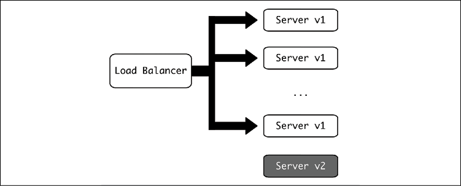

# 演进的架构

正如软件本身永远不会真正完整一样，软件架构也永远不会是一件完成的工作。为了改进系统，总是需要进行更改、调整和调整：添加新功能；提高性能；修复安全问题。虽然良好的架构要求我们深入了解如何设计系统，但正在进行的过程的现实更多的是进行更改和改进。

我们将在本章中讨论其中的一些方面，以及处理在实际工作系统中进行更改的一些技术和想法，请记住，始终可以通过反思流程的方式来进一步改进流程执行并遵循一些准则，以确保系统可以不断更改，同时保持对客户的服务。

在本章中，我们将介绍以下主题：

- 调整架构
- 计划停机时间
- 事故
- 负载测试
- 版本控制
- 向后兼容性
- 功能标志
- 团队合作方面的变化

让我们先来看看为什么要对系统架构进行更改。

## 调整架构

虽然在本书的大部分内容中，我们一直在讨论系统设计，这是架构师的基本职能，但他们的大部分日常工作很可能会更加专注于重新设计。

这始终是一项无止境的任务，因为工作的软件系统总是在修订和扩展中。可能需要调整系统架构的一些原因如下：

- 提供以前不可用的某些特性或特性——例如，添加一个事件驱动的系统来运行异步任务，使我们能够避免以前所有可用的请求-响应模式。
- 因为当前架构存在瓶颈或限制。例如，系统中只有一个数据库，并且可以运行的查询数量是有限的。
- 随着系统的发展，可能有必要划分部分以便更好地控制它们——例如，将单体应用程序划分为微服务，正如我们在第 8 章“高级事件驱动结构”中看到的那样。
- 为了提高系统的安全性——例如，删除或编码可能敏感的存储信息，如电子邮件地址和其他个人身份信息 (PII)。
- 大的 API 更改，例如在内部或外部引入新版本的 API。例如，添加一个新端点，该端点更适合其他内部系统执行某些操作，调用服务应迁移到该处。
- 存储系统的变化，包括我们在第 3 章讨论分布式数据库时讨论的所有不同想法。这还可能包括添加或替换现有的存储系统。
- 适应过时的技术。这可能发生在具有不再受支持的关键组件或基本安全问题的遗留系统中。例如，将一个旧模块替换为另一个能够使用新安全过程的模块，因为旧模块不再维护并且依赖于旧的加密方法。
- 使用新的语言或技术重写。如果在某个时候使用不同的语言创建系统，则可以这样做以整合技术，并且在一段时间后，决定将其与最常用的语言保持一致，以便更好地维护。这种情况在经历了成长的组织中很典型，在某个时候，一个团队决定使用他们最喜欢的语言来创建服务。一段时间后，由于可能缺乏这种语言的专业知识，这可能会导致维护复杂化而导致问题。如果原始开发人员离开了组织，情况可能会更糟。最好通过将服务集成到现有服务中来调整或重写服务，或者用首选语言的等效服务替换它。
- 其他类型的技术债务——例如，可以清理代码并使其更具可读性的重构，或者允许更精确地更改组件名称等。

这些只是一些例子，但事实是所有系统都需要不断更新和调整，因为软件很少是完成的任务。

挑战不仅在于设计这些更改以实现预期结果，而且还在于以最小的系统中断从起点移动到目的地。如今，人们期望在线系统很少被中断，为任何变化设定了很高的标准。

为了实现这一点，需要以小步骤进行更改，并特别注意确保系统在所有点都可用。

## 计划停机时间

虽然理想情况下，系统不应因所做的更改而中断，但有时根本不可能在不中断系统的情况下执行重大更改。

> 何时以及是否合理停机可能在很大程度上取决于系统。例如，流行的网站 Stack Overflow (https://stackoverflow.com/) 在其运营的第一年就经常出现停机，最初甚至每天都出现停机，网页在 2019 年的早上返回“停机维护”页面。欧洲。这种情况最终改变了，现在很少看到这种信息了。
>
> 但这在项目的早期阶段是可以接受的，因为他们的大部分用户使用该网站的时间与北美时间一致，而且它曾经（现在仍然是）一个免费网站。

安排停机时间始终是一种选择，但代价高昂，因此需要以一种对运营的影响最小化的方式进行设计。如果该系统是对客户至关重要的已建立的 24x7 服务，或者在运行时为企业创造收入（例如商店），那么任何停机时间都会有相当高的代价。

在其他情况下，例如流量很少的小型新服务，客户要么会更加理解，要么甚至很有可能不受影响。

计划的停机时间应事先通知受影响的客户。这种通信可以采取多种形式，并且很大程度上取决于服务的种类。例如，一家公共网络商店可能会在一周内通过其页面上的横幅来宣布停机时间，通知周日早上将无法使用，但为银行业务安排停机时间可能需要几个月的提前通知，并就何时是最好的时间。

如果可能的话，定义维护窗口以正确设置对服务将或可能具有某种中断的高风险的时间的明确预期是一个很好的做法。

## 维护窗口

维护窗口是预先告知可能发生维护的时段。这个想法是为了保证系统在维护窗口之外的稳定性，同时分配可能发生维护的明确时间。

维护窗口可能在系统最活跃的时区的周末或晚上。在最繁忙的活动期间，服务不会中断，并且只有在迫不及待的情况下才会进行维护，例如在预防或修复严重事件时。

维护窗口不同于计划的停机时间。虽然在某些情况下会发生这种情况，但并非每个维护窗口都需要停机——它只是有可能发生。

并非每个维护窗口都需要同等定义——有些可能比其他窗口更安全，并且能够进行更广泛的维护。例如，周末可能会预留给预定的停机时间，但工作周的晚上可能会定期部署。

提前沟通维护时段很重要，例如设计如下表：

| Days             | Time              | 维护窗口类型     | 风险     | Comments                                                     |
| ---------------- | ----------------- | ---------------- | -------- | ------------------------------------------------------------ |
| Monday -Thursday | 08:00 – 12:00 UTC | 定期维护         | 低风险   | 定期部署被认为是低风险的。对服务没有影响。                   |
| Saturday         | 08:00 – 18:00 UTC | 认真维护         | 高风险   | 调整被认为是有风险的。虽然期望该服务将完全可用，但它有可能在窗口期间的某个时间点被中断。 |
| Sunday           | 08:00 – 18:00 UTC | 通知计划停机时间 | 暂停服务 | 提前一个月通知。需要服务不可用的基本维护。                   |

关于维护窗口的一个重要细节是它们应该足够大，以便有足够的时间来完成维护。一定要留出足够的时间，因为最好用一个大的维护窗口来设定期望，这个窗口可以安全地用于任何可能的情况，而不是一个经常需要延长的短窗口。

虽然计划的停机时间和维护窗口将有助于确定服务处于活动状态的时间以及对用户来说风险更高的时间，但仍有可能出现一些问题并导致系统出现问题。

## 事故

不幸的是，在其生命中的某个时刻，系统不会按应有的方式运行。它会产生一个非常重要的错误，需要立即处理。

事件被定义为严重破坏服务以致需要紧急响应的问题。

> 这并不一定意味着整个服务被完全中断——它可能是外部服务的明显降级，甚至是一个内部服务的问题，从而降低了整体服务质量。例如，如果一个异步任务处理程序有 50% 的时间都失败了，外部客户可能只会看到他们的任务需要更长的时间，但这可能足以采取纠正措施。

在事件发生期间，使用所有可用的监控工具对于尽快发现问题并能够纠正它至关重要。反应时间应尽可能快，同时尽可能降低纠正措施的风险。这里需要取得平衡，并且根据事件的性质，可以采取风险更大的行动，例如当系统完全关闭时，因为恢复系统将更加重要。

事故期间的恢复通常会受到两个因素的限制：

- 监控工具在检测和理解问题方面的表现如何
- 可以多快在系统中引入更改，与更改参数或部署新代码的速度有关

上述第一点是理解部分，第二点是解决部分（尽管可能需要进行更改以更好地理解问题，正如我们在第 14 章“分析”中看到的那样）。

> 我们在本书中涵盖了这两个方面，在第 11 章，包管理和第 12 章，日志记录中检查了可观察性工具。我们可能还需要使用第 14 章“分析”中描述的技术。
>
> 对系统进行更改与我们在第 4 章“数据层”中讨论的持续集成 (CI) 技术密切相关。快速 CI 管道可以对准备部署新代码所需的时间产生很大影响。

这就是为什么这两个要素，即可观察性和进行更改所需的时间，如此重要的原因。在正常情况下，花费很长时间来部署或进行更改通常只是一个小麻烦，但在危急情况下，它可能会阻碍有助于系统健康恢复的修复。

对事件的反应是一个复杂的过程，需要灵活性和即兴发挥，并随着经验而改进。但是还需要有一个持续的过程来提高系统的正常运行时间并了解系统的最薄弱部分，以避免问题或将问题最小化。

### 尸检分析

事后分析，也称为事后审查，是在问题影响服务后进行的分析。其目标是了解失败的原因、原因，并采取纠正措施以确保问题不再发生，或者至少减少影响。

通常，事后分析从参与纠正问题的人员填写模板表格开始。预定义模板有助于塑造讨论并专注于要执行的补救措施。

> 网上有很多事后分析模板可供你搜索，以查看是否有你喜欢的特定模板，或者只是为了获得想法。与流程的任何其他部分一样，它应该随着它的进行而改进和完善。请记住创建和调整你自己的模板。

基本模板应该从发生的所有主要细节开始，然后是发生的原因，最后是最重要的部分：纠正问题的下一步行动是什么？

> 请记住，事后分析会在事件结束后进行。虽然在发生时做一些笔记可能会很好，但在事件期间的重点是首先解决它。首先关注最重要的事情。

例如，一个简单的模板可能如下：

事故报告

1. 概括。简要描述发生的事情。
    示例：服务于 11 月 5 日 08:30 到 9:45 UTC 之间中断。

2. 影响。描述问题的影响。外部问题是什么？外部用户如何受到影响？
    示例：所有用户请求都返回 500 错误。

3. 检测。最初如何检测到它的描述。会不会更早被发现？
    示例：在 5 分钟 100% 的错误请求后，监控系统在 8:35 UTC 发出有关该问题的警报。

4. 回复。为纠正问题而采取的措施。
    示例：John 清理了数据库服务器中的磁盘空间并重新启动了数据库。

5. 时间线。事件时间表，以了解事件如何发展以及每个阶段需要多长时间。
    例子：
    8:30 问题开始。
    8:35 监控系统中的警报被触发。约翰开始研究这个问题。
    8:37 检测到数据库无响应，无法重启。
    9:05 经过调查，John 发现数据库磁盘已满。
    9:30 数据库服务器中的日志已经占满了服务器磁盘空间，导致数据库服务器崩溃。
    9:40 从服务器中删除旧日志，释放磁盘空间。数据库重新启动。
    9:45 服务恢复。

6. 根本原因。对已确定问题的根本原因的描述，如果得到解决，将完全消除此问题。
    检测根本原因并不一定容易，因为有时会涉及一系列事件。为了帮助找到根本原因，你可以使用五个为什么技术。开始描述影响并询问为什么会发生。然后问为什么会这样，等等。继续迭代，直到你问“为什么？”五次，其结果将是根本原因。不要认为这意味着你必须问“为什么？”正好五次，但要继续下去，直到你得到一个可靠的答案。
    考虑到调查可能比在事件期间恢复服务所采取的步骤更进一步，在这种情况下，快速修复可能足以摆脱困境。
    例子：
    服务器返回错误。为什么？
    因为数据库崩溃了。为什么？
    因为数据库服务器空间不足。为什么？
    因为空间完全被日志填满了。为什么？
    因为磁盘上的日志空间不受限制，可以无限增长。

7. 得到教训。在此过程中可以改进的事情，以及任何其他进展顺利并且可能有用的元素，例如在分析问题时有用的某个工具或指标的使用。
    例子：
    在所有情况下，日志使用的磁盘空间量都应该受到限制。
    磁盘空间本身在完全用完之前不会受到监视或警报。
    警报系统太慢，需要在警报前出现大量错误。

8. 下一步行动。过程中最重要的部分。描述应该采取什么行动来消除问题，或者，如果不可能的话，减轻问题。确保这些行动有明确的所有者并得到跟进。

    > 如果有票务系统，则应将这些操作转换为票证并相应地确定优先级，以确保适当的团队实施它们。

不仅应该解决根本原因，而且还应该在经验教训部分发现任何可能的改进。

例子：

行动：启用日志轮换，以限制日志可以在所有服务器中占用的空间量，从数据库开始。分配给运营团队。

措施：监视磁盘空间并发出警报，如果磁盘空间少于总可用空间的 20%，则发出警报，以便更快地做出反应。分配给运营团队。

操作：调整错误警报以将其更改为在只有一分钟的 30% 或更多请求返回错误时发出警报。分配给运营团队。

请注意，模板不必一次性填写。通常情况下，模板会尽可能的填写，并且会召开一个事后会议，当可以分析事件并且完全填写模板时，包括下一步行动部分，这也是最重要的部分。分析。

> 请记住，事后分析过程的重点是改进系统，而不是把责任归咎于问题，这一点至关重要。该过程的目标是检测薄弱环节并尝试确保问题不再重复。

近年来，尝试预见问题的等效流程已经到位，尤其是在重要事件之前。

### 验尸分析

事前分析是一种尝试分析在重要事件之前可能出现的问题的练习。该事件可能是某个里程碑、启动事件或预计会显着改变系统状况的类似事件。

> “premortem”这个词是一个非常有趣的新词，它来自使用“postmortem”作为一种方式来指代事后进行的分析，与尸检进行类比。虽然希望，还没有什么是死的！
>
> 它也可以称为准备分析。

例如，可能会推出一项营销活动，预计流量会增加一倍或三倍，而之前的流量是正常的。

事前分析与事后分析相反。你在未来设定你的心态并问：出了什么问题？最坏的情况是什么？从那里，你可以验证你对系统的假设并为它们做好准备。

考虑对上述将系统流量增加三倍的示例进行分析。我们可以模拟条件来验证我们的系统是否已经准备好？我们认为系统的哪些元素不够健壮？

所有这些都可以导致计划不同的场景并运行测试，以确保系统为事件做好准备。

在进行任何事前分析时，请确保有足够的时间来执行必要的操作和测试以准备系统。像往常一样，必须优先考虑行动，以确保时间得到合理利用。但请记住，这项准备工作可能是一项无休止的任务，而且由于时间有限，因此需要将重点放在系统中最重要或最敏感的部分。确保尽可能多地使用数据驱动的操作，并将分析重点放在真实数据上，而不是预感上。

## 负载测试

在这些情况下，准备工作的一个关键要素是负载测试。

负载测试正在创建一个模拟负载，以增加流量。它可以以探索性的方式完成，即让我们找出我们系统的限制是什么；或者以一种确认的方式，即让我们再次检查我们是否可以达到这个流量水平。

负载测试通常不在生产环境中进行，而是在暂存环境中进行，在生产环境中复制配置和硬件，尽管创建最终负载测试以验证生产环境中的配置是否正确是正常的。

> 云环境中负载测试分析的一个有趣部分是确保系统中的任何自动缩放都能正常工作，因此它会在接收到更大负载时自动配置更多硬件，并在不需要时将其删除。这里需要小心，因为每次运行时对集群的最大容量进行全负载测试可能会很昂贵。

负载测试的基本元素是模拟典型用户在系统上执行的操作。例如，一个典型的用户可以登录，查看几页，添加一些信息，然后退出。我们可以使用在我们的外部接口上工作的自动化工具来复制这种行为。

> 使用这些工具的一个好方法是重用可以创建的任何类型的自动化测试，并使用它以及模拟的基础。这使得集成或系统测试框架成为启用负载测试的单元。

然后，我们可以将模拟单个用户行为的单元乘以多次，以模拟 N 个用户的效果，产生足够的负载来测试我们的系统。

> 为简单起见，最好使用单个模拟作为用户典型行为的组合，而不是尝试生成多个较小的模拟来尝试复制不同的用户。

正如我们之前所说，一旦你仔细检查该行为是否与系统中的典型案例兼容，那么在这些情况下，使用一些对系统主要部分进行测试的系统测试的使用效果非常好。

如有必要或进行调整，可以分析日志以生成用户使用的典型界面的适当配置文件。记住尽可能传递数据。但是，有时在没有可靠数据时需要进行负载测试，因为它们通常是在引入新功能时完成的，因此必须使用估计。

> 请记住监控每个模拟的结果，尤其是错误。这将有助于检测可能出现的问题。负载测试还可以对系统进行监控，因此它可以很好地检测薄弱点并对其进行改进。

负载测试越密集，它们能够捕获的问题就越多。然后，一旦真正的流量发挥作用，我们就可以避免这些问题。

请记住，创建负载也会受到其自身瓶颈的影响。为了增加模拟，可能需要使用多个服务器并确保网络能够支持流量。

通过多次启动该过程可以直接进行模拟乘法。这个过程虽然简单，但非常有效，可以通过简单的脚本进行控制。它还具有灵活性，模拟可以是任何类型的过程，包括使用任何现有软件重新调整的系统测试。这加快了负载测试的准备工作，并建立了对模拟准确度的信任，因为它重用了之前已经测试过的现有软件。

> 也可以使用针对常见用例的特定工具，例如 HTTP 接口，例如 Locust (https://locust.io/)。这个工具允许我们创建一个网络会话，模拟用户访问系统。 Locust 的最大优势在于它已经嵌入了一个报告系统，并且可以通过最少的准备进行扩展。但是，它需要为负载测试显式创建一个新会话，并且只能使用 Web 界面。

负载测试还应该旨在在生产集群中创建一些空间，以便它们验证负载始终处于控制之下，即使在负载增长的情况下也是如此，而不是在常规操作期间发现可能产生事故的瓶颈。

## 版本控制

在对任何服务进行更改时，需要有一个系统来跟踪不同的更改。这样，我们就可以了解什么时候部署的以及与上周相比发生了什么变化。

> 当你面临事件时，这些信息非常强大。系统中最危险的时刻之一是有新部署时，因为新代码可能会产生新问题。由于新版本的发布而产生事件并不罕见。

版本控制意味着为每个服务或系统分配一个唯一的代码版本。它使了解已部署的软件和跟踪从一个版本到另一个版本的更改变得容易。

> 版本号通常在源代码控制系统中的特定点分配，以精确跟踪该特定点的代码。定义版本的目的是在该唯一版本号下对代码进行精确定义。适用于代码多次迭代的版本号是没有用的。

版本号是关于在谈论同一项目的不同快照时传达代码中的差异。他们的主要目标是沟通，让我们了解软件如何发展，不仅在团队内部，而且在外部。

传统上，版本与打包软件高度相关，不同版本的软件以盒装形式出售，从而成为营销版本。当需要内部版本时，使用内部版本号，这是基于软件编译次数的连续编号。

版本不仅可以应用于整个软件，还可以应用于其中的元素，如 API 版本、库版本等。同样，不同的版本可以有效地用于同一软件，例如为技术团队，但出于营销目的的外部版本。

> 例如，某些软件可以作为 Awesome Software v4 出售，具有 API v2，并且在内部被描述为版本号 v4.356。

在现代软件中，发布频繁且版本需要经常更改，这种简单的方法是不够的，而是创建了不同的版本模式。最常见的是语义版本控制。

> 我们在第 2 章“API 设计”中讨论了语义版本控制，但这个主题非常重要，需要重复一遍。请注意，相同的概念可用于 API 和代码发布。

语义版本控制使用两个或三个数字，用点分隔。可以添加一个可选的 v 前缀来阐明它指的是一个版本：

```vX.Y.Z```
第一个数字 (X) 称为主要版本。第二个 (Y) 是次要版本，最后一个数字 (Z) 是补丁版本。随着新版本的生成，这些数字会增加：

- 主要版本的增加表明该软件与以前存在的软件不兼容。
- 次要版本的增加意味着该版本包含新功能，但不会破坏与旧版本的兼容性。
- 最后，补丁版本的增加仅涵盖错误修复和其他改进，如安全补丁。它修复了问题，但不会改变系统的兼容性。

> 请记住，增加主要版本号也可以标记通常会出现在次要版本更新中的更改。主要版本号的更改可能会带来新功能以及大修。

这种版本控制的一个很好的例子是 Python 解释器本身：

- Python 3 是主要版本的增加，因此，来自 Python 2 的代码需要更改才能在 Python 3 下运行
- 与 Python 3.8 相比，Python 3.9 引入了新特性，例如字典的新联合运算符
- Python 3.9.7 比以前的补丁版本添加了错误修复和改进

语义版本控制非常流行，在处理 API 和将在外部使用的库时特别有用。它提供了一个明确的期望，从版本号到对新更改的期望，并在添加新功能时允许清晰。

但是，这种版本控制对于某些项目可能过于严格，尤其是对于内部接口。由于它通过小迭代运行，在此过程中保持兼容性，仅在旧功能后弃用，它更像是一个不断发展的窗口。因此，很难引入有意义的特定版本。

> 例如，Linux 内核出于这个原因决定放弃语义版本控制，而是决定新的主要版本将很小，不会改变任何东西，并且不会具有任何特殊含义：http://lkml.iu.edu/超级邮件/linux/kernel/1804.1/06654.html。

在使用内部 API 时，尤其是使用经常变化并被组织的其他部分使用的微服务或内部库时，最好放宽规则，并在使用类似于语义版本控制的东西时，将其用作通用工具以一致的方式增加版本号以提供对代码如何更改的理解，但不必强制更改主要或次要版本。

但是，通过外部 API 进行通信时，版本号不仅具有技术意义，还具有营销意义。使用语义版本控制为 API 的容量提供了强有力的保证。

> 由于版本控制非常重要，一个好主意是允许服务通过特定端点（如 /api/version 或其他易于访问的方式自我报告其版本号）以确保它是清晰的并且可以由其他相关服务检查。

请记住，可以创建整个系统的通用版本，即使在内部它的不同组件有自己独立的版本。但是，在像在线服务这样的情况下，这可能很棘手或毫无意义。相反，重点应该放在保持向后兼容性上。

## 向后兼容性

在运行系统中更改架构的关键方面是必须始终保持其接口和 API 的向后兼容性。

> 我们还在第 3 章“数据建模”中讨论了关于数据库更改的向后兼容性。在这里，我们将讨论接口，但它遵循相同的想法。

向后兼容性意味着系统保持其旧接口按预期工作，因此任何调用系统都不会受到更改的影响。这使它们可以随时升级，而不会中断服务。

> 请记住，向后兼容性需要在外部应用，因为客户依赖于稳定的工作界面，但也需要在内部应用多个服务相互交互的地方。如果系统很复杂并且有多个部分，那么连接它们的 API 应该是向后兼容的。这在微服务架构中尤其重要，以允许独立部署微服务。

这个概念非常简单，但它对如何设计和实施变更有影响：

- 更改应始终是附加的。这意味着他们添加选项，而不是删除它们。这使得对系统的任何现有调用都会继续使用现有的功能和选项，并且不会中断它们。

- 删除选项应该非常小心，并且只有在确认它们不再被使用之后才能完成。为了能够检测到这一点，我们需要调整监控，以便我们拥有可以清楚地提供可靠数据的真实数据，以便我们确定这一点。

    > 使用外部接口，几乎不可能删除任何选项或端点，尤其是在 API 上。除非有充分的理由，否则客户不希望更改其现有系统以适应任何变化，即使在这种情况下，也需要大量工作才能充分传达它。我们将在本章后面讨论这种情况。
    >
    > Web 界面允许更灵活的更改，因为它们是由人类手动使用的。
- 即使是外部可访问 API 的附加更改也很困难。外部客户往往会按原样记住 API，因此即使只是添加一个新字段，也很难更改现有调用的格式。
  这取决于使用的格式。在 JSON 对象中添加新字段比更改需要预先定义的 SOAP 定义更安全。这是 JSON 如此受欢迎的原因之一——因为它在返回对象的定义方面很灵活。
  尽管如此，对于外部 API，在必要时添加新端点可能会更安全。 API 更改通常分阶段进行，创建新版本的 API 并尝试鼓励客户更改为新的更好的 API。这些迁移可能是漫长而艰巨的，因为外部用户将需要明显的优势来说服他们最终采用更改。

  > 从 Python 2 到 Python 3 的迁移就是 API 的变化是多么痛苦的一个很好的例子。Python 3 自 2008 年以来一直可用，但需要很长时间才能获得任何形式的牵引力，因为用 Python 2 编写的程序需要被改变。迁移过程相当漫长，甚至到最后一个 Python 2 解释器（Python 2.7）从 2010 年首次发布到 2020 年支持了十年。即使有这么长的过程，遗留系统中仍然有代码可以使用Python 2。这表明如果不考虑向后兼容性，从一个 API 迁移到另一个 API 的难度。
- 现有的测试，包括单元测试和集成测试，是确保 API 向后兼容的最佳方式。本质上，任何新功能都应该毫无问题地通过测试，因为旧的行为不会改变。良好的 API 功能测试覆盖率是保持兼容性的最佳方式。
在外部接口中引入更改更复杂，通常需要定义更严格的 API 和更慢的更改速度。内部接口允许更大的灵活性，因为它们的更改可以在整个组织内以增量方式进行沟通，这将允许适应而不会在任何时候中断服务。

### 增量更改

对系统的增量更改、减缓变异和调整 API，可以在涉及多个服务的情况下按顺序发布。但是这些更改需要按顺序应用，并牢记向后兼容性。

例如，假设我们有两个服务：服务A生成一个显示学生参加考试的界面，并调用服务B获取考生列表。这是通过调用内部端点来完成的：

```
GET /examinees (v1)
[
    {
         "examinee_id": <student id>,
         "name": <name of the examinee>
    }, …
]
```

需要在服务 A 中引入一个新功能，该功能需要考生提供额外信息，并要求我们知道每个考生尝试特定考试的次数，以便根据该参数对它们进行充分排序。使用当前信息，这是不可能的，但可以调整服务 B 以返回该信息。

为此，需要扩展 API，以便返回该信息：

```
GET /examinees (v2)
[
    {
         "examinee_id": <student id>,
         "name": <name of the examinee>,
         "exam_tries", <num tries>
    }, …
]
```

只有正确完成并部署此更改后，服务 A 才能使用它。这个过程发生在以下阶段：

1. 初期。
2. 使用 /examinees (v2) 部署服务 B。请注意服务 A 将如何忽略额外字段并继续正常工作。
3. 服务 A 的部署读取并使用新参数exam_tries。

所有的步骤都是稳定的。该服务在每个服务中都没有问题，因此不同服务之间存在分离。

> 这种分离很重要，因为如果部署出现问题，可以撤消它并且只影响单个服务，快速恢复到之前的稳定状态，直到问题得到解决。最糟糕的情况是需要同时发生两个服务更改，因为其中一个发生故障会影响另一个，并且扭转这种情况可能并不容易。更糟糕的是，问题可能出在它们之间的相互作用上，在这种情况下，不清楚哪一个负责，因为可能两者兼而有之。重要的是要保持每一步都扎实可靠的小独立步骤。

这种操作方式可以让我们实现更大的改变，例如，重命名一个字段。假设我们不喜欢 Exame_id 字段并希望将其更改为更合适的 student_id。该过程将如下所示：

1. 更新返回的对象以包含一个名为 student_id 的新字段，复制服务 B 中的先前值：

```
GET /examinees (v3)
[
    {
         "examinee_id": <student id>,
         "student_id": <student id>,
         "name": <name of the examinee>,
         "exam_tries", <num tries>
    }, …
]
```

2. 更新并部署服务 A 以使用 student_id 而不是 Exame_id。

3. 在其他可能调用服务 B 的服务中执行相同的操作。

    > 使用监控工具和日志来验证这一点！

4. 从服务 B 中删除旧字段并部署服务：

```
GET /examinees (v3)
[
    {
         "examinee_id": <student id>,
         "student_id": <student id>,
         "name": <name of the examinee>,
         "exam_tries", <num tries>
    }, …
]
```

5. 从服务 B 中删除旧字段并部署服务。

    > 此步骤在技术上是可选的，尽管出于维护原因从 API 中删除 cruft 会很好。但日常工作的现实意味着它很可能会留在那里，只是不再被访问。需要在保留它的便利性和维护干净和更新的 API 之间找到一个很好的平衡点。

这说明了我们如何在不中断正在部署的服务的情况下部署更改。但是，我们如何确保在部署新版本时服务始终可用？

### 不间断部署

为了允许在不中断服务的情况下持续发布，我们需要进行向后兼容的更改并在服务仍在响应时部署它们。

为此，最好的盟友是负载均衡器。

> 我们在第 5 章“十二因素应用方法论”和第 8 章“高级事件驱动结构”中讨论了负载均衡器。它们真的很有用！

成功顺利部署的过程需要更新多个服务实例，如下所示：

> 我们将假设我们正在使用可以轻松创建和销毁的云实例或容器。请记住，你可以将它们视为 nginx 下的工作人员或任何其他类型的 Web 服务器，充当单个服务器内的负载均衡器。这就是 nginx reload 命令的工作原理。

这是初始阶段，所有实例都有要更新的服务版本 1：


图 16.1：起点
创建了一个具有服务 2 的新实例。请注意，它尚未添加到负载均衡器中。



图 16.2：创建的新服务器
新版本将添加到负载均衡器。目前，可以将请求定向到版本 1 或版本 2。但是，如果我们遵循向后兼容的原则，这应该不会造成任何问题。


图 16.3：负载均衡器中包含的新服务器
为了保持实例数量不变，需要删除旧实例。此处谨慎的方法意味着首先禁用负载均衡器中的旧实例，因此不会处理新请求。在服务完成所有正在进行的请求后（请记住，不会向此实例发送新请求），该实例被有效禁用并且可以从负载均衡器中完全删除。


图 16.4：从负载均衡器中移除旧服务器
旧实例可以被销毁/回收。


图 16.5：旧服务器已被完全移除
可以重复该过程，直到所有实例都处于版本 2。


图 16.6：所有新服务器的最后阶段

有一些工具可以让我们自动完成这个过程。例如，Kubernetes 将在对容器进行更改时自动执行此操作。我们还看到像 nginx 或 Apache 这样的 Web 服务也可以。但同样的过程也可以手动应用，或者在不寻常的用例需要时通过开发自定义工具来应用。

## 功能标志

功能标志的想法是隐藏在配置更改下仍未准备好发布的功能。遵循小增量和快速迭代的原则，就不可能产生大的变化，比如新的用户界面。

更复杂的是，这些重大变化可能会与其他变化同时发生。在新的用户界面正常工作之前，不可能将整个发布过程延迟 6 个月或更长时间。

创建一个长期存在的单独分支也不是一个好的解决方案，因为合并这个分支成为一场噩梦。长期存在的分支机构管理起来很复杂，而且总是难以使用。

更好的解决方案是创建一个激活或停用此功能的配置参数。然后可以在特定环境中测试该功能，同时所有开发都以相同的速度继续进行。

这意味着其他更改（例如错误修复或性能改进）仍在发生和部署中。并且像往常一样经常将在大型新功能上所做的工作合并到主分支中。这意味着大新功能的开发部分也正在发布到生产环境，但它们还没有激活。

> 测试需要确保这两个选项 - 激活和停用的功能 - 都能正常工作，但以小增量工作会使这相对容易。

然后，该功能将以小增量进行开发，直到准备好发布。最后一步是通过配置更改简单地启用它。

> 请注意，该功能可能对某些用户或环境有效。这就是测试版功能的测试方式：它们依赖于某些用户能够在该功能完全发布之前访问该功能。测试用户最初可能是组织内部的，如 QA 团队、经理、产品负责人等，因此他们可以提供有关功能的反馈，但使用生产数据。

这种技术使我们能够在不牺牲小的增量方法的情况下增强信心并发布大功能。

## 团队合作方面的变化

软件架构不仅与技术有关，而且其中一部分高度依赖于沟通和人的方面。

在系统中实施变更的过程中存在一些影响团队合作的人为因素，需要加以考虑。

一些例子：

- 请记住，软件架构师的工作通常在于管理与多个团队的沟通，这需要在积极倾听团队以及解释甚至协商设计变更方面的谨慎和软技能。根据组织的规模，这可能具有挑战性，因为不同的团队可能拥有截然不同的文化。
- 组织中技术变革的速度和接受度与组织的文化（或亚文化）密切相关。组织工作方式的变化通常发生得更慢，尽管能够快速改变技术的组织往往更快地适应组织范围的变化。
- 同样，技术变革需要支持和培训，即使它纯粹是在组织内部。当需要进行一些重大的技术变革时，请确保有一个联系点，团队可以在那里解决疑虑和问题。通过解释为什么需要进行变革并从那里开始工作，可以解决很多问题。
- 还记得我们在第 1 章“软件架构简介”中谈到软件架构的康威定律时，谈到了通信结构和架构结构之间的关系。一个变化可能会影响另一个，这意味着足够大的架构变化将导致组织重组，这有其自身的挑战。
- 同时，变化可能会在受影响的团队中产生赢家和输家。一位工程师可能会因为无法使用自己喜欢的编程语言而感到受到威胁。同样，他们的合作伙伴也会很兴奋，因为现在使用他们最喜欢的技术的机会真是太棒了。
- 当人们四处走动或创建新团队时，这个问题在团队改组时尤其严重。开发速度的一个重要因素是拥有一个高效的团队，对团队进行更改会影响他们的沟通和效率。需要分析和考虑这种影响。
- 作为组织日常运营的一部分，需要定期引入维护。定期维护应包括所有安全更新，还包括升级操作系统版本、依赖项等任务。
- 处理这种日常维护的一般计划将提供清晰和明确的期望。例如：操作系统版本将在新的 LTS 版本发布后的三到六个月内升级。这产生了可预测性，给出了明确的目标，并产生了系统的持续改进。同样地，检测安全漏洞的自动工具使团队很容易知道什么时候该升级代码或代码中的依赖项。底层系统。
- 同样，需要将偿还技术债务作为一种习惯，以确保系统是健康的。技术债务通常由团队自己检测到，因为他们对它有最好的理解，并且表现为代码更改的速度越来越慢。如果不解决技术债务，它将变得越来越复杂，使开发过程更加困难，并有被开发人员精疲力竭的风险。一定要在它失控之前安排时间来解决它。

作为一般考虑，请记住架构的更改需要由团队成员执行，并且需要正确传达和执行信息。与任何其他以沟通为重要组成部分的任务一样，这也带来了自己的挑战和问题，因为与人沟通，尤其是与多人沟通，可以说是软件开发中最困难的任务之一。任何软件架构设计师都需要意识到这一点并分配足够的时间来确保一方面充分传达计划，另一方面接收反馈并进行相应调整以获得最佳结果。

## 概括

在本章中，我们描述了在开发和更改系统（包括其体系结构）时保持系统运行的不同方面和挑战。

我们首先描述了架构可能需要调整和更改的不同方式。然后，我们继续讨论如何管理更改，包括选择指定时间系统不可用的选项，并引入维护窗口的概念以清楚地传达对稳定性和更改的期望。

接下来，我们讨论了当出现问题并且系统出现问题时可能发生的不同事件。在此类事件发生后，我们回顾了必要的持续改进和反思过程，并研究了在风险增加的重大事件之前可以使用的准备过程，例如，由于营销推动预计会增加风险系统的负载。

为了解决这个问题，我们接下来介绍了负载测试以及如何使用它来验证系统接受定义负载的能力，确保它已准备好支持预期的流量。我们还谈到了创建版本控制系统的必要性，该系统可以清楚地传达当前部署的软件版本。

接下来，我们讨论了向后兼容性的关键方面，以及在确保小而快的增量方面的重要性，这是持续改进和进步的关键。我们还讨论了功能标志如何帮助混合发布需要整体激活的更大功能的过程。

最后，我们描述了系统和架构中的变化如何影响人类协作和沟通的不同方面，以及在对系统进行更改时需要如何考虑这一点，特别是可能影响团队结构的更改，其中，正如我们所见，将倾向于复制软件的结构。